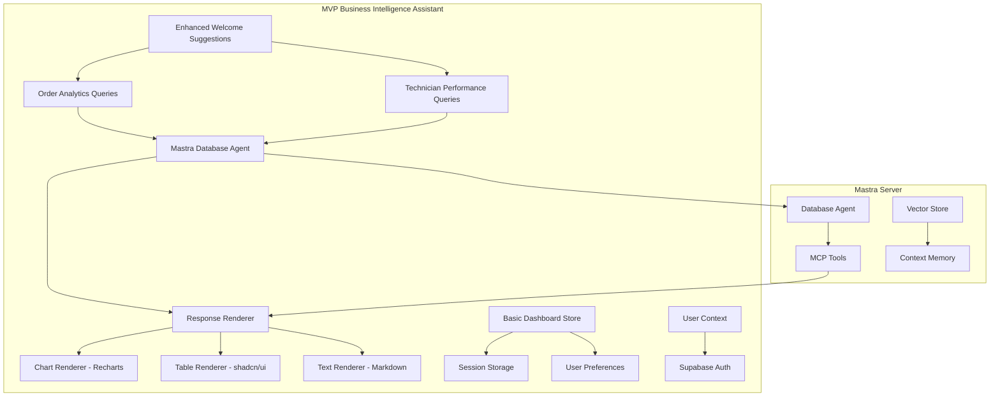

# Assistant UI Business Intelligence Enhancement Plan - MVP

## Overview

This document outlines the Minimum Viable Product (MVP) plan for enhancing the assistant UI with business intelligence features, focusing on order analytics and technician performance metrics for business owners and shareholders.

## Current System Analysis

### Mastra Server Architecture
- **Database Agent**: PostgreSQL memory store with vector search capabilities
- **MCP Integration**: postgres and supabase MCP servers for database operations
- **API Routes**: OpenAI-compatible endpoints (`/openai/v1/models`, `/openai/v1/chat/completions`)
- **User Context**: Session management and context awareness
- **Vector Store**: Semantic search and agent memory capabilities

### Current Assistant UI
- **Components**: Basic chat interface with thread management
- **Welcome Suggestions**: Extensible suggestion system
- **State Management**: Zustand integration ready
- **UI Framework**: shadcn/ui with Tailwind CSS
- **Integration**: Mastra client with error handling

## MVP Scope: Order Analytics & Technician Performance

### Phase 1: Enhanced Welcome Suggestions (Core MVP)

**Business-Focused Suggestion Categories:**

1. **Order Analytics**
   - "Show me order trends for the last 3 months"
   - "What are our top 5 performing products this quarter?"
   - "Compare order volumes by region"
   - "Show order completion rates"

2. **Technician Performance**
   - "Which technicians have the highest completion rates?"
   - "Show average service call duration by technician"
   - "Display technician productivity metrics"
   - "Analyze response time performance"

### Phase 2: Response Rendering System

**Chart Integration with Recharts:**
- **Line Charts**: Order trends over time
- **Bar Charts**: Technician performance comparisons
- **Pie Charts**: Order distribution by region/product
- **Area Charts**: Cumulative metrics

**Table Rendering:**
- **Data Tables**: Detailed metrics with sorting/filtering
- **Summary Cards**: Key performance indicators
- **Responsive Design**: Mobile-friendly layouts

### Phase 3: Basic Persistent Storage

**Zustand Store with Persistence:**
- **Session Storage**: Current session filters and preferences
- **Local Storage**: User display preferences
- **Chat History**: Recent business intelligence queries

## Technical Architecture



## Implementation Plan

### MVP File Structure

```
src/
├── components/
│   ├── assistant-ui/
│   │   ├── business-intelligence/
│   │   │   ├── chart-renderer.tsx          # Recharts integration
│   │   │   ├── table-renderer.tsx          # Data tables
│   │   │   ├── response-renderer.tsx       # Multi-format handler
│   │   │   └── index.ts
│   │   ├── enhanced-welcome-suggestions.tsx # Business categories
│   │   └── [existing components...]
│   └── charts/
│       ├── order-analytics-charts.tsx      # Order-specific charts
│       ├── technician-performance-charts.tsx # Performance charts
│       └── index.ts
├── stores/
│   ├── business-dashboard-store.ts         # MVP dashboard state
│   └── chart-preferences-store.ts          # User chart preferences
├── types/
│   ├── business-intelligence.ts            # BI-specific types
│   └── chart-types.ts                      # Chart configuration types
├── hooks/
│   ├── use-business-dashboard.ts           # Dashboard state hook
│   └── use-chart-renderer.ts               # Chart rendering hook
└── utils/
    ├── chart-helpers.ts                    # Chart configuration utilities
    └── data-formatters.ts                  # Data transformation utilities
```

### Required Dependencies (MVP)

```json
{
  "recharts": "^2.12.7",
  "zustand": "^4.5.2"
}
```

### MVP Features

#### 1. Enhanced Welcome Suggestions
- **Business Categories**: Order Analytics, Technician Performance
- **Contextual Icons**: Business-specific iconography
- **Quick Actions**: One-click access to common queries

#### 2. Response Rendering
- **Chart Detection**: Automatic chart type selection based on data
- **Responsive Charts**: Mobile-friendly chart rendering
- **Error Handling**: Graceful fallbacks for rendering issues

#### 3. Basic Persistence
- **Session State**: Current filters and view preferences
- **User Preferences**: Chart types, color schemes
- **Query History**: Recent business intelligence queries

#### 4. Data Integration
- **Mastra Agent**: Enhanced prompts for business queries
- **MCP Tools**: Database query optimization
- **Context Awareness**: User role-based suggestions

## Success Metrics (MVP)

### User Engagement
- **BI Mode Usage**: Percentage of sessions using business intelligence features
- **Query Success Rate**: Successful chart/table generations
- **Feature Adoption**: Usage of different chart types and analytics

### Performance
- **Response Time**: Time from query to chart rendering
- **Error Rate**: Failed business intelligence queries
- **User Satisfaction**: Feedback on MVP features

## Future Expansion (Post-MVP)

### Phase 2 Features
- **Customer Complaints Analysis**: Sentiment analysis and trend tracking
- **Operational Risk Assessment**: Predictive analytics
- **Revenue Analysis**: Financial performance metrics

### Phase 3 Features
- **Real-time Data**: Live dashboard updates
- **Advanced Charts**: Mermaid diagrams, complex visualizations
- **Export Features**: PDF reports, data export

### Phase 4 Features
- **External Integrations**: CRM, ERP system connections
- **Advanced Analytics**: Machine learning insights
- **Collaborative Features**: Shared dashboards, annotations

## Technical Considerations

### Performance
- **Lazy Loading**: Chart components loaded on demand
- **Memoization**: React.memo for expensive chart renders
- **Data Caching**: Intelligent caching of business queries

### Accessibility
- **ARIA Labels**: Screen reader support for charts
- **Keyboard Navigation**: Full keyboard accessibility
- **Color Contrast**: WCAG compliant color schemes

### Security
- **Data Privacy**: Secure handling of business metrics
- **Role-Based Access**: Appropriate data visibility
- **Audit Logging**: Track business intelligence usage

## Implementation Phases

### Phase 1: Foundation (Week 1)
- Enhanced welcome suggestions with business categories
- Basic chart renderer with Recharts integration
- Simple table renderer for data display

### Phase 2: Core Features (Week 2)
- Order analytics chart implementations
- Technician performance visualizations
- Basic persistent storage with Zustand

### Phase 3: Polish & Testing (Week 3)
- Error handling and edge cases
- Responsive design improvements
- User feedback integration and iteration

### Phase 4: Documentation & Deployment (Week 4)
- Component documentation
- User guide creation
- Production deployment and monitoring

## Conclusion

This MVP focuses on delivering immediate value through order analytics and technician performance insights while establishing a solid foundation for future business intelligence enhancements. The modular architecture ensures easy expansion based on user feedback and business needs.