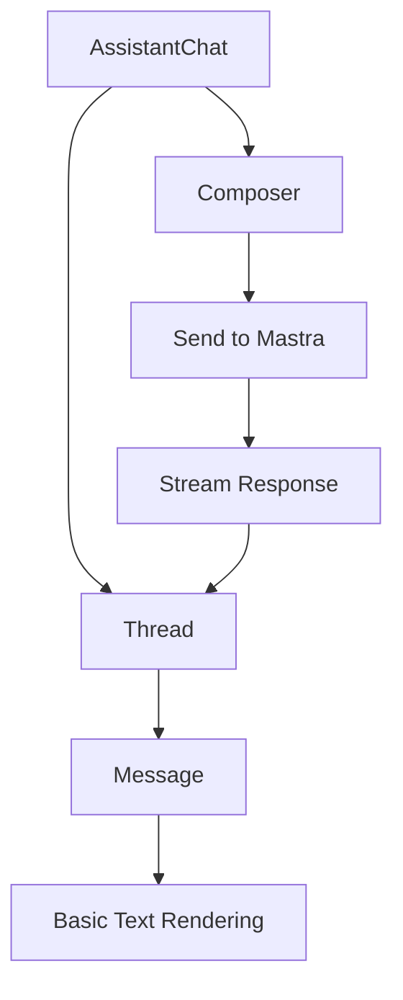
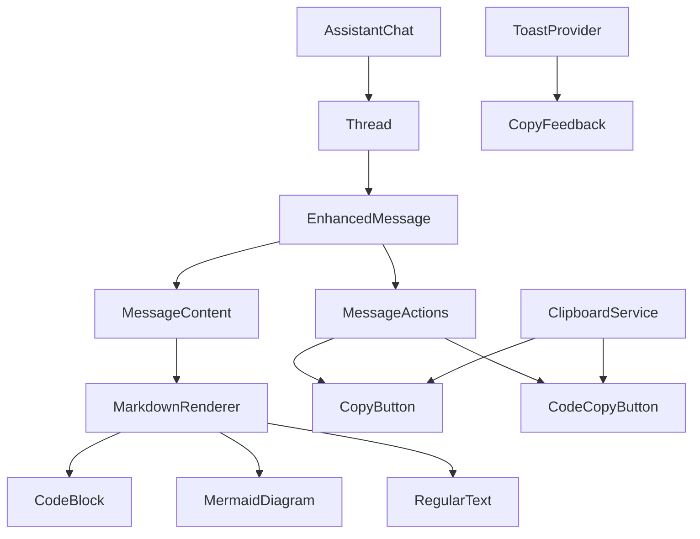

# Assistant UI Enhanced Chat Features Implementation Plan

## Overview

This document outlines the comprehensive plan for enhancing the assistant chat interface with advanced features including code block syntax highlighting, copy-to-clipboard functionality, and Mermaid diagram support. The implementation focuses on improving user experience while maintaining the existing architecture and design patterns.

## Current Architecture Analysis

### Existing Components Structure
```
src/components/assistant-ui/
├── assistant-chat.tsx     # Main chat container with Mastra integration
├── thread.tsx            # Message thread display with scrolling
├── message.tsx           # Individual message rendering (basic text)
├── composer.tsx          # Message input component
└── welcome-suggestions.tsx # Welcome screen suggestions
```

### Current Message Flow


## Enhanced Features Requirements

### 1. Code Block Support
- **Syntax Highlighting**: Support for multiple programming languages
- **Language Detection**: Automatic or manual language specification
- **Theme Integration**: Match shadcn/ui theme (light/dark mode)
- **Copy Code**: Individual code block copy functionality

### 2. Full Message Copy
- **Entire Message**: Copy complete chat bubble content
- **User & Assistant**: Support for both message types
- **Visual Feedback**: Toast notifications for successful copies
- **Accessibility**: Keyboard shortcuts and screen reader support

### 3. Mermaid Diagram Support
- **Diagram Rendering**: Support for Mermaid diagram syntax
- **Interactive Diagrams**: Zoom and pan capabilities
- **Copy Functionality**: Copy diagram source code
- **Error Handling**: Graceful fallback for invalid diagrams

### 4. Enhanced Message Rendering
- **Markdown Support**: Full markdown parsing and rendering
- **Mixed Content**: Code blocks within markdown content
- **Responsive Design**: Mobile-friendly layouts
- **Performance**: Efficient rendering for long conversations

## Technical Implementation Strategy

### Dependencies and Libraries

Based on research findings, the following libraries will be integrated:

```json
{
  "react-syntax-highlighter": "^15.5.0",
  "react-markdown": "^9.0.1",
  "remark-gfm": "^4.0.0",
  "mermaid": "^10.6.1",
  "sonner": "^1.3.1"
}
```

### Architecture Enhancements



## Implementation Phases

### Phase 1: Core Infrastructure
**Objective**: Set up foundational components and utilities

#### 1.1 Clipboard Service
- Create centralized clipboard utility
- Handle browser compatibility
- Implement fallback mechanisms
- Add error handling and user feedback

#### 1.2 Toast Notification System
- Integrate Sonner for toast notifications
- Create consistent feedback patterns
- Support accessibility requirements
- Theme integration with shadcn/ui

#### 1.3 Enhanced Type Definitions
- Extend existing assistant types
- Add code block and content type interfaces
- Define copy functionality types
- Maintain backward compatibility

### Phase 2: Message Content Enhancement
**Objective**: Upgrade message rendering capabilities

#### 2.1 Markdown Renderer Component
- Implement react-markdown with remark-gfm
- Custom renderers for code blocks
- Integration with existing message styling
- Performance optimization for large content

#### 2.2 Code Block Component
- Syntax highlighting with react-syntax-highlighter
- Language detection and manual specification
- Theme integration (light/dark mode)
- Individual copy functionality
- Line numbers and highlighting options

#### 2.3 Mermaid Diagram Component
- Mermaid integration with error boundaries
- Responsive diagram rendering
- Copy source functionality
- Loading and error states

### Phase 3: Copy Functionality
**Objective**: Implement comprehensive copy features

#### 3.1 Message-Level Copy
- Full message content copying
- Preserve formatting in clipboard
- Support for mixed content (text + code + diagrams)
- Visual copy button integration

#### 3.2 Selective Copy Features
- Individual code block copying
- Mermaid diagram source copying
- Text selection preservation
- Context menu integration

#### 3.3 User Experience Enhancements
- Hover states and visual feedback
- Keyboard shortcuts (Ctrl+C enhancements)
- Mobile touch interactions
- Accessibility improvements

### Phase 4: Integration and Polish
**Objective**: Complete integration and user experience refinement

#### 4.1 Message Component Refactoring
- Replace basic message rendering
- Integrate enhanced content components
- Maintain existing props interface
- Performance optimization

#### 4.2 Theme and Styling
- Consistent shadcn/ui integration
- Dark/light mode support
- Mobile responsiveness
- Animation and transitions

#### 4.3 Testing and Validation
- Unit tests for new components
- Integration tests for copy functionality
- Accessibility testing
- Performance benchmarking

## Detailed Component Specifications

### Enhanced Message Component Architecture

```typescript
interface EnhancedMessageProps {
  message: AssistantMessage;
  className?: string;
  onCopy?: (content: string, type: 'full' | 'code' | 'diagram') => void;
}

interface MessageContentBlock {
  type: 'text' | 'code' | 'mermaid';
  content: string;
  language?: string;
  metadata?: Record<string, unknown>;
}
```

### Code Block Component Specification

```typescript
interface CodeBlockProps {
  code: string;
  language?: string;
  showLineNumbers?: boolean;
  theme?: 'light' | 'dark';
  onCopy?: (code: string) => void;
  className?: string;
}
```

### Copy Service Interface

```typescript
interface ClipboardService {
  copyText(text: string): Promise<boolean>;
  copyWithFallback(text: string): Promise<boolean>;
  isSupported(): boolean;
}

interface CopyFeedback {
  showSuccess(message: string): void;
  showError(message: string): void;
}
```

## File Structure Plan

```
src/
├── components/
│   ├── assistant-ui/
│   │   ├── assistant-chat.tsx (existing)
│   │   ├── thread.tsx (existing)
│   │   ├── enhanced-message.tsx (new)
│   │   ├── message-content/
│   │   │   ├── index.ts
│   │   │   ├── markdown-renderer.tsx
│   │   │   ├── code-block.tsx
│   │   │   ├── mermaid-diagram.tsx
│   │   │   └── message-actions.tsx
│   │   ├── composer.tsx (existing)
│   │   └── welcome-suggestions.tsx (existing)
│   └── ui/ (existing shadcn/ui components)
├── hooks/
│   ├── use-mastra-chat.ts (existing)
│   ├── use-clipboard.ts (new)
│   └── use-copy-feedback.ts (new)
├── services/
│   ├── clipboard-service.ts (new)
│   └── content-parser.ts (new)
├── types/
│   ├── assistant.ts (existing - extend)
│   └── content-types.ts (new)
└── utils/
    ├── content-utils.ts (new)
    └── theme-utils.ts (new)
```

## User Experience Considerations

### Copy Button Placement
- **Full Message Copy**: Bottom-right corner of message bubble
- **Code Block Copy**: Top-right corner of code block
- **Hover Behavior**: Show on hover, always visible on mobile
- **Visual Consistency**: Use shadcn/ui button variants

### Feedback Mechanisms
- **Toast Notifications**: "Copied to clipboard" with fade-out
- **Button State Changes**: Temporary checkmark icon
- **Error Handling**: Clear error messages for failed copies
- **Accessibility**: Screen reader announcements

### Mobile Optimization
- **Touch Targets**: Minimum 44px touch targets
- **Long Press**: Alternative copy trigger for mobile
- **Responsive Layout**: Adapt button placement for small screens
- **Performance**: Optimize for mobile rendering

## Performance Considerations

### Code Highlighting Optimization
- **Lazy Loading**: Load syntax highlighter on demand
- **Language Bundling**: Only load required language definitions
- **Caching**: Cache highlighted code blocks
- **Virtual Scrolling**: For long code blocks

### Memory Management
- **Component Cleanup**: Proper cleanup of Mermaid instances
- **Event Listeners**: Remove clipboard event listeners
- **Large Content**: Pagination or virtualization for long messages

## Accessibility Requirements

### Keyboard Navigation
- **Tab Order**: Logical tab sequence through copy buttons
- **Keyboard Shortcuts**: Standard copy shortcuts (Ctrl+C)
- **Focus Management**: Clear focus indicators
- **Screen Reader**: Proper ARIA labels and announcements

### Visual Accessibility
- **Color Contrast**: Meet WCAG AA standards
- **High Contrast Mode**: Support for high contrast themes
- **Font Scaling**: Respect user font size preferences
- **Motion**: Respect reduced motion preferences

## Security Considerations

### Clipboard Security
- **Content Sanitization**: Clean content before copying
- **Permission Handling**: Graceful permission request handling
- **Fallback Methods**: Secure fallback for unsupported browsers
- **Data Validation**: Validate content before clipboard operations

### Content Security
- **XSS Prevention**: Sanitize markdown and code content
- **Mermaid Security**: Validate diagram syntax
- **Content Filtering**: Filter potentially harmful content
- **CSP Compliance**: Ensure Content Security Policy compliance

## Testing Strategy

### Unit Testing
- **Component Tests**: Test each new component in isolation
- **Service Tests**: Test clipboard and content parsing services
- **Hook Tests**: Test custom hooks with various scenarios
- **Utility Tests**: Test utility functions thoroughly

### Integration Testing
- **Copy Workflows**: End-to-end copy functionality testing
- **Theme Integration**: Test light/dark mode switching
- **Mobile Testing**: Test touch interactions and responsive design
- **Accessibility Testing**: Automated and manual accessibility testing

### Performance Testing
- **Rendering Performance**: Measure component render times
- **Memory Usage**: Monitor memory consumption with large content
- **Bundle Size**: Track bundle size impact of new dependencies
- **Load Testing**: Test with various content sizes and types

## Migration Strategy

### Backward Compatibility
- **Gradual Rollout**: Feature flags for new functionality
- **Fallback Rendering**: Graceful degradation for unsupported content
- **API Compatibility**: Maintain existing component interfaces
- **Progressive Enhancement**: Add features without breaking existing functionality

### Deployment Phases
1. **Infrastructure**: Deploy core services and utilities
2. **Components**: Deploy new components with feature flags
3. **Integration**: Enable enhanced message rendering
4. **Full Rollout**: Enable all features for all users

## Success Metrics

### User Experience Metrics
- **Copy Success Rate**: Percentage of successful copy operations
- **Feature Adoption**: Usage rates of new copy features
- **User Satisfaction**: Feedback on enhanced chat experience
- **Accessibility Compliance**: WCAG compliance verification

### Performance Metrics
- **Render Performance**: Message rendering time improvements
- **Bundle Size Impact**: JavaScript bundle size increase
- **Memory Usage**: Memory consumption with enhanced features
- **Error Rates**: Copy operation failure rates

## Conclusion

This implementation plan provides a comprehensive roadmap for enhancing the assistant chat interface with advanced features while maintaining the existing architecture and design principles. The phased approach ensures systematic development and testing, while the focus on user experience and accessibility ensures the features will be valuable and usable for all users.

The plan balances feature richness with performance considerations and provides clear specifications for implementation in code mode.