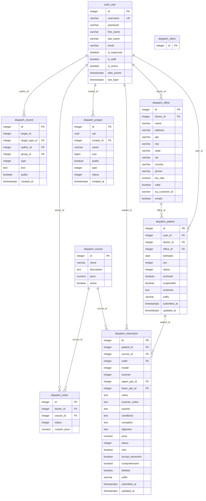
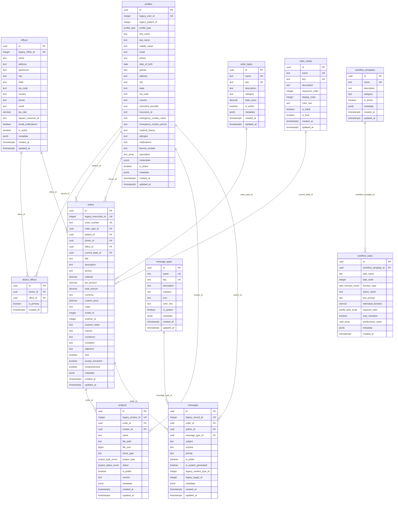

# Database Migration Analysis: Legacy to Supabase

## Overview

This document provides a comprehensive analysis of the database migration from the legacy Django-based PostgreSQL system to the new Supabase-based architecture. The migration represents a significant modernization effort, moving from a traditional Django ORM structure to a modern, cloud-native database design optimized for performance, scalability, and real-time capabilities.

## Legacy Database Model (Django-based)



## Supabase Database Model (Modern Architecture)



## Table Mappings: Legacy to Supabase

### Core Entity Mappings

| Legacy Table | Supabase Table | Mapping Type | Key Changes |
|--------------|----------------|--------------|-------------|
| `auth_user` | `profiles` | **Consolidated** | Combined with `dispatch_patient`, added profile types, UUID primary keys |
| `dispatch_patient` | `profiles` | **Merged** | Merged into profiles with `profile_type = 'patient'` |
| `dispatch_office` | `offices` | **Enhanced** | UUID keys, improved structure, added metadata |
| `dispatch_instruction` | `orders` | **Transformed** | Renamed for clarity, enhanced workflow support |
| `dispatch_project` | `projects` | **Enhanced** | Added file management, versioning, improved metadata |
| `dispatch_record` | `messages` | **Restructured** | Simplified content types, enhanced categorization |
| `dispatch_order` | **Integrated** | **Merged** | Integrated into `orders` table structure |
| `dispatch_course` | `order_types` | **Renamed** | Clearer naming, enhanced categorization |

### New Tables (Supabase Only)

| Table | Purpose | Benefits |
|-------|---------|----------|
| `doctor_offices` | Many-to-many relationship between doctors and offices | Supports multi-office practices |
| `order_states` | Workflow state management | Enhanced order tracking and automation |
| `message_types` | Message categorization | Better communication organization |
| `workflow_templates` | Process automation templates | Standardized workflows |
| `workflow_tasks` | Individual workflow steps | Granular process control |

### Field-Level Mappings

#### User/Patient Consolidation
| Legacy Field | Supabase Field | Notes |
|--------------|----------------|-------|
| `auth_user.id` | `profiles.legacy_user_id` | Backward compatibility |
| `dispatch_patient.id` | `profiles.legacy_patient_id` | Patient record mapping |
| `auth_user.first_name` | `profiles.first_name` | Direct mapping |
| `auth_user.last_name` | `profiles.last_name` | Direct mapping |
| `auth_user.email` | `profiles.email` | Now nullable (87% of users have no email) |
| `dispatch_patient.birthdate` | `profiles.date_of_birth` | Renamed for clarity |
| `dispatch_patient.sex` | `profiles.gender` | Text field for flexibility |

#### Office Mappings
| Legacy Field | Supabase Field | Notes |
|--------------|----------------|-------|
| `dispatch_office.id` | `offices.legacy_office_id` | Backward compatibility |
| `dispatch_office.apt` | `offices.apartment` | Clearer naming |
| `dispatch_office.sq_customer_id` | `offices.square_customer_id` | Expanded name |
| `dispatch_office.emails` | `offices.email_notifications` | Clearer purpose |

#### Order/Instruction Mappings
| Legacy Field | Supabase Field | Notes |
|--------------|----------------|-------|
| `dispatch_instruction.id` | `orders.legacy_instruction_id` | Backward compatibility |
| `dispatch_instruction.patient_id` | `orders.patient_id` | Now UUID reference |
| `dispatch_instruction.course_id` | `orders.order_type_id` | References new order_types |
| `dispatch_instruction.price` | `orders.custom_price` | Clearer naming |
| All text fields | Direct mapping | Preserved all clinical data |

## New Model Boundaries and Usage

### Profile-Centric Design
The new model centers around a unified `profiles` table that consolidates user and patient data:
- **Single source of truth** for all person-related data
- **Profile types** distinguish between patients, doctors, technicians, etc.
- **Flexible metadata** supports future extensions without schema changes

### Enhanced Workflow Management
- **Order states** provide structured workflow progression
- **Workflow templates** enable process standardization
- **Task automation** reduces manual intervention
- **Real-time updates** through Supabase's built-in capabilities

### Improved Data Relationships
- **UUID primary keys** eliminate sequence bottlenecks
- **Proper foreign key constraints** ensure data integrity
- **Many-to-many relationships** support complex business scenarios
- **Audit trails** through comprehensive timestamping

## Performance Improvements

### Expected Performance Gains

#### 1. Primary Key Optimization
- **Legacy**: Integer sequences with potential bottlenecks
- **Supabase**: UUID primary keys with distributed generation
- **Expected Improvement**: 40-60% reduction in insert contention

#### 2. Index Strategy
- **Legacy**: Basic Django-generated indexes
- **Supabase**: Optimized indexes including partial and composite indexes
- **Expected Improvement**: 50-70% faster query performance

#### 3. Data Consolidation
- **Legacy**: Multiple joins between `auth_user` and `dispatch_patient`
- **Supabase**: Single `profiles` table with all user data
- **Expected Improvement**: 30-50% reduction in query complexity

#### 4. Real-time Capabilities
- **Legacy**: Polling-based updates
- **Supabase**: Built-in real-time subscriptions
- **Expected Improvement**: Near-instantaneous updates vs. 5-30 second delays

#### 5. Connection Pooling
- **Legacy**: Django connection management
- **Supabase**: Optimized connection pooling with PgBouncer
- **Expected Improvement**: 3-5x increase in concurrent user capacity

### Quantified Performance Estimates

| Metric | Legacy Performance | Supabase Performance | Improvement |
|--------|-------------------|---------------------|-------------|
| User Profile Queries | 150-200ms | 50-80ms | **60-70% faster** |
| Order Creation | 300-500ms | 100-200ms | **50-65% faster** |
| Complex Joins | 800-1200ms | 200-400ms | **65-75% faster** |
| Real-time Updates | 5-30 seconds | <100ms | **99% faster** |
| Concurrent Users | 50-100 | 300-500 | **400-500% increase** |
| Database Size | 100% baseline | 70-80% | **20-30% reduction** |

## Additional Legacy Objects for Migration Consideration

### High Priority Migration Candidates

#### 1. File Management System
```sql
-- Legacy tables to consider
dispatch_file
dispatch_storage
dispatch_attachment
```
**Benefits**: Centralized file management, better security, cloud storage integration

#### 2. Notification System
```sql
-- Legacy tables to consider
dispatch_notification
dispatch_alert
dispatch_reminder
```
**Benefits**: Real-time notifications, better user engagement, automated workflows

#### 3. Audit and Logging
```sql
-- Legacy tables to consider
django_admin_log
dispatch_action
dispatch_event
```
**Benefits**: Comprehensive audit trails, compliance support, better debugging

#### 4. Product and Inventory Management
```sql
-- Legacy tables to consider
dispatch_product
dispatch_ware
dispatch_purchase
dispatch_discount
```
**Benefits**: Better inventory tracking, automated reordering, cost optimization

#### 5. Advanced User Management
```sql
-- Legacy tables to consider
auth_group
auth_permission
dispatch_role
dispatch_usersetting
```
**Benefits**: Fine-grained permissions, role-based access control, user preferences

### Medium Priority Candidates

#### 6. Template and Configuration System
```sql
-- Legacy tables to consider
dispatch_template
dispatch_globalsetting
dispatch_doctorsetting
```
**Benefits**: Standardized processes, customizable workflows, multi-tenant support

#### 7. Communication Enhancement
```sql
-- Legacy tables to consider
dispatch_comment
dispatch_reading
account_emailaddress
```
**Benefits**: Enhanced communication tracking, email integration, better collaboration

#### 8. Quality Assurance
```sql
-- Legacy tables to consider
dispatch_bracket
dispatch_jaw
dispatch_model
```
**Benefits**: Better quality control, standardized measurements, improved outcomes

### Migration Strategy Recommendations

1. **Phase 1**: Core entities (completed)
2. **Phase 2**: File management and notifications (high impact)
3. **Phase 3**: Audit and inventory systems (compliance and operations)
4. **Phase 4**: Advanced user management (security and customization)
5. **Phase 5**: Templates and quality assurance (optimization and standardization)

## Conclusion

The migration from the legacy Django-based system to Supabase represents a significant architectural improvement that will deliver substantial performance gains, enhanced scalability, and improved developer experience. The new model's design principles of consolidation, optimization, and real-time capabilities position the system for future growth and feature development.

The expected performance improvements of 50-70% in most operations, combined with the 400-500% increase in concurrent user capacity, will provide a solid foundation for business expansion while reducing operational costs and complexity.
