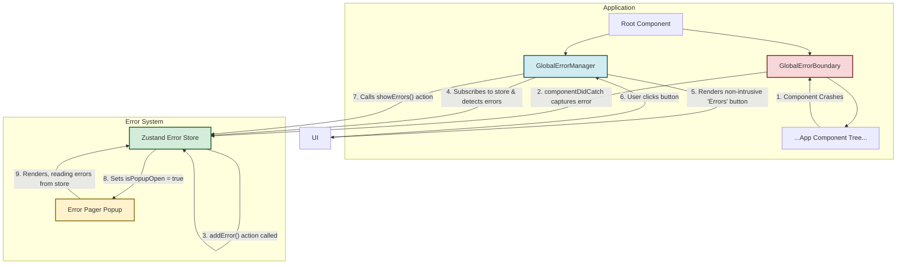

# Non-Intrusive Error Handling System

## 1. Overview & Design Goals

This document outlines the architecture for a non-intrusive, global error handling system for the Brius Smile Nexus application. The primary goal is to create a user-friendly and developer-centric mechanism for managing runtime errors, inspired by the developer experience of frameworks like Next.js 15, but tailored to our specific needs.

The key objectives are:
- **Prevent UI Collapse**: Errors in one component should not crash the entire application or disrupt the surrounding layout.
- **Non-Intrusive Notification**: Instead of replacing UI with a large error message, the system will provide a discreet, persistent notification that an error has occurred.
- **Centralized Error Management**: All captured errors will be managed in a single, global state store.
- **Detailed Diagnostics**: Provide a user-initiated way to view detailed error information, including messages and component stacks, in a structured and easy-to-navigate format.
- **Maintainable & Scalable**: The system should be easy to integrate, understand, and extend.

## 2. System Architecture

The architecture decouples error *capturing* from error *displaying*. This is achieved with four main components: a global Zustand store, a custom `GlobalErrorBoundary`, a `GlobalErrorManager` for visible notifications, and an `ErrorPagerPopup` for detailed inspection.

### Data Flow Diagram



## 3. Component & Store Definitions

### A. `useErrorStore` (Zustand Store)

This store is the central hub for managing all runtime errors.

-   **Location**: `src/stores/error-store.ts`
-   **State Interface**:
    ```typescript
    interface ErrorState {
      errors: { error: Error; errorInfo: React.ErrorInfo }[];
      isPopupOpen: boolean;
      activeErrorIndex: number;
      addError: (error: Error, errorInfo: React.ErrorInfo) => void;
      showErrors: (index?: number) => void;
      hideErrors: () => void;
      nextError: () => void;
      previousError: () => void;
      clearErrors: () => void;
    }
    ```
-   **Functionality**: Manages the list of errors and the state of the display popup.

### B. `GlobalErrorBoundary` (Component)

A specialized error boundary that captures errors without rendering a fallback UI.

-   **Location**: `src/components/ui/global-error-boundary.tsx`
-   **Logic**:
    -   Implements `componentDidCatch` to send error details to the `useErrorStore`.
    -   When an error is caught, it renders `null`, preventing the crashed component subtree from rendering but preserving the integrity of the surrounding UI.
-   **Usage**: This component should wrap the entire application at the root layout level.

### C. `GlobalErrorManager` (Component)

The user-facing component that indicates the presence of errors.

-   **Location**: `src/components/error/global-error-manager.tsx`
-   **Logic**:
    -   It is a client component (`'use client'`) that subscribes to `useErrorStore`.
    -   When `errors.length` is greater than 0, it renders a small, red button (using `shadcn/ui/button`) in a fixed position on the screen (e.g., bottom-left).
    -   The button will display a count of the number of unique errors.
    -   Clicking the button will trigger the `showErrors()` action in the store.
    -   It will also manage the rendering of the `ErrorPagerPopup`.

### D. `ErrorPagerPopup` (Component)

The modal dialog for detailed error inspection.

-   **Location**: `src/components/error/error-pager-popup.tsx`
-   **UI & Logic**:
    -   A modal implemented with `shadcn/ui/dialog`.
    -   Displays the current error message (`error.message`).
    -   Uses `shadcn/ui/accordion` to provide a collapsible section containing the detailed component stack (`errorInfo.componentStack`).
    -   Provides a pager UI (`Error X of Y`) with "Previous" and "Next" buttons to navigate through the `errors` array in the store.
    -   A "Clear" button to dismiss all errors and close the popup.

## 4. Usage and Implementation Guide

1.  **Global Setup**: In the primary application layout file (e.g., `src/pages/portal/layout.tsx`), wrap the main content area with `<GlobalErrorBoundary>`.
2.  **Indicator Placement**: Inside the same layout file, place the `<GlobalErrorManager />` component as a sibling to the main content, ensuring it is outside the `GlobalErrorBoundary` wrapper to prevent it from being hidden if the entire app crashes.

    ```tsx
    // Example in a root layout
    import { GlobalErrorBoundary } from '@/components/ui/global-error-boundary';
    import { GlobalErrorManager } from '@/components/error/global-error-manager';

    export default function RootLayout({ children }: { children: React.ReactNode }) {
      return (
        <body>
          <GlobalErrorBoundary>
            {children}
          </GlobalErrorBoundary>
          <GlobalErrorManager />
        </body>
      );
    }
    ```

3.  **Granular Boundaries (Optional)**: For more specific error handling, developers can wrap discrete sections of the UI (e.g., a complex data dashboard, a single panel) with the same `<GlobalErrorBoundary>`. Because our boundary only reports the error and renders null, this practice will gracefully hide the failing feature without affecting the rest of the page.

This system provides a robust foundation for creating a resilient application where errors are handled gracefully, improving both the user and developer experience.