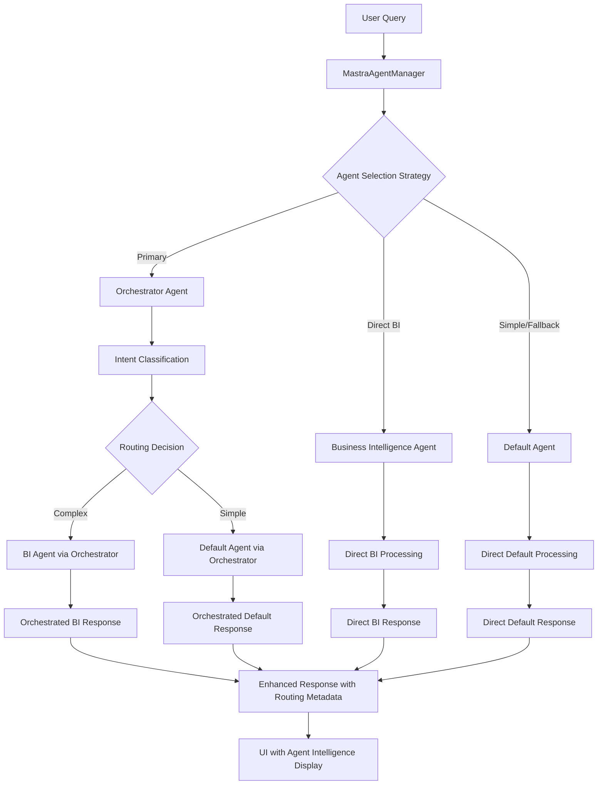

# Mastra Multi-Agent Orchestrator Integration

## Overview

This document describes the comprehensive multi-agent architecture implemented for flawless integration with the Mastra orchestrator agent from the `brius-business-intelligence` project. The architecture provides intelligent routing, classification, and robust fallback mechanisms across three specialized agents.

## Architecture Components

### 🎯 **Agent Hierarchy**



### 🏗️ **Service Layer Architecture**

#### 1. **MastraOrchestratorClient** (Primary)
- **File**: [`src/services/mastra-orchestrator-client.ts`](../src/services/mastra-orchestrator-client.ts)
- **Purpose**: Intelligent routing and classification through orchestrator agent
- **Capabilities**:
  - Intent classification and complexity analysis
  - Automatic routing to appropriate specialized agents
  - Enhanced response metadata with routing decisions
  - Full conversation context and memory integration

#### 2. **MastraBusinessIntelligenceClient** (Specialized)
- **File**: [`src/services/mastra-business-intelligence-client.ts`](../src/services/mastra-business-intelligence-client.ts)
- **Purpose**: Direct access to sophisticated BI agent with planner-executor pattern
- **Capabilities**:
  - Advanced orthodontic business domain expertise
  - Complex analytical workflows and data processing
  - Executive-ready deliverables and insights
  - Planner-executor pattern for sophisticated analysis

#### 3. **MastraDefaultClient** (Fallback)
- **File**: [`src/services/mastra-default-client.ts`](../src/services/mastra-default-client.ts)
- **Purpose**: Simple queries and fallback scenarios
- **Capabilities**:
  - General assistance and help queries
  - Lightweight processing for quick responses
  - Fallback for system degradation scenarios
  - Basic conversational capabilities

#### 4. **MastraAgentManager** (Coordinator)
- **File**: [`src/services/mastra-agent-manager.ts`](../src/services/mastra-agent-manager.ts)
- **Purpose**: Central coordination with cascading fallback logic
- **Capabilities**:
  - Intelligent agent selection based on query complexity
  - Comprehensive health monitoring across all agents
  - Cascading fallback chain: Orchestrator → BI → Default → Error
  - Performance tracking and optimization

## State Management Architecture

### **MastraOrchestratorStore**
- **File**: [`src/stores/mastra-orchestrator-store.ts`](../src/stores/mastra-orchestrator-store.ts)
- **Purpose**: Centralized state management for orchestrator integration
- **Features**:
  - Agent health tracking and monitoring
  - Routing decision history and metadata
  - Performance metrics and analytics
  - User preferences and configuration
  - Persistent storage for routing insights

### **Hook-Based Data Orchestration**

#### Primary Hooks:
1. **`useMastraOrchestratorIntegration`** - Complete orchestrator functionality
2. **`useMastraOrchestratorBI`** - Orchestrator with BI preference
3. **`useMastraOrchestratorDefault`** - Orchestrator with default agent preference
4. **`useMastraOrchestratorInsights`** - Performance analytics and routing insights

## Environment Configuration

### **Multi-Agent Environment Variables**

```bash
# Base Configuration
VITE_MASTRA_BASE_URL=http://localhost:3000
VITE_MASTRA_API_KEY=your-api-key-here
VITE_MASTRA_DEBUG=false

# Orchestrator Agent (Primary)
VITE_MASTRA_ORCHESTRATOR_ENDPOINT=/agents/orchestrator-agent/generate
VITE_MASTRA_ORCHESTRATOR_TIMEOUT=45000

# Business Intelligence Agent (Specialized)
VITE_MASTRA_BI_ENDPOINT=/agents/business-intelligence-agent/generate
VITE_MASTRA_BI_TIMEOUT=60000

# Default Agent (Fallback)
VITE_MASTRA_DEFAULT_ENDPOINT=/agents/default-agent/generate
VITE_MASTRA_DEFAULT_TIMEOUT=30000

# Multi-Agent Strategy
VITE_MASTRA_PRIMARY_AGENT=orchestrator
VITE_MASTRA_ENABLE_FALLBACK=true
VITE_MASTRA_FALLBACK_CHAIN=orchestrator,business-intelligence,default
VITE_MASTRA_MAX_RETRIES=3
VITE_MASTRA_HEALTH_CHECK_INTERVAL=60000
```

## Integration Patterns

### **1. Primary Usage Pattern (Recommended)**

```typescript
import { useMastraOrchestratorIntegration } from '@/hooks/use-mastra-orchestrator-integration';

const MyComponent = () => {
  const {
    executeQuery,
    isLoading,
    error,
    routingMetadata,
    agentHealth,
    insights
  } = useMastraOrchestratorIntegration();

  const handleQuery = async (query: string) => {
    try {
      const response = await executeQuery({
        id: `query-${Date.now()}`,
        query,
        type: 'general',
        context: { userId: 'user-123' }
      });
      
      // Response includes routing intelligence
      console.log('Selected Agent:', routingMetadata?.selectedAgent);
      console.log('Confidence:', routingMetadata?.confidence);
      console.log('Reasoning:', routingMetadata?.reasoning);
    } catch (error) {
      console.error('Query failed:', error);
    }
  };

  return (
    <div>
      {/* Component renders routing intelligence */}
      {routingMetadata && (
        <div className="routing-info">
          <p>Agent: {routingMetadata.selectedAgent}</p>
          <p>Confidence: {(routingMetadata.confidence * 100).toFixed(1)}%</p>
          <p>Reasoning: {routingMetadata.reasoning}</p>
        </div>
      )}
    </div>
  );
};
```

### **2. Specialized BI Pattern**

```typescript
import { useMastraOrchestratorBI } from '@/hooks/use-mastra-orchestrator-integration';

const AnalyticsComponent = () => {
  const { executeAnalyticsQuery, insights } = useMastraOrchestratorBI();

  const handleAnalytics = async () => {
    const response = await executeAnalyticsQuery(
      "Show me quarterly revenue trends",
      {
        dataSources: ['supabase'],
        timeRange: { start: new Date('2024-01-01'), end: new Date() },
        metrics: ['revenue', 'orders'],
        dimensions: ['quarter', 'region']
      }
    );
  };
};
```

### **3. Direct Agent Access Pattern**

```typescript
import { getMastraBusinessIntelligenceClient } from '@/services/mastra-business-intelligence-client';

const DirectBIComponent = () => {
  const [biClient] = useState(() => getMastraBusinessIntelligenceClient());

  const handleDirectBI = async () => {
    const response = await biClient.executeAnalyticsQuery(
      "Analyze patient satisfaction trends",
      {
        dataSources: ['patient_feedback'],
        timeRange: { start: new Date('2024-01-01'), end: new Date() },
        metrics: ['satisfaction_score', 'response_rate']
      }
    );
  };
};
```

## Fallback Strategy

### **Cascading Fallback Chain**

```
User Query
    ↓
Orchestrator Agent (Primary)
    ↓ (if fails)
Business Intelligence Agent (Specialized)
    ↓ (if fails)
Default Agent (Fallback)
    ↓ (if fails)
Error State with Graceful Degradation
```

### **Health-Based Routing**

The system continuously monitors agent health and automatically routes queries to healthy agents:

1. **Healthy Orchestrator**: Use orchestrator for intelligent routing
2. **Degraded Orchestrator**: Fall back to direct BI or Default based on query complexity
3. **Multiple Failures**: Use the most reliable agent based on performance history
4. **All Agents Down**: Graceful error handling with retry mechanisms

## Performance Monitoring

### **Metrics Tracked**

- **Agent Usage**: Percentage distribution across agents
- **Success Rates**: Success/failure rates per agent
- **Response Times**: Average response times per agent
- **Fallback Usage**: Frequency of fallback scenarios
- **Routing Confidence**: Average confidence scores by agent
- **Health Status**: Real-time agent availability

### **Routing Insights**

The system provides comprehensive insights into routing decisions:

```typescript
const { insights } = useMastraOrchestratorInsights();

// insights.agentUsagePercentages - Agent usage distribution
// insights.averageConfidenceByAgent - Confidence scores by agent
// insights.successRate - Overall success rate
// insights.fallbackRate - Fallback usage percentage
// insights.recentActivity - Recent routing decisions
```

## Error Handling

### **Error Types**

- **`ORCHESTRATOR_ERROR`**: Orchestrator-specific failures
- **`BUSINESS_INTELLIGENCE_ERROR`**: BI agent failures
- **`DEFAULT_AGENT_ERROR`**: Default agent failures
- **`AGENT_SELECTION_ERROR`**: Agent selection logic failures
- **`FALLBACK_EXHAUSTED`**: All agents in fallback chain failed
- **`HEALTH_CHECK_FAILED`**: Agent health monitoring failures

### **Error Recovery**

1. **Automatic Retry**: Configurable retry logic with exponential backoff
2. **Agent Fallback**: Automatic fallback to next healthy agent
3. **Graceful Degradation**: Maintain functionality even with partial failures
4. **User Notification**: Clear error messages with suggested actions

## Type Safety

### **Comprehensive Type System**

- **`mastra-agents-types.ts`**: Complete type definitions for all agents
- **Zod Schemas**: Runtime validation for all agent communications
- **Strict TypeScript**: Zero `any` usage with proper type guards
- **Interface Compatibility**: Full compatibility with orchestrator patterns

### **Key Interfaces**

```typescript
// Orchestrator request/response
interface MastraOrchestratorRequest extends MastraAgentRequest {
  type?: 'analytics' | 'dashboard' | 'report' | 'general';
  routing_hints?: {
    preferred_agent?: string;
    complexity_override?: 'force_simple' | 'force_complex';
    bypass_classification?: boolean;
  };
}

// Multi-agent execution result
interface MultiAgentExecutionResult {
  request: MastraAgentRequest;
  executed_by: MastraAgentType;
  response: MastraAgentResponse;
  execution_metadata: {
    total_time_ms: number;
    agents_attempted: MastraAgentType[];
    fallback_reason?: string;
    agent_health: AgentHealthStatus[];
  };
}
```

## Testing Strategy

### **Test Coverage Areas**

1. **Unit Tests**: Individual client services and utilities
2. **Integration Tests**: Multi-agent communication and fallback scenarios
3. **Health Monitoring Tests**: Agent health checks and recovery
4. **Performance Tests**: Response times and resource usage
5. **Error Handling Tests**: All failure scenarios and recovery paths

### **Mock Strategies**

- **Agent Responses**: Mock orchestrator, BI, and default agent responses
- **Health Checks**: Simulate various agent health states
- **Network Failures**: Test fallback mechanisms
- **Configuration**: Test different environment configurations

## Migration Path

### **Backward Compatibility**

- **Existing Components**: Continue to work with legacy [`mastra-bi-client.ts`](../src/services/mastra-bi-client.ts)
- **Progressive Enhancement**: Gradually migrate to orchestrator hooks
- **Feature Flags**: Control rollout of orchestrator features
- **Graceful Degradation**: Fallback to legacy implementation if needed

### **Migration Steps**

1. **Phase 1**: Deploy new services and hooks alongside existing code
2. **Phase 2**: Update critical components to use orchestrator integration
3. **Phase 3**: Migrate remaining components with comprehensive testing
4. **Phase 4**: Remove legacy code after full validation

## Best Practices

### **Component Integration**

```typescript
// ✅ RECOMMENDED - Use orchestrator integration hook
const MyComponent = () => {
  const { executeQuery, routingMetadata, isLoading, error } = useMastraOrchestratorIntegration();
  
  // Component stays pure and focused on rendering
  if (isLoading) return <LoadingSpinner />;
  if (error) return <ErrorMessage error={error} />;
  
  return (
    <div>
      {/* Display routing intelligence */}
      {routingMetadata && (
        <AgentRoutingInfo metadata={routingMetadata} />
      )}
    </div>
  );
};
```

### **Error Handling**

```typescript
// ✅ COMPREHENSIVE - Handle all error scenarios
try {
  const response = await executeQuery(request);
} catch (error) {
  if (error instanceof MastraMultiAgentError) {
    switch (error.code) {
      case MastraMultiAgentErrorType.ORCHESTRATOR_ERROR:
        // Handle orchestrator-specific errors
        break;
      case MastraMultiAgentErrorType.FALLBACK_EXHAUSTED:
        // Handle complete system failure
        break;
      default:
        // Handle other error types
        break;
    }
  }
}
```

### **Performance Optimization**

```typescript
// ✅ OPTIMIZED - Use appropriate agent for query type
const { executeAnalyticsQuery } = useMastraOrchestratorBI(); // For complex analytics
const { executeSimpleQuery } = useMastraOrchestratorDefault(); // For simple queries
const { executeQuery } = useMastraOrchestratorIntegration(); // For automatic routing
```

## Monitoring and Debugging

### **Health Monitoring**

- **Real-time Health Checks**: Continuous monitoring of all agents
- **Automatic Failover**: Immediate routing to healthy agents
- **Performance Tracking**: Response times and success rates
- **Alert System**: Notifications for agent failures

### **Debug Information**

- **Routing Decisions**: Full classification and routing metadata
- **Execution Paths**: Complete trace of agent selection and execution
- **Performance Metrics**: Detailed timing and resource usage
- **Error Context**: Comprehensive error details with recovery suggestions

## Security Considerations

### **Authentication**

- **API Key Management**: Secure handling of Mastra API keys
- **Request Validation**: Comprehensive input validation with Zod schemas
- **Error Sanitization**: Prevent sensitive information leakage in errors

### **Network Security**

- **HTTPS Enforcement**: All agent communications over HTTPS
- **Timeout Management**: Prevent hanging requests and resource exhaustion
- **Rate Limiting**: Respect agent service rate limits

## Future Enhancements

### **Planned Features**

1. **Streaming Support**: Real-time streaming for all agents
2. **Advanced Analytics**: Machine learning-based agent selection
3. **Custom Agents**: Support for additional specialized agents
4. **Load Balancing**: Distribute load across multiple agent instances

### **Extensibility Points**

- **Agent Registry**: Easy addition of new specialized agents
- **Routing Strategies**: Pluggable routing algorithms
- **Health Checks**: Customizable health monitoring
- **Metrics Collection**: Extensible performance tracking

## Troubleshooting

### **Common Issues**

1. **Agent Unavailable**: Check health status and fallback configuration
2. **Slow Responses**: Monitor performance metrics and adjust timeouts
3. **Classification Errors**: Review query format and routing hints
4. **Fallback Loops**: Verify agent health and fallback chain configuration

### **Debug Tools**

- **Health Dashboard**: Real-time agent status monitoring
- **Routing History**: Complete log of routing decisions
- **Performance Analytics**: Detailed performance insights
- **Error Tracking**: Comprehensive error logging and analysis

## Conclusion

This multi-agent orchestrator integration provides:

✅ **Flawless Integration** - Complete compatibility with orchestrator patterns  
✅ **Intelligent Routing** - Automatic complexity analysis and agent selection  
✅ **Robust Fallback** - Graceful degradation through agent hierarchy  
✅ **Rich Metadata** - Comprehensive routing and execution intelligence  
✅ **Performance Insights** - Detailed analytics and monitoring  
✅ **Future-Proof Design** - Extensible architecture for new capabilities  

The architecture ensures maximum reliability, performance, and maintainability while providing the sophisticated routing intelligence that makes the orchestrator agent so powerful.