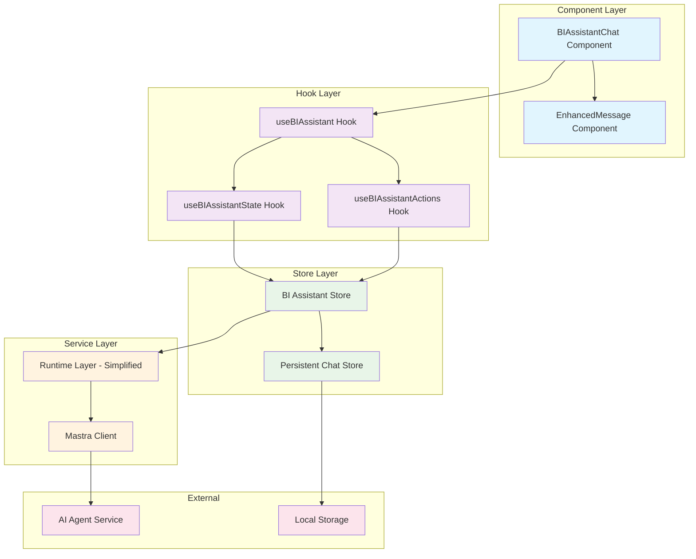

# Progress Tracking

## Current Project: Assistant UI Architecture Refactoring

### Status: Planning Complete - Ready for Implementation

### Overview
Comprehensive refactoring of the Business Intelligence Assistant UI to implement proper Zustand store architecture, enhanced UI state management, and full markdown rendering capabilities.

## Implementation Plan

### Phase 1: New Zustand Store Architecture
**Objective**: Create centralized state management for BI Assistant

#### Tasks:
1. **Create BI Assistant Store** (`src/stores/bi-assistant-store.ts`)
   - Implement Zustand store with proper TypeScript interfaces
   - Manage UI state (loading, streaming, errors, input disabled)
   - Handle message history and thread management
   - Integrate with existing `usePersistentChatStore` for persistence
   - Follow project's custom hooks pattern

2. **Create Custom Hooks** (`src/hooks/use-bi-assistant-*.ts`)
   - `use-bi-assistant.ts`: Main hook for component integration
   - `use-bi-assistant-state.ts`: UI state management hook
   - `use-bi-assistant-actions.ts`: Action dispatchers hook
   - Follow project's Zustand patterns (no direct store access)

3. **Type Definitions** (`src/types/bi-assistant.ts`)
   - Check existing types in `src/types/assistant.ts` to prevent duplicates
   - Define store state interfaces
   - Define action interfaces
   - Define error handling types
   - UI state management types

#### Technical Requirements:
- Single source of truth for all BI Assistant state
- Proper separation of concerns (UI state vs business logic)
- Integration with existing persistent chat store
- TypeScript strict mode compliance
- Custom hooks pattern for component access

### Phase 2: Component Architecture Refactoring
**Objective**: Refactor components to use new Zustand store architecture

#### Tasks:
1. **Refactor BIAssistantChat Component** (`src/components/assistant-ui/bi-assistant-chat.tsx`)
   - Remove direct `useBIAssistantRuntime` usage
   - Integrate with new Zustand store via custom hooks
   - Replace basic message rendering with `EnhancedMessage` component
   - Implement proper loading states and input disabling
   - Add comprehensive error handling and display

2. **Integrate EnhancedMessage Component**
   - Use existing `src/components/assistant-ui/message-content/enhanced-message.tsx`
   - Full markdown rendering with mermaid diagrams
   - Code block syntax highlighting and copy functionality
   - Proper styling integration with shadcn/ui components

3. **Simplify Runtime Layer** (`src/lib/bi-assistant-runtime.ts`)
   - Reduce to minimal interface for Mastra integration
   - Remove UI state management responsibilities
   - Focus on pure data streaming and processing
   - Consider deprecation in favor of direct Mastra integration

#### Technical Requirements:
- No direct runtime coupling in components
- Proper loading/streaming indicators
- Input disabled during processing (one prompt at a time)
- Enhanced markdown rendering with all features
- Consistent error handling and recovery

### Phase 3: Enhanced State Persistence
**Objective**: Implement comprehensive state synchronization and persistence

#### Tasks:
1. **Thread Synchronization**
   - Sync BI Assistant store with persistent chat store
   - Handle thread creation and management
   - Implement proper message history persistence
   - Server state synchronization on initialization

2. **Offline/Online State Management**
   - Handle network connectivity changes
   - Implement optimistic updates with rollback
   - Queue messages during offline periods
   - Sync state when connection restored

3. **Performance Optimization**
   - Implement proper Zustand subscriptions
   - Optimize re-renders with selective state access
   - Memory management for large conversation histories
   - Lazy loading for historical messages

#### Technical Requirements:
- Seamless integration with existing chat persistence
- Proper error recovery and state consistency
- Performance optimization for large datasets
- Network resilience and offline support

### Phase 4: Error Handling & User Experience
**Objective**: Implement comprehensive error handling and optimal user experience

#### Tasks:
1. **Error Display and Recovery**
   - User-friendly error messages with clear actions
   - Retry mechanisms for recoverable errors
   - Error categorization (network, validation, system)
   - Graceful degradation for partial failures

2. **Loading and Streaming Indicators**
   - Visual feedback during prompt processing
   - Streaming text indicators during response generation
   - Progress indicators for long-running operations
   - Proper accessibility support for screen readers

3. **Input Management**
   - Disable input during processing to prevent multiple prompts
   - Clear visual indication of disabled state
   - Proper focus management and keyboard navigation
   - Input validation and sanitization

4. **User Experience Enhancements**
   - Smooth transitions and animations
   - Proper responsive design for all screen sizes
   - Keyboard shortcuts and accessibility features
   - Context preservation during navigation

#### Technical Requirements:
- Comprehensive error handling with user-friendly messaging
- Proper accessibility (a11y) compliance
- Responsive design with shadcn/ui components
- Performance optimization and smooth interactions

## Architecture Diagram

## Files to Create/Modify

### New Files:
- `src/stores/bi-assistant-store.ts`
- `src/hooks/use-bi-assistant.ts`
- `src/hooks/use-bi-assistant-state.ts`
- `src/hooks/use-bi-assistant-actions.ts`
- `src/types/bi-assistant.ts` (if needed after checking existing types)

### Modified Files:
- `src/components/assistant-ui/bi-assistant-chat.tsx`
- `src/lib/bi-assistant-runtime.ts` (simplify/deprecate)

### Integration Files:
- `src/components/assistant-ui/message-content/enhanced-message.tsx` (existing)
- `src/stores/chat-store.ts` (existing - integration point)

## Success Criteria

1. **Functional Requirements**
   - ✅ Proper loading/streaming indicators during prompt processing
   - ✅ Enhanced markdown rendering with mermaid diagrams and code blocks
   - ✅ Input disabled during processing (one prompt at a time)
   - ✅ Comprehensive error handling and user-friendly error display
   - ✅ State persistence and thread management

2. **Technical Requirements**
   - ✅ Single source of truth through Zustand store architecture
   - ✅ Proper separation of concerns (UI, business logic, persistence)
   - ✅ Custom hooks pattern following project standards
   - ✅ TypeScript strict mode compliance
   - ✅ Integration with existing persistent chat store

3. **User Experience Requirements**
   - ✅ Smooth, responsive interface with proper feedback
   - ✅ Accessibility compliance and keyboard navigation
   - ✅ Error recovery and graceful degradation
   - ✅ Consistent styling with shadcn/ui components

## Next Steps

Ready to proceed to **Code Mode** for implementation. The architectural plan is complete and approved, with detailed technical specifications for each phase.

**Implementation Order**: Phase 1 → Phase 2 → Phase 3 → Phase 4

Each phase builds upon the previous one, ensuring a stable foundation before adding complexity.