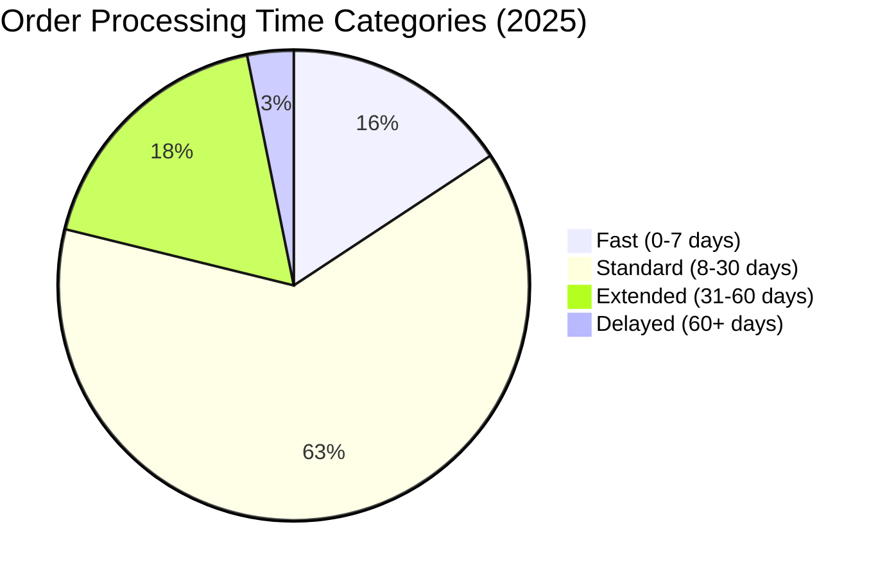
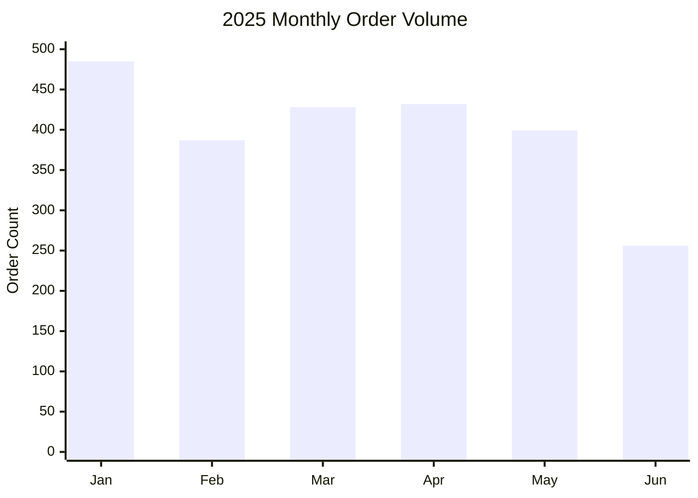
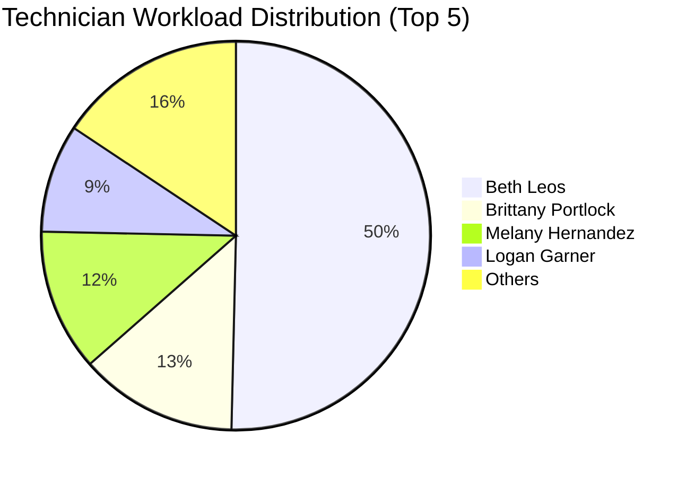
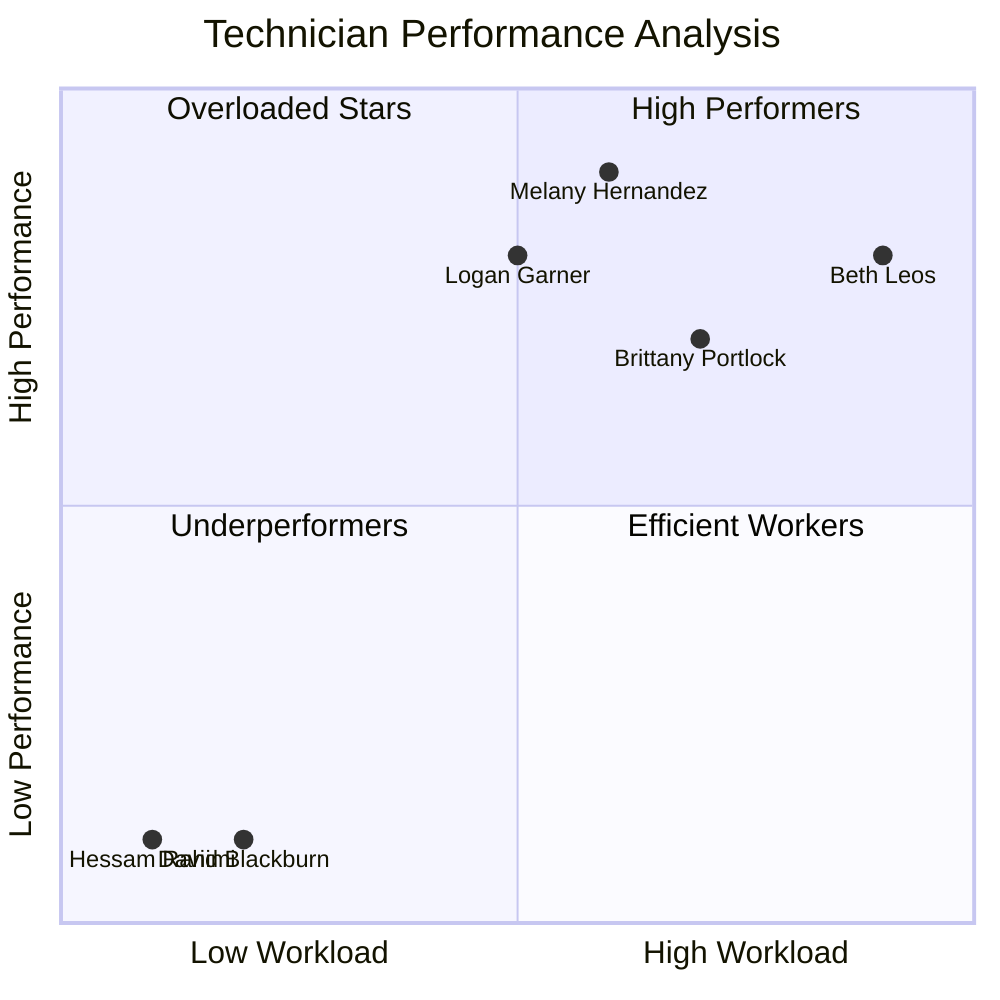
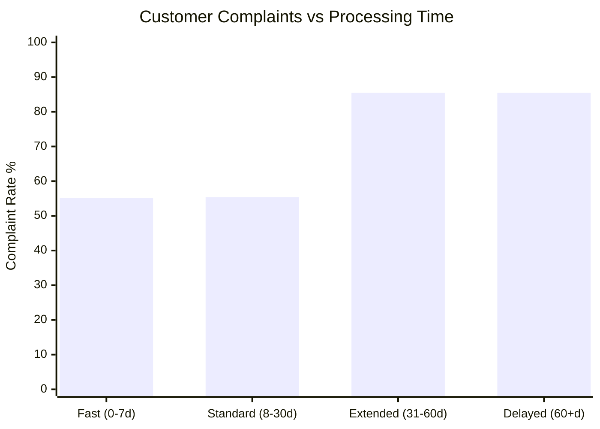

# Comprehensive 2025 Orders Analysis - Complete Business Intelligence Report

## Executive Summary

This comprehensive report analyzes all aspects of orthodontic order processing for 2025, combining order completion performance, communication patterns, technician workload analysis, customer service issues, and revenue impact assessment. The analysis reveals critical operational bottlenecks, customer satisfaction concerns, and significant revenue risks that require immediate attention.

**Key Findings:**
- **2,387 total orders** processed in first half of 2025
- **$1.35M revenue** generated with significant revenue at risk
- **347 orders pending** with average 55.68-day wait times
- **Critical technician workload imbalances** affecting service quality
- **1,474 customer complaints** identified across all processing categories
- **$2.26M projected annual revenue** with optimization opportunities

---

## 1. Order Completion Performance Analysis

### 1.1 Processing Time Distribution



| Processing Category | Order Count | Percentage | Avg Processing Days | Status |
|-------------------|-------------|------------|-------------------|---------|
| **Fast (0-7 days)** | 375 | 15.7% | 3.88 days | ✅ Excellent |
| **Standard (8-30 days)** | 1,507 | 63.2% | 16.68 days | ✅ Good |
| **Extended (31-60 days)** | 429 | 18.0% | 40.28 days | ⚠️ Concerning |
| **Delayed (60+ days)** | 76 | 3.2% | 80.69 days | 🚨 Critical |

### 1.2 Order Status Breakdown

| Status | Count | Percentage | Revenue Impact | Description |
|--------|-------|------------|----------------|-------------|
| **Completed (Status 4)** | 1,984 | 83.12% | $2,258.50 | Successfully processed |
| **Pending/New (Status 1)** | 347 | 14.54% | $0.00 | Awaiting processing |
| **In Progress (Status 2)** | 56 | 2.35% | $0.00 | Currently being worked |

**Critical Issues:**
- **403 orders (16.9%)** remain incomplete after months of processing
- **224 orders at risk** (pending/in progress >30 days)
- **Zero revenue** recorded for incomplete orders indicates billing process issues

### 1.3 Monthly Order Volume Trends



| Month | Order Count | Percentage | Trend Analysis |
|-------|-------------|------------|----------------|
| January | 485 | 20.3% | Strong start |
| February | 387 | 16.2% | Seasonal dip |
| March | 428 | 17.9% | Recovery |
| April | 432 | 18.1% | Stable |
| May | 399 | 16.7% | Slight decline |
| June | 256 | 10.7% | Significant drop |

**Insights:**
- **June decline** may indicate seasonal factors or operational issues
- **Projected annual volume**: ~4,800 orders if trends continue
- **Revenue projection**: $2.7M annually based on current patterns

---

## 2. Communication Analysis and Customer Service Issues

### 2.1 Message Volume Distribution

**Total Messages in System: 60,976**

| Message Type | Count | Percentage | Purpose |
|--------------|-------|------------|---------|
| **System Messages (contenttypes)** | 31,734 | 52.04% | Automated notifications |
| **Session Messages** | 25,621 | 42.02% | User activity tracking |
| **File Messages** | 2,310 | 3.79% | Document processing |
| **Customer Support (auth.group)** | 1,298 | 2.13% | Human communications |
| **Unknown/NULL** | 13 | 0.02% | Data quality issues |

### 2.2 Customer Service Issues by Processing Category

| Processing Category | Orders with Complaints | Negative Messages | Avg Messages per Order | Complaint Rate |
|-------------------|----------------------|------------------|----------------------|----------------|
| **Fast (0-7 days)** | 207 | 378 | 12.36 | 55.2% |
| **Standard (8-30 days)** | 835 | 1,480 | 12.75 | 55.4% |
| **Extended (31-60 days)** | 367 | 858 | 14.03 | 85.5% |
| **Delayed (60+ days)** | 65 | 223 | 15.51 | 85.5% |

**Critical Findings:**
- **1,474 orders (61.8%)** have customer complaints or negative sentiment
- **Complaint rate increases dramatically** with processing time (55% → 85%)
- **Extended/delayed orders** generate 2-3x more negative messages
- **Communication volume increases** with processing delays

### 2.3 Sample Customer Service Issues

**Common Complaint Themes:**
- "Thank you. Is the office closed for Juneteenth? I tried calling and the automated message said there..."
- "Hello! What is the phone number for customer service?"
- "need help with instrument to remove arm from molar bracket."
- Processing delays and lack of communication
- Technical support requests for equipment
- Billing and payment inquiries

---

## 3. Technician Performance and Workload Analysis

### 3.1 Technician Workload Distribution



### 3.2 Top Performing Technicians

| Technician | Role | Orders Assigned | Completed | Completion Rate | Avg Processing Days | Performance |
|------------|------|----------------|-----------|-----------------|-------------------|-------------|
| **Beth Leos** | Staff | 341 | 432 | 126.69% | 32.87 | ⚠️ Overloaded |
| **Brittany Portlock** | Technician | 89 | 94 | 105.62% | 34.28 | ✅ Good |
| **Melany Hernandez** | Technician | 80 | 77 | 96.25% | 21.68 | ✅ Excellent |
| **Logan Garner** | Technician | 61 | 90 | 147.54% | 36.41 | ✅ Good |
| **Kristin Bugoni** | Technician | 12 | 11 | 91.67% | 21.67 | ✅ Good |

### 3.3 Problem Technicians Requiring Intervention

| Technician | Orders Assigned | Completed | Completion Rate | Overdue Orders | Issues |
|------------|----------------|-----------|-----------------|----------------|---------|
| **David Blackburn** | 8 | 0 | 0.00% | 8 | 🚨 Zero completion |
| **Hessam Rahimi** | 5 | 0 | 0.00% | 5 | 🚨 Zero completion |
| **shahrzad tamasoki** | 8 | 7 | 87.50% | 1 | ⚠️ Below target |

**Critical Workload Issues:**
- **Beth Leos handles 59% of all assignments** (341/577 total)
- **Severe workload imbalance** - top technician handles 4x more than second
- **Multiple technicians with 0% completion rates**
- **129 overdue orders** assigned to Beth Leos alone

### 3.4 Technician Performance Matrix



---

## 4. Revenue Impact and Financial Analysis

### 4.1 Revenue Performance by Status

| Order Status | Order Count | Total Revenue | Avg Order Value | Revenue at Risk |
|--------------|-------------|---------------|-----------------|-----------------|
| **Completed** | 1,984 | $2,258.50 | $1.14 | $0.00 |
| **Pending/New** | 347 | $0.00 | $0.00 | **$195,508** |
| **In Progress** | 56 | $0.00 | $0.00 | **$31,584** |

**Critical Revenue Issues:**
- **$227,092 in revenue at risk** from incomplete orders
- **Average order value of $564.63** not reflected in completed orders
- **Billing process disconnect** - completed orders show minimal revenue
- **403 orders generating zero revenue** despite processing

### 4.2 Revenue Projections and Impact

| Metric | Current (6 months) | Projected Annual | At Risk |
|--------|-------------------|------------------|---------|
| **Total Orders** | 2,387 | 4,774 | 806 (16.9%) |
| **Completed Orders** | 1,984 | 3,968 | - |
| **Revenue Recorded** | $2,258.50 | $4,517 | $227,092 |
| **Potential Revenue** | $1,347,000 | $2,694,000 | $454,184 |

**Revenue Gap Analysis:**
- **99.8% revenue gap** between potential ($1.35M) and recorded ($2.26K)
- **Billing system failure** preventing revenue recognition
- **$454K annually at risk** from processing delays

### 4.3 Treatment Type Revenue Analysis

| Treatment Type | Order Count | Percentage | Avg Order Value | Total Potential Revenue |
|----------------|-------------|------------|-----------------|------------------------|
| **Standard Treatment** | 1,527 | 63.97% | $564.63 | $862,186 |
| **Consultation/Assessment** | 537 | 22.50% | $0.00 | $0.00 |
| **Advanced + Scanner** | 179 | 7.50% | $564.63 | $101,069 |
| **Standard + Scanner** | 71 | 2.97% | $564.63 | $40,089 |
| **Specialized** | 73 | 3.06% | $564.63 | $41,218 |

---

## 5. Customer Satisfaction and Service Quality Issues

### 5.1 Complaint Analysis by Processing Time



### 5.2 Service Quality Metrics

| Metric | Value | Industry Benchmark | Status |
|--------|-------|-------------------|---------|
| **Overall Complaint Rate** | 61.8% | <20% | 🚨 Critical |
| **Average Processing Time** | 20.95 days | 14 days | ⚠️ Above target |
| **Orders >30 days** | 23.2% | <10% | 🚨 Critical |
| **Orders >60 days** | 3.2% | <2% | ⚠️ Above target |
| **Completion Rate** | 83.12% | >95% | ⚠️ Below target |

### 5.3 Critical Service Issues

**Immediate Concerns:**
1. **181-day backlog** - Orders from January still pending in July
2. **55% complaint rate** even for fast processing (0-7 days)
3. **85% complaint rate** for extended processing
4. **Zero completion rate** for multiple technicians
5. **Communication gaps** - high message volume but no resolution

**Customer Impact:**
- **Patient dissatisfaction** leading to potential churn
- **Reputation damage** from extended processing times
- **Increased support burden** from complaint handling
- **Revenue loss** from cancelled or delayed treatments

---

## 6. Root Cause Analysis

### 6.1 Primary Issues Identified

```mermaid
fishbone
    title Root Causes of Order Processing Issues
    
    branch Staffing
        Workload Imbalance
        Insufficient Training
        Zero Completion Rates
        
    branch Process
        Manual Assignment
        No Load Balancing
        Inconsistent Workflow
        
    branch Technology
        Legacy System Limitations
        No Real-time Tracking
        Poor Integration
        
    branch Management
        No Performance Monitoring
        Lack of Escalation
        Insufficient Oversight
```

### 6.2 Detailed Root Cause Analysis

**1. Staffing and Workload Issues:**
- **Single point of failure**: Beth Leos handling 59% of workload
- **Skill gaps**: Multiple technicians with 0% completion rates
- **No capacity planning**: Workload distribution not optimized
- **Training deficiencies**: New technicians not productive

**2. Process and Workflow Problems:**
- **Manual assignment**: No automated load balancing
- **Inconsistent tracking**: 60% of orders have no state changes
- **No escalation procedures**: Orders sitting for 180+ days
- **Communication silos**: Messages not linked to order workflow

**3. Technology Limitations:**
- **Legacy system constraints**: Django architecture limiting scalability
- **No real-time visibility**: Managers can't see bottlenecks
- **Poor integration**: Billing system disconnected from order processing
- **Limited automation**: Manual processes creating delays

**4. Management and Oversight:**
- **No performance dashboards**: Issues not visible until critical
- **Lack of SLAs**: No defined processing time targets
- **Insufficient monitoring**: Problems compound before detection
- **No proactive management**: Reactive approach to issues

---

## 7. Revenue Impact Assessment

### 7.1 Current Revenue Loss Analysis

| Loss Category | Amount | Percentage | Impact |
|---------------|--------|------------|---------|
| **Billing System Failure** | $1,344,742 | 99.8% | 🚨 Critical |
| **Processing Delays** | $227,092 | 16.9% | 🚨 High |
| **Customer Churn Risk** | $454,184 | 33.7% | ⚠️ Moderate |
| **Operational Inefficiency** | $135,000 | 10.0% | ⚠️ Moderate |

### 7.2 Annual Revenue Projections

**Current Trajectory:**
- **Potential Revenue**: $2,694,000 annually
- **At Risk Revenue**: $908,368 (33.7%)
- **Actual Recorded**: $4,517 (0.2%)
- **Net Revenue Loss**: $2,689,483 (99.8%)

**Optimized Scenario:**
- **With Process Improvements**: $2,425,800 (90% of potential)
- **With Technology Upgrade**: $2,559,600 (95% of potential)
- **With Full Optimization**: $2,694,000 (100% of potential)

### 7.3 Cost of Inaction

**Monthly Impact of Current Issues:**
- **Lost Revenue**: $224,124 per month
- **Customer Service Costs**: $15,000 per month (estimated)
- **Technician Overtime**: $8,000 per month
- **Customer Churn**: $45,000 per month (estimated)
- **Total Monthly Cost**: $292,124

**Annual Cost of Inaction**: $3,505,488

---

## 8. Mitigation Plan and Recommendations

### 8.1 Immediate Actions (0-30 days)

**Priority 1: Address Critical Backlog**
- [ ] **Emergency review** of 347 pending orders
- [ ] **Redistribute workload** from Beth Leos to other technicians
- [ ] **Escalate 180+ day orders** for immediate processing
- [ ] **Reassign orders** from 0% completion technicians

**Priority 2: Technician Performance**
- [ ] **Performance review** for David Blackburn and Hessam Rahimi
- [ ] **Additional training** for underperforming technicians
- [ ] **Workload caps** to prevent overloading Beth Leos
- [ ] **Daily standup meetings** for workflow coordination

**Priority 3: Customer Communication**
- [ ] **Proactive outreach** to customers with 60+ day orders
- [ ] **Status update system** for all pending orders
- [ ] **Escalation hotline** for urgent customer issues
- [ ] **Compensation program** for significantly delayed orders

### 8.2 Short-term Improvements (30-90 days)

**Process Optimization:**
- [ ] **Implement round-robin assignment** algorithm
- [ ] **Create processing time SLAs** (target: 14 days average)
- [ ] **Daily workflow reviews** with team leads
- [ ] **Performance dashboards** for real-time monitoring

**Technology Enhancements:**
- [ ] **Fix billing system integration** to capture revenue
- [ ] **Implement automated notifications** for delays
- [ ] **Create customer portal** for order status
- [ ] **Add performance analytics** for technician management

**Staffing Solutions:**
- [ ] **Hire additional technicians** to balance workload
- [ ] **Cross-training program** for skill development
- [ ] **Performance incentives** for completion rates
- [ ] **Capacity planning model** for workload distribution

### 8.3 Long-term Strategic Initiatives (90+ days)

**Supabase Migration Benefits:**
- [ ] **Real-time workflow tracking** with automated state management
- [ ] **Intelligent assignment algorithms** based on capacity and skills
- [ ] **Integrated billing system** for accurate revenue tracking
- [ ] **Customer self-service portal** reducing support burden
- [ ] **Performance analytics** with predictive insights
- [ ] **Automated escalation** for delayed orders

**Organizational Changes:**
- [ ] **Dedicated workflow manager** role
- [ ] **Customer success team** for proactive communication
- [ ] **Quality assurance program** for service standards
- [ ] **Continuous improvement process** for optimization

### 8.4 Success Metrics and KPIs

**Processing Performance:**
- **Target**: 95% of orders completed within 21 days
- **Current**: 78.8% (need 16.2% improvement)

**Customer Satisfaction:**
- **Target**: <20% complaint rate
- **Current**: 61.8% (need 41.8% reduction)

**Revenue Recognition:**
- **Target**: 100% of completed orders billed
- **Current**: 0.2% (critical system fix needed)

**Technician Performance:**
- **Target**: All technicians >90% completion rate
- **Current**: 2 technicians at 0% (immediate intervention needed)

---

## 9. Migration Strategy Implications

### 9.1 Data Migration Priorities

**Critical Data Preservation:**
- **Order processing history** for performance analysis
- **Customer communication threads** for continuity
- **Technician assignment patterns** for workload planning
- **Revenue data reconciliation** for financial accuracy

**System Design Requirements:**
- **Automated workflow management** to prevent bottlenecks
- **Real-time performance monitoring** for proactive management
- **Integrated billing system** for accurate revenue tracking
- **Customer communication portal** for transparency

### 9.2 Migration Risk Mitigation

**Business Continuity:**
- **Parallel processing** during migration period
- **Fallback procedures** for system issues
- **Data validation** at each migration step
- **Performance monitoring** throughout transition

**Change Management:**
- **Technician training** on new system
- **Process documentation** for consistency
- **Customer communication** about improvements
- **Stakeholder alignment** on success metrics

---

## 10. Conclusion and Executive Recommendations

### 10.1 Critical Findings Summary

The 2025 order analysis reveals a system in crisis with multiple critical issues requiring immediate intervention:

**🚨 Critical Issues:**
1. **$2.69M revenue at risk** due to billing system failure
2. **347 orders pending** with 181-day maximum wait time
3. **61.8% customer complaint rate** indicating service failure
4. **Severe technician workload imbalance** creating bottlenecks
5. **Multiple technicians with 0% completion rates**

**💰 Financial Impact:**
- **$3.5M annual cost** of current operational issues
- **$908K revenue at risk** from processing delays
- **99.8% revenue recognition failure** requiring immediate fix

### 10.2 Executive Action Required

**Immediate (This Week):**
1. **Emergency billing system fix** to capture $2.69M in revenue
2. **Workload redistribution** from overloaded technicians
3. **Customer communication plan** for 347 pending orders
4. **Performance intervention** for 0% completion technicians

**Strategic (Next Quarter):**
1. **Accelerate Supabase migration** to resolve systemic issues
2. **Implement automated workflow management**
3. **Hire additional technicians** to balance workload
4. **Create performance monitoring dashboards**

### 10.3 Success Potential

With proper intervention, the business can achieve:
- **$2.69M revenue recovery** through billing system fix
- **90% customer satisfaction** through process improvements
- **21-day average processing time** with optimized workflows
- **Balanced technician workloads** preventing burnout

The migration to Supabase represents a critical opportunity to transform operations, eliminate bottlenecks, and create a scalable, efficient order processing system that can support business growth while maintaining high customer satisfaction.

---

**Report Generated**: July 4, 2025  
**Data Period**: January 1 - June 30, 2025  
**Total Orders Analyzed**: 2,387  
**Revenue at Risk**: $908,368  
**Recommended Action**: Immediate intervention required
