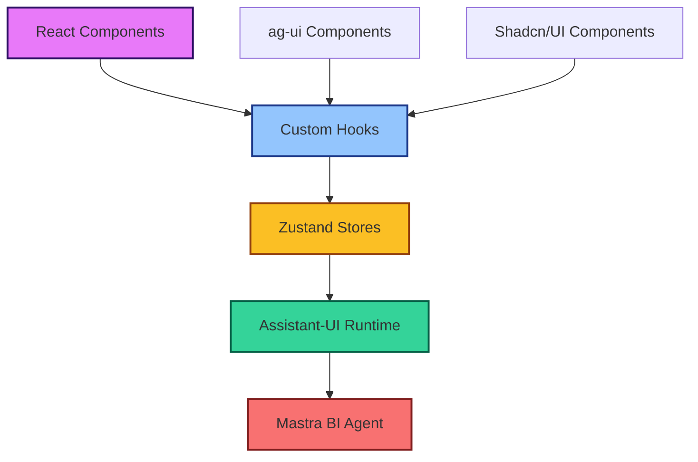

# Business Intelligence Agent Integration Overview

Comprehensive guide for integrating the Business Intelligence Agent with modern React applications using Zustand state management and assistant-ui components.

## 🎯 Agent Capabilities

The Business Intelligence Agent specializes in:

- **Revenue Analysis**: Sales trends, forecasting, and performance metrics
- **Operational Metrics**: Efficiency analysis, process optimization
- **Cost Optimization**: Budget analysis, expense tracking, ROI calculations
- **Data Visualization**: Chart generation and interactive dashboards
- **Real-time Analytics**: Streaming data analysis and live updates

## 🏗️ Architecture: Components → Hooks → Stores

### Clean Separation Pattern



### Layer Responsibilities

1. **Components Layer**: Pure UI components that only call hooks
2. **Hooks Layer**: Business logic and state management interface
3. **Stores Layer**: Persistent state with Zustand + assistant-ui integration
4. **Runtime Layer**: Assistant-UI runtime connecting to Mastra agents

## 🗄️ State Management Architecture

### Core Store Structure

```typescript
interface BIAgentState {
  // Chat State
  messages: BIMessage[];
  isRunning: boolean;
  currentSession: string;
  
  // BI-Specific State
  activeAnalysis: AnalysisContext | null;
  queryHistory: QueryHistoryItem[];
  dashboardData: DashboardMetrics;
  
  // UI State
  sidebarOpen: boolean;
  selectedTimeRange: TimeRange;
  activeFilters: FilterSet;
  
  // Actions
  sendQuery: (query: string, context?: AnalysisContext) => Promise<void>;
  updateDashboard: (metrics: DashboardMetrics) => void;
  setFilters: (filters: FilterSet) => void;
}
```

### Persistent Storage Strategy

```typescript
// Multi-layer persistence
const useBIStore = create<BIAgentState>()(
  persist(
    immer((set, get) => ({
      // State and actions
    })),
    {
      name: 'bi-agent-storage',
      storage: createJSONStorage(() => localStorage),
      partialize: (state) => ({
        // Only persist relevant data
        queryHistory: state.queryHistory,
        dashboardData: state.dashboardData,
        selectedTimeRange: state.selectedTimeRange,
        activeFilters: state.activeFilters,
      }),
    }
  )
);
```

## 🔗 Assistant-UI Integration Patterns

### External Store Runtime Pattern

```typescript
export function useBIAgentRuntime() {
  const store = useBIStore();
  
  const runtime = useExternalStoreRuntime({
    messages: store.messages,
    isRunning: store.isRunning,
    setMessages: store.setMessages,
    
    onNew: async (message) => {
      // Enhanced message handling with BI context
      await store.sendQuery(message.content, store.activeAnalysis);
    },
    
    onEdit: async (messageId, content) => {
      // Handle message editing with context preservation
      await store.editQuery(messageId, content);
    },
    
    onReload: async (messageId) => {
      // Regenerate analysis with current context
      await store.regenerateAnalysis(messageId);
    },
  });
  
  return runtime;
}
```

### ag-ui Connection Pattern

```typescript
// ag-ui components connect through hooks, not directly to stores
export function useBIAgentInterface() {
  const store = useBIStore();
  const runtime = useBIAgentRuntime();
  
  return {
    // Runtime for assistant-ui
    runtime,
    
    // State for ag-ui components
    dashboardData: store.dashboardData,
    isAnalyzing: store.isRunning,
    queryHistory: store.queryHistory,
    
    // Actions for ag-ui interactions
    runAnalysis: store.sendQuery,
    updateFilters: store.setFilters,
    exportResults: store.exportAnalysis,
  };
}
```

## 🎨 UI Component Patterns

### Assistant-UI Chat Interface

```typescript
export function BIChatInterface() {
  const { runtime, isAnalyzing } = useBIAgentInterface();
  
  return (
    <AssistantRuntimeProvider runtime={runtime}>
      <div className="flex flex-col h-full">
        <BIChatHeader isAnalyzing={isAnalyzing} />
        <Thread 
          components={{
            Message: BIMessageComponent,
            Composer: BIComposerComponent,
          }}
        />
        <BIQuickActions />
      </div>
    </AssistantRuntimeProvider>
  );
}
```

### ag-ui Dashboard Components

```typescript
export function BIDashboard() {
  const { dashboardData, updateFilters, runAnalysis } = useBIAgentInterface();
  
  return (
    <div className="grid grid-cols-12 gap-4">
      <BIMetricsCards data={dashboardData.metrics} />
      <BIChartPanel data={dashboardData.charts} />
      <BIFilterPanel onFiltersChange={updateFilters} />
      <BIQueryPanel onQuery={runAnalysis} />
    </div>
  );
}
```

### Hybrid Layout Pattern

```typescript
export function BIWorkspace() {
  const { runtime, dashboardData } = useBIAgentInterface();
  
  return (
    <div className="h-screen flex">
      {/* ag-ui Dashboard */}
      <div className="flex-1">
        <BIDashboard />
      </div>
      
      {/* Assistant-UI Chat */}
      <div className="w-96 border-l">
        <AssistantRuntimeProvider runtime={runtime}>
          <Thread />
        </AssistantRuntimeProvider>
      </div>
    </div>
  );
}
```

## 📊 BI-Specific Features

### Query Context Management

```typescript
interface AnalysisContext {
  type: 'revenue' | 'operations' | 'costs' | 'custom';
  timeRange: TimeRange;
  filters: FilterSet;
  dataSource: string[];
  visualizationType?: 'chart' | 'table' | 'dashboard';
}

// Context-aware query processing
const sendContextualQuery = async (query: string, context: AnalysisContext) => {
  const enhancedQuery = {
    query,
    context,
    timestamp: new Date(),
    sessionId: currentSession,
  };
  
  return await biAgent.analyze(enhancedQuery);
};
```

### Real-time Data Integration

```typescript
export function useBIRealTimeData() {
  const store = useBIStore();
  
  useEffect(() => {
    const eventSource = new EventSource('/api/bi/stream');
    
    eventSource.onmessage = (event) => {
      const data = JSON.parse(event.data);
      store.updateDashboard(data);
    };
    
    return () => eventSource.close();
  }, [store]);
}
```

### Data Visualization Integration

```typescript
export function BIVisualizationPanel() {
  const { dashboardData } = useBIAgentInterface();
  
  return (
    <div className="space-y-4">
      {dashboardData.charts.map((chart) => (
        <BIChart
          key={chart.id}
          type={chart.type}
          data={chart.data}
          config={chart.config}
        />
      ))}
    </div>
  );
}
```

## 🔄 State Synchronization Patterns

### Cross-Component State Sync

```typescript
// Automatic sync between chat and dashboard
export function useBIStateSynchronization() {
  const store = useBIStore();
  
  // Sync chat context with dashboard filters
  useEffect(() => {
    if (store.activeAnalysis) {
      store.setFilters(store.activeAnalysis.filters);
    }
  }, [store.activeAnalysis]);
  
  // Sync dashboard changes back to chat context
  useEffect(() => {
    if (store.activeFilters) {
      store.updateAnalysisContext({
        ...store.activeAnalysis,
        filters: store.activeFilters,
      });
    }
  }, [store.activeFilters]);
}
```

### Persistent Conversation Context

```typescript
// Maintain context across sessions
const persistentContext = {
  // Save analysis context with messages
  saveMessageWithContext: (message: BIMessage, context: AnalysisContext) => {
    const enrichedMessage = {
      ...message,
      metadata: {
        ...message.metadata,
        analysisContext: context,
        timestamp: new Date(),
      },
    };
    
    store.addMessage(enrichedMessage);
  },
  
  // Restore context when resuming conversation
  restoreContextFromMessage: (messageId: string) => {
    const message = store.messages.find(m => m.id === messageId);
    if (message?.metadata?.analysisContext) {
      store.setActiveAnalysis(message.metadata.analysisContext);
    }
  },
};
```

## 🚀 Performance Optimization

### Selective Re-rendering

```typescript
// Optimized selectors to prevent unnecessary re-renders
export const useBIDashboardData = () => 
  useBIStore(useShallow((state) => ({
    metrics: state.dashboardData.metrics,
    charts: state.dashboardData.charts,
    lastUpdated: state.dashboardData.lastUpdated,
  })));

export const useBIChatState = () =>
  useBIStore(useShallow((state) => ({
    messages: state.messages,
    isRunning: state.isRunning,
    error: state.error,
  })));
```

### Memoized Actions

```typescript
// Prevent action recreation on every render
export function useBIActions() {
  const store = useBIStore();
  
  return useMemo(() => ({
    sendQuery: store.sendQuery,
    updateFilters: store.setFilters,
    exportResults: store.exportAnalysis,
    clearHistory: store.clearQueryHistory,
  }), [store]);
}
```

## 🔧 Development Tools Integration

### Redux DevTools Support

```typescript
const useBIStore = create<BIAgentState>()(
  devtools(
    persist(
      immer((set, get) => ({
        // Store implementation
      })),
      { name: 'bi-agent-storage' }
    ),
    { name: 'BI Agent Store' }
  )
);
```

### Debug Utilities

```typescript
// Development-only debugging hooks
export function useBIDebugInfo() {
  const store = useBIStore();
  
  if (process.env.NODE_ENV === 'development') {
    return {
      storeState: store,
      messageCount: store.messages.length,
      lastQuery: store.queryHistory[0],
      performanceMetrics: {
        averageResponseTime: calculateAverageResponseTime(store.queryHistory),
        errorRate: calculateErrorRate(store.queryHistory),
      },
    };
  }
  
  return null;
}
```

## 📚 Next Steps

1. **[Basic Integration](./basic-integration.md)**: Start with simple chat interface
2. **[Advanced Queries](./advanced-queries.md)**: Complex BI query patterns
3. **[Data Visualization](./data-visualization.md)**: Charts and dashboards
4. **[Real-time Analytics](./real-time-analytics.md)**: Streaming data integration
5. **[Custom Tools](./custom-tools.md)**: Extend BI capabilities

## 🎯 Key Benefits

- **Clean Architecture**: Maintainable separation of concerns
- **Persistent State**: Conversations and context survive page refreshes
- **Type Safety**: Full TypeScript with proper error handling
- **Performance**: Optimized re-rendering and state updates
- **Flexibility**: Easy to extend with new BI features
- **Developer Experience**: Great debugging and development tools

---

This architecture provides a solid foundation for building sophisticated BI applications with modern React patterns and persistent state management.