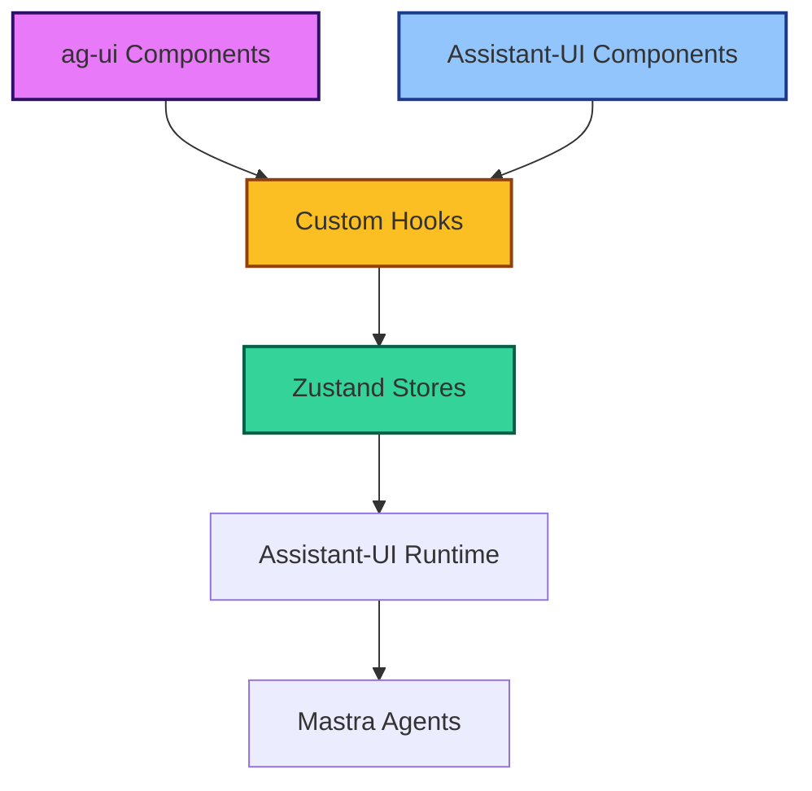

# Assistant-UI Integration Examples

Complete examples showing how to integrate assistant-ui with Zustand stores using the Components → Hooks → Stores pattern, with special focus on ag-ui driven connections.

## 🏗️ Architecture Overview



## 🗄️ Complete Store Implementation

### Enhanced Chat Store with ag-ui Support

```typescript
// src/stores/enhanced-chat-store.ts
import { create } from 'zustand';
import { persist, createJSONStorage } from 'zustand/middleware';
import { immer } from 'zustand/middleware/immer';
import { useShallow } from 'zustand/react/shallow';
import type { ThreadMessageLike } from '@assistant-ui/react';

// Enhanced message type for ag-ui integration
interface AgentMessage extends ThreadMessageLike {
  id: string;
  role: 'user' | 'assistant';
  content: Array<{
    type: 'text' | 'image' | 'tool-call' | 'tool-result';
    text?: string;
    image?: string;
    toolCallId?: string;
    toolName?: string;
    args?: Record<string, unknown>;
    result?: unknown;
  }>;
  createdAt: Date;
  metadata?: {
    agentId?: string;
    queryType?: string;
    executionTime?: number;
    confidence?: number;
    sources?: string[];
  };
}

// UI state for ag-ui components
interface UIState {
  sidebarOpen: boolean;
  activeTab: 'chat' | 'history' | 'settings';
  theme: 'light' | 'dark';
  compactMode: boolean;
  showMetadata: boolean;
}

// Chat session management
interface ChatSession {
  id: string;
  title: string;
  agentId: string;
  createdAt: Date;
  lastActivity: Date;
  messageCount: number;
  tags: string[];
}

// Complete store interface
interface EnhancedChatState {
  // Core chat state
  messages: AgentMessage[];
  isRunning: boolean;
  error: string | null;
  currentSessionId: string;
  
  // Session management
  sessions: ChatSession[];
  activeSession: ChatSession | null;
  
  // UI state for ag-ui
  ui: UIState;
  
  // Agent configuration
  selectedAgentId: string;
  agentConfig: Record<string, unknown>;
  
  // Performance tracking
  responseMetrics: {
    averageTime: number;
    successRate: number;
    totalQueries: number;
  };
  
  // Actions - Chat Management
  addMessage: (message: AgentMessage) => void;
  setMessages: (messages: AgentMessage[]) => void;
  updateMessage: (id: string, updates: Partial<AgentMessage>) => void;
  deleteMessage: (id: string) => void;
  clearMessages: () => void;
  
  // Actions - Session Management
  createSession: (agentId: string, title?: string) => string;
  switchSession: (sessionId: string) => void;
  deleteSession: (sessionId: string) => void;
  updateSessionTitle: (sessionId: string, title: string) => void;
  
  // Actions - Runtime State
  setIsRunning: (isRunning: boolean) => void;
  setError: (error: string | null) => void;
  
  // Actions - UI State
  toggleSidebar: () => void;
  setActiveTab: (tab: UIState['activeTab']) => void;
  setTheme: (theme: UIState['theme']) => void;
  toggleCompactMode: () => void;
  toggleMetadata: () => void;
  
  // Actions - Agent Management
  setSelectedAgent: (agentId: string) => void;
  updateAgentConfig: (config: Record<string, unknown>) => void;
  
  // Actions - Metrics
  updateMetrics: (responseTime: number, success: boolean) => void;
}

// Create the enhanced store
export const useEnhancedChatStore = create<EnhancedChatState>()(
  persist(
    immer((set, get) => ({
      // Initial state
      messages: [],
      isRunning: false,
      error: null,
      currentSessionId: '',
      sessions: [],
      activeSession: null,
      selectedAgentId: 'businessIntelligenceAgent',
      agentConfig: {},
      
      ui: {
        sidebarOpen: true,
        activeTab: 'chat',
        theme: 'light',
        compactMode: false,
        showMetadata: false,
      },
      
      responseMetrics: {
        averageTime: 0,
        successRate: 100,
        totalQueries: 0,
      },

      // Chat Management Actions
      addMessage: (message) =>
        set((state) => {
          state.messages.push(message);
          
          // Update session activity
          if (state.activeSession) {
            state.activeSession.lastActivity = new Date();
            state.activeSession.messageCount = state.messages.length;
          }
        }),

      setMessages: (messages) =>
        set((state) => {
          state.messages = messages;
        }),

      updateMessage: (id, updates) =>
        set((state) => {
          const index = state.messages.findIndex((m) => m.id === id);
          if (index !== -1) {
            Object.assign(state.messages[index], updates);
          }
        }),

      deleteMessage: (id) =>
        set((state) => {
          state.messages = state.messages.filter((m) => m.id !== id);
        }),

      clearMessages: () =>
        set((state) => {
          state.messages = [];
          state.error = null;
        }),

      // Session Management Actions
      createSession: (agentId, title) => {
        const sessionId = `session-${Date.now()}-${Math.random().toString(36).substr(2, 9)}`;
        const now = new Date();
        
        set((state) => {
          const newSession: ChatSession = {
            id: sessionId,
            title: title ?? `Chat with ${agentId}`,
            agentId,
            createdAt: now,
            lastActivity: now,
            messageCount: 0,
            tags: [],
          };
          
          state.sessions.unshift(newSession);
          state.activeSession = newSession;
          state.currentSessionId = sessionId;
          state.selectedAgentId = agentId;
          state.messages = [];
        });
        
        return sessionId;
      },

      switchSession: (sessionId) =>
        set((state) => {
          const session = state.sessions.find((s) => s.id === sessionId);
          if (session) {
            state.activeSession = session;
            state.currentSessionId = sessionId;
            state.selectedAgentId = session.agentId;
            // Note: Messages would be loaded from persistence layer
          }
        }),

      deleteSession: (sessionId) =>
        set((state) => {
          state.sessions = state.sessions.filter((s) => s.id !== sessionId);
          if (state.currentSessionId === sessionId) {
            state.activeSession = state.sessions[0] ?? null;
            state.currentSessionId = state.activeSession?.id ?? '';
          }
        }),

      updateSessionTitle: (sessionId, title) =>
        set((state) => {
          const session = state.sessions.find((s) => s.id === sessionId);
          if (session) {
            session.title = title;
          }
        }),

      // Runtime State Actions
      setIsRunning: (isRunning) =>
        set((state) => {
          state.isRunning = isRunning;
        }),

      setError: (error) =>
        set((state) => {
          state.error = error;
        }),

      // UI State Actions
      toggleSidebar: () =>
        set((state) => {
          state.ui.sidebarOpen = !state.ui.sidebarOpen;
        }),

      setActiveTab: (tab) =>
        set((state) => {
          state.ui.activeTab = tab;
        }),

      setTheme: (theme) =>
        set((state) => {
          state.ui.theme = theme;
        }),

      toggleCompactMode: () =>
        set((state) => {
          state.ui.compactMode = !state.ui.compactMode;
        }),

      toggleMetadata: () =>
        set((state) => {
          state.ui.showMetadata = !state.ui.showMetadata;
        }),

      // Agent Management Actions
      setSelectedAgent: (agentId) =>
        set((state) => {
          state.selectedAgentId = agentId;
        }),

      updateAgentConfig: (config) =>
        set((state) => {
          state.agentConfig = { ...state.agentConfig, ...config };
        }),

      // Metrics Actions
      updateMetrics: (responseTime, success) =>
        set((state) => {
          const { responseMetrics } = state;
          const newTotal = responseMetrics.totalQueries + 1;
          
          // Update average response time
          responseMetrics.averageTime = 
            (responseMetrics.averageTime * responseMetrics.totalQueries + responseTime) / newTotal;
          
          // Update success rate
          const successCount = Math.round(responseMetrics.successRate * responseMetrics.totalQueries / 100);
          responseMetrics.successRate = 
            ((successCount + (success ? 1 : 0)) / newTotal) * 100;
          
          responseMetrics.totalQueries = newTotal;
        }),
    })),
    {
      name: 'enhanced-chat-storage',
      storage: createJSONStorage(() => localStorage),
      partialize: (state) => ({
        sessions: state.sessions,
        ui: state.ui,
        selectedAgentId: state.selectedAgentId,
        agentConfig: state.agentConfig,
        responseMetrics: state.responseMetrics,
      }),
    }
  )
);

// Optimized selectors for performance
export const useChatMessages = () => 
  useEnhancedChatStore((state) => state.messages);

export const useChatRuntime = () => 
  useEnhancedChatStore(useShallow((state) => ({
    messages: state.messages,
    isRunning: state.isRunning,
    error: state.error,
  })));

export const useUIState = () => 
  useEnhancedChatStore((state) => state.ui);

export const useSessionManagement = () =>
  useEnhancedChatStore(useShallow((state) => ({
    sessions: state.sessions,
    activeSession: state.activeSession,
    createSession: state.createSession,
    switchSession: state.switchSession,
    deleteSession: state.deleteSession,
  })));

export const useAgentConfig = () =>
  useEnhancedChatStore(useShallow((state) => ({
    selectedAgentId: state.selectedAgentId,
    agentConfig: state.agentConfig,
    setSelectedAgent: state.setSelectedAgent,
    updateAgentConfig: state.updateAgentConfig,
  })));
```

## 🔗 Custom Hooks for ag-ui Integration

### Main Integration Hook

```typescript
// src/hooks/use-agent-chat.ts
import { useCallback, useMemo } from 'react';
import { useExternalStoreRuntime } from '@assistant-ui/react';
import type { AppendMessage } from '@assistant-ui/react';
import { useEnhancedChatStore } from '../stores/enhanced-chat-store';

interface AgentChatConfig {
  baseUrl?: string;
  timeout?: number;
  retryAttempts?: number;
}

export function useAgentChat(config: AgentChatConfig = {}) {
  const {
    messages,
    isRunning,
    error,
    selectedAgentId,
    agentConfig,
    addMessage,
    setMessages,
    setIsRunning,
    setError,
    updateMetrics,
  } = useEnhancedChatStore();

  // Memoized API client
  const apiClient = useMemo(() => ({
    baseUrl: config.baseUrl ?? 'http://localhost:4113',
    timeout: config.timeout ?? 30000,
    retryAttempts: config.retryAttempts ?? 3,
  }), [config]);

  // Enhanced message handler with metrics tracking
  const handleNewMessage = useCallback(async (message: AppendMessage) => {
    const startTime = Date.now();
    let success = false;
    
    try {
      setError(null);
      setIsRunning(true);

      // Extract text content from message
      const content = typeof message.content === 'string' 
        ? message.content 
        : message.content
            .filter(part => part.type === 'text')
            .map(part => part.text)
            .join(' ');

      // Add user message
      const userMessage = {
        id: `msg-${Date.now()}-user`,
        role: 'user' as const,
        content: [{ type: 'text' as const, text: content }],
        createdAt: new Date(),
        metadata: {
          agentId: selectedAgentId,
        },
      };
      addMessage(userMessage);

      // Call agent API with retry logic
      const response = await callAgentWithRetry(content, selectedAgentId, apiClient);
      
      // Add assistant response
      const assistantMessage = {
        id: `msg-${Date.now()}-assistant`,
        role: 'assistant' as const,
        content: [{ type: 'text' as const, text: response.content }],
        createdAt: new Date(),
        metadata: {
          agentId: selectedAgentId,
          executionTime: Date.now() - startTime,
          confidence: response.confidence,
          sources: response.sources,
        },
      };
      addMessage(assistantMessage);
      
      success = true;
    } catch (error) {
      const errorMessage = error instanceof Error ? error.message : 'Unknown error';
      setError(errorMessage);
      
      // Add error message
      const errorResponse = {
        id: `msg-${Date.now()}-error`,
        role: 'assistant' as const,
        content: [{ 
          type: 'text' as const, 
          text: `I apologize, but I encountered an error: ${errorMessage}. Please try again.` 
        }],
        createdAt: new Date(),
        metadata: {
          agentId: selectedAgentId,
          executionTime: Date.now() - startTime,
          error: true,
        },
      };
      addMessage(errorResponse);
    } finally {
      setIsRunning(false);
      updateMetrics(Date.now() - startTime, success);
    }
  }, [selectedAgentId, agentConfig, addMessage, setIsRunning, setError, updateMetrics, apiClient]);

  // Create assistant-ui runtime
  const runtime = useExternalStoreRuntime({
    messages,
    isRunning,
    setMessages,
    onNew: handleNewMessage,
    
    // Optional: Handle message editing
    onEdit: async (messageId, content) => {
      // Implementation for editing messages
    },
    
    // Optional: Handle message regeneration
    onReload: async (messageId) => {
      // Implementation for regenerating responses
    },
  });

  return {
    runtime,
    messages,
    isRunning,
    error,
    selectedAgentId,
    // Expose store actions for ag-ui components
    clearMessages: useEnhancedChatStore((state) => state.clearMessages),
    hasMessages: messages.length > 0,
    lastMessage: messages[messages.length - 1] ?? null,
  };
}

// Helper function for API calls with retry logic
async function callAgentWithRetry(
  content: string, 
  agentId: string, 
  config: { baseUrl: string; timeout: number; retryAttempts: number }
): Promise<{ content: string; confidence?: number; sources?: string[] }> {
  let lastError: Error | null = null;
  
  for (let attempt = 1; attempt <= config.retryAttempts; attempt++) {
    try {
      const controller = new AbortController();
      const timeoutId = setTimeout(() => controller.abort(), config.timeout);
      
      const response = await fetch(`${config.baseUrl}/api/agents/${agentId}/generate`, {
        method: 'POST',
        headers: { 'Content-Type': 'application/json' },
        body: JSON.stringify({
          messages: [{ role: 'user', content }],
        }),
        signal: controller.signal,
      });
      
      clearTimeout(timeoutId);
      
      if (!response.ok) {
        throw new Error(`HTTP ${response.status}: ${response.statusText}`);
      }
      
      const data = await response.json();
      return {
        content: data.content ?? data.message ?? 'No response received',
        confidence: data.confidence,
        sources: data.sources,
      };
      
    } catch (error) {
      lastError = error instanceof Error ? error : new Error('Unknown error');
      
      if (attempt < config.retryAttempts) {
        // Exponential backoff
        await new Promise(resolve => setTimeout(resolve, Math.pow(2, attempt) * 1000));
      }
    }
  }
  
  throw lastError ?? new Error('All retry attempts failed');
}
```

### Session Management Hook

```typescript
// src/hooks/use-session-management.ts
import { useCallback } from 'react';
import { useSessionManagement } from '../stores/enhanced-chat-store';

export function useSessionManagement() {
  const { sessions, activeSession, createSession, switchSession, deleteSession } = useSessionManagement();
  
  // Enhanced session creation with auto-naming
  const createNewSession = useCallback((agentId: string, initialMessage?: string) => {
    const title = initialMessage 
      ? `${initialMessage.slice(0, 30)}${initialMessage.length > 30 ? '...' : ''}`
      : `New ${agentId} Chat`;
    
    return createSession(agentId, title);
  }, [createSession]);
  
  // Safe session switching with validation
  const switchToSession = useCallback((sessionId: string) => {
    const session = sessions.find(s => s.id === sessionId);
    if (session) {
      switchSession(sessionId);
      return true;
    }
    return false;
  }, [sessions, switchSession]);
  
  // Session deletion with confirmation
  const deleteSessionSafely = useCallback((sessionId: string) => {
    if (sessions.length <= 1) {
      // Don't delete the last session
      return false;
    }
    
    deleteSession(sessionId);
    return true;
  }, [sessions, deleteSession]);
  
  return {
    sessions,
    activeSession,
    createNewSession,
    switchToSession,
    deleteSessionSafely,
    hasMultipleSessions: sessions.length > 1,
  };
}
```

## 🎨 ag-ui Component Examples

### Chat Interface with ag-ui Integration

```typescript
// src/components/AgentChatInterface.tsx
import React from 'react';
import { AssistantRuntimeProvider, Thread } from '@assistant-ui/react';
import { useAgentChat } from '../hooks/use-agent-chat';
import { useUIState } from '../stores/enhanced-chat-store';
import { 
  MessageSquare, 
  Settings, 
  History, 
  Sidebar,
  Bot,
  User,
  AlertCircle 
} from 'lucide-react';

interface AgentChatInterfaceProps {
  className?: string;
}

export function AgentChatInterface({ className }: AgentChatInterfaceProps) {
  const { runtime, isRunning, error, hasMessages, clearMessages } = useAgentChat();
  const ui = useUIState();
  const { toggleSidebar, setActiveTab } = useEnhancedChatStore();

  return (
    <div className={`flex h-full ${className ?? ''}`}>
      {/* ag-ui Sidebar */}
      {ui.sidebarOpen && (
        <div className="w-64 border-r bg-gray-50 flex flex-col">
          <AgSidebar />
        </div>
      )}
      
      {/* Main Chat Area */}
      <div className="flex-1 flex flex-col">
        {/* ag-ui Header */}
        <div className="flex items-center justify-between p-4 border-b bg-white">
          <div className="flex items-center gap-3">
            <button
              onClick={toggleSidebar}
              className="p-2 hover:bg-gray-100 rounded-md"
            >
              <Sidebar className="h-4 w-4" />
            </button>
            
            <div className="flex items-center gap-2">
              <Bot className="h-5 w-5 text-blue-600" />
              <h1 className="font-semibold text-gray-900">Agent Chat</h1>
            </div>
            
            {isRunning && (
              <div className="flex items-center gap-2 text-sm text-blue-600">
                <div className="animate-spin h-4 w-4 border-2 border-blue-600 border-t-transparent rounded-full" />
                Processing...
              </div>
            )}
          </div>
          
          <div className="flex items-center gap-2">
            {hasMessages && (
              <button
                onClick={clearMessages}
                className="px-3 py-1 text-sm text-gray-600 hover:text-gray-900 hover:bg-gray-100 rounded-md"
              >
                Clear
              </button>
            )}
            
            <AgentSelector />
          </div>
        </div>

        {/* Error Display */}
        {error && (
          <div className="mx-4 mt-4 p-3 bg-red-50 border border-red-200 rounded-md flex items-center gap-2">
            <AlertCircle className="h-4 w-4 text-red-500 flex-shrink-0" />
            <span className="text-sm text-red-700">{error}</span>
          </div>
        )}

        {/* Assistant-UI Thread */}
        <div className="flex-1 overflow-hidden">
          <AssistantRuntimeProvider runtime={runtime}>
            <Thread 
              components={{
                Message: AgChatMessage,
                Composer: AgChatComposer,
              }}
            />
          </AssistantRuntimeProvider>
        </div>
      </div>
    </div>
  );
}

// ag-ui Sidebar Component
function AgSidebar() {
  const ui = useUIState();
  const { setActiveTab } = useEnhancedChatStore();
  
  const tabs = [
    { id: 'chat' as const, label: 'Chat', icon: MessageSquare },
    { id: 'history' as const, label: 'History', icon: History },
    { id: 'settings' as const, label: 'Settings', icon: Settings },
  ];

  return (
    <div className="flex flex-col h-full">
      {/* Tab Navigation */}
      <div className="flex border-b">
        {tabs.map((tab) => (
          <button
            key={tab.id}
            onClick={() => setActiveTab(tab.id)}
            className={`flex-1 flex items-center justify-center gap-2 p-3 text-sm font-medium transition-colors ${
              ui.activeTab === tab.id
                ? 'text-blue-600 border-b-2 border-blue-600 bg-blue-50'
                : 'text-gray-600 hover:text-gray-900 hover:bg-gray-100'
            }`}
          >
            <tab.icon className="h-4 w-4" />
            {tab.label}
          </button>
        ))}
      </div>
      
      {/* Tab Content */}
      <div className="flex-1 overflow-auto p-4">
        {ui.activeTab === 'chat' && <AgChatTab />}
        {ui.activeTab === 'history' && <AgHistoryTab />}
        {ui.activeTab === 'settings' && <AgSettingsTab />}
      </div>
    </div>
  );
}

// ag-ui Chat Tab
function AgChatTab() {
  const { sessions, activeSession, createNewSession, switchToSession } = useSessionManagement();
  
  return (
    <div className="space-y-4">
      <button
        onClick={() => createNewSession('businessIntelligenceAgent')}
        className="w-full p-3 text-left bg-blue-50 hover:bg-blue-100 border border-blue-200 rounded-md transition-colors"
      >
        <div className="font-medium text-blue-900">New Chat</div>
        <div className="text-sm text-blue-600">Start a new conversation</div>
      </button>
      
      <div className="space-y-2">
        <h3 className="font-medium text-gray-900">Recent Sessions</h3>
        {sessions.map((session) => (
          <button
            key={session.id}
            onClick={() => switchToSession(session.id)}
            className={`w-full p-3 text-left rounded-md transition-colors ${
              activeSession?.id === session.id
                ? 'bg-blue-50 border border-blue-200'
                : 'hover:bg-gray-100 border border-gray-200'
            }`}
          >
            <div className="font-medium text-gray-900 truncate">{session.title}</div>
            <div className="text-sm text-gray-500">
              {session.messageCount} messages • {session.lastActivity.toLocaleDateString()}
            </div>
          </button>
        ))}
      </div>
    </div>
  );
}

// ag-ui History Tab
function AgHistoryTab() {
  const { sessions } = useSessionManagement();
  
  return (
    <div className="space-y-4">
      <h3 className="font-medium text-gray-900">Chat History</h3>
      {sessions.map((session) => (
        <div key={session.id} className="p-3 border border-gray-200 rounded-md">
          <div className="font-medium text-gray-900">{session.title}</div>
          <div className="text-sm text-gray-500 mt-1">
            Created: {session.createdAt.toLocaleDateString()}
          </div>
          <div className="text-sm text-gray-500">
            Messages: {session.messageCount}
          </div>
        </div>
      ))}
    </div>
  );
}

// ag-ui Settings Tab
function AgSettingsTab() {
  const ui = useUIState();
  const { setTheme, toggleCompactMode, toggleMetadata } = useEnhancedChatStore();
  
  return (
    <div className="space-y-6">
      <div>
        <h3 className="font-medium text-gray-900 mb-3">Appearance</h3>
        <div className="space-y-3">
          <label className="flex items-center justify-between">
            <span className="text-sm text-gray-700">Theme</span>
            <select
              value={ui.theme}
              onChange={(e) => setTheme(e.target.value as 'light' | 'dark')}
              className="text-sm border border-gray-300 rounded px-2 py-1"
            >
              <option value="light">Light</option>
              <option value="dark">Dark</option>
            </select>
          </label>
          
          <label className="flex items-center justify-between">
            <span className="text-sm text-gray-700">Compact Mode</span>
            <input
              type="checkbox"
              checked={ui.compactMode}
              onChange={toggleCompactMode}
              className="rounded"
            />
          </label>
          
          <label className="flex items-center justify-between">
            <span className="text-sm text-gray-700">Show Metadata</span>
            <input
              type="checkbox"
              checked={ui.showMetadata}
              onChange={toggleMetadata}
              className="rounded"
            />
          </label>
        </div>
      </div>
    </div>
  );
}

// Agent Selector Component
function AgentSelector() {
  const { selectedAgentId, setSelectedAgent } = useAgentConfig();
  
  const agents = [
    { id: 'businessIntelligenceAgent', name: 'Business Intelligence' },
    { id: 'databaseAgent', name: 'Database' },
    { id: 'migrationAgent', name: 'Migration' },
  ];
  
  return (
    <select
      value={selectedAgentId}
      onChange={(e) => setSelectedAgent(e.target.value)}
      className="text-sm border border-gray-300 rounded px-3 py-1"
    >
      {agents.map((agent) => (
        <option key={agent.id} value={agent.id}>
          {agent.name}
        </option>
      ))}
    </select>
  );
}

// Custom Message Component
function AgChatMessage({ message }: { message: any }) {
  const ui = useUIState();
  
  return (
    <div className={`flex gap-3 p-4 ${ui.compactMode ? 'py-2' : 'py-4'}`}>
      <div className="flex-shrink-0">
        {message.role === 'user' ? (
          <User className="h-6 w-6 text-gray-600" />
        ) : (
          <Bot className="h-6 w-6 text-blue-600" />
        )}
      </div>
      
      <div className="flex-1 min-w-0">
        <div className="prose prose-sm max-w-none">
          {message.content}
        </div>
        
        {ui.showMetadata && message.metadata && (
          <div className="mt-2 text-xs text-gray-500 space-y-1">
            {message.metadata.executionTime && (
              <div>Response time: {message.metadata.executionTime}ms</div>
            )}
            {message.metadata.confidence && (
              <div>Confidence: {Math.round(message.metadata.confidence * 100)}%</div>
            )}
          </div>
        )}
      </div>
    </div>
  );
}

// Custom Composer Component
function AgChatComposer() {
  return (
    <div className="border-t bg-white p-4">
      {/* Assistant-UI will render the default composer here */}
      {/* You can customize this further as needed */}
    </div>
  );
}
```

## 🔄 Runtime Integration Patterns

### Advanced Runtime Configuration

```typescript
// src