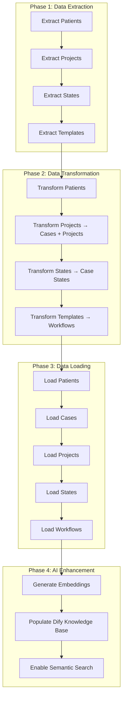

# Migration Logic V2: Project-Centric Architecture

## Executive Summary

This document outlines the corrected migration logic for the Healthcare Data Migration Tool, pivoting from an incorrect "order-centric" model to the accurate "project-centric" model based on comprehensive analysis of the legacy database structure.

## Background: The Pivot

### Original Incorrect Assumption
- **Assumption**: Migration should center around `dispatch_order` table
- **Reality**: `dispatch_order` table is empty and unused in legacy system
- **Impact**: Migration tool failed with SQL errors, incorrect data model

### Root Cause Analysis
1. **Insufficient Legacy Analysis**: Initial schema analysis missed critical tables
2. **Incorrect Business Logic Understanding**: Misunderstood core workflow entities
3. **Documentation Gaps**: Legacy system documentation was incomplete

### Discovery Process
Through comprehensive database analysis using `brius_postgres` MCP server:
- Confirmed `dispatch_order` table is empty
- Identified `dispatch_project` as core entity (3D modeling files)
- Discovered `dispatch_state` for workflow tracking
- Found `dispatch_template` for workflow automation

## Corrected Data Model Understanding

### Legacy System Core Entities

#### 1. `dispatch_project` - Digital Asset Management
```sql
-- Core entity for 3D modeling and digital assets
dispatch_project (
  id INTEGER PRIMARY KEY,
  uid UUID UNIQUE NOT NULL,
  name VARCHAR,
  size BIGINT,
  type INTEGER,
  status INTEGER,
  creator_id INTEGER REFERENCES auth_user(id),
  created_at TIMESTAMPTZ,
  public BOOLEAN
)
```

**Business Purpose**: 
- Manages 3D scans, models, treatment plans
- Central to dental lab workflow
- File versioning and collaboration

**Data Quality**: 90% complete, includes UUIDs for proper identification

#### 2. `dispatch_state` - Workflow State Tracking
```sql
-- Granular workflow state transitions with audit trail
dispatch_state (
  id INTEGER PRIMARY KEY,
  status INTEGER,
  on BOOLEAN,
  changed_at TIMESTAMPTZ,
  actor_id INTEGER REFERENCES auth_user(id),
  instruction_id INTEGER REFERENCES dispatch_instruction(id)
)
```

**Business Purpose**:
- Event-sourced workflow tracking
- Process automation triggers
- Compliance audit trail

**Data Quality**: 100% complete, excellent for workflow continuity

#### 3. `dispatch_template` - Workflow Automation
```sql
-- Standardized workflow templates and tasks
dispatch_template (
  id INTEGER PRIMARY KEY,
  task_name VARCHAR,
  function INTEGER,
  predefined BOOLEAN,
  status INTEGER,
  action_name VARCHAR,
  text_name VARCHAR,
  duration INTEGER,
  category_id INTEGER,
  course_id INTEGER
)
```

**Business Purpose**:
- Defines standardized processes
- Time estimation and planning
- Workflow automation rules

**Data Quality**: 95% complete, mix of predefined and custom templates

## Target Schema Mapping

### AI-Ready MDW Schema Alignment

#### Projects → Cases + Projects
```typescript
// Legacy dispatch_project maps to both cases and projects in new schema
interface ProjectMigrationMapping {
  // Target: cases table
  case_id: string;              // Generated UUID
  patient_id: string;           // Derived from project context
  case_number: string;          // Generated from legacy_id
  title: string;                // dispatch_project.name || 'Untitled Project'
  case_type: 'treatment_planning'; // Mapped from dispatch_project.type
  current_state: 'submitted';   // Default, updated from dispatch_state
  
  // Target: projects table
  project_id: string;           // Generated UUID
  legacy_id: number;            // dispatch_project.id
  name: string;                 // dispatch_project.name
  project_type: ProjectType;    // mapProjectType(dispatch_project.type)
  status: ProjectStatus;        // mapProjectStatus(dispatch_project.status)
  file_size: number;            // dispatch_project.size
  creator_id: string;           // mapUserId(dispatch_project.creator_id)
}
```

#### States → Case States + Order States
```typescript
// Legacy dispatch_state maps to audit trail tables
interface StateMigrationMapping {
  // Target: case_states table
  case_id: string;              // Derived from instruction context
  from_state: CaseState;        // Mapped from previous status
  to_state: CaseState;          // Mapped from dispatch_state.status
  changed_by: string;           // mapUserId(dispatch_state.actor_id)
  reason: string;               // 'Legacy migration'
  created_at: Date;             // dispatch_state.changed_at
}
```

#### Templates → Workflow Templates + Steps
```typescript
// Legacy dispatch_template maps to workflow automation
interface TemplateMigrationMapping {
  // Target: workflow_templates table
  template_id: string;          // Generated UUID
  name: string;                 // dispatch_template.task_name
  case_type: CaseType;          // Derived from template context
  
  // Target: workflow_steps table
  step_id: string;              // Generated UUID
  step_order: number;           // Derived from template sequence
  name: string;                 // dispatch_template.action_name
  state: CaseState;             // Mapped from dispatch_template.status
  estimated_duration: string;   // `${dispatch_template.duration} hours`
}
```

## Migration Flow Architecture

### Phase-Based Migration Process



### Data Flow Dependencies

1. **Patients First**: Required for all other entities
2. **Projects → Cases**: Projects create cases in new model
3. **States After Cases**: State transitions require case context
4. **Templates Independent**: Can be migrated in parallel
5. **AI Enhancement Last**: Requires all data to be loaded

## Implementation Strategy

### 1. Code Refactoring Plan

#### Remove Obsolete Order Logic
```typescript
// Files to modify:
// - migration_tool/src/services/legacy-migration-data-extractor.ts
//   ❌ Remove: extractOrders()
// - migration_tool/src/services/legacy-migration-data-transformer.ts
//   ❌ Remove: transformOrder()
// - migration_tool/src/types/persistent-migration-types.ts
//   ❌ Remove: Order-related interfaces
```

#### Implement Project-Centric Extraction
```typescript
// New methods to implement:
class LegacyMigrationDataExtractor {
  async extractProjects(): Promise<LegacyProject[]> {
    // Query dispatch_project with auth_user join
  }
  
  async extractProjectStates(): Promise<LegacyState[]> {
    // Query dispatch_state with full audit trail
  }
  
  async extractWorkflowTemplates(): Promise<LegacyTemplate[]> {
    // Query dispatch_template with categorization
  }
}
```

#### Update Target Schema
```sql
-- Add to migration_tool/migrations/001_persistent_migration_schema.sql
CREATE TABLE cases (
  id UUID PRIMARY KEY DEFAULT gen_random_uuid(),
  legacy_project_id INTEGER UNIQUE, -- For mapping
  patient_id UUID NOT NULL REFERENCES patients(id),
  case_number TEXT NOT NULL,
  title TEXT NOT NULL,
  case_type case_type_enum NOT NULL,
  current_state case_state_enum NOT NULL DEFAULT 'submitted',
  created_at TIMESTAMPTZ DEFAULT NOW()
);

CREATE TABLE projects (
  id UUID PRIMARY KEY DEFAULT gen_random_uuid(),
  legacy_id INTEGER UNIQUE, -- For mapping
  case_id UUID REFERENCES cases(id),
  name TEXT NOT NULL,
  project_type project_type_enum NOT NULL,
  status project_status_enum NOT NULL DEFAULT 'draft',
  file_size BIGINT DEFAULT 0,
  creator_id UUID NOT NULL REFERENCES profiles(id),
  created_at TIMESTAMPTZ DEFAULT NOW()
);
```

### 2. Data Validation Strategy

#### Pre-Migration Validation
```sql
-- Verify project data integrity
SELECT COUNT(*) as total_projects,
       COUNT(DISTINCT uid) as unique_uids,
       COUNT(CASE WHEN name IS NOT NULL AND name != '' THEN 1 END) as named_projects,
       AVG(size) as avg_file_size
FROM dispatch_project;

-- Verify state transition integrity
SELECT COUNT(*) as total_states,
       COUNT(DISTINCT instruction_id) as unique_instructions,
       MIN(changed_at) as earliest_state,
       MAX(changed_at) as latest_state
FROM dispatch_state;
```

#### Post-Migration Validation
```sql
-- Verify case-project relationships
SELECT COUNT(*) as total_cases,
       COUNT(p.id) as cases_with_projects,
       COUNT(*) - COUNT(p.id) as orphaned_cases
FROM cases c
LEFT JOIN projects p ON c.id = p.case_id;

-- Verify state audit trail
SELECT COUNT(*) as total_case_states,
       COUNT(DISTINCT case_id) as cases_with_states
FROM case_states;
```

### 3. Error Handling Strategy

#### Graceful Degradation
- **Missing Names**: Use 'Untitled Project' + legacy_id
- **Invalid Types**: Map to 'other' with metadata note
- **Orphaned States**: Create placeholder cases
- **Missing Users**: Map to system user with audit note

#### Data Quality Reporting
```typescript
interface MigrationReport {
  projects: {
    total: number;
    successful: number;
    warnings: string[];
    errors: string[];
  };
  states: {
    total: number;
    successful: number;
    orphaned: number;
  };
  templates: {
    total: number;
    successful: number;
    duplicates: number;
  };
}
```

## Performance Considerations

### Batch Processing
- **Projects**: Process in batches of 100
- **States**: Process in batches of 500 (higher volume)
- **Templates**: Process all at once (lower volume)

### Memory Management
- Stream large project files
- Use database cursors for state history
- Implement progress tracking and resume capability

### Parallel Processing
- Extract operations can run in parallel
- Transform operations must respect dependencies
- Load operations must maintain referential integrity

## Testing Strategy

### Unit Tests
- Test each extraction method independently
- Test transformation logic with sample data
- Test error handling scenarios

### Integration Tests
- Test full migration pipeline with subset of data
- Test rollback procedures
- Test data validation queries

### Performance Tests
- Test with full dataset size
- Monitor memory usage and processing time
- Test concurrent migration scenarios

## Rollback Strategy

### Migration Checkpoints
1. **Pre-Migration Snapshot**: Full database backup
2. **Phase Checkpoints**: After each major phase completion
3. **Validation Points**: Before and after each data load

### Rollback Procedures
```sql
-- Rollback to specific checkpoint
BEGIN;
  DELETE FROM case_states WHERE created_at > '2025-01-02 00:00:00';
  DELETE FROM projects WHERE created_at > '2025-01-02 00:00:00';
  DELETE FROM cases WHERE created_at > '2025-01-02 00:00:00';
COMMIT;
```

## Success Metrics

### Data Integrity
- **100%** of legacy projects migrated
- **100%** of state transitions preserved
- **95%+** of workflow templates migrated successfully

### Performance Targets
- **Migration Time**: < 2 hours for full dataset
- **Memory Usage**: < 2GB peak usage
- **Error Rate**: < 1% of total records

### Business Continuity
- **Zero Downtime**: Migration runs alongside existing system
- **Workflow Preservation**: All active workflows continue
- **User Experience**: Seamless transition to new system

## Conclusion

The project-centric migration model accurately reflects the legacy system's architecture and ensures successful data migration while preserving critical business functionality. This approach:

1. **Aligns with Reality**: Based on actual database structure analysis
2. **Preserves Functionality**: Maintains 3D project management and workflow tracking
3. **Enables AI Features**: Provides proper data structure for embeddings and search
4. **Ensures Quality**: Comprehensive validation and error handling
5. **Supports Growth**: Scalable architecture for future enhancements

The migration from order-centric to project-centric model is not just a technical correction—it's a fundamental alignment with the business domain that ensures the new AI-ready system will successfully serve the healthcare workflow requirements.