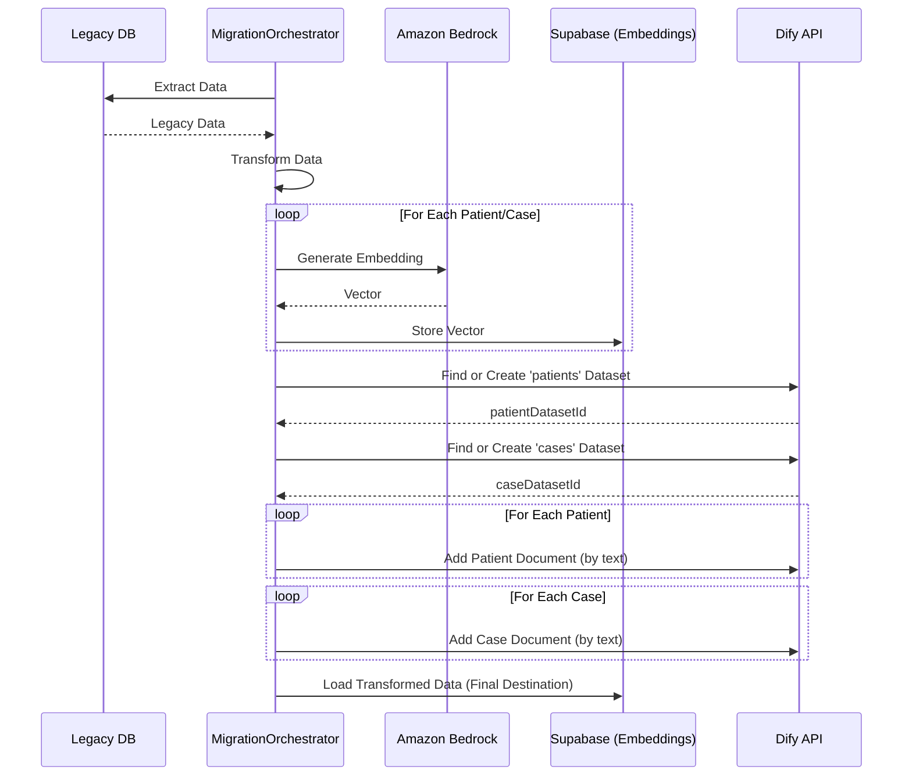

# Technical Plan: Dify Knowledge Base Integration

## 1. Introduction & Goals

This document outlines the plan to integrate the Dify.com Knowledge Base API into the healthcare data migration tool. The primary goal is to create and populate Dify knowledge bases with patient and case data as an additional step in the migration workflow. This will exist alongside the current process of generating and storing embeddings in the Supabase database.

The key objectives are:
- To leverage Dify as a managed RAG datasource.
- To create two distinct knowledge bases: one for `patients` and one for `cases`.
- To populate these knowledge bases with the transformed data from the legacy system.
- To ensure the integration is robust, configurable, and includes proper error handling.

## 2. Configuration

The integration will require new environment variables to be added to the `.env` file and the central configuration in `migration_tool/src/utils/config.ts`.

### 2.1. Environment Variables (.env)

```env
# Dify API Configuration
DIFY_BASE_URL=https://dify.brius.com
DIFY_KNOWLEDGE_API_KEY=dataset-lEb71CjyHVbn6jNrysFdXBHH
```

### 2.2. Application Configuration (`config.ts`)

The `config.ts` file will be updated to include a new `dify` section:

```typescript
// migration_tool/src/utils/config.ts

// ... existing config interface
export interface AppConfig {
  // ... other properties
  dify: {
    baseUrl: string;
    apiKey: string;
  };
}

// ... existing config object
export const config: AppConfig = {
  // ... other properties
  dify: {
    baseUrl: process.env.DIFY_BASE_URL || '',
    apiKey: process.env.DIFY_KNOWLEDGE_API_KEY || '',
  },
};
```

## 3. Architecture & Implementation

The core of the implementation will be a new `DifyService` responsible for all communication with the Dify API. This service will be consumed by the `MigrationOrchestrator`.

### 3.1. New Service: `dify-service.ts`

A new file will be created at `migration_tool/src/services/integration/dify-service.ts`. This service will be a TypeScript class with methods to abstract the Dify API endpoints.

```typescript
// migration_tool/src/services/integration/dify-service.ts
import { config } from '../../utils/config';
import logger from '../../utils/logger';
import axios from 'axios';

interface DifyDataset {
  id: string;
  name: string;
  // ... other properties
}

export class DifyService {
  private readonly baseUrl: string;
  private readonly apiKey: string;
  private readonly headers: Record<string, string>;

  constructor() {
    this.baseUrl = config.dify.baseUrl;
    this.apiKey = config.dify.apiKey;
    this.headers = {
      'Authorization': `Bearer ${this.apiKey}`,
      'Content-Type': 'application/json',
    };
  }

  /**
   * Finds a dataset by name, or creates it if it doesn't exist.
   * @param name The name of the dataset (e.g., "patients", "cases").
   * @returns The ID of the dataset.
   */
  public async findOrCreateDataset(name: string): Promise<string> {
    // 1. List existing datasets
    const response = await axios.get(`${this.baseUrl}/v1/datasets`, { headers: this.headers });
    const existingDataset = response.data.data.find((d: DifyDataset) => d.name === name);

    if (existingDataset) {
      logger.info(`Found existing Dify dataset "${name}" with ID: ${existingDataset.id}`);
      return existingDataset.id;
    }

    // 2. Create dataset if not found
    logger.info(`No Dify dataset named "${name}" found. Creating a new one.`);
    const createResponse = await axios.post(
      `${this.baseUrl}/v1/datasets`,
      { name, permission: 'only_me' }, // Or 'all_team_members'
      { headers: this.headers }
    );
    logger.info(`Successfully created Dify dataset "${name}" with ID: ${createResponse.data.id}`);
    return createResponse.data.id;
  }

  /**
   * Creates a new document in a specified dataset using raw text.
   * @param datasetId The ID of the target dataset.
   * @param documentName A unique name for the document (e.g., patient-123).
   * @param text The content to be indexed.
   */
  public async addDocumentByText(datasetId: string, documentName: string, text: string): Promise<void> {
    logger.info(`Adding document "${documentName}" to Dify dataset ${datasetId}.`);
    await axios.post(
      `${this.baseUrl}/v1/datasets/${datasetId}/document/create_by_text`,
      {
        name: documentName,
        text,
        indexing_technique: 'high_quality',
        process_rule: { mode: 'automatic' },
      },
      { headers: this.headers }
    );
    logger.info(`Successfully added document "${documentName}".`);
  }
}

export const difyService = new DifyService();
```

### 3.2. Integration into `MigrationOrchestrator`

A new phase, `populateDifyKnowledgeBases`, will be added to the `MigrationOrchestrator` in `migration_tool/src/index.ts`. This phase will execute after the Bedrock embeddings are generated.

```typescript
// migration_tool/src/index.ts (inside MigrationOrchestrator)

import { difyService } from './services/integration/dify-service';

// ...

private async populateDifyKnowledgeBases(_options: Record<string, unknown>): Promise<void> {
  this.progressReporter.updateProgress(0, 'Initializing Dify knowledge bases');

  if (!this.transformationResult) {
    throw new Error('Transformation result is not available for Dify knowledge base population.');
  }

  // Get or create datasets
  const patientDatasetId = await difyService.findOrCreateDataset('patients');
  const caseDatasetId = await difyService.findOrCreateDataset('cases');

  // Populate patient data
  this.progressReporter.updateProgress(10, 'Populating patient knowledge base');
  for (const patient of this.transformationResult.patients) {
    const documentName = `patient-${patient.smile_patient_id}`;
    const textToUpload = `Patient: ${patient.first_name} ${patient.last_name}, DOB: ${patient.date_of_birth}`; // Add more fields as needed
    await difyService.addDocumentByText(patientDatasetId, documentName, textToUpload);
  }

  // Populate case data
  this.progressReporter.updateProgress(50, 'Populating case knowledge base');
  if (this.transformationResult.cases) {
    for (const caseItem of this.transformationResult.cases) {
      const documentName = `case-${caseItem.smile_case_id}`;
      const textToUpload = `Case for patient ${caseItem.patient_id}: ${caseItem.case_description}`; // Add more fields as needed
      await difyService.addDocumentByText(caseDatasetId, documentName, textToUpload);
    }
  }
  
  this.progressReporter.updateProgress(100, 'Dify knowledge bases populated');
}

// ... in the run() method, add the new phase to the steps array
this.steps = [
  // ... existing steps
  { name: 'Generate AI Embeddings', method: this.generateAiEmbeddings, options: {} },
  { name: 'Populate Dify Knowledge Bases', method: this.populateDifyKnowledgeBases, options: {} },
  { name: 'Load Data into Smile Nexus', method: this.loadDataIntoSmileNexus, options: {} },
];
```

## 4. Data Flow Diagram

The following Mermaid diagram illustrates the updated data flow, including the new Dify integration step.



## 5. Error Handling & Idempotency

- The `findOrCreateDataset` method provides idempotency at the dataset level. On subsequent runs, it will find the existing datasets instead of creating duplicates.
- The `DifyService` methods should include `try...catch` blocks to handle potential API errors from Dify (e.g., network issues, invalid API key, etc.). Errors will be logged using the existing logger, and critical errors will halt the migration process.
- We will assume that Dify handles document-level duplication gracefully or that our unique document names (`patient-id`, `case-id`) are sufficient to manage updates if needed, though the current plan is for a one-time load.
