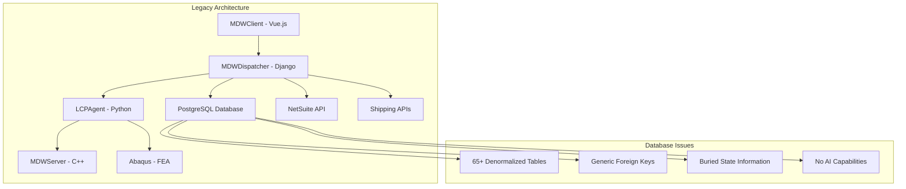
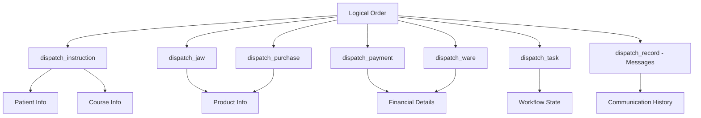
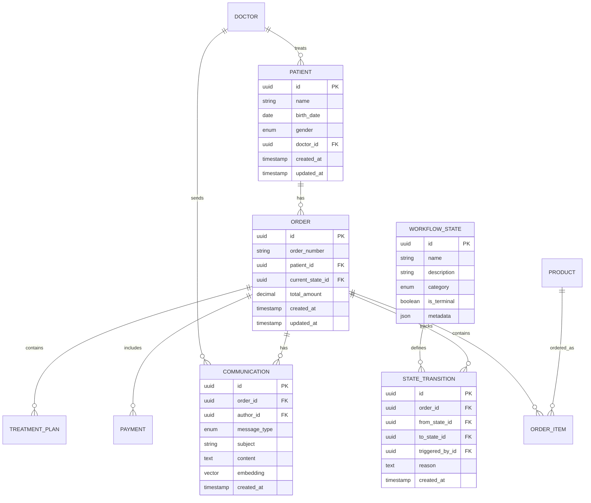
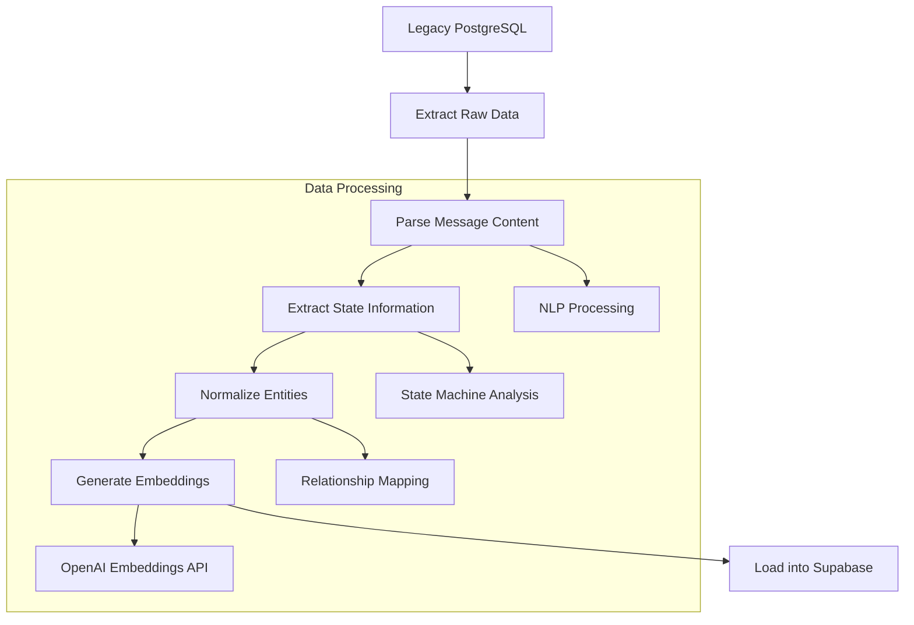

# Legacy Database Architecture Analysis

## Executive Summary

This document provides a comprehensive analysis of the legacy Medical Design Workflow (MDW) system's database architecture, identifying critical design flaws and establishing the foundation for a complete data model transformation. The legacy system uses Django's ContentTypes framework with Generic Foreign Keys, resulting in a denormalized, non-normalized database that severely limits analytical capabilities, AI integration, and modern data processing.

**Key Findings:**
- 65+ tables with poor normalization
- Heavy reliance on Django ContentTypes anti-pattern
- State information buried in unstructured message text
- No support for embeddings or AI-powered queries
- Complex data retrieval requiring application-layer assembly

**Transformation Goals:**
1. Normalize data model according to best practices
2. Extract state machines from message data
3. Enable AI embeddings for natural language queries
4. Support dynamic reporting and analytics
5. Create migration scripts for data transformation

## Legacy System Overview

### Technology Stack
- **Backend:** Django (Python web framework)
- **Frontend:** Vue.js with Three.js for 3D rendering
- **Database:** PostgreSQL with 65+ tables
- **Computational Engine:** C++ with Abaqus integration
- **External Integrations:** NetSuite, FedEx/USPS

### System Architecture



## Physical Database Schema Analysis

### Core Table Inventory

The legacy database contains 65+ tables with the following key categories:

#### Authentication & User Management
- `auth_user` - Django's built-in user model
- `auth_group` - User groups for permissions
- `auth_permission` - Granular permissions
- `dispatch_role` - Custom role system
- `dispatch_usersetting` - User preferences

#### Business Entities
- `dispatch_patient` - Patient information
- `dispatch_instruction` - Treatment orders (core business entity)
- `dispatch_plan` - Treatment plans
- `dispatch_project` - 3D modeling projects
- `dispatch_product` - Available products/services
- `dispatch_course` - Treatment courses

#### Messaging System (Major Anti-Pattern)
- `dispatch_record` - **Central messaging hub using Generic Foreign Keys**
- `dispatch_comment` - Plan-specific comments
- `django_content_type` - Django's content type registry

#### Workflow & State Management
- `dispatch_task` - Workflow tasks
- `dispatch_state` - State definitions
- `dispatch_event` - System events
- `dispatch_notification` - User notifications

#### Financial & Commerce
- `dispatch_payment` - Payment records
- `dispatch_purchase` - Purchase orders
- `dispatch_ware` - Detailed line items
- `dispatch_offer` - Pricing offers

### Critical Design Flaws

#### 1. Django ContentTypes Anti-Pattern

The `dispatch_record` table implements Django's Generic Foreign Key pattern:

```sql
-- Simplified structure of dispatch_record
CREATE TABLE dispatch_record (
    id SERIAL PRIMARY KEY,
    target_type_id INTEGER REFERENCES django_content_type(id),
    target_id INTEGER,  -- Points to ANY table's primary key
    author_id INTEGER REFERENCES auth_user(id),
    type INTEGER,  -- Message type enum
    text TEXT,  -- Unstructured message content
    public BOOLEAN DEFAULT TRUE,
    created_at TIMESTAMP DEFAULT NOW()
);
```

**Problems:**
- No referential integrity (target_id can point to non-existent records)
- Impossible to create proper foreign key constraints
- Query performance issues (requires JOINs with content_type table)
- State information buried in unstructured text
- No way to index or analyze message content effectively

#### 2. Denormalized Entity Construction

Logical business entities like "Orders" don't exist as single tables but must be assembled from multiple tables:



#### 3. State Machine Information Loss

Critical state information is embedded in unstructured text within `dispatch_record.text`:
- Order status changes
- Workflow progression
- Error conditions
- User actions
- System events

This makes it impossible to:
- Query orders by current state
- Generate state transition reports
- Identify bottlenecks in the workflow
- Create automated alerts for stuck processes

## Django ContentTypes Pattern Analysis

### How Generic Foreign Keys Work

Django's ContentTypes framework allows a single foreign key field to reference any model:

```python
# Django Model Example
class Record(models.Model):
    target_type = models.ForeignKey(ContentType, on_delete=models.CASCADE)
    target_id = models.PositiveIntegerField()
    target = GenericForeignKey('target_type', 'target_id')
    text = models.TextField()
```

### Database Implementation

```sql
-- Content type registry
CREATE TABLE django_content_type (
    id SERIAL PRIMARY KEY,
    app_label VARCHAR(100),
    model VARCHAR(100)
);

-- Example content types
INSERT INTO django_content_type VALUES 
(1, 'dispatch', 'patient'),
(2, 'dispatch', 'instruction'),
(3, 'dispatch', 'user');

-- Generic foreign key implementation
CREATE TABLE dispatch_record (
    id SERIAL PRIMARY KEY,
    target_type_id INTEGER REFERENCES django_content_type(id),
    target_id INTEGER,  -- No foreign key constraint possible
    text TEXT
);
```

### Query Complexity Example

To get all messages for a patient:

```sql
-- Legacy: Complex query with content type lookup
SELECT r.*, ct.model, ct.app_label
FROM dispatch_record r
JOIN django_content_type ct ON r.target_type_id = ct.id
WHERE ct.app_label = 'dispatch' 
  AND ct.model = 'patient'
  AND r.target_id = 123;
```

## Logical Data Model Extraction

### Core Business Entities

Based on the physical schema analysis, the following logical entities can be identified:



## AI-Ready Data Architecture Plan

### 1. Normalized Schema Design

#### Core Principles
- **Third Normal Form (3NF)** compliance
- **UUID primary keys** for distributed systems
- **Proper foreign key constraints** for referential integrity
- **Embedding columns** for AI-powered search
- **Audit trails** for all state changes
- **JSON metadata** for flexible attributes

#### State Machine Extraction

```sql
-- Modern state management
CREATE TABLE workflow_states (
    id UUID PRIMARY KEY DEFAULT gen_random_uuid(),
    name VARCHAR(100) NOT NULL,
    description TEXT,
    category VARCHAR(50), -- 'order', 'production', 'shipping', etc.
    is_terminal BOOLEAN DEFAULT FALSE,
    metadata JSONB,
    created_at TIMESTAMP DEFAULT NOW()
);

CREATE TABLE state_transitions (
    id UUID PRIMARY KEY DEFAULT gen_random_uuid(),
    order_id UUID REFERENCES orders(id),
    from_state_id UUID REFERENCES workflow_states(id),
    to_state_id UUID REFERENCES workflow_states(id),
    triggered_by_id UUID REFERENCES users(id),
    reason TEXT,
    metadata JSONB,
    created_at TIMESTAMP DEFAULT NOW()
);
```

### 2. Embedding Strategy for AI Queries

#### Communication Embeddings
```sql
CREATE TABLE communications (
    id UUID PRIMARY KEY DEFAULT gen_random_uuid(),
    order_id UUID REFERENCES orders(id),
    author_id UUID REFERENCES users(id),
    message_type VARCHAR(50),
    subject VARCHAR(200),
    content TEXT NOT NULL,
    content_embedding VECTOR(1536), -- OpenAI embedding dimension
    metadata JSONB,
    created_at TIMESTAMP DEFAULT NOW()
);

-- Vector similarity index for semantic search
CREATE INDEX ON communications USING ivfflat (content_embedding vector_cosine_ops);
```

#### Order Embeddings for Natural Language Queries
```sql
CREATE TABLE order_summaries (
    order_id UUID PRIMARY KEY REFERENCES orders(id),
    summary_text TEXT, -- Generated summary of order details
    summary_embedding VECTOR(1536),
    last_updated TIMESTAMP DEFAULT NOW()
);
```

### 3. AI Query Capabilities

#### Natural Language Query Examples

**Query:** "How many orders did we have last month?"
```sql
-- Enabled by proper date indexing and normalized structure
SELECT COUNT(*) 
FROM orders 
WHERE created_at >= date_trunc('month', CURRENT_DATE - INTERVAL '1 month')
  AND created_at < date_trunc('month', CURRENT_DATE);
```

**Query:** "Are there any orders stuck in the process?"
```sql
-- Enabled by state machine extraction
SELECT o.order_number, o.created_at, ws.name as current_state
FROM orders o
JOIN workflow_states ws ON o.current_state_id = ws.id
WHERE o.updated_at < CURRENT_DATE - INTERVAL '7 days'
  AND ws.is_terminal = FALSE;
```

**Query:** "Find orders with communication issues"
```sql
-- Enabled by embeddings and semantic search
SELECT DISTINCT o.order_number
FROM orders o
JOIN communications c ON o.id = c.order_id
WHERE c.content_embedding <-> $1 < 0.8  -- $1 = embedding of "problem issue error"
ORDER BY c.content_embedding <-> $1;
```

### 4. Dynamic Reporting Architecture

#### Materialized Views for Performance
```sql
-- Order status summary for dashboards
CREATE MATERIALIZED VIEW order_status_summary AS
SELECT 
    ws.name as status,
    COUNT(*) as order_count,
    AVG(EXTRACT(EPOCH FROM (NOW() - o.created_at))/86400) as avg_days_in_status
FROM orders o
JOIN workflow_states ws ON o.current_state_id = ws.id
GROUP BY ws.id, ws.name;
```

#### AI-Generated Report Metadata
```sql
CREATE TABLE report_templates (
    id UUID PRIMARY KEY DEFAULT gen_random_uuid(),
    name VARCHAR(200),
    description TEXT,
    query_template TEXT, -- Parameterized SQL
    visualization_config JSONB, -- Chart/graph configuration
    ai_prompt_embedding VECTOR(1536), -- For natural language report requests
    created_at TIMESTAMP DEFAULT NOW()
);
```

## Migration Strategy

### Phase 1: Data Extraction and Cleaning



### Phase 2: State Machine Reconstruction

1. **Analyze `dispatch_record` messages** to identify state transitions
2. **Extract workflow patterns** from message sequences
3. **Create state definitions** based on discovered patterns
4. **Build transition history** from chronological message analysis

### Phase 3: Embedding Generation

1. **Communication content** → OpenAI embeddings
2. **Order summaries** → Semantic search capabilities
3. **Product descriptions** → Recommendation engine
4. **User queries** → Natural language interface

### Phase 4: Validation and Testing

1. **Data integrity checks** comparing legacy vs. new system
2. **Query performance benchmarks**
3. **AI query accuracy testing**
4. **Report generation validation**

## Implementation Roadmap

### Immediate Actions (Week 1-2)
1. ✅ Document legacy architecture (this document)
2. Create detailed table schema documentation
3. Analyze `dispatch_record` message patterns
4. Design normalized Supabase schema

### Short Term (Week 3-6)
1. Build data extraction scripts
2. Implement state machine analysis
3. Create embedding pipeline
4. Design migration validation framework

### Medium Term (Week 7-12)
1. Execute full data migration
2. Implement AI query interface
3. Build dynamic reporting system
4. Create data validation dashboard

### Long Term (Month 4+)
1. Advanced AI features (predictive analytics)
2. Real-time embedding updates
3. Automated report generation
4. Machine learning model training

## Success Metrics

### Data Quality
- **100% data migration** with validation
- **Zero data loss** during transformation
- **Referential integrity** maintained
- **Performance improvement** (10x faster queries)

### AI Capabilities
- **Natural language queries** with 95% accuracy
- **Semantic search** across all communications
- **Automated state detection** from messages
- **Dynamic report generation** in under 30 seconds

### Business Impact
- **Real-time dashboards** for order tracking
- **Predictive analytics** for bottleneck identification
- **Automated alerts** for stuck processes
- **AI-powered insights** for process optimization

## Conclusion

The legacy MDW system's database architecture represents a classic example of technical debt that severely limits analytical capabilities and AI integration. The Django ContentTypes pattern, while flexible for development, creates a maintenance nightmare and prevents modern data analysis.

The proposed transformation to a normalized, AI-ready architecture will:
1. **Eliminate technical debt** through proper normalization
2. **Enable AI-powered queries** through embeddings
3. **Extract hidden state information** from unstructured messages
4. **Support dynamic reporting** and analytics
5. **Provide foundation** for advanced AI features

This migration represents not just a database upgrade, but a fundamental transformation that will enable the next generation of AI-powered medical device workflow management.

---

**Next Steps:** Proceed with detailed schema design and migration script development based on this architectural analysis.