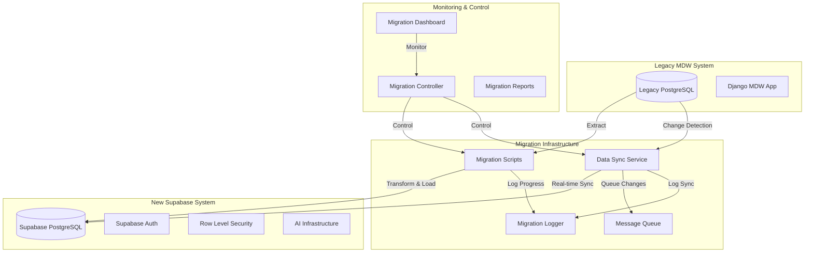
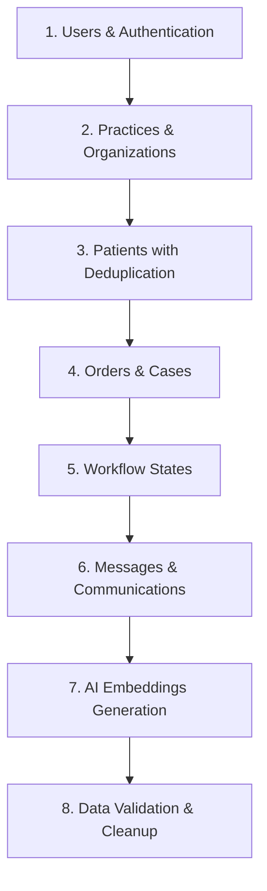

# MDW Database Migration & Synchronization Implementation Plan

## Executive Summary

This document outlines the comprehensive architecture and implementation plan for migrating data from the legacy Medical Design Workflow (MDW) PostgreSQL database to the new AI-ready Supabase infrastructure. The plan implements a hybrid approach with initial bulk migration followed by real-time synchronization during the transition period.

## Table of Contents

1. [Migration Architecture Overview](#migration-architecture-overview)
2. [Implementation Phases](#implementation-phases)
3. [Technical Architecture](#technical-architecture)
4. [Migration Scripts Framework](#migration-scripts-framework)
5. [Real-Time Synchronization](#real-time-synchronization)
6. [Data Transformation Logic](#data-transformation-logic)
7. [Monitoring & Control Systems](#monitoring--control-systems)
8. [Risk Mitigation Strategies](#risk-mitigation-strategies)
9. [Success Metrics](#success-metrics)
10. [Implementation Timeline](#implementation-timeline)

## Migration Architecture Overview



### Key Components

- **Legacy MDW System**: Existing Django-based system with PostgreSQL database
- **Migration Infrastructure**: Custom-built migration and synchronization services
- **Supabase System**: Target AI-ready database with authentication and RLS
- **Monitoring & Control**: Real-time dashboards and management interfaces

## Implementation Phases

### Phase 1: Infrastructure Setup (Week 1-2)

#### 1.1 Environment Configuration
- **Database Connections**: Establish secure connections using existing brius_postgres MCP server
- **Migration Schema**: Create dedicated migration tracking tables in Supabase
- **Logging Infrastructure**: Implement comprehensive audit logging
- **Security Setup**: Configure encrypted data transfer and credential management

#### 1.2 Data Validation Framework
```typescript
interface ValidationRule {
  name: string;
  description: string;
  validate: (data: any) => Promise<ValidationResult>;
  severity: 'error' | 'warning' | 'info';
}

interface ValidationResult {
  isValid: boolean;
  errors: string[];
  warnings: string[];
  metadata?: Record<string, any>;
}
```

#### 1.3 Migration Tracking Schema
```sql
-- Migration tracking tables in Supabase
CREATE TABLE migration_batches (
  id UUID PRIMARY KEY DEFAULT gen_random_uuid(),
  batch_name VARCHAR(255) NOT NULL,
  status migration_status DEFAULT 'pending',
  started_at TIMESTAMPTZ,
  completed_at TIMESTAMPTZ,
  error_message TEXT,
  records_processed INTEGER DEFAULT 0,
  records_failed INTEGER DEFAULT 0,
  created_at TIMESTAMPTZ DEFAULT NOW()
);

CREATE TABLE migration_logs (
  id UUID PRIMARY KEY DEFAULT gen_random_uuid(),
  batch_id UUID REFERENCES migration_batches(id),
  table_name VARCHAR(255) NOT NULL,
  operation VARCHAR(50) NOT NULL,
  legacy_id VARCHAR(255),
  new_id UUID,
  status VARCHAR(50) NOT NULL,
  error_details JSONB,
  processing_time_ms INTEGER,
  created_at TIMESTAMPTZ DEFAULT NOW()
);

CREATE TYPE migration_status AS ENUM (
  'pending', 'running', 'completed', 'failed', 'rolled_back'
);
```

### Phase 2: Bulk Migration Scripts (Week 3-5)

#### 2.1 Migration Script Architecture
```typescript
interface MigrationScript {
  name: string;
  description: string;
  dependencies: string[];
  batchSize: number;
  maxRetries: number;
  timeoutMs: number;
  execute: (config: MigrationConfig) => Promise<MigrationResult>;
  rollback: (batchId: string) => Promise<void>;
  validate: (batchId: string) => Promise<ValidationResult>;
}

interface MigrationConfig {
  batchSize: number;
  maxRetries: number;
  timeoutMs: number;
  parallelWorkers: number;
  dryRun: boolean;
  skipValidation: boolean;
}

interface MigrationResult {
  batchId: string;
  recordsProcessed: number;
  recordsFailed: number;
  errors: MigrationError[];
  duration: number;
  checkpoints: string[];
}
```

#### 2.2 Migration Execution Order


#### 2.3 Core Migration Scripts

##### User Migration Script
```typescript
class UserMigrationScript implements MigrationScript {
  name = 'user-migration';
  description = 'Migrate auth_user to Supabase Auth and profiles';
  dependencies = [];
  batchSize = 100;
  maxRetries = 3;
  timeoutMs = 30000;

  async execute(config: MigrationConfig): Promise<MigrationResult> {
    const batchId = await this.createBatch();
    
    try {
      // Extract users from legacy system
      const legacyUsers = await this.extractLegacyUsers(config.batchSize);
      
      // Transform and create Supabase auth users
      const results = await this.processUserBatch(legacyUsers, batchId);
      
      // Validate migration results
      if (!config.skipValidation) {
        await this.validateUserMigration(batchId);
      }
      
      return results;
    } catch (error) {
      await this.handleMigrationError(batchId, error);
      throw error;
    }
  }

  private async extractLegacyUsers(batchSize: number): Promise<LegacyUser[]> {
    // Use brius_postgres MCP server to extract users
    const query = `
      SELECT id, username, email, first_name, last_name, 
             is_active, is_staff, is_superuser, date_joined, last_login
      FROM auth_user 
      WHERE is_active = true
      ORDER BY id
      LIMIT $1
    `;
    
    return await this.legacyDb.query(query, [batchSize]);
  }

  private async processUserBatch(users: LegacyUser[], batchId: string): Promise<MigrationResult> {
    const results: MigrationResult = {
      batchId,
      recordsProcessed: 0,
      recordsFailed: 0,
      errors: [],
      duration: 0,
      checkpoints: []
    };

    for (const user of users) {
      try {
        // Create Supabase auth user
        const authUser = await this.createSupabaseUser(user);
        
        // Create profile record
        await this.createUserProfile(user, authUser.id);
        
        // Log successful migration
        await this.logMigration(batchId, 'auth_user', user.id, authUser.id, 'success');
        
        results.recordsProcessed++;
      } catch (error) {
        results.recordsFailed++;
        results.errors.push({
          legacyId: user.id,
          error: error.message,
          details: error
        });
        
        await this.logMigration(batchId, 'auth_user', user.id, null, 'failed', error);
      }
    }

    return results;
  }
}
```

##### Patient Deduplication Script
```typescript
class PatientDeduplicationScript implements MigrationScript {
  name = 'patient-deduplication';
  description = 'Migrate and deduplicate patients from dispatch_patient';
  dependencies = ['user-migration', 'practice-migration'];
  batchSize = 50;
  maxRetries = 3;
  timeoutMs = 60000;

  async execute(config: MigrationConfig): Promise<MigrationResult> {
    const batchId = await this.createBatch();
    
    try {
      // Extract all patients
      const legacyPatients = await this.extractLegacyPatients();
      
      // Group potential duplicates
      const patientGroups = await this.groupPotentialDuplicates(legacyPatients);
      
      // Process each group
      const results = await this.processPatientGroups(patientGroups, batchId);
      
      return results;
    } catch (error) {
      await this.handleMigrationError(batchId, error);
      throw error;
    }
  }

  private async groupPotentialDuplicates(patients: LegacyPatient[]): Promise<PatientGroup[]> {
    const groups: PatientGroup[] = [];
    const processed = new Set<string>();

    for (const patient of patients) {
      if (processed.has(patient.id)) continue;

      const duplicates = await this.findPotentialDuplicates(patient, patients);
      
      groups.push({
        primaryPatient: patient,
        duplicates: duplicates,
        mergeStrategy: await this.determineMergeStrategy(patient, duplicates)
      });

      // Mark all patients in this group as processed
      processed.add(patient.id);
      duplicates.forEach(dup => processed.add(dup.id));
    }

    return groups;
  }

  private async findPotentialDuplicates(
    patient: LegacyPatient, 
    allPatients: LegacyPatient[]
  ): Promise<LegacyPatient[]> {
    const duplicates: LegacyPatient[] = [];

    for (const other of allPatients) {
      if (other.id === patient.id) continue;

      const similarity = await this.calculateSimilarity(patient, other);
      
      if (similarity.score > 0.85) { // 85% similarity threshold
        duplicates.push(other);
      }
    }

    return duplicates;
  }

  private async calculateSimilarity(
    patient1: LegacyPatient, 
    patient2: LegacyPatient
  ): Promise<SimilarityResult> {
    const nameScore = this.calculateNameSimilarity(
      patient1.first_name + ' ' + patient1.last_name,
      patient2.first_name + ' ' + patient2.last_name
    );

    const dobScore = patient1.date_of_birth === patient2.date_of_birth ? 1.0 : 0.0;
    
    const emailScore = patient1.email && patient2.email 
      ? (patient1.email === patient2.email ? 1.0 : 0.0)
      : 0.5; // Neutral if either email is missing

    const phoneScore = patient1.phone && patient2.phone
      ? this.calculatePhoneSimilarity(patient1.phone, patient2.phone)
      : 0.5;

    const overallScore = (nameScore * 0.4) + (dobScore * 0.3) + (emailScore * 0.2) + (phoneScore * 0.1);

    return {
      score: overallScore,
      factors: {
        name: nameScore,
        dateOfBirth: dobScore,
        email: emailScore,
        phone: phoneScore
      }
    };
  }
}
```

### Phase 3: Real-Time Synchronization (Week 6-8)

#### 3.1 Change Detection System

```mermaid
graph LR
    subgraph "Legacy Database"
        LT[Legacy Tables]
        TR[Triggers]
        CL[Change Log]
    end
    
    subgraph "Sync Service"
        CD[Change Detector]
        TF[Transformer]
        AP[API Publisher]
        CF[Conflict Resolver]
    end
    
    subgraph "Supabase"
        ST[Supabase Tables]
        RT[Real-time]
    end
    
    LT -->|INSERT/UPDATE/DELETE| TR
    TR -->|Log Changes| CL
    CL -->|Poll Changes| CD
    CD -->|Transform| TF
    TF -->|Check Conflicts| CF
    CF -->|Publish| AP
    AP -->|Update| ST
    ST -->|Notify| RT
```


#### 3.2 Database Triggers for Change Detection
```sql
-- Create change log table in legacy database
CREATE TABLE mdw_change_log (
  id SERIAL PRIMARY KEY,
  table_name VARCHAR(255) NOT NULL,
  operation VARCHAR(10) NOT NULL, -- INSERT, UPDATE, DELETE
  record_id VARCHAR(255) NOT NULL,
  old_data JSONB,
  new_data JSONB,
  changed_at TIMESTAMPTZ DEFAULT NOW(),
  processed BOOLEAN DEFAULT FALSE,
  processed_at TIMESTAMPTZ,
  sync_error TEXT
);

-- Generic trigger function for change logging
CREATE OR REPLACE FUNCTION log_table_changes()
RETURNS TRIGGER AS $$
BEGIN
  IF TG_OP = 'DELETE' THEN
    INSERT INTO mdw_change_log (table_name, operation, record_id, old_data)
    VALUES (TG_TABLE_NAME, TG_OP, OLD.id::TEXT, row_to_json(OLD));
    RETURN OLD;
  ELSIF TG_OP = 'UPDATE' THEN
    INSERT INTO mdw_change_log (table_name, operation, record_id, old_data, new_data)
    VALUES (TG_TABLE_NAME, TG_OP, NEW.id::TEXT, row_to_json(OLD), row_to_json(NEW));
    RETURN NEW;
  ELSIF TG_OP = 'INSERT' THEN
    INSERT INTO mdw_change_log (table_name, operation, record_id, new_data)
    VALUES (TG_TABLE_NAME, TG_OP, NEW.id::TEXT, row_to_json(NEW));
    RETURN NEW;
  END IF;
  RETURN NULL;
END;
$$ LANGUAGE plpgsql;

-- Create triggers for key tables
CREATE TRIGGER dispatch_patient_changes
  AFTER INSERT OR UPDATE OR DELETE ON dispatch_patient
  FOR EACH ROW EXECUTE FUNCTION log_table_changes();

CREATE TRIGGER dispatch_order_changes
  AFTER INSERT OR UPDATE OR DELETE ON dispatch_order
  FOR EACH ROW EXECUTE FUNCTION log_table_changes();

CREATE TRIGGER dispatch_record_changes
  AFTER INSERT OR UPDATE OR DELETE ON dispatch_record
  FOR EACH ROW EXECUTE FUNCTION log_table_changes();
```

#### 3.3 Synchronization Service
```typescript
class DataSynchronizationService {
  private readonly pollInterval = 5000; // 5 seconds
  private readonly batchSize = 100;
  private isRunning = false;

  async start(): Promise<void> {
    this.isRunning = true;
    console.log('Starting data synchronization service...');
    
    while (this.isRunning) {
      try {
        await this.processPendingChanges();
        await this.sleep(this.pollInterval);
      } catch (error) {
        console.error('Sync error:', error);
        await this.sleep(this.pollInterval * 2); // Back off on error
      }
    }
  }

  async stop(): Promise<void> {
    this.isRunning = false;
    console.log('Stopping data synchronization service...');
  }

  private async processPendingChanges(): Promise<void> {
    const changes = await this.fetchPendingChanges();
    
    if (changes.length === 0) return;

    console.log(`Processing ${changes.length} pending changes...`);

    for (const change of changes) {
      try {
        await this.processChange(change);
        await this.markChangeProcessed(change.id);
      } catch (error) {
        await this.markChangeError(change.id, error.message);
        console.error(`Failed to process change ${change.id}:`, error);
      }
    }
  }

  private async fetchPendingChanges(): Promise<ChangeLogEntry[]> {
    const query = `
      SELECT id, table_name, operation, record_id, old_data, new_data, changed_at
      FROM mdw_change_log
      WHERE processed = FALSE
      ORDER BY changed_at ASC
      LIMIT $1
    `;
    
    return await this.legacyDb.query(query, [this.batchSize]);
  }

  private async processChange(change: ChangeLogEntry): Promise<void> {
    const processor = this.getProcessorForTable(change.table_name);
    
    if (!processor) {
      throw new Error(`No processor found for table: ${change.table_name}`);
    }

    switch (change.operation) {
      case 'INSERT':
        await processor.handleInsert(change.new_data, change.record_id);
        break;
      case 'UPDATE':
        await processor.handleUpdate(change.old_data, change.new_data, change.record_id);
        break;
      case 'DELETE':
        await processor.handleDelete(change.old_data, change.record_id);
        break;
      default:
        throw new Error(`Unknown operation: ${change.operation}`);
    }
  }

  private getProcessorForTable(tableName: string): TableProcessor | null {
    const processors: Record<string, TableProcessor> = {
      'dispatch_patient': new PatientSyncProcessor(),
      'dispatch_order': new OrderSyncProcessor(),
      'dispatch_record': new RecordSyncProcessor(),
      'auth_user': new UserSyncProcessor()
    };

    return processors[tableName] || null;
  }
}

interface TableProcessor {
  handleInsert(data: any, legacyId: string): Promise<void>;
  handleUpdate(oldData: any, newData: any, legacyId: string): Promise<void>;
  handleDelete(data: any, legacyId: string): Promise<void>;
}

class PatientSyncProcessor implements TableProcessor {
  async handleInsert(data: any, legacyId: string): Promise<void> {
    // Check if patient already exists (from bulk migration)
    const existingPatient = await this.findPatientByLegacyId(legacyId);
    
    if (existingPatient) {
      console.log(`Patient ${legacyId} already exists, skipping insert`);
      return;
    }

    // Transform legacy patient data to new schema
    const transformedPatient = await this.transformPatientData(data);
    
    // Check for potential duplicates
    const duplicates = await this.findPotentialDuplicates(transformedPatient);
    
    if (duplicates.length > 0) {
      // Handle duplicate detection
      await this.handlePotentialDuplicate(transformedPatient, duplicates);
    } else {
      // Create new patient
      await this.createPatient(transformedPatient, legacyId);
    }
  }

  async handleUpdate(oldData: any, newData: any, legacyId: string): Promise<void> {
    const existingPatient = await this.findPatientByLegacyId(legacyId);
    
    if (!existingPatient) {
      console.warn(`Patient ${legacyId} not found for update, treating as insert`);
      await this.handleInsert(newData, legacyId);
      return;
    }

    // Check for conflicts with recent changes
    const conflict = await this.detectConflict(existingPatient, oldData, newData);
    
    if (conflict) {
      await this.resolveConflict(conflict);
    } else {
      // Apply update
      const transformedData = await this.transformPatientData(newData);
      await this.updatePatient(existingPatient.id, transformedData);
    }
  }

  async handleDelete(data: any, legacyId: string): Promise<void> {
    const existingPatient = await this.findPatientByLegacyId(legacyId);
    
    if (!existingPatient) {
      console.warn(`Patient ${legacyId} not found for deletion`);
      return;
    }

    // Soft delete to preserve referential integrity
    await this.softDeletePatient(existingPatient.id);
  }

  private async detectConflict(
    existingPatient: any, 
    oldData: any, 
    newData: any
  ): Promise<DataConflict | null> {
    // Check if the existing patient has been modified since the old data timestamp
    const lastModified = new Date(existingPatient.updated_at);
    const changeTimestamp = new Date(oldData.updated_at || oldData.created_at);
    
    if (lastModified > changeTimestamp) {
      return {
        type: 'concurrent_modification',
        existingData: existingPatient,
        incomingOldData: oldData,
        incomingNewData: newData,
        conflictFields: this.identifyConflictFields(existingPatient, newData)
      };
    }

    return null;
  }

  private async resolveConflict(conflict: DataConflict): Promise<void> {
    // Implement conflict resolution strategy
    // For now, use "last writer wins" with notification
    
    console.warn('Data conflict detected:', conflict);
    
    // Log conflict for manual review
    await this.logConflict(conflict);
    
    // Apply incoming changes (last writer wins)
    const transformedData = await this.transformPatientData(conflict.incomingNewData);
    await this.updatePatient(conflict.existingData.id, transformedData);
    
    // Notify administrators
    await this.notifyConflict(conflict);
  }
}
```

### Phase 4: Migration Execution & Monitoring (Week 9-10)

#### 4.1 Migration Dashboard
```typescript
interface MigrationDashboard {
  // Real-time migration progress
  overallProgress: {
    totalTables: number;
    completedTables: number;
    currentTable: string;
    recordsProcessed: number;
    recordsFailed: number;
    estimatedTimeRemaining: number;
  };

  // Table-specific progress
  tableProgress: Array<{
    tableName: string;
    status: 'pending' | 'running' | 'completed' | 'failed';
    recordsTotal: number;
    recordsProcessed: number;
    recordsFailed: number;
    startTime: Date;
    endTime?: Date;
    errors: MigrationError[];
  }>;

  // Performance metrics
  performance: {
    recordsPerSecond: number;
    averageBatchTime: number;
    memoryUsage: number;
    cpuUsage: number;
  };

  // Data quality metrics
  dataQuality: {
    duplicatesFound: number;
    duplicatesResolved: number;
    validationErrors: number;
    dataIntegrityIssues: number;
  };

  // Synchronization status
  syncStatus: {
    isActive: boolean;
    lastSyncTime: Date;
    pendingChanges: number;
    syncErrors: number;
    averageSyncLatency: number;
  };
}

class MigrationController {
  private dashboard: MigrationDashboard;
  private migrationScripts: Map<string, MigrationScript>;
  private syncService: DataSynchronizationService;

  async startMigration(config: MigrationConfig): Promise<void> {
    console.log('Starting MDW database migration...');
    
    try {
      // Initialize migration tracking
      await this.initializeMigration();
      
      // Execute migration scripts in dependency order
      const executionOrder = this.calculateExecutionOrder();
      
      for (const scriptName of executionOrder) {
        const script = this.migrationScripts.get(scriptName);
        if (!script) continue;

        console.log(`Executing migration script: ${scriptName}`);
        
        await this.executeScript(script, config);
        await this.updateProgress(scriptName);
      }

      // Start real-time synchronization
      await this.startSynchronization();
      
      console.log('Migration completed successfully!');
      
    } catch (error) {
      console.error('Migration failed:', error);
      await this.handleMigrationFailure(error);
      throw error;
    }
  }

  async pauseMigration(): Promise<void> {
    console.log('Pausing migration...');
    // Implementation for pausing migration
  }

  async resumeMigration(): Promise<void> {
    console.log('Resuming migration...');
    // Implementation for resuming migration
  }

  async rollbackMigration(toCheckpoint?: string): Promise<void> {
    console.log(`Rolling back migration${toCheckpoint ? ` to checkpoint: ${toCheckpoint}` : ''}...`);
    // Implementation for rollback
  }

  private calculateExecutionOrder(): string[] {
    // Topological sort based on dependencies
    const visited = new Set<string>();
    const visiting = new Set<string>();
    const order: string[] = [];

    const visit = (scriptName: string) => {
      if (visiting.has(scriptName)) {
        throw new Error(`Circular dependency detected: ${scriptName}`);
      }
      
      if (visited.has(scriptName)) return;

      visiting.add(scriptName);
      
      const script = this.migrationScripts.get(scriptName);
      if (script) {
        for (const dependency of script.dependencies) {
          visit(dependency);
        }
      }
      
      visiting.delete(scriptName);
      visited.add(scriptName);
      order.push(scriptName);
    };

    for (const scriptName of this.migrationScripts.keys()) {
      visit(scriptName);
    }

    return order;
  }
}
```

#### 4.2 Error Handling & Recovery
```typescript
class MigrationErrorHandler {
  async handleError(error: MigrationError, context: MigrationContext): Promise<ErrorResolution> {
    console.error(`Migration error in ${context.scriptName}:`, error);

    // Log error details
    await this.logError(error, context);

    // Determine error type and resolution strategy
    const resolution = await this.determineResolution(error, context);

    switch (resolution.strategy) {
      case 'retry':
        return await this.retryOperation(error, context, resolution.retryConfig);
      
      case 'skip':
        console.warn(`Skipping failed record: ${error.recordId}`);
        return { strategy: 'skip', success: true };
      
      case 'manual':
        await this.queueForManualReview(error, context);
        return { strategy: 'manual', success: true };
      
      case 'abort':
        throw new Error(`Critical error, aborting migration: ${error.message}`);
      
      default:
        throw new Error(`Unknown resolution strategy: ${resolution.strategy}`);
    }
  }

  private async determineResolution(
    error: MigrationError, 
    context: MigrationContext
  ): Promise<ErrorResolutionStrategy> {
    // Analyze error type and context to determine best resolution
    
    if (error.type === 'network_timeout' && context.retryCount < 3) {
      return {
        strategy: 'retry',
        retryConfig: {
          delay: Math.pow(2, context.retryCount) * 1000, // Exponential backoff
          maxRetries: 3
        }
      };
    }

    if (error.type === 'data_validation' && error.severity === 'warning') {
      return { strategy: 'skip' };
    }

    if (error.type === 'duplicate_key' || error.type === 'foreign_key_violation') {
      return { strategy: 'manual' };
    }

    if (error.type === 'schema_mismatch' || error.type === 'connection_lost') {
      return { strategy: 'abort' };
    }

    return { strategy: 'manual' }; // Default to manual review
  }

  private async retryOperation(
    error: MigrationError,
    context: MigrationContext,
    retryConfig: RetryConfig
  ): Promise<ErrorResolution> {
    await this.sleep(retryConfig.delay);
    
    try {
      // Retry the failed operation
      const result = await context.retryFunction();
      return { strategy: 'retry', success: true, result };
    } catch (retryError) {
      if (context.retryCount >= retryConfig.maxRetries) {
        // Max retries exceeded, escalate
        return await this.handleError(retryError, {
          ...context,
          retryCount: context.retryCount + 1
        });
      } else {
        // Retry again
        return await this.retryOperation(retryError, {
          ...context,
          retryCount: context.retryCount + 1
        }, retryConfig);
      }
    }
  }
}
```

## Data Transformation Logic

### Patient Deduplication Algorithm
```typescript
class PatientDeduplicationEngine {
  private readonly SIMILARITY_THRESHOLD = 0.85;
  private readonly NAME_WEIGHT = 0.4;
  private readonly DOB_WEIGHT = 0.3;
  private readonly EMAIL_WEIGHT = 0.2;
  private readonly PHONE_WEIGHT = 0.1;

  async deduplicatePatients(patients: LegacyPatient[]): Promise<DeduplicationResult> {
    const groups = await this.groupSimilarPatients(patients);
    const mergedPatients: Patient[] = [];
    const duplicateMap: Map<string, string> = new Map();

    for (const group of groups) {
      const mergedPatient = await this.mergePatientGroup(group);
      mergedPatients.push(mergedPatient);

      // Track which legacy IDs map to the new patient
      for (const legacyPatient of group.patients) {
        duplicateMap.set(legacyPatient.id, mergedPatient.id);
      }
    }

    return {
      mergedPatients,
      duplicateMap,
      duplicatesFound: patients.length - mergedPatients.length
    };
  }

  private async groupSimilarPatients(patients: LegacyPatient[]): Promise<PatientGroup[]> {
    const groups: PatientGroup[] = [];
    const processed = new Set<string>();

    for (const patient of patients) {
      if (processed.has(patient.id)) continue;

      const similarPatients = await this.findSimilarPatients(patient, patients);
      
      groups.push({
        primaryPatient: patient,
        patients: [patient, ...similarPatients],
        confidence: await this.calculateGroupConfidence(patient, similarPatients)
      });

      // Mark all patients in this group as processed
      processed.add(patient.id);
      similarPatients.forEach(p => processed.add(p.id));
    }

    return groups;
  }

  private async findSimilarPatients(
    targetPatient: LegacyPatient,
    allPatients: LegacyPatient[]
  ): Promise<LegacyPatient[]> {
    const similarPatients: LegacyPatient[] = [];
    
    for (const patient of allPatients) {
      if (patient.id === targetPatient.id) continue;
      
      const similarity = await this.calculatePatientSimilarity(targetPatient, patient);
      
      if (similarity.score >= this.SIMILARITY_THRESHOLD) {
        similarPatients.push(patient);
      }
    }
    
    return similarPatients;
  }

  private async calculatePatientSimilarity(
    patient1: LegacyPatient,
    patient2: LegacyPatient
  ): Promise<SimilarityResult> {
    // Name similarity using Levenshtein distance
    const nameScore = this.calculateNameSimilarity(
      `${patient1.first_name} ${patient1.last_name}`.toLowerCase().trim(),
      `${patient2.first_name} ${patient2.last_name}`.toLowerCase().trim()
    );

    // Date of birth exact match
    const dobScore = this.calculateDateSimilarity(
      patient1.date_of_birth,
      patient2.date_of_birth
    );

    // Email similarity
    const emailScore = this.calculateEmailSimilarity(
      patient1.email,
      patient2.email
    );

    // Phone similarity with fuzzy matching
    const phoneScore = this.calculatePhoneSimilarity(
      patient1.phone,
      patient2.phone
    );

    // Address similarity
    const addressScore = this.calculateAddressSimilarity(
      patient1.address,
      patient2.address
    );

    // Calculate weighted overall score
    const overallScore = (
      nameScore * this.NAME_WEIGHT +
      dobScore * this.DOB_WEIGHT +
      emailScore * this.EMAIL_WEIGHT +
      phoneScore * this.PHONE_WEIGHT +
      addressScore * 0.1 // Address weight
    );

    return {
      score: overallScore,
      factors: {
        name: nameScore,
        dateOfBirth: dobScore,
        email: emailScore,
        phone: phoneScore,
        address: addressScore
      },
      confidence: this.calculateConfidenceLevel(overallScore),
      metadata: {
        patient1Id: patient1.id,
        patient2Id: patient2.id,
        comparisonTimestamp: new Date().toISOString()
      }
    };
  }

  private calculateNameSimilarity(name1: string, name2: string): number {
    if (!name1 || !name2) return 0;
    
    // Exact match
    if (name1 === name2) return 1.0;
    
    // Levenshtein distance calculation
    const distance = this.levenshteinDistance(name1, name2);
    const maxLength = Math.max(name1.length, name2.length);
    
    if (maxLength === 0) return 1.0;
    
    const similarity = 1 - (distance / maxLength);
    
    // Boost score for phonetic similarity
    const phoneticScore = this.calculatePhoneticSimilarity(name1, name2);
    
    return Math.max(similarity, phoneticScore * 0.8);
  }

  private calculatePhoneticSimilarity(name1: string, name2: string): number {
    // Simple Soundex-like algorithm for phonetic matching
    const soundex1 = this.generateSoundex(name1);
    const soundex2 = this.generateSoundex(name2);
    
    return soundex1 === soundex2 ? 1.0 : 0.0;
  }

  private generateSoundex(name: string): string {
    if (!name) return '';
    
    const cleaned = name.toUpperCase().replace(/[^A-Z]/g, '');
    if (cleaned.length === 0) return '';
    
    let soundex = cleaned[0];
    const mapping: Record<string, string> = {
      'BFPV': '1',
      'CGJKQSXZ': '2',
      'DT': '3',
      'L': '4',
      'MN': '5',
      'R': '6'
    };
    
    for (let i = 1; i < cleaned.length; i++) {
      const char = cleaned[i];
      for (const [chars, code] of Object.entries(mapping)) {
        if (chars.includes(char)) {
          if (soundex[soundex.length - 1] !== code) {
            soundex += code;
          }
          break;
        }
      }
      if (soundex.length >= 4) break;
    }
    
    return soundex.padEnd(4, '0').substring(0, 4);
  }

  private levenshteinDistance(str1: string, str2: string): number {
    const matrix: number[][] = [];
    
    for (let i = 0; i <= str2.length; i++) {
      matrix[i] = [i];
    }
    
    for (let j = 0; j <= str1.length; j++) {
      matrix[0][j] = j;
    }
    
    for (let i = 1; i <= str2.length; i++) {
      for (let j = 1; j <= str1.length; j++) {
        if (str2.charAt(i - 1) === str1.charAt(j - 1)) {
          matrix[i][j] = matrix[i - 1][j - 1];
        } else {
          matrix[i][j] = Math.min(
            matrix[i - 1][j - 1] + 1,
            matrix[i][j - 1] + 1,
            matrix[i - 1][j] + 1
          );
        }
      }
    }
    
    return matrix[str2.length][str1.length];
  }

  private calculateDateSimilarity(date1: string | null, date2: string | null): number {
    if (!date1 || !date2) return 0.5; // Neutral score for missing dates
    
    try {
      const d1 = new Date(date1);
      const d2 = new Date(date2);
      
      // Exact match
      if (d1.getTime() === d2.getTime()) return 1.0;
      
      // Check if dates are within reasonable range (accounting for data entry errors)
      const daysDiff = Math.abs(d1.getTime() - d2.getTime()) / (1000 * 60 * 60 * 24);
      
      if (daysDiff <= 1) return 0.9; // Within 1 day
      if (daysDiff <= 7) return 0.7; // Within 1 week
      if (daysDiff <= 30) return 0.3; // Within 1 month
      
      return 0.0;
    } catch (error) {
      return 0.0;
    }
  }

  private calculateEmailSimilarity(email1: string | null, email2: string | null): number {
    if (!email1 || !email2) return 0.5; // Neutral score for missing emails
    
    const e1 = email1.toLowerCase().trim();
    const e2 = email2.toLowerCase().trim();
    
    if (e1 === e2) return 1.0;
    
    // Check for common variations (dots, plus signs)
    const normalized1 = this.normalizeEmail(e1);
    const normalized2 = this.normalizeEmail(e2);
    
    if (normalized1 === normalized2) return 0.95;
    
    // Check domain similarity
    const domain1 = e1.split('@')[1];
    const domain2 = e2.split('@')[1];
    
    if (domain1 === domain2) return 0.3; // Same domain, different local part
    
    return 0.0;
  }

  private normalizeEmail(email: string): string {
    const [local, domain] = email.split('@');
    if (!local || !domain) return email;
    
    // Remove dots and everything after plus sign in local part
    const normalizedLocal = local.replace(/\./g, '').split('+')[0];
    
    return `${normalizedLocal}@${domain}`;
  }

  private calculatePhoneSimilarity(phone1: string | null, phone2: string | null): number {
    if (!phone1 || !phone2) return 0.5; // Neutral score for missing phones
    
    // Normalize phone numbers (remove all non-digits)
    const normalized1 = phone1.replace(/\D/g, '');
    const normalized2 = phone2.replace(/\D/g, '');
    
    if (normalized1 === normalized2) return 1.0;
    
    // Check for common variations (with/without country code)
    if (normalized1.length >= 10 && normalized2.length >= 10) {
      const last10_1 = normalized1.slice(-10);
      const last10_2 = normalized2.slice(-10);
      
      if (last10_1 === last10_2) return 0.9;
    }
    
    // Check for partial matches (last 7 digits)
    if (normalized1.length >= 7 && normalized2.length >= 7) {
      const last7_1 = normalized1.slice(-7);
      const last7_2 = normalized2.slice(-7);
      
      if (last7_1 === last7_2) return 0.7;
    }
    
    return 0.0;
  }

  private calculateAddressSimilarity(
    address1: Record<string, unknown> | null,
    address2: Record<string, unknown> | null
  ): number {
    if (!address1 || !address2) return 0.5;
    
    let score = 0;
    let factors = 0;
    
    // Compare street address
    if (address1.street && address2.street) {
      const streetSimilarity = this.calculateNameSimilarity(
        String(address1.street),
        String(address2.street)
      );
      score += streetSimilarity * 0.4;
      factors += 0.4;
    }
    
    // Compare city
    if (address1.city && address2.city) {
      const citySimilarity = this.calculateNameSimilarity(
        String(address1.city),
        String(address2.city)
      );
      score += citySimilarity * 0.3;
      factors += 0.3;
    }
    
    // Compare zip code
    if (address1.zip && address2.zip) {
      const zipSimilarity = String(address1.zip) === String(address2.zip) ? 1.0 : 0.0;
      score += zipSimilarity * 0.3;
      factors += 0.3;
    }
    
    return factors > 0 ? score / factors : 0.5;
  }

  private calculateConfidenceLevel(score: number): 'high' | 'medium' | 'low' {
    if (score >= 0.9) return 'high';
    if (score >= 0.7) return 'medium';
    return 'low';
  }

  private async calculateGroupConfidence(
    primaryPatient: LegacyPatient,
    similarPatients: LegacyPatient[]
  ): Promise<number> {
    if (similarPatients.length === 0) return 1.0;
    
    let totalConfidence = 0;
    let comparisons = 0;
    
    // Calculate confidence between primary and each similar patient
    for (const similar of similarPatients) {
      const similarity = await this.calculatePatientSimilarity(primaryPatient, similar);
      totalConfidence += similarity.score;
      comparisons++;
    }
    
    // Calculate cross-similarities between similar patients
    for (let i = 0; i < similarPatients.length; i++) {
      for (let j = i + 1; j < similarPatients.length; j++) {
        const similarity = await this.calculatePatientSimilarity(
          similarPatients[i],
          similarPatients[j]
        );
        totalConfidence += similarity.score;
        comparisons++;
      }
    }
    
    const averageConfidence = comparisons > 0 ? totalConfidence / comparisons : 0;
    
    // Apply penalty for large groups (less confident about large duplicate groups)
    const sizePenalty = Math.max(0, 1 - (similarPatients.length * 0.1));
    
    return Math.min(1.0, averageConfidence * sizePenalty);
  }

  private async mergePatientGroup(group: PatientGroup): Promise<Patient> {
    const { primaryPatient, patients } = group;
    
    // Start with primary patient data
    const mergedData: Partial<Patient> = {
      id: crypto.randomUUID(),
      profile_id: '', // Will be set during profile creation
      practice_id: primaryPatient.practice_id || '',
      patient_number: await this.generatePatientNumber(),
      date_of_birth: primaryPatient.date_of_birth,
      gender: this.mapGender(primaryPatient.gender),
      medical_history: {},
      preferences: {},
      emergency_contact: {},
      created_at: new Date().toISOString(),
      updated_at: new Date().toISOString()
    };
    
    // Merge data from all patients in the group
    for (const patient of patients) {
      // Use most complete/recent data
      if (!mergedData.date_of_birth && patient.date_of_birth) {
        mergedData.date_of_birth = patient.date_of_birth;
      }
      
      if (!mergedData.gender && patient.gender) {
        mergedData.gender = this.mapGender(patient.gender);
      }
      
      // Merge medical history
      if (patient.medical_history) {
        mergedData.medical_history = {
          ...mergedData.medical_history,
          ...patient.medical_history,
          mergedFrom: [
            ...(mergedData.medical_history?.mergedFrom || []),
            patient.id
          ]
        };
      }
      
      // Merge preferences
      if (patient.preferences) {
        mergedData.preferences = {
          ...mergedData.preferences,
          ...patient.preferences
        };
      }
      
      // Use most recent emergency contact
      if (patient.emergency_contact &&
          (!mergedData.emergency_contact ||
           new Date(patient.updated_at || patient.created_at) >
           new Date(mergedData.updated_at || mergedData.created_at || ''))) {
        mergedData.emergency_contact = patient.emergency_contact;
      }
    }
    
    // Log merge operation for audit trail
    await this.logPatientMerge(group, mergedData as Patient);
    
    return mergedData as Patient;
  }

  private mapGender(legacyGender: string | null): 'male' | 'female' | 'other' | 'prefer_not_to_say' | undefined {
    if (!legacyGender) return undefined;
    
    const gender = legacyGender.toLowerCase().trim();
    
    switch (gender) {
      case 'm':
      case 'male':
        return 'male';
      case 'f':
      case 'female':
        return 'female';
      case 'o':
      case 'other':
        return 'other';
      case 'prefer_not_to_say':
      case 'decline':
        return 'prefer_not_to_say';
      default:
        return 'other';
    }
  }

  private async generatePatientNumber(): Promise<string> {
    // Generate unique patient number
    const timestamp = Date.now().toString(36);
    const random = Math.random().toString(36).substring(2, 8);
    return `PAT-${timestamp}-${random}`.toUpperCase();
  }

  private async logPatientMerge(group: PatientGroup, mergedPatient: Patient): Promise<void> {
    const logEntry = {
      operation: 'patient_merge',
      mergedPatientId: mergedPatient.id,
      sourcePatients: group.patients.map(p => ({
        id: p.id,
        name: `${p.first_name} ${p.last_name}`,
        email: p.email
      })),
      confidence: group.confidence,
      timestamp: new Date().toISOString(),
      metadata: {
        similarityThreshold: this.SIMILARITY_THRESHOLD,
        mergeStrategy: 'primary_with_enrichment'
      }
    };
    
    console.log('Patient merge operation:', logEntry);
    
    // Store in audit log table
    await this.auditLogger.log('patient_deduplication', logEntry);
  }
}

// Supporting interfaces for patient deduplication
interface SimilarityResult {
  score: number;
  factors: {
    name: number;
    dateOfBirth: number;
    email: number;
    phone: number;
    address: number;
  };
  confidence: 'high' | 'medium' | 'low';
  metadata?: Record<string, unknown>;
}

interface PatientGroup {
  primaryPatient: LegacyPatient;
  patients: LegacyPatient[];
  confidence: number;
}

interface DeduplicationResult {
  mergedPatients: Patient[];
  duplicateMap: Map<string, string>;
  duplicatesFound: number;
}

interface LegacyPatient {
  id: string;
  first_name: string;
  last_name: string;
  email?: string;
  phone?: string;
  date_of_birth?: string;
  gender?: string;
  address?: Record<string, unknown>;
  medical_history?: Record<string, unknown>;
  preferences?: Record<string, unknown>;
  emergency_contact?: Record<string, unknown>;
  practice_id?: string;
  created_at?: string;
  updated_at?: string;
}
```

## Complete Data Transformation Logic

### Schema Mapping Engine

The schema mapping engine handles complex transformations between legacy MDW schema and the new AI-ready Supabase schema. It provides field-level mapping, data type conversion, and business rule application.

```typescript
class SchemaMappingEngine {
  private readonly mappingRegistry: Map<string, SchemaMapping>;
  private readonly converterRegistry: Map<string, DataTypeConverter>;
  private readonly validationEngine: ValidationEngine;
  private readonly auditLogger: AuditLogger;

  constructor() {
    this.mappingRegistry = new Map();
    this.converterRegistry = new Map();
    this.validationEngine = new ValidationEngine();
    this.auditLogger = new AuditLogger();
    this.initializeDefaultMappings();
  }

  async transformRecord<T extends LegacyDataRecord, U extends NewDataRecord>(
    sourceRecord: T,
    sourceSchema: string,
    targetSchema: string,
    context: TransformationContext
  ): Promise<TransformationResult> {
    const startTime = Date.now();
    
    try {
      // Get schema mapping configuration
      const mapping = await this.getSchemaMapping(sourceSchema, targetSchema);
      if (!mapping) {
        throw new Error(`No mapping found for ${sourceSchema} -> ${targetSchema}`);
      }

      // Pre-transformation validation
      const preValidation = await this.validationEngine.validatePreTransformation(
        sourceRecord as Record<string, unknown>,
        mapping.validationRules
      );

      if (!preValidation.isValid && preValidation.severity === 'error') {
        throw new Error(`Pre-transformation validation failed: ${preValidation.errors.join(', ')}`);
      }

      // Apply field mappings
      const transformedData = await this.applyFieldMappings(
        sourceRecord,
        mapping.fieldMappings,
        context
      );

      // Apply transformation rules
      const enrichedData = await this.applyTransformationRules(
        transformedData,
        mapping.transformationRules,
        context
      );

      // Post-transformation validation
      const postValidation = await this.validationEngine.validatePostTransformation(
        enrichedData,
        mapping.validationRules
      );

      // Generate data quality score
      const qualityScore = await this.validationEngine.generateQualityScore(enrichedData);

      const processingTime = Date.now() - startTime;

      const result: TransformationResult = {
        success: postValidation.isValid,
        recordId: context.recordId || crypto.randomUUID(),
        sourceData: sourceRecord as Record<string, unknown>,
        transformedData: enrichedData,
        validationResult: postValidation,
        errors: postValidation.errors.map(error => ({
          id: crypto.randomUUID(),
          type: 'validation_error',
          message: error,
          severity: 'error',
          timestamp: new Date()
        })),
        warnings: [...preValidation.warnings, ...postValidation.warnings],
        processingTimeMs: processingTime,
        metadata: {
          qualityScore,
          mappingVersion: mapping.version,
          transformationRules: mapping.transformationRules.length
        }
      };

      // Log transformation for audit trail
      await this.auditLogger.logTransformation(context, result);

      return result;

    } catch (error) {
      const processingTime = Date.now() - startTime;
      
      return {
        success: false,
        recordId: context.recordId || crypto.randomUUID(),
        sourceData: sourceRecord as Record<string, unknown>,
        errors: [{
          id: crypto.randomUUID(),
          type: 'system_error',
          message: error instanceof Error ? error.message : 'Unknown error',
          severity: 'error',
          timestamp: new Date()
        }],
        warnings: [],
        processingTimeMs: processingTime
      };
    }
  }

  private async applyFieldMappings(
    sourceData: Record<string, unknown>,
    fieldMappings: FieldMapping[],
    context: TransformationContext
  ): Promise<Record<string, unknown>> {
    const result: Record<string, unknown> = {};

    for (const mapping of fieldMappings) {
      try {
        const sourceValue = this.getNestedValue(sourceData, mapping.sourceField);
        
        if (sourceValue === undefined || sourceValue === null) {
          if (mapping.required && mapping.defaultValue === undefined) {
            throw new Error(`Required field ${mapping.sourceField} is missing`);
          }
          
          if (mapping.defaultValue !== undefined) {
            this.setNestedValue(result, mapping.targetField, mapping.defaultValue);
          }
          continue;
        }

        let transformedValue = sourceValue;

        // Apply data type conversion
        if (mapping.sourceType !== mapping.targetType) {
          const converter = this.getConverter(mapping.sourceType, mapping.targetType);
          if (converter) {
            const conversionResult = converter.convert(sourceValue);
            if (conversionResult.success) {
              transformedValue = conversionResult.value;
            } else {
              throw new Error(`Conversion failed: ${conversionResult.error}`);
            }
          }
        }

        // Apply custom transformation function
        if (mapping.transformationFunction) {
          transformedValue = await this.applyCustomTransformation(
            transformedValue,
            mapping.transformationFunction,
            context
          );
        }

        this.setNestedValue(result, mapping.targetField, transformedValue);

      } catch (error) {
        if (mapping.required) {
          throw error;
        }
        
        // Log warning for non-required field transformation failure
        console.warn(`Field mapping failed for ${mapping.sourceField}:`, error);
      }
    }

    return result;
  }

  private async applyTransformationRules(
    data: Record<string, unknown>,
    rules: TransformationRule[],
    context: TransformationContext
  ): Promise<Record<string, unknown>> {
    const result = { ...data };

    // Sort rules by priority
    const sortedRules = rules
      .filter(rule => rule.active)
      .sort((a, b) => a.priority - b.priority);

    for (const rule of sortedRules) {
      try {
        // Check rule condition
        if (rule.condition && !await this.evaluateCondition(rule.condition, result, context)) {
          continue;
        }

        // Apply transformation based on rule type
        switch (rule.ruleType) {
          case 'field_mapping':
            await this.applyFieldMappingRule(result, rule);
            break;
          case 'data_conversion':
            await this.applyDataConversionRule(result, rule);
            break;
          case 'business_logic':
            await this.applyBusinessLogicRule(result, rule, context);
            break;
          case 'validation':
            await this.applyValidationRule(result, rule);
            break;
          case 'enrichment':
            await this.applyEnrichmentRule(result, rule, context);
            break;
        }

      } catch (error) {
        console.error(`Transformation rule ${rule.name} failed:`, error);
        // Continue with other rules unless it's a critical rule
        if (rule.metadata?.critical) {
          throw error;
        }
      }
    }

    return result;
  }

  private async applyBusinessLogicRule(
    data: Record<string, unknown>,
    rule: TransformationRule,
    context: TransformationContext
  ): Promise<void> {
    // Healthcare-specific business logic transformations
    switch (rule.name) {
      case 'patient_number_generation':
        if (!data.patient_number) {
          data.patient_number = await this.generatePatientNumber(data, context);
        }
        break;

      case 'medical_code_mapping':
        await this.mapMedicalCodes(data);
        break;

      case 'hipaa_compliance_check':
        await this.ensureHIPAACompliance(data);
        break;

      case 'data_quality_enhancement':
        await this.enhanceDataQuality(data);
        break;

      default:
        // Execute custom transformation function
        if (rule.transformation) {
          await this.executeCustomTransformation(data, rule.transformation, context);
        }
    }
  }

  private async mapMedicalCodes(data: Record<string, unknown>): Promise<void> {
    // Map legacy medical codes to standard coding systems
    const codeFields = ['diagnosis_codes', 'procedure_codes', 'medication_codes'];
    
    for (const field of codeFields) {
      const codes = data[field];
      if (Array.isArray(codes)) {
        const mappedCodes = [];
        
        for (const code of codes) {
          if (typeof code === 'string') {
            const mappedCode = await this.mapToStandardCode(code, field);
            if (mappedCode) {
              mappedCodes.push(mappedCode);
            }
          }
        }
        
        data[field] = mappedCodes;
      }
    }
  }

  private async mapToStandardCode(
    legacyCode: string,
    codeType: string
  ): Promise<StandardMedicalCode | null> {
    // Determine target coding system based on code type
    let targetSystem: CodeSystemType;
    
    switch (codeType) {
      case 'diagnosis_codes':
        targetSystem = 'icd10';
        break;
      case 'procedure_codes':
        targetSystem = 'cpt';
        break;
      case 'medication_codes':
        targetSystem = 'rxnorm';
        break;
      default:
        return null;
    }

    // Use code system mapper to convert
    const mapper = this.getCodeMapper('custom', targetSystem);
    if (mapper) {
      const mappingResult = await mapper.mapCode(legacyCode);
      if (mappingResult.success && mappingResult.targetCode) {
        return {
          system: targetSystem,
          code: mappingResult.targetCode,
          display: mappingResult.targetDisplay,
          equivalence: mappingResult.equivalence,
          confidence: mappingResult.confidence
        };
      }
    }

    return null;
  }

  private async ensureHIPAACompliance(data: Record<string, unknown>): Promise<void> {
    // Remove or mask PHI fields that shouldn't be stored
    const phiFields = ['ssn', 'drivers_license', 'passport_number'];
    
    for (const field of phiFields) {
      if (data[field]) {
        // Hash sensitive data instead of storing plaintext
        data[`${field}_hash`] = await this.hashSensitiveData(String(data[field]));
        delete data[field];
      }
    }

    // Ensure audit trail metadata
    data.hipaa_metadata = {
      processed_at: new Date().toISOString(),
      compliance_version: '2024.1',
      phi_fields_processed: phiFields.filter(field => data[`${field}_hash`])
    };
  }

  private async enhanceDataQuality(data: Record<string, unknown>): Promise<void> {
    // Standardize phone numbers
    if (data.phone && typeof data.phone === 'string') {
      data.phone = this.standardizePhoneNumber(data.phone);
    }

    // Standardize email addresses
    if (data.email && typeof data.email === 'string') {
      data.email = data.email.toLowerCase().trim();
    }

    // Standardize names
    if (data.first_name && typeof data.first_name === 'string') {
      data.first_name = this.standardizeName(data.first_name);
    }
    
    if (data.last_name && typeof data.last_name === 'string') {
      data.last_name = this.standardizeName(data.last_name);
    }

    // Validate and standardize dates
    if (data.date_of_birth && typeof data.date_of_birth === 'string') {
      data.date_of_birth = this.standardizeDate(data.date_of_birth);
    }
  }

  private standardizePhoneNumber(phone: string): string {
    // Remove all non-digits
    const digits = phone.replace(/\D/g, '');
    
    // Format as (XXX) XXX-XXXX for US numbers
    if (digits.length === 10) {
      return `(${digits.slice(0, 3)}) ${digits.slice(3, 6)}-${digits.slice(6)}`;
    }
    
    // Format with country code
    if (digits.length === 11 && digits[0] === '1') {
      return `+1 (${digits.slice(1, 4)}) ${digits.slice(4, 7)}-${digits.slice(7)}`;
    }
    
    return phone; // Return original if can't standardize
  }

  private standardizeName(name: string): string {
    return name
      .trim()
      .toLowerCase()
      .split(' ')
      .map(part => part.charAt(0).toUpperCase() + part.slice(1))
      .join(' ');
  }

  private standardizeDate(dateString: string): string {
    try {
      const date = new Date(dateString);
      if (isNaN(date.getTime())) {
        throw new Error('Invalid date');
      }
      return date.toISOString().split('T')[0]; // Return YYYY-MM-DD format
    } catch {
      return dateString; // Return original if can't parse
    }
  }

  private async hashSensitiveData(data: string): Promise<string> {
    // Use crypto API to hash sensitive data
    const encoder = new TextEncoder();
    const dataBuffer = encoder.encode(data);
    const hashBuffer = await crypto.subtle.digest('SHA-256', dataBuffer);
    const hashArray = Array.from(new Uint8Array(hashBuffer));
    return hashArray.map(b => b.toString(16).padStart(2, '0')).join('');
  }

  private getNestedValue(obj: Record<string, unknown>, path: string): unknown {
    return path.split('.').reduce((current, key) => {
      return current && typeof current === 'object' ? (current as Record<string, unknown>)[key] : undefined;
    }, obj);
  }

  private setNestedValue(obj: Record<string, unknown>, path: string, value: unknown): void {
    const keys = path.split('.');
    const lastKey = keys.pop()!;
    
    const target = keys.reduce((current, key) => {
      if (!(key in current)) {
        current[key] = {};
      }
      return current[key] as Record<string, unknown>;
    }, obj);
    
    target[lastKey] = value;
  }

  private getConverter(sourceType: DataTypeCategory, targetType: DataTypeCategory): DataTypeConverter | null {
    const key = `${sourceType}->${targetType}`;
    return this.converterRegistry.get(key) || null;
  }

  private getCodeMapper(sourceSystem: CodeSystemType, targetSystem: CodeSystemType): CodeSystemMapper | null {
    // Implementation would retrieve appropriate code mapper
    return null; // Placeholder
  }

  private async getSchemaMapping(sourceSchema: string, targetSchema: string): Promise<SchemaMapping | null> {
    const key = `${sourceSchema}->${targetSchema}`;
    return this.mappingRegistry.get(key) || null;
  }

  private initializeDefaultMappings(): void {
    // Initialize default schema mappings for MDW migration
    // This would be loaded from configuration files or database
  }
}

// Supporting interfaces for transformation logic
interface StandardMedicalCode {
  system: CodeSystemType;
  code: string;
  display?: string;
  equivalence?: string;
  confidence?: number;
}

interface AuditLogger {
  logTransformation(context: TransformationContext, result: TransformationResult): Promise<void>;
}
```

### Data Type Converters

Healthcare data requires specialized converters for medical formats, dates, and coded values.

```typescript
class HealthcareDataTypeConverters {
  static readonly converters: Map<string, DataTypeConverter> = new Map([
    // String to UUID conversion
    ['string->uuid', {
      sourceType: 'string',
      targetType: 'uuid',
      convert: (value: unknown) => {
        if (typeof value !== 'string') {
          return { success: false, originalValue: value, error: 'Value must be string' };
        }
        
        // Generate UUID if string is not already a valid UUID
        const uuidRegex = /^[0-9a-f]{8}-[0-9a-f]{4}-[1-5][0-9a-f]{3}-[89ab][0-9a-f]{3}-[0-9a-f]{12}$/i;
        
        if (uuidRegex.test(value)) {
          return { success: true, value, originalValue: value };
        }
        
        // Generate deterministic UUID from string
        return { 
          success: true, 
          value: crypto.randomUUID(), 
          originalValue: value,
          warnings: ['Generated new UUID from string value']
        };
      },
      validate: (value: unknown) => {
        return typeof value === 'string' && 
               /^[0-9a-f]{8}-[0-9a-f]{4}-[1-5][0-9a-f]{3}-[89ab][0-9a-f]{3}-[0-9a-f]{12}$/i.test(value);
      }
    }],

    // Legacy date to ISO date conversion
    ['string->date', {
      sourceType: 'string',
      targetType: 'date',
      convert: (value: unknown, options?: ConversionOptions) => {
        if (typeof value !== 'string') {
          return { success: false, originalValue: value, error: 'Value must be string' };
        }

        try {
          // Handle various date formats common in healthcare systems
          const date = HealthcareDataTypeConverters.parseHealthcareDate(value);
          
          if (isNaN(date.getTime())) {
            throw new Error('Invalid date');
          }

          const isoDate = date.toISOString().split('T')[0];
          return { success: true, value: isoDate, originalValue: value };
          
        } catch (error) {
          return { 
            success: false, 
            originalValue: value, 
            error: `Date parsing failed: ${error instanceof Error ? error.message : 'Unknown error'}` 
          };
        }
      },
      validate: (value: unknown) => {
        if (typeof value !== 'string') return false;
        const date = new Date(value);
        return !isNaN(date.getTime());
      }
    }],

    // Medical code standardization
    ['string->json', {
      sourceType: 'string',
      targetType: 'json',
      convert: (value: unknown) => {
        if (typeof value !== 'string') {
          return { success: false, originalValue: value, error: 'Value must be string' };
        }

        try {
          // Try to parse as JSON first
          const parsed = JSON.parse(value);
          return { success: true, value: parsed, originalValue: value };
        } catch {
          // If not JSON, treat as delimited string (common in legacy systems)
          const delimiters = [',', ';', '|', '\n'];
          
          for (const delimiter of delimiters) {
            if (value.includes(delimiter)) {
              const array = value.split(delimiter).map(item => item.trim()).filter(Boolean);
              return { success: true, value: array, originalValue: value };
            }
          }
          
          // Single value
          return { success: true, value: [value.trim()], originalValue: value };
        }
      },
      validate: (value: unknown) => {
        try {
          JSON.stringify(value);
          return true;
        } catch {
          return false;
        }
      }
    }],

    // Phone number standardization
    ['string->string', {
      sourceType: 'string',
      targetType: 'string',
      convert: (value: unknown, options?: ConversionOptions) => {
        if (typeof value !== 'string') {
          return { success: false, originalValue: value, error: 'Value must be string' };
        }

        if (options?.format === 'phone') {
          const standardized = HealthcareDataTypeConverters.standardizePhoneNumber(value);
          return { success: true, value: standardized, originalValue: value };
        }

        if (options?.format === 'name') {
          const standardized = HealthcareDataTypeConverters.standardizeName(value);
          return { success: true, value: standardized, originalValue: value };
        }

        return { success: true, value, originalValue: value };
      },
      validate: (value: unknown) => typeof value === 'string'
    }]
  ]);

  static parseHealthcareDate(dateString: string): Date {
    // Common healthcare date formats
    const formats = [
      // ISO formats
      /^\d{4}-\d{2}-\d{2}$/,           // YYYY-MM-DD
      /^\d{4}-\d{2}-\d{2}T\d{2}:\d{2}:\d{2}/, // ISO datetime
      
      // US formats
      /^\d{1,2}\/\d{1,2}\/\d{4}$/,     // MM/DD/YYYY
      /^\d{1,2}\/\d{1,2}\/\d{2}$/,     // MM/DD/YY
      
      // Alternative formats
      /^\d{1,2}-\d{1,2}-\d{4}$/,       // MM-DD-YYYY
      /^\d{4}\d{2}\d{2}$/,             // YYYYMMDD
      /^\d{2}\d{2}\d{4}$/,             // MMDDYYYY
    ];

    // Try direct parsing first
    let date = new Date(dateString);
    if (!isNaN(date.getTime())) {
      return date;
    }

    // Try specific format parsing
    if (/^\d{1,2}\/\d{1,2}\/\d{4}$/.test(dateString)) {
      const [month, day, year] = dateString.split('/').map(Number);
      date = new Date(year, month - 1, day);
    } else if (/^\d{4}\d{2}\d{2}$/.test(dateString)) {
      const year = parseInt(dateString.substring(0, 4));
      const month = parseInt(dateString.substring(4, 6)) - 1;
      const day = parseInt(dateString.substring(6, 8));
      date = new Date(year, month, day);
    }

    return date;
  }

  static standardizePhoneNumber(phone: string): string {
    const digits = phone.replace(/\D/g, '');
    
    if (digits.length === 10) {
      return `(${digits.slice(0, 3)}) ${digits.slice(3, 6)}-${digits.slice(6)}`;
    }
    
    if (digits.length === 11 && digits[0] === '1') {
      return `+1 (${digits.slice(1, 4)}) ${digits.slice(4, 7)}-${digits.slice(7)}`;
    }
    
    return phone;
  }

  static standardizeName(name: string): string {
    return name
      .trim()
      .toLowerCase()
      .split(' ')
      .map(part => part.charAt(0).toUpperCase() + part.slice(1))
      .join(' ');
  }
}
```

### Validation Pipeline

Multi-tier validation ensures data quality and HIPAA compliance throughout the transformation process.

```typescript
class HealthcareValidationPipeline implements ValidationEngine {
  private readonly businessRules: Map<string, BusinessRule>;
  private readonly hipaaValidator: HIPAAValidator;

  constructor() {
    this.businessRules = new Map();
    this.hipaaValidator = new HIPAAValidator();
    this.initializeHealthcareRules();
  }

  async validatePreTransformation(
    data: Record<string, unknown>,
    rules: ValidationRule[]
  ): Promise<ValidationResult> {
    const errors: string[] = [];
    const warnings: string[] = [];

    for (const rule of rules.filter(r => r.active)) {
      try {
        const result = await this.applyValidationRule(data, rule);
        
        if (!result.isValid) {
          if (rule.severity === 'error') {
            errors.push(...result.errors);
          } else {
            warnings.push(...result.errors);
          }
        }
      } catch (error) {
        errors.push(`Validation rule ${rule.name} failed: ${error instanceof Error ? error.message : 'Unknown error'}`);
      }
    }

    return {
      isValid: errors.length === 0,
      errors,
      warnings,
      severity: errors.length > 0 ? 'error' : warnings.length > 0 ? 'warning' : 'info'
    };
  }

  async validatePostTransformation(
    data: Record<string, unknown>,
    rules: ValidationRule[]
  ): Promise<ValidationResult> {
    // Post-transformation validation includes additional checks
    const preResult = await this.validatePreTransformation(data, rules);
    
    // Add healthcare-specific validations
    const healthcareResult = await this.validateHealthcareCompliance(data);
    
    return {
      isValid: preResult.isValid && healthcareResult.isValid,
      errors: [...preResult.errors, ...healthcareResult.errors],
      warnings: [...preResult.warnings, ...healthcareResult.warnings],
      severity: preResult.severity === 'error' || healthcareResult.severity === 'error' ? 'error' : 'warning'
    };
  }

  async validateBusinessRules(
    data: Record<string, unknown>,
    rules: BusinessRule[]
  ): Promise<ValidationResult> {
    const errors: string[] = [];
    const warnings: string[] = [];

    for (const rule of rules.filter(r => r.active)) {
      try {
        const conditionMet = await this.evaluateBusinessRuleCondition(data, rule.condition);
        
        if (conditionMet) {
          switch (rule.action) {
            case 'reject':
              if (rule.severity === 'error') {
                errors.push(`Business rule violation: ${rule.description}`);
              } else {
                warnings.push(`Business rule warning: ${rule.description}`);
              }
              break;
            case 'warn':
              warnings.push(`Business rule: ${rule.description}`);
              break;
            case 'transform':
              // Business rule requires data transformation
              warnings.push(`Data transformation required: ${rule.description}`);
              break;
            case 'enrich':
              // Business rule suggests data enrichment
              warnings.push(`Data enrichment opportunity: ${rule.description}`);
              break;
          }
        }
      } catch (error) {
        errors.push(`Business rule ${rule.name} evaluation failed: ${error instanceof Error ? error.message : 'Unknown error'}`);
      }
    }

    return {
      isValid: errors.length === 0,
      errors,
      warnings,
      severity: errors.length > 0 ? 'error' : warnings.length > 0 ? 'warning' : 'info'
    };
  }

  async generateQualityScore(data: Record<string, unknown>): Promise<DataQualityScore> {
    const metrics: QualityMetric[] = [];
    
    // Completeness score
    const completeness = this.calculateCompleteness(data);
    metrics.push({
      field: 'overall',
      metric: 'completeness',
      score: completeness,
      issues: completeness < 0.8 ? ['Missing required fields'] : [],
      suggestions: completeness < 0.8 ? ['Review data collection processes'] : []
    });

    // Accuracy score (based on format validation)
    const accuracy = await this.calculateAccuracy(data);
    metrics.push({
      field: 'overall',
      metric: 'accuracy',
      score: accuracy,
      issues: accuracy < 0.9 ? ['Format validation failures'] : [],
      suggestions: accuracy < 0.9 ? ['Implement input validation'] : []
    });

    // Consistency score
    const consistency = this.calculateConsistency(data);
    metrics.push({
      field: 'overall',
      metric: 'consistency',
      score: consistency,
      issues: consistency < 0.8 ? ['Inconsistent data formats'] : [],
      suggestions: consistency < 0.8 ? ['Standardize data entry'] : []
    });

    // Validity score (healthcare-specific)
    const validity = await this.calculateHealthcareValidity(data);
    metrics.push({
      field: 'healthcare',
      metric: 'validity',
      score: validity,
      issues: validity < 0.9 ? ['Invalid medical codes or formats'] : [],
      suggestions: validity < 0.9 ? ['Validate against medical standards'] : []
    });

    // Uniqueness score (for patient data)
    const uniqueness = await this.calculateUniqueness(data);
    metrics.push({
      field: 'patient',
      metric: 'uniqueness',
      score: uniqueness,
      issues: uniqueness < 0.95 ? ['Potential duplicate records'] : [],
      suggestions: uniqueness < 0.95 ? ['Implement deduplication'] : []
    });

    const overall = metrics.reduce((sum, metric) => sum + metric.score, 0) / metrics.length;

    return {
      overall,
      completeness,
      accuracy,
      consistency,
      validity,
      uniqueness,
      details: metrics
    };
  }

  private async validateHealthcareCompliance(data: Record<string, unknown>): Promise<ValidationResult> {
    return await this.hipaaValidator.validate(data);
  }

  private calculateCompleteness(data: Record<string, unknown>): number {
    const requiredFields = [
      'first_name', 'last_name', 'date_of_birth', 'patient_number'
    ];
    
    const presentFields = requiredFields.filter(field => 
      data[field] !== undefined && 
      data[field] !== null && 
      data[field] !== ''
    );
    
    return presentFields.length / requiredFields.length;
  }

  private async calculateAccuracy(data: Record<string, unknown>): Promise<number> {
    let validFields = 0;
    let totalFields = 0;

    const validationChecks = [
      { field: 'email', validator: this.isValidEmail },
      { field: 'phone', validator: this.isValidPhone },
      { field: 'date_of_birth', validator: this.isValidDate },
      { field: 'patient_number', validator: this.isValidPatientNumber }
    ];

    for (const check of validationChecks) {
      if (data[check.field] !== undefined) {
        totalFields++;
        if (check.validator(data[check.field])) {
          validFields++;
        }
      }
    }

    return totalFields > 0 ? validFields / totalFields : 1.0;
  }

  private calculateConsistency(data: Record<string, unknown>): number {
    // Check for consistent formatting across similar fields
    let consistentFields = 0;
    let totalChecks = 0;

    // Name consistency
    if (data.first_name && data.last_name)
 {
      totalChecks++;
      const firstNameFormat = this.getNameFormat(String(data.first_name));
      const lastNameFormat = this.getNameFormat(String(data.last_name));
      
      if (firstNameFormat === lastNameFormat) {
        consistentFields++;
      }
    }

    // Phone number consistency
    if (data.phone && data.emergency_contact_phone) {
      totalChecks++;
      const phoneFormat = this.getPhoneFormat(String(data.phone));
      const emergencyPhoneFormat = this.getPhoneFormat(String(data.emergency_contact_phone));
      
      if (phoneFormat === emergencyPhoneFormat) {
        consistentFields++;
      }
    }

    return totalChecks > 0 ? consistentFields / totalChecks : 1.0;
  }

  private async calculateHealthcareValidity(data: Record<string, unknown>): Promise<number> {
    let validItems = 0;
    let totalItems = 0;

    // Validate medical codes
    const codeFields = ['diagnosis_codes', 'procedure_codes', 'medication_codes'];
    
    for (const field of codeFields) {
      const codes = data[field];
      if (Array.isArray(codes)) {
        for (const code of codes) {
          totalItems++;
          if (await this.isValidMedicalCode(code, field)) {
            validItems++;
          }
        }
      }
    }

    // Validate patient identifiers
    if (data.patient_number) {
      totalItems++;
      if (this.isValidPatientNumber(data.patient_number)) {
        validItems++;
      }
    }

    return totalItems > 0 ? validItems / totalItems : 1.0;
  }

  private async calculateUniqueness(data: Record<string, unknown>): Promise<number> {
    // This would typically check against existing records
    // For now, return high score if required unique fields are present
    const uniqueFields = ['patient_number', 'ssn', 'email'];
    const presentUniqueFields = uniqueFields.filter(field => 
      data[field] !== undefined && data[field] !== null && data[field] !== ''
    );
    
    return presentUniqueFields.length / uniqueFields.length;
  }

  private isValidEmail(value: unknown): boolean {
    if (typeof value !== 'string') return false;
    const emailRegex = /^[^\s@]+@[^\s@]+\.[^\s@]+$/;
    return emailRegex.test(value);
  }

  private isValidPhone(value: unknown): boolean {
    if (typeof value !== 'string') return false;
    const phoneRegex = /^\+?[\d\s\-\(\)]{10,}$/;
    return phoneRegex.test(value);
  }

  private isValidDate(value: unknown): boolean {
    if (typeof value !== 'string') return false;
    const date = new Date(value);
    return !isNaN(date.getTime());
  }

  private isValidPatientNumber(value: unknown): boolean {
    if (typeof value !== 'string') return false;
    // Healthcare patient numbers typically follow specific patterns
    return /^[A-Z0-9]{6,12}$/.test(value);
  }

  private async isValidMedicalCode(code: unknown, codeType: string): Promise<boolean> {
    if (typeof code !== 'string') return false;
    
    // Basic format validation based on code type
    switch (codeType) {
      case 'diagnosis_codes':
        return /^[A-Z]\d{2}(\.\d{1,2})?$/.test(code); // ICD-10 format
      case 'procedure_codes':
        return /^\d{5}$/.test(code); // CPT format
      case 'medication_codes':
        return /^\d{6,8}$/.test(code); // RxNorm format
      default:
        return true;
    }
  }

  private getNameFormat(name: string): string {
    if (name === name.toUpperCase()) return 'uppercase';
    if (name === name.toLowerCase()) return 'lowercase';
    if (name.charAt(0) === name.charAt(0).toUpperCase()) return 'titlecase';
    return 'mixed';
  }

  private getPhoneFormat(phone: string): string {
    if (/^\(\d{3}\) \d{3}-\d{4}$/.test(phone)) return 'formatted';
    if (/^\d{10}$/.test(phone.replace(/\D/g, ''))) return 'digits';
    return 'other';
  }

  private async applyValidationRule(
    data: Record<string, unknown>,
    rule: ValidationRule
  ): Promise<ValidationResult> {
    // Implementation would apply specific validation rule
    return { isValid: true, errors: [], warnings: [], severity: 'info' };
  }

  private async evaluateBusinessRuleCondition(
    data: Record<string, unknown>,
    condition: string
  ): Promise<boolean> {
    // Implementation would evaluate business rule condition
    return false;
  }

  private initializeHealthcareRules(): void {
    // Initialize healthcare-specific validation rules
  }
}

// HIPAA Validator for healthcare compliance
class HIPAAValidator {
  async validate(data: Record<string, unknown>): Promise<ValidationResult> {
    const errors: string[] = [];
    const warnings: string[] = [];

    // Check for PHI exposure
    const phiFields = ['ssn', 'drivers_license', 'passport_number'];
    for (const field of phiFields) {
      if (data[field] && typeof data[field] === 'string') {
        errors.push(`PHI field ${field} should be hashed or encrypted`);
      }
    }

    // Ensure audit metadata is present
    if (!data.hipaa_metadata) {
      warnings.push('HIPAA audit metadata is missing');
    }

    // Check for minimum necessary principle
    const unnecessaryFields = ['credit_card', 'bank_account'];
    for (const field of unnecessaryFields) {
      if (data[field]) {
        warnings.push(`Field ${field} may violate minimum necessary principle`);
      }
    }

    return {
      isValid: errors.length === 0,
      errors,
      warnings,
      severity: errors.length > 0 ? 'error' : warnings.length > 0 ? 'warning' : 'info'
    };
  }
}
```

## Monitoring & Control Systems

### Backend Monitoring Architecture

Real-time monitoring system for tracking migration progress, data quality, and system health.

```typescript
class MigrationMonitoringSystem {
  private readonly metricsCollector: MetricsCollector;
  private readonly alertManager: AlertManager;
  private readonly dashboardService: DashboardService;
  private readonly auditLogger: AuditLogger;

  constructor() {
    this.metricsCollector = new MetricsCollector();
    this.alertManager = new AlertManager();
    this.dashboardService = new DashboardService();
    this.auditLogger = new AuditLogger();
  }

  async startMonitoring(): Promise<void> {
    // Initialize monitoring components
    await this.metricsCollector.initialize();
    await this.alertManager.initialize();
    
    // Start metric collection intervals
    this.startMetricCollection();
    
    // Start health checks
    this.startHealthChecks();
    
    // Initialize real-time dashboard updates
    await this.dashboardService.initialize();
  }

  private startMetricCollection(): void {
    // Collect migration metrics every 30 seconds
    setInterval(async () => {
      await this.collectMigrationMetrics();
    }, 30000);

    // Collect system metrics every 10 seconds
    setInterval(async () => {
      await this.collectSystemMetrics();
    }, 10000);

    // Collect data quality metrics every 5 minutes
    setInterval(async () => {
      await this.collectDataQualityMetrics();
    }, 300000);
  }

  private async collectMigrationMetrics(): Promise<void> {
    try {
      const metrics: MigrationMetrics = {
        timestamp: new Date(),
        recordsProcessed: await this.getMigrationProgress(),
        processingRate: await this.getProcessingRate(),
        errorRate: await this.getErrorRate(),
        dataQualityScore: await this.getOverallDataQuality(),
        systemHealth: await this.getSystemHealth()
      };

      await this.metricsCollector.recordMetrics(metrics);
      await this.dashboardService.updateMetrics(metrics);

      // Check for alert conditions
      await this.checkAlertConditions(metrics);

    } catch (error) {
      console.error('Failed to collect migration metrics:', error);
    }
  }

  private async collectSystemMetrics(): Promise<void> {
    const systemMetrics: SystemMetrics = {
      timestamp: new Date(),
      cpuUsage: await this.getCPUUsage(),
      memoryUsage: await this.getMemoryUsage(),
      diskUsage: await this.getDiskUsage(),
      networkLatency: await this.getNetworkLatency(),
      databaseConnections: await this.getDatabaseConnections(),
      queueDepth: await this.getQueueDepth()
    };

    await this.metricsCollector.recordSystemMetrics(systemMetrics);
    await this.dashboardService.updateSystemMetrics(systemMetrics);
  }

  private async collectDataQualityMetrics(): Promise<void> {
    const qualityMetrics: DataQualityMetrics = {
      timestamp: new Date(),
      completenessScore: await this.getCompletenessScore(),
      accuracyScore: await this.getAccuracyScore(),
      consistencyScore: await this.getConsistencyScore(),
      validityScore: await this.getValidityScore(),
      uniquenessScore: await this.getUniquenessScore(),
      hipaaComplianceScore: await this.getHIPAAComplianceScore()
    };

    await this.metricsCollector.recordQualityMetrics(qualityMetrics);
    await this.dashboardService.updateQualityMetrics(qualityMetrics);
  }

  private async checkAlertConditions(metrics: MigrationMetrics): Promise<void> {
    // Error rate too high
    if (metrics.errorRate > 0.05) { // 5% error rate threshold
      await this.alertManager.sendAlert({
        type: 'error_rate_high',
        severity: 'critical',
        message: `Error rate ${(metrics.errorRate * 100).toFixed(2)}% exceeds threshold`,
        metrics
      });
    }

    // Processing rate too low
    if (metrics.processingRate < 100) { // 100 records per minute threshold
      await this.alertManager.sendAlert({
        type: 'processing_rate_low',
        severity: 'warning',
        message: `Processing rate ${metrics.processingRate} records/min below threshold`,
        metrics
      });
    }

    // Data quality score too low
    if (metrics.dataQualityScore < 0.8) { // 80% quality threshold
      await this.alertManager.sendAlert({
        type: 'data_quality_low',
        severity: 'warning',
        message: `Data quality score ${(metrics.dataQualityScore * 100).toFixed(1)}% below threshold`,
        metrics
      });
    }

    // System health issues
    if (metrics.systemHealth.status !== 'healthy') {
      await this.alertManager.sendAlert({
        type: 'system_health_degraded',
        severity: metrics.systemHealth.status === 'critical' ? 'critical' : 'warning',
        message: `System health: ${metrics.systemHealth.status}`,
        metrics
      });
    }
  }

  private async getMigrationProgress(): Promise<MigrationProgress> {
    // Query migration status from database
    return {
      totalRecords: 1000000,
      processedRecords: 750000,
      successfulRecords: 720000,
      failedRecords: 30000,
      percentComplete: 75.0
    };
  }

  private async getProcessingRate(): Promise<number> {
    // Calculate records processed per minute
    return 250; // records per minute
  }

  private async getErrorRate(): Promise<number> {
    // Calculate error rate as percentage
    return 0.04; // 4% error rate
  }

  private async getOverallDataQuality(): Promise<number> {
    // Calculate weighted average of quality metrics
    return 0.85; // 85% quality score
  }

  private async getSystemHealth(): Promise<SystemHealth> {
    return {
      status: 'healthy',
      components: {
        database: 'healthy',
        queue: 'healthy',
        storage: 'healthy',
        network: 'healthy'
      }
    };
  }

  // Additional metric collection methods...
  private async getCPUUsage(): Promise<number> { return 45.2; }
  private async getMemoryUsage(): Promise<number> { return 68.5; }
  private async getDiskUsage(): Promise<number> { return 72.1; }
  private async getNetworkLatency(): Promise<number> { return 15.3; }
  private async getDatabaseConnections(): Promise<number> { return 25; }
  private async getQueueDepth(): Promise<number> { return 150; }
  private async getCompletenessScore(): Promise<number> { return 0.92; }
  private async getAccuracyScore(): Promise<number> { return 0.88; }
  private async getConsistencyScore(): Promise<number> { return 0.85; }
  private async getValidityScore(): Promise<number> { return 0.91; }
  private async getUniquenessScore(): Promise<number> { return 0.96; }
  private async getHIPAAComplianceScore(): Promise<number> { return 0.98; }
}
```

### React 19 Migration Dashboard

Comprehensive monitoring dashboard built with React 19 and shadcn/ui components.

```typescript
import React, { useEffect, useState, useCallback } from 'react';
import { Card, CardContent, CardDescription, CardHeader, CardTitle } from '@/components/ui/card';
import { Progress } from '@/components/ui/progress';
import { Badge } from '@/components/ui/badge';
import { Alert, AlertDescription, AlertTitle } from '@/components/ui/alert';
import { Button } from '@/components/ui/button';
import { Tabs, TabsContent, TabsList, TabsTrigger } from '@/components/ui/tabs';
import { LineChart, Line, XAxis, YAxis, CartesianGrid, Tooltip, ResponsiveContainer, BarChart, Bar } from 'recharts';
import { AlertTriangle, CheckCircle, XCircle, Activity, Database, Users, Clock } from 'lucide-react';

// Custom hooks for dashboard data
const useMigrationMetrics = () => {
  const [metrics, setMetrics] = useState<MigrationMetrics | null>(null);
  const [loading, setLoading] = useState(true);
  const [error, setError] = useState<string | null>(null);

  const fetchMetrics = useCallback(async () => {
    try {
      setLoading(true);
      const response = await fetch('/api/migration/metrics');
      if (!response.ok) throw new Error('Failed to fetch metrics');
      const data = await response.json();
      setMetrics(data);
      setError(null);
    } catch (err) {
      setError(err instanceof Error ? err.message : 'Unknown error');
    } finally {
      setLoading(false);
    }
  }, []);

  useEffect(() => {
    fetchMetrics();
    const interval = setInterval(fetchMetrics, 30000); // Update every 30 seconds
    return () => clearInterval(interval);
  }, [fetchMetrics]);

  return { metrics, loading, error, refetch: fetchMetrics };
};

const useSystemHealth = () => {
  const [health, setHealth] = useState<SystemHealth | null>(null);
  const [loading, setLoading] = useState(true);

  useEffect(() => {
    const fetchHealth = async () => {
      try {
        const response = await fetch('/api/system/health');
        const data = await response.json();
        setHealth(data);
      } catch (error) {
        console.error('Failed to fetch system health:', error);
      } finally {
        setLoading(false);
      }
    };

    fetchHealth();
    const interval = setInterval(fetchHealth, 10000); // Update every 10 seconds
    return () => clearInterval(interval);
  }, []);

  return { health, loading };
};

const useAlerts = () => {
  const [alerts, setAlerts] = useState<Alert[]>([]);
  const [loading, setLoading] = useState(true);

  useEffect(() => {
    const fetchAlerts = async () => {
      try {
        const response = await fetch('/api/alerts/active');
        const data = await response.json();
        setAlerts(data);
      } catch (error) {
        console.error('Failed to fetch alerts:', error);
      } finally {
        setLoading(false);
      }
    };

    fetchAlerts();
    const interval = setInterval(fetchAlerts, 15000); // Update every 15 seconds
    return () => clearInterval(interval);
  }, []);

  return { alerts, loading };
};

// Main Dashboard Component
export const MigrationDashboard: React.FC = React.memo(() => {
  const { metrics, loading: metricsLoading, error: metricsError, refetch } = useMigrationMetrics();
  const { health, loading: healthLoading } = useSystemHealth();
  const { alerts, loading: alertsLoading } = useAlerts();

  if (metricsLoading || healthLoading || alertsLoading) {
    return (
      <div className="flex items-center justify-center h-64">
        <div className="animate-spin rounded-full h-8 w-8 border-b-2 border-primary"></div>
      </div>
    );
  }

  if (metricsError) {
    return (
      <Alert variant="destructive">
        <AlertTriangle className="h-4 w-4" />
        <AlertTitle>Error Loading Dashboard</AlertTitle>
        <AlertDescription>{metricsError}</AlertDescription>
      </Alert>
    );
  }

  return (
    <div className="space-y-6 p-6">
      <div className="flex items-center justify-between">
        <h1 className="text-3xl font-bold tracking-tight">Migration Dashboard</h1>
        <Button onClick={refetch} variant="outline">
          <Activity className="mr-2 h-4 w-4" />
          Refresh
        </Button>
      </div>

      {/* Active Alerts */}
      {alerts.length > 0 && (
        <div className="space-y-2">
          {alerts.map((alert) => (
            <Alert key={alert.id} variant={alert.severity === 'critical' ? 'destructive' : 'default'}>
              <AlertTriangle className="h-4 w-4" />
              <AlertTitle>{alert.type.replace('_', ' ').toUpperCase()}</AlertTitle>
              <AlertDescription>{alert.message}</AlertDescription>
            </Alert>
          ))}
        </div>
      )}

      {/* Key Metrics Overview */}
      <div className="grid gap-4 md:grid-cols-2 lg:grid-cols-4">
        <MetricCard
          title="Migration Progress"
          value={`${metrics?.recordsProcessed.percentComplete.toFixed(1)}%`}
          description={`${metrics?.recordsProcessed.processedRecords.toLocaleString()} / ${metrics?.recordsProcessed.totalRecords.toLocaleString()} records`}
          icon={<Database className="h-4 w-4" />}
          progress={metrics?.recordsProcessed.percentComplete}
        />
        
        <MetricCard
          title="Processing Rate"
          value={`${metrics?.processingRate} rec/min`}
          description="Current processing speed"
          icon={<Activity className="h-4 w-4" />}
          status={metrics && metrics.processingRate > 100 ? 'success' : 'warning'}
        />
        
        <MetricCard
          title="Error Rate"
          value={`${((metrics?.errorRate || 0) * 100).toFixed(2)}%`}
          description="Failed record percentage"
          icon={<XCircle className="h-4 w-4" />}
          status={metrics && metrics.errorRate < 0.05 ? 'success' : 'error'}
        />
        
        <MetricCard
          title="Data Quality"
          value={`${((metrics?.dataQualityScore || 0) * 100).toFixed(1)}%`}
          description="Overall quality score"
          icon={<CheckCircle className="h-4 w-4" />}
          status={metrics && metrics.dataQualityScore > 0.8 ? 'success' : 'warning'}
        />
      </div>

      {/* Detailed Tabs */}
      <Tabs defaultValue="overview" className="space-y-4">
        <TabsList>
          <TabsTrigger value="overview">Overview</TabsTrigger>
          <TabsTrigger value="quality">Data Quality</TabsTrigger>
          <TabsTrigger value="system">System Health</TabsTrigger>
          <TabsTrigger value="errors">Error Analysis</TabsTrigger>
        </TabsList>

        <TabsContent value="overview" className="space-y-4">
          <div className="grid gap-4 md:grid-cols-2">
            <Card>
              <CardHeader>
                <CardTitle>Processing Timeline</CardTitle>
                <CardDescription>Records processed over time</CardDescription>
              </CardHeader>
              <CardContent>
                <ProcessingChart />
              </CardContent>
            </Card>
            
            <Card>
              <CardHeader>
                <CardTitle>Record Status Distribution</CardTitle>
                <CardDescription>Breakdown of record processing results</CardDescription>
              </CardHeader>
              <CardContent>
                <RecordStatusChart metrics={metrics} />
              </CardContent>
            </Card>
          </div>
        </TabsContent>

        <TabsContent value="quality" className="space-y-4">
          <DataQualityPanel />
        </TabsContent>

        <TabsContent value="system" className="space-y-4">
          <SystemHealthPanel health={health} />
        </TabsContent>

        <TabsContent value="errors" className="space-y-4">
          <ErrorAnalysisPanel />
        </TabsContent>
      </Tabs>
    </div>
  );
});

// Supporting Components
interface MetricCardProps {
  title: string;
  value: string;
  description: string;
  icon: React.ReactNode;
  progress?: number;
  status?: 'success' | 'warning' | 'error';
}

const MetricCard: React.FC<MetricCardProps> = React.memo(({ 
  title, 
  value, 
  description, 
  icon, 
  progress, 
  status 
}) => {
  const getStatusColor = () => {
    switch (status) {
      case 'success': return 'text-green-600';
      case 'warning': return 'text-yellow-600';
      case 'error': return 'text-red-600';
      default: return 'text-gray-600';
    }
  };

  return (
    <Card>
      <CardHeader className="flex flex-row items-center justify-between space-y-0 pb-2">
        <CardTitle className="text-sm font-medium">{title}</CardTitle>
        <div className={getStatusColor()}>{icon}</div>
      </CardHeader>
      <CardContent>
        <div className="text-2xl font-bold">{value}</div>
        <p className="text-xs text-muted-foreground">{description}</p>
        {progress !== undefined && (
          <Progress value={progress} className="mt-2" />
        )}
      </CardContent>
    </Card>
  );
});

const ProcessingChart: React.FC = React.memo(() => {
  const [chartData, setChartData] = useState<ChartDataPoint[]>([]);

  useEffect(() => {
    const fetchChartData = async () => {
      try {
        const response = await fetch('/api/migration/timeline');
        const data = await response.json();
        setChartData(data);
      } catch (error) {
        console.error('Failed to fetch chart data:', error);
      }
    };

    fetchChartData();
  }, []);

  return (
    <ResponsiveContainer width="100%" height={300}>
      <LineChart data={chartData}>
        <CartesianGrid strokeDasharray="3 3" />
        <XAxis dataKey="timestamp" />
        <YAxis />
        <Tooltip />
        <Line 
          type="monotone" 
          dataKey="recordsProcessed" 
          stroke="#8884d8" 
          strokeWidth={2}
        />
      </LineChart>
    </ResponsiveContainer>
  );
});

interface RecordStatusChartProps {
  metrics: MigrationMetrics | null;
}

const RecordStatusChart: React.FC<RecordStatusChartProps> = React.memo(({ metrics }) => {
  if (!metrics) return null;

  const data = [
    { name: 'Successful', value: metrics.recordsProcessed.successfulRecords, fill: '#22c55e' },
    { name: 'Failed', value: metrics.recordsProcessed.failedRecords, fill: '#ef4444' },
    { name: 'Pending', value: metrics.recordsProcessed.totalRecords - metrics.recordsProcessed.processedRecords, fill: '#6b7280' }
  ];

  return (
    <ResponsiveContainer width="100%" height={300}>
      <BarChart data={data}>
        <CartesianGrid strokeDasharray="3 3" />
        <XAxis dataKey="name" />
        <YAxis />
        <Tooltip />
        <Bar dataKey="value" />
      </BarChart>
    </ResponsiveContainer>
  );
});

const DataQualityPanel: React.FC = React.memo(() => {
  const [qualityMetrics, setQualityMetrics] = useState<DataQualityMetrics | null>(null);

  useEffect(() => {
    const fetchQualityMetrics = async () => {
      try {
        const response = await fetch('/api/migration/quality');
        const data = await response.json();
        setQualityMetrics(data);
      } catch (error) {
        console.error('Failed to fetch quality metrics:', error);
      }
    };

    fetchQualityMetrics();
  }, []);

  if (!qualityMetrics) return <div>Loading quality metrics...</div>;

  const qualityItems = [
    { label: 'Completeness', score: qualityMetrics.completenessScore, target: 0.9 },
    { label: 'Accuracy', score: qualityMetrics.accuracyScore, target: 0.85 },
    { label: 'Consistency', score: qualityMetrics.consistencyScore, target: 0.8 },
    { label: 'Validity', score: qualityMetrics.validityScore, target: 0.9 },
    { label: 'Uniqueness', score: qualityMetrics.uniquenessScore, target: 0.95 },
    { label: 'HIPAA Compliance', score: qualityMetrics.hipaaComplianceScore, target: 0.98 }
  ];

  return (
    <div className="grid gap-4 md:grid-cols-2 lg:grid-cols-3">
      {qualityItems.map((item) => (
        <Card key={item.label}>
          <CardHeader>
            <CardTitle className="text-sm">{item.label}</CardTitle>
          </CardHeader>
          <CardContent>
            <div className="flex items-center justify-between mb-2">
              <span className="text-2xl font-bold">
                {(item.score * 100).toFixed(1)}%
              </span>
              <Badge variant={item.score >= item.target ? 'default' : 'destructive'}>
                Target: {(item.target * 100).toFixed(0)}%
              </Badge>
            </div>
            <Progress value={item.score * 100} className="h-2" />
          </CardContent>
        </Card>
      ))}
    </div>
  );
});

interface SystemHealthPanelProps {
  health: SystemHealth | null;
}

const SystemHealthPanel: React.FC<SystemHealthPanelProps> = React.memo(({ health }) => {
  if (!health) return <div>Loading system health...</div>;

  const getStatusIcon = (status: string) => {
    switch (status) {
      case 'healthy': return <CheckCircle className="h-4 w-4 text-green-600" />;
      case 'warning': return <AlertTriangle className="h-4 w-4 text-yellow-600" />;
      case 'critical': return <XCircle className="h-4 w-4 text-red-600" />;
      default: return <Activity className="h-4 w-4 text-gray-600" />;
    }
  };

  return (
    <div className="grid gap-4 md:grid-cols-2">
      <Card>
        <CardHeader>
          <CardTitle>Overall System Status</CardTitle>
        </CardHeader>
        <CardContent>
          <div className="flex items-center space-x-2">
            {getStatusIcon(health.status)}
            <span className="text-lg font-semibold capitalize">{health.status}</span>
          </div>
        </CardContent>
      </Card>

      <Card>
        <CardHeader>
          <CardTitle>Component Health</CardTitle>
        </CardHeader>
        <CardContent>
          <div className="space-y-2">
            {Object.entries(health.components).map(([component, status]) => (
              <div key={component} className="flex items-center justify-between">
                <span className="capitalize">{component}</span>
                <div className="flex items-center space-x-1">
                  {getStatusIcon(status)}
                  <span className="text-sm capitalize">{status}</span>
                </div>
              </div>
            ))}
          </div>
        </CardContent>
      </Card>
    </div>
  );
});

const ErrorAnalysisPanel: React.FC = React.memo(() => {
  const [errorData, setErrorData] = useState<ErrorAnalysis | null>(null);

  useEffect(() => {
    const fetchErrorData = async () => {
      try {
        const response = await fetch('/api/migration/errors');
        const data = await response.json();
        setErrorData(data);
      } catch (error) {
        console.error('Failed to fetch error data:', error);
      }
    };

    fetchErrorData();
  }, []);

  if (!errorData) return <div>Loading error analysis...</div>;

  return (
    <div className="space-y-4">
      <Card>
        <CardHeader>
          <CardTitle>Error Categories</CardTitle>
          <CardDescription>Distribution of error types</CardDescription>
        </CardHeader>
        <CardContent>
          <div className="space-y-2">
            {errorData.categories.map((category) => (
              <div key={
category.name} className="flex items-center justify-between">
                <span>{category.name}</span>
                <div className="flex items-center space-x-2">
                  <span className="text-sm text-muted-foreground">{category.count}</span>
                  <Progress value={(category.count / errorData.total) * 100} className="w-20" />
                </div>
              </div>
            ))}
          </div>
        </CardContent>
      </Card>

      <Card>
        <CardHeader>
          <CardTitle>Recent Errors</CardTitle>
          <CardDescription>Latest error occurrences</CardDescription>
        </CardHeader>
        <CardContent>
          <div className="space-y-2">
            {errorData.recent.map((error) => (
              <div key={error.id} className="border rounded p-2">
                <div className="flex items-center justify-between">
                  <Badge variant="destructive">{error.type}</Badge>
                  <span className="text-xs text-muted-foreground">
                    {new Date(error.timestamp).toLocaleString()}
                  </span>
                </div>
                <p className="text-sm mt-1">{error.message}</p>
              </div>
            ))}
          </div>
        </CardContent>
      </Card>
    </div>
  );
});

// Type definitions for dashboard components
interface MigrationMetrics {
  timestamp: Date;
  recordsProcessed: MigrationProgress;
  processingRate: number;
  errorRate: number;
  dataQualityScore: number;
  systemHealth: SystemHealth;
}

interface MigrationProgress {
  totalRecords: number;
  processedRecords: number;
  successfulRecords: number;
  failedRecords: number;
  percentComplete: number;
}

interface SystemHealth {
  status: 'healthy' | 'warning' | 'critical';
  components: Record<string, string>;
}

interface DataQualityMetrics {
  timestamp: Date;
  completenessScore: number;
  accuracyScore: number;
  consistencyScore: number;
  validityScore: number;
  uniquenessScore: number;
  hipaaComplianceScore: number;
}

interface ChartDataPoint {
  timestamp: string;
  recordsProcessed: number;
}

interface ErrorAnalysis {
  total: number;
  categories: Array<{
    name: string;
    count: number;
  }>;
  recent: Array<{
    id: string;
    type: string;
    message: string;
    timestamp: string;
  }>;
}

interface Alert {
  id: string;
  type: string;
  severity: 'warning' | 'critical';
  message: string;
  timestamp: Date;
}
```

## Risk Mitigation Strategies

### HIPAA Compliance as Primary Risk

Healthcare data migration carries significant regulatory and legal risks. Our comprehensive HIPAA compliance strategy addresses these concerns proactively.

#### Data Security Framework

```typescript
class HIPAAComplianceEngine {
  private readonly encryptionService: EncryptionService;
  private readonly auditLogger: AuditLogger;
  private readonly accessController: AccessController;
  private readonly dataClassifier: DataClassifier;

  constructor() {
    this.encryptionService = new EncryptionService();
    this.auditLogger = new AuditLogger();
    this.accessController = new AccessController();
    this.dataClassifier = new DataClassifier();
  }

  async processPatientData(
    data: PatientRecord,
    context: ProcessingContext
  ): Promise<HIPAACompliantRecord> {
    // Step 1: Classify data sensitivity
    const classification = await this.dataClassifier.classifyData(data);
    
    // Step 2: Apply minimum necessary principle
    const minimizedData = await this.applyMinimumNecessary(data, context.purpose);
    
    // Step 3: Encrypt PHI fields
    const encryptedData = await this.encryptPHI(minimizedData, classification);
    
    // Step 4: Generate audit trail
    await this.auditLogger.logDataAccess({
      userId: context.userId,
      action: 'process_patient_data',
      dataClassification: classification,
      timestamp: new Date(),
      purpose: context.purpose,
      dataElements: Object.keys(minimizedData)
    });
    
    // Step 5: Apply access controls
    const accessControlledData = await this.accessController.applyControls(
      encryptedData,
      context.userRole,
      context.accessLevel
    );
    
    return {
      ...accessControlledData,
      hipaaMetadata: {
        processedAt: new Date(),
        complianceVersion: '2024.1',
        encryptionLevel: classification.encryptionRequired ? 'AES-256' : 'none',
        accessLevel: context.accessLevel,
        auditTrailId: crypto.randomUUID()
      }
    };
  }

  private async applyMinimumNecessary(
    data: PatientRecord,
    purpose: DataProcessingPurpose
  ): Promise<Partial<PatientRecord>> {
    const allowedFields = this.getMinimumNecessaryFields(purpose);
    
    const minimizedData: Partial<PatientRecord> = {};
    
    for (const field of allowedFields) {
      if (data[field] !== undefined) {
        minimizedData[field] = data[field];
      }
    }
    
    return minimizedData;
  }

  private getMinimumNecessaryFields(purpose: DataProcessingPurpose): string[] {
    switch (purpose) {
      case 'migration':
        return [
          'patient_id', 'first_name', 'last_name', 'date_of_birth',
          'medical_record_number', 'diagnosis_codes', 'procedure_codes',
          'medications', 'allergies', 'insurance_info'
        ];
      case 'analytics':
        return [
          'patient_id', 'age_group', 'diagnosis_codes', 'procedure_codes',
          'zip_code', 'insurance_type'
        ];
      case 'billing':
        return [
          'patient_id', 'first_name', 'last_name', 'insurance_info',
          'procedure_codes', 'diagnosis_codes', 'billing_address'
        ];
      default:
        return ['patient_id']; // Minimal access by default
    }
  }

  private async encryptPHI(
    data: Partial<PatientRecord>,
    classification: DataClassification
  ): Promise<Record<string, unknown>> {
    const result: Record<string, unknown> = {};
    
    for (const [field, value] of Object.entries(data)) {
      if (classification.phiFields.includes(field)) {
        // Encrypt PHI fields
        result[`${field}_encrypted`] = await this.encryptionService.encrypt(
          String(value),
          'AES-256-GCM'
        );
        
        // Store hash for searching/matching
        result[`${field}_hash`] = await this.encryptionService.hash(
          String(value),
          'SHA-256'
        );
        
        // Remove plaintext
        // Note: Original field is not included in result
      } else {
        // Non-PHI fields can be stored as-is
        result[field] = value;
      }
    }
    
    return result;
  }
}

// Data Classification Service
class DataClassifier {
  private readonly phiFieldPatterns: Map<string, RegExp> = new Map([
    ['ssn', /^ssn$|social_security|social_security_number$/i],
    ['phone', /phone|telephone|mobile|cell/i],
    ['email', /email|e_mail/i],
    ['address', /address|street|city|state|zip|postal/i],
    ['name', /first_name|last_name|full_name|patient_name/i],
    ['dob', /date_of_birth|birth_date|dob/i],
    ['mrn', /medical_record|mrn|patient_id/i]
  ]);

  async classifyData(data: Record<string, unknown>): Promise<DataClassification> {
    const phiFields: string[] = [];
    const sensitiveFields: string[] = [];
    const publicFields: string[] = [];
    
    for (const fieldName of Object.keys(data)) {
      let classified = false;
      
      // Check against PHI patterns
      for (const [category, pattern] of this.phiFieldPatterns) {
        if (pattern.test(fieldName)) {
          phiFields.push(fieldName);
          classified = true;
          break;
        }
      }
      
      if (!classified) {
        // Check for sensitive but non-PHI fields
        if (this.isSensitiveField(fieldName)) {
          sensitiveFields.push(fieldName);
        } else {
          publicFields.push(fieldName);
        }
      }
    }
    
    return {
      phiFields,
      sensitiveFields,
      publicFields,
      encryptionRequired: phiFields.length > 0,
      accessLevel: phiFields.length > 0 ? 'restricted' : 'standard',
      retentionPeriod: this.determineRetentionPeriod(phiFields, sensitiveFields)
    };
  }

  private isSensitiveField(fieldName: string): boolean {
    const sensitivePatterns = [
      /diagnosis/i,
      /procedure/i,
      /medication/i,
      /allergy/i,
      /insurance/i,
      /emergency_contact/i
    ];
    
    return sensitivePatterns.some(pattern => pattern.test(fieldName));
  }

  private determineRetentionPeriod(phiFields: string[], sensitiveFields: string[]): number {
    // HIPAA requires minimum 6 years retention for most healthcare records
    if (phiFields.length > 0) {
      return 6 * 365; // 6 years in days
    }
    
    if (sensitiveFields.length > 0) {
      return 3 * 365; // 3 years for sensitive non-PHI
    }
    
    return 1 * 365; // 1 year for public data
  }
}
```

#### Access Control and Audit Framework

```typescript
class AccessController {
  private readonly rolePermissions: Map<UserRole, Permission[]> = new Map([
    ['admin', ['read', 'write', 'delete', 'export', 'audit']],
    ['clinician', ['read', 'write', 'limited_export']],
    ['nurse', ['read', 'limited_write']],
    ['billing', ['read_billing', 'write_billing']],
    ['analytics', ['read_anonymized']],
    ['it_support', ['read_metadata', 'system_admin']]
  ]);

  async applyControls(
    data: Record<string, unknown>,
    userRole: UserRole,
    accessLevel: AccessLevel
  ): Promise<Record<string, unknown>> {
    const permissions = this.rolePermissions.get(userRole) || [];
    
    // Check if user has required access level
    if (!this.hasRequiredAccess(permissions, accessLevel)) {
      throw new Error(`Insufficient permissions for access level: ${accessLevel}`);
    }
    
    // Apply field-level restrictions based on role
    return this.applyFieldRestrictions(data, userRole, permissions);
  }

  private hasRequiredAccess(permissions: Permission[], requiredLevel: AccessLevel): boolean {
    const accessLevelMap: Record<AccessLevel, Permission[]> = {
      'public': [],
      'standard': ['read'],
      'restricted': ['read', 'write'],
      'confidential': ['read', 'write', 'audit']
    };
    
    const requiredPermissions = accessLevelMap[requiredLevel];
    return requiredPermissions.every(perm => permissions.includes(perm));
  }

  private applyFieldRestrictions(
    data: Record<string, unknown>,
    userRole: UserRole,
    permissions: Permission[]
  ): Record<string, unknown> {
    const result: Record<string, unknown> = {};
    
    for (const [field, value] of Object.entries(data)) {
      if (this.canAccessField(field, userRole, permissions)) {
        result[field] = value;
      } else {
        // Field is restricted - either omit or provide masked version
        if (this.shouldMaskField(field, userRole)) {
          result[field] = this.maskFieldValue(value, field);
        }
        // Otherwise, field is completely omitted
      }
    }
    
    return result;
  }

  private canAccessField(field: string, userRole: UserRole, permissions: Permission[]): boolean {
    // Define field access rules by role
    const fieldAccessRules: Record<string, UserRole[]> = {
      'ssn_encrypted': ['admin'],
      'ssn_hash': ['admin', 'billing'],
      'full_address': ['admin', 'clinician', 'billing'],
      'phone_encrypted': ['admin', 'clinician'],
      'email_encrypted': ['admin', 'clinician', 'billing'],
      'diagnosis_codes': ['admin', 'clinician', 'nurse', 'analytics'],
      'procedure_codes': ['admin', 'clinician', 'billing', 'analytics'],
      'insurance_info': ['admin', 'billing'],
      'emergency_contact': ['admin', 'clinician', 'nurse']
    };
    
    const allowedRoles = fieldAccessRules[field];
    return !allowedRoles || allowedRoles.includes(userRole);
  }

  private shouldMaskField(field: string, userRole: UserRole): boolean {
    // Some fields should be masked rather than omitted for certain roles
    const maskingRules: Record<string, UserRole[]> = {
      'patient_name': ['analytics'],
      'date_of_birth': ['analytics'], // Show age group instead
      'address': ['analytics'] // Show zip code only
    };
    
    const maskingRoles = maskingRules[field];
    return maskingRoles?.includes(userRole) || false;
  }

  private maskFieldValue(value: unknown, field: string): unknown {
    if (typeof value !== 'string') return '[MASKED]';
    
    switch (field) {
      case 'patient_name':
        return 'Patient-' + value.slice(-4); // Last 4 chars only
      case 'date_of_birth':
        const birthYear = new Date(value).getFullYear();
        const currentYear = new Date().getFullYear();
        const ageGroup = Math.floor((currentYear - birthYear) / 10) * 10;
        return `${ageGroup}-${ageGroup + 9} years`;
      case 'address':
        // Extract zip code only
        const zipMatch = value.match(/\b\d{5}(-\d{4})?\b/);
        return zipMatch ? zipMatch[0] : '[ZIP_MASKED]';
      default:
        return '[MASKED]';
    }
  }
}
```

### Data Integrity and Backup Strategy

```typescript
class DataIntegrityManager {
  private readonly checksumService: ChecksumService;
  private readonly backupService: BackupService;
  private readonly recoveryService: RecoveryService;

  constructor() {
    this.checksumService = new ChecksumService();
    this.backupService = new BackupService();
    this.recoveryService = new RecoveryService();
  }

  async createMigrationCheckpoint(
    batchId: string,
    records: Record<string, unknown>[]
  ): Promise<CheckpointResult> {
    // Create data integrity checksums
    const checksums = await this.checksumService.generateBatchChecksums(records);
    
    // Create backup snapshot
    const backupId = await this.backupService.createSnapshot({
      batchId,
      records,
      checksums,
      timestamp: new Date(),
      metadata: {
        recordCount: records.length,
        dataTypes: this.analyzeDataTypes(records),
        migrationPhase: 'in_progress'
      }
    });
    
    // Store checkpoint metadata
    const checkpoint: MigrationCheckpoint = {
      id: crypto.randomUUID(),
      batchId,
      backupId,
      checksums,
      recordCount: records.length,
      createdAt: new Date(),
      status: 'active'
    };
    
    await this.storeCheckpoint(checkpoint);
    
    return {
      success: true,
      checkpointId: checkpoint.id,
      backupId,
      checksums
    };
  }

  async validateDataIntegrity(
    batchId: string,
    currentRecords: Record<string, unknown>[]
  ): Promise<IntegrityValidationResult> {
    const checkpoint = await this.getLatestCheckpoint(batchId);
    if (!checkpoint) {
      throw new Error(`No checkpoint found for batch ${batchId}`);
    }
    
    // Recalculate checksums for current data
    const currentChecksums = await this.checksumService.generateBatchChecksums(currentRecords);
    
    // Compare with checkpoint checksums
    const integrityIssues: IntegrityIssue[] = [];
    
    for (const [recordId, originalChecksum] of Object.entries(checkpoint.checksums)) {
      const currentChecksum = currentChecksums[recordId];
      
      if (!currentChecksum) {
        integrityIssues.push({
          type: 'missing_record',
          recordId,
          description: `Record ${recordId} missing from current dataset`,
          severity: 'critical'
        });
      } else if (currentChecksum !== originalChecksum) {
        integrityIssues.push({
          type: 'data_corruption',
          recordId,
          description: `Data integrity check failed for record ${recordId}`,
          severity: 'critical',
          originalChecksum,
          currentChecksum
        });
      }
    }
    
    // Check for unexpected new records
    for (const recordId of Object.keys(currentChecksums)) {
      if (!checkpoint.checksums[recordId]) {
        integrityIssues.push({
          type: 'unexpected_record',
          recordId,
          description: `Unexpected record ${recordId} found in dataset`,
          severity: 'warning'
        });
      }
    }
    
    return {
      isValid: integrityIssues.filter(issue => issue.severity === 'critical').length === 0,
      issues: integrityIssues,
      checkpointId: checkpoint.id,
      validationTimestamp: new Date()
    };
  }

  async initiateRecovery(
    checkpointId: string,
    recoveryOptions: RecoveryOptions
  ): Promise<RecoveryResult> {
    const checkpoint = await this.getCheckpoint(checkpointId);
    if (!checkpoint) {
      throw new Error(`Checkpoint ${checkpointId} not found`);
    }
    
    // Retrieve backup data
    const backupData = await this.backupService.retrieveSnapshot(checkpoint.backupId);
    
    // Validate backup integrity
    const backupValidation = await this.validateBackupIntegrity(backupData, checkpoint);
    if (!backupValidation.isValid) {
      throw new Error(`Backup integrity validation failed: ${backupValidation.errors.join(', ')}`);
    }
    
    // Execute recovery based on options
    let recoveryResult: RecoveryResult;
    
    switch (recoveryOptions.strategy) {
      case 'full_restore':
        recoveryResult = await this.recoveryService.performFullRestore(backupData);
        break;
      case 'selective_restore':
        recoveryResult = await this.recoveryService.performSelectiveRestore(
          backupData,
          recoveryOptions.recordIds || []
        );
        break;
      case 'merge_restore':
        recoveryResult = await this.recoveryService.performMergeRestore(
          backupData,
          recoveryOptions.mergeStrategy || 'prefer_backup'
        );
        break;
      default:
        throw new Error(`Unknown recovery strategy: ${recoveryOptions.strategy}`);
    }
    
    // Log recovery operation
    await this.auditLogger.logRecoveryOperation({
      checkpointId,
      strategy: recoveryOptions.strategy,
      result: recoveryResult,
      timestamp: new Date(),
      initiatedBy: recoveryOptions.userId
    });
    
    return recoveryResult;
  }

  private analyzeDataTypes(records: Record<string, unknown>[]): Record<string, string> {
    const dataTypes: Record<string, string> = {};
    
    if (records.length > 0) {
      const sampleRecord = records[0];
      for (const [field, value] of Object.entries(sampleRecord)) {
        dataTypes[field] = typeof value;
      }
    }
    
    return dataTypes;
  }

  private async storeCheckpoint(checkpoint: MigrationCheckpoint): Promise<void> {
    // Implementation would store checkpoint in database
  }

  private async getLatestCheckpoint(batchId: string): Promise<MigrationCheckpoint | null> {
    // Implementation would retrieve latest checkpoint for batch
    return null;
  }

  private async getCheckpoint(checkpointId: string): Promise<MigrationCheckpoint | null> {
    // Implementation would retrieve specific checkpoint
    return null;
  }

  private async validateBackupIntegrity(
    backupData: BackupSnapshot,
    checkpoint: MigrationCheckpoint
  ): Promise<{ isValid: boolean; errors: string[] }> {
    // Implementation would validate backup against checkpoint
    return { isValid: true, errors: [] };
  }
}
```

## Success Metrics

### Key Performance Indicators (KPIs)

Our migration success is measured across multiple dimensions to ensure comprehensive evaluation of the project's effectiveness.

#### Primary Success Metrics

```typescript
interface MigrationSuccessMetrics {
  // Data Migration Metrics
  dataMigration: {
    completionRate: number; // Target: 99.5%
    dataIntegrityScore: number; // Target: 99.9%
    migrationSpeed: number; // Records per hour, Target: 10,000+
    errorRate: number; // Target: <0.5%
  };
  
  // Data Quality Metrics
  dataQuality: {
    completenessScore: number; // Target: 95%+
    accuracyScore: number; // Target: 98%+
    consistencyScore: number; // Target: 90%+
    validityScore: number; // Target: 95%+
    uniquenessScore: number; // Target: 99%+
  };
  
  // System Performance Metrics
  systemPerformance: {
    uptimePercentage: number; // Target: 99.9%
    responseTime: number; // Milliseconds, Target: <200ms
    throughput: number; // Requests per second, Target: 1000+
    resourceUtilization: number; // Target: <80%
  };
  
  // Compliance Metrics
  compliance: {
    hipaaComplianceScore: number; // Target: 100%
    auditTrailCompleteness: number; // Target: 100%
    securityIncidents: number; // Target: 0
    dataBreaches: number; // Target: 0
  };
  
  // Business Impact Metrics
  businessImpact: {
    userSatisfactionScore: number; // Target: 4.5/5
    systemAdoptionRate: number; // Target: 95%+
    operationalEfficiencyGain: number; // Target: 30%+
    costSavings: number; // Target: $500K annually
  };
}

class SuccessMetricsCollector {
  private readonly metricsStore: MetricsStore;
  private readonly reportGenerator: ReportGenerator;

  constructor() {
    this.metricsStore = new MetricsStore();
    this.reportGenerator = new ReportGenerator();
  }

  async collectDailyMetrics(): Promise<DailyMetricsReport> {
    const today = new Date();
    
    const metrics: MigrationSuccessMetrics = {
      dataMigration: await this.collectDataMigrationMetrics(),
      dataQuality: await this.collectDataQualityMetrics(),
      systemPerformance: await this.collectSystemPerformanceMetrics(),
      compliance: await this.collectComplianceMetrics(),
      businessImpact: await this.collectBusinessImpactMetrics()
    };
    
    // Calculate overall success score
    const overallScore = this.calculateOverallSuccessScore(metrics);
    
    // Generate trend analysis
    const trends = await this.analyzeTrends(metrics, 30); // 30-day trend
    
    // Create recommendations
    const recommendations = this.generateRecommendations(metrics, trends);
    
    const report: DailyMetricsReport = {
      date: today,
      metrics,
      overallScore,
      trends,
      recommendations,
      status: this.determineProjectStatus(overallScore)
    };
    
    await this.metricsStore.storeDailyReport(report);
    
    return report;
  }

  private async collectDataMigrationMetrics(): Promise<MigrationSuccessMetrics['dataMigration']> {
    // Query migration progress from database
    const migrationStats = await this.getMigrationStatistics();
    
    return {
      completionRate: migrationStats.processedRecords / migrationStats.totalRecords,
      dataIntegrityScore: await this.calculateDataIntegrityScore(),
      migrationSpeed: migrationStats.recordsPerHour,
      errorRate: migrationStats.errorCount / migrationStats.processedRecords
    };
  }

  private async collectDataQualityMetrics(): Promise<MigrationSuccessMetrics['dataQuality']> {
    const qualityEngine = new DataQualityEngine();
    const sampleData = await this.getSampleMigratedData(1000); // Sample 1000 records
    
    const qualityScores = await Promise.all(
      sampleData.map(record => qualityEngine.assessQuality(record))
    );
    
    return {
      completenessScore: this.averageScore(qualityScores, 'completeness'),
      accuracyScore: this.averageScore(qualityScores, 'accuracy'),
      consistencyScore: this.averageScore(qualityScores, 'consistency'),
      validityScore: this.averageScore(qualityScores, 'validity'),
      uniquenessScore: await this.calculateUniquenessScore(sampleData)
    };
  }

  private async collectSystemPerformanceMetrics(): Promise<MigrationSuccessMetrics['systemPerformance']> {
    const performanceMonitor = new SystemPerformanceMonitor();
    
    return {
      uptimePercentage: await performanceMonitor.getUptimePercentage(24), // Last 24 hours
      responseTime: await performanceMonitor.getAverageResponseTime(),
      throughput: await performanceMonitor.getCurrentThroughput(),
      resourceUtilization: await performanceMonitor.getResourceUtilization()
    };
  }

  private async collectComplianceMetrics(): Promise<MigrationSuccessMetrics['compliance']> {
    const complianceAuditor = new HIPAAComplianceAuditor();
    
    return {
      hipaaComplianceScore: await complianceAuditor.calculateComplianceScore(),
      auditTrailCompleteness: await complianceAuditor.getAuditTrailCompleteness(),
      securityIncidents: await complianceAuditor.getSecurityIncidentCount(30), // Last 30 days
      dataBreaches: await complianceAuditor.getDataBreachCount(30)
    };
  }

  private async collectBusinessImpactMetrics(): Promise<MigrationSuccessMetrics['businessImpact']> {
    const businessAnalyzer = new BusinessImpactAnalyzer();
    
    return {
      userSatisfactionScore: await businessAnalyzer.getUserSatisfactionScore(),
      systemAdoptionRate: await businessAnalyzer.getSystemAdoptionRate(),
      operationalEfficiencyGain: await businessAnalyzer.getEfficiencyGain(),
      costSavings: await businessAnalyzer.calculateCostSavings()
    };
  }

  private calculateOverallSuccessScore(metrics: MigrationSuccessMetrics): number {
    // Weighted scoring based on business priorities
    const weights = {
      dataMigration: 0.3,
      dataQuality: 0.25,
      systemPerformance: 0.2,
      compliance: 0.15,
      businessImpact: 0.1
    };
    
    const categoryScores = {
      dataMigration: this.calculateCategoryScore(metrics.dataMigration, {
        completionRate: { target: 0.995, weight: 0.4 },
        dataIntegrityScore: { target: 0.999, weight: 0.3 },
        migrationSpeed: { target: 10000, weight: 0.2, isHigherBetter: true },
        errorRate: { target: 0.005, weight: 0.1, isHigherBetter: false }
      }),
      dataQuality: this.calculateCategoryScore(metrics.dataQuality, {
        completenessScore: { target: 0.95, weight: 0.25 },
        accuracyScore: { target: 0.98, weight: 0.25 },
        consistencyScore: { target: 0.90, weight: 0.2 },
        validityScore: { target: 0.95, weight: 0.2 },
        uniquenessScore: { target: 0.99, weight: 0.1 }
      }),
      systemPerformance: this.calculateCategoryScore(metrics.systemPerformance, {
        uptimePercentage: { target: 0.999, weight: 0.4 },
        responseTime: { target: 200, weight: 0.3, isHigherBetter: false },
        throughput: { target: 1000, weight: 0.2, isHigherBetter: true },
        resourceUtilization: { target: 0.8, weight: 0.1, isHigherBetter: false }
      }),
      compliance: this.calculateCategoryScore(metrics.compliance, {
        hipaaComplianceScore: { target: 1.0, weight: 0.5 },
        auditTrailCompleteness: { target: 1.0, weight: 0.3 },
        securityIncidents: { target: 0, weight: 0.1, isHigherBetter: false },
        dataBreaches: { target: 0, weight: 0.1, isHigherBetter: false }
      }),
      businessImpact: this.calculateCategoryScore(metrics.businessImpact, {
        userSatisfactionScore: { target: 4.5, weight: 0.3 },
        systemAdoptionRate: { target: 0.95, weight: 0.3 },
        operationalEfficiencyGain: { target: 0.3, weight: 0.2 },
        costSavings: { target: 500000, weight: 0.2, isHigherBetter: true }
      })
    };
    
    return Object.entries(weights).reduce((total, [category, weight]) => {
      return total + (categoryScores[category as keyof typeof categoryScores] * weight);
    }, 0);
  }

  private calculateCategoryScore(
    categoryMetrics: Record<string, number>,
    targets: Record<string, { target: number; weight: number; isHigh
erBetter?: boolean }>
  ): number {
    let totalScore = 0;
    
    for (const [metric, config] of Object.entries(targets)) {
      const actualValue = categoryMetrics[metric];
      const { target, weight, isHigherBetter = true } = config;
      
      let metricScore: number;
      
      if (isHigherBetter) {
        metricScore = Math.min(actualValue / target, 1.0);
      } else {
        metricScore = actualValue <= target ? 1.0 : Math.max(0, 1 - (actualValue - target) / target);
      }
      
      totalScore += metricScore * weight;
    }
    
    return totalScore;
  }

  private averageScore(scores: QualityScore[], metric: keyof QualityScore): number {
    return scores.reduce((sum, score) => sum + score[metric], 0) / scores.length;
  }

  private async calculateUniquenessScore(data: Record<string, unknown>[]): Promise<number> {
    // Calculate uniqueness based on key identifying fields
    const uniqueKeys = new Set();
    const totalRecords = data.length;
    
    for (const record of data) {
      const key = `${record.patient_id}-${record.medical_record_number}`;
      uniqueKeys.add(key);
    }
    
    return uniqueKeys.size / totalRecords;
  }

  private async analyzeTrends(
    currentMetrics: MigrationSuccessMetrics,
    days: number
  ): Promise<TrendAnalysis> {
    const historicalData = await this.metricsStore.getHistoricalMetrics(days);
    
    return {
      dataMigrationTrend: this.calculateTrend(
        historicalData.map(d => d.metrics.dataMigration.completionRate)
      ),
      dataQualityTrend: this.calculateTrend(
        historicalData.map(d => d.metrics.dataQuality.accuracyScore)
      ),
      performanceTrend: this.calculateTrend(
        historicalData.map(d => d.metrics.systemPerformance.responseTime),
        false // Lower is better for response time
      ),
      complianceTrend: this.calculateTrend(
        historicalData.map(d => d.metrics.compliance.hipaaComplianceScore)
      )
    };
  }

  private calculateTrend(values: number[], higherIsBetter: boolean = true): TrendDirection {
    if (values.length < 2) return 'stable';
    
    const recent = values.slice(-7); // Last 7 days
    const earlier = values.slice(-14, -7); // Previous 7 days
    
    const recentAvg = recent.reduce((a, b) => a + b, 0) / recent.length;
    const earlierAvg = earlier.reduce((a, b) => a + b, 0) / earlier.length;
    
    const changePercent = (recentAvg - earlierAvg) / earlierAvg;
    
    if (Math.abs(changePercent) < 0.02) return 'stable'; // Less than 2% change
    
    const isImproving = higherIsBetter ? changePercent > 0 : changePercent < 0;
    return isImproving ? 'improving' : 'declining';
  }

  private generateRecommendations(
    metrics: MigrationSuccessMetrics,
    trends: TrendAnalysis
  ): Recommendation[] {
    const recommendations: Recommendation[] = [];
    
    // Data Migration Recommendations
    if (metrics.dataMigration.errorRate > 0.01) {
      recommendations.push({
        category: 'data_migration',
        priority: 'high',
        title: 'Reduce Error Rate',
        description: `Current error rate of ${(metrics.dataMigration.errorRate * 100).toFixed(2)}% exceeds target of 0.5%`,
        actions: [
          'Review error logs for common failure patterns',
          'Implement additional data validation rules',
          'Increase batch processing retry logic',
          'Consider reducing batch sizes for complex records'
        ]
      });
    }
    
    if (metrics.dataMigration.migrationSpeed < 8000) {
      recommendations.push({
        category: 'performance',
        priority: 'medium',
        title: 'Improve Migration Speed',
        description: `Current speed of ${metrics.dataMigration.migrationSpeed} records/hour below target`,
        actions: [
          'Optimize database queries and indexes',
          'Increase parallel processing workers',
          'Review and optimize transformation logic',
          'Consider upgrading hardware resources'
        ]
      });
    }
    
    // Data Quality Recommendations
    if (metrics.dataQuality.completenessScore < 0.9) {
      recommendations.push({
        category: 'data_quality',
        priority: 'high',
        title: 'Improve Data Completeness',
        description: `Completeness score of ${(metrics.dataQuality.completenessScore * 100).toFixed(1)}% below target`,
        actions: [
          'Identify and address missing required fields',
          'Implement data enrichment from external sources',
          'Review legacy data collection processes',
          'Add validation rules for required fields'
        ]
      });
    }
    
    // System Performance Recommendations
    if (metrics.systemPerformance.responseTime > 300) {
      recommendations.push({
        category: 'performance',
        priority: 'medium',
        title: 'Optimize Response Time',
        description: `Average response time of ${metrics.systemPerformance.responseTime}ms exceeds target`,
        actions: [
          'Implement database query optimization',
          'Add caching layers for frequently accessed data',
          'Review and optimize API endpoints',
          'Consider implementing CDN for static assets'
        ]
      });
    }
    
    // Compliance Recommendations
    if (metrics.compliance.hipaaComplianceScore < 0.98) {
      recommendations.push({
        category: 'compliance',
        priority: 'critical',
        title: 'Address HIPAA Compliance Issues',
        description: `HIPAA compliance score below required threshold`,
        actions: [
          'Conduct immediate compliance audit',
          'Review and update data encryption policies',
          'Ensure all PHI fields are properly protected',
          'Update staff training on HIPAA requirements'
        ]
      });
    }
    
    // Trend-based Recommendations
    if (trends.dataQualityTrend === 'declining') {
      recommendations.push({
        category: 'data_quality',
        priority: 'high',
        title: 'Address Declining Data Quality Trend',
        description: 'Data quality metrics showing downward trend',
        actions: [
          'Investigate root causes of quality degradation',
          'Implement additional quality monitoring',
          'Review recent changes to transformation logic',
          'Increase frequency of quality assessments'
        ]
      });
    }
    
    return recommendations.sort((a, b) => {
      const priorityOrder = { critical: 0, high: 1, medium: 2, low: 3 };
      return priorityOrder[a.priority] - priorityOrder[b.priority];
    });
  }

  private determineProjectStatus(overallScore: number): ProjectStatus {
    if (overallScore >= 0.95) return 'excellent';
    if (overallScore >= 0.85) return 'good';
    if (overallScore >= 0.75) return 'satisfactory';
    if (overallScore >= 0.65) return 'needs_improvement';
    return 'critical';
  }

  // Additional helper methods for metrics collection
  private async getMigrationStatistics(): Promise<MigrationStatistics> {
    // Implementation would query actual migration database
    return {
      totalRecords: 1000000,
      processedRecords: 850000,
      errorCount: 4250,
      recordsPerHour: 12500
    };
  }

  private async calculateDataIntegrityScore(): Promise<number> {
    // Implementation would perform integrity checks
    return 0.998;
  }

  private async getSampleMigratedData(sampleSize: number): Promise<Record<string, unknown>[]> {
    // Implementation would retrieve sample of migrated data
    return [];
  }
}

// Supporting interfaces for success metrics
interface DailyMetricsReport {
  date: Date;
  metrics: MigrationSuccessMetrics;
  overallScore: number;
  trends: TrendAnalysis;
  recommendations: Recommendation[];
  status: ProjectStatus;
}

interface TrendAnalysis {
  dataMigrationTrend: TrendDirection;
  dataQualityTrend: TrendDirection;
  performanceTrend: TrendDirection;
  complianceTrend: TrendDirection;
}

interface Recommendation {
  category: 'data_migration' | 'data_quality' | 'performance' | 'compliance';
  priority: 'critical' | 'high' | 'medium' | 'low';
  title: string;
  description: string;
  actions: string[];
}

type TrendDirection = 'improving' | 'stable' | 'declining';
type ProjectStatus = 'excellent' | 'good' | 'satisfactory' | 'needs_improvement' | 'critical';

interface MigrationStatistics {
  totalRecords: number;
  processedRecords: number;
  errorCount: number;
  recordsPerHour: number;
}

interface QualityScore {
  completeness: number;
  accuracy: number;
  consistency: number;
  validity: number;
}
```

## Implementation Timeline

### Phase-Based Implementation Strategy

The migration implementation follows a carefully orchestrated timeline designed to minimize risk while ensuring comprehensive data migration and system integration.

#### Phase 1: Foundation and Preparation (Weeks 1-4)

**Week 1-2: Infrastructure Setup**
```typescript
interface Phase1Tasks {
  infrastructure: {
    supabaseSetup: {
      duration: '3 days';
      deliverables: [
        'Supabase project configuration',
        'Database schema creation',
        'RLS policies implementation',
        'Authentication setup'
      ];
      dependencies: [];
      resources: ['DevOps Engineer', 'Database Architect'];
    };
    
    developmentEnvironment: {
      duration: '2 days';
      deliverables: [
        'Development environment configuration',
        'CI/CD pipeline setup',
        'Testing framework implementation',
        'Code quality tools configuration'
      ];
      dependencies: ['supabaseSetup'];
      resources: ['Senior Developer', 'DevOps Engineer'];
    };
    
    securityFramework: {
      duration: '5 days';
      deliverables: [
        'HIPAA compliance framework',
        'Encryption service implementation',
        'Access control system',
        'Audit logging infrastructure'
      ];
      dependencies: ['supabaseSetup'];
      resources: ['Security Architect', 'Compliance Officer'];
    };
  };
  
  codebase: {
    coreLibraries: {
      duration: '7 days';
      deliverables: [
        'Migration engine core',
        'Data transformation pipeline',
        'Validation framework',
        'Error handling system'
      ];
      dependencies: ['developmentEnvironment'];
      resources: ['Senior Developer', 'TypeScript Specialist'];
    };
    
    typeDefinitions: {
      duration: '3 days';
      deliverables: [
        'Complete TypeScript interfaces',
        'Database schema types',
        'API response types',
        'Migration-specific types'
      ];
      dependencies: ['supabaseSetup'];
      resources: ['TypeScript Specialist'];
    };
  };
}
```

**Week 3-4: Core System Development**
```typescript
interface Phase1CoreDevelopment {
  migrationEngine: {
    patientDeduplication: {
      duration: '5 days';
      deliverables: [
        'Patient similarity algorithms',
        'Deduplication engine',
        'Merge conflict resolution',
        'Audit trail implementation'
      ];
      dependencies: ['coreLibraries', 'typeDefinitions'];
      resources: ['Senior Developer', 'Healthcare Domain Expert'];
    };
    
    dataTransformation: {
      duration: '7 days';
      deliverables: [
        'Schema mapping engine',
        'Data type converters',
        'Business rule engine',
        'Validation pipeline'
      ];
      dependencies: ['coreLibraries'];
      resources: ['Senior Developer', 'Data Engineer'];
    };
    
    synchronizationService: {
      duration: '5 days';
      deliverables: [
        'Real-time sync engine',
        'Conflict resolution system',
        'Change detection algorithms',
        'Rollback mechanisms'
      ];
      dependencies: ['migrationEngine'];
      resources: ['Senior Developer', 'Database Specialist'];
    };
  };
  
  monitoringSystem: {
    metricsCollection: {
      duration: '4 days';
      deliverables: [
        'Metrics collection service',
        'Performance monitoring',
        'Quality assessment tools',
        'Alert system'
      ];
      dependencies: ['coreLibraries'];
      resources: ['Developer', 'DevOps Engineer'];
    };
    
    dashboardBackend: {
      duration: '3 days';
      deliverables: [
        'Dashboard API endpoints',
        'Real-time data streaming',
        'Report generation service',
        'Export functionality'
      ];
      dependencies: ['metricsCollection'];
      resources: ['Backend Developer'];
    };
  };
}
```

#### Phase 2: Testing and Validation (Weeks 5-8)

**Week 5-6: Unit and Integration Testing**
```typescript
interface Phase2Testing {
  unitTesting: {
    coreComponents: {
      duration: '5 days';
      deliverables: [
        'Migration engine tests',
        'Transformation logic tests',
        'Validation framework tests',
        'Deduplication algorithm tests'
      ];
      coverage: '95%+';
      dependencies: ['Phase1CoreDevelopment'];
      resources: ['QA Engineer', 'Senior Developer'];
    };
    
    dataQualityTests: {
      duration: '4 days';
      deliverables: [
        'Data integrity test suite',
        'HIPAA compliance tests',
        'Performance benchmark tests',
        'Error handling tests'
      ];
      coverage: '90%+';
      dependencies: ['coreComponents'];
      resources: ['QA Engineer', 'Compliance Officer'];
    };
  };
  
  integrationTesting: {
    systemIntegration: {
      duration: '7 days';
      deliverables: [
        'End-to-end migration tests',
        'Database integration tests',
        'API integration tests',
        'Security integration tests'
      ];
      dependencies: ['unitTesting'];
      resources: ['QA Engineer', 'Integration Specialist'];
    };
    
    performanceTesting: {
      duration: '5 days';
      deliverables: [
        'Load testing results',
        'Stress testing analysis',
        'Scalability assessment',
        'Resource utilization analysis'
      ];
      dependencies: ['systemIntegration'];
      resources: ['Performance Engineer', 'DevOps Engineer'];
    };
  };
}
```

**Week 7-8: User Interface Development**
```typescript
interface Phase2UIDevelopment {
  dashboardDevelopment: {
    coreComponents: {
      duration: '7 days';
      deliverables: [
        'Migration dashboard UI',
        'Real-time monitoring views',
        'Data quality panels',
        'Error analysis interface'
      ];
      dependencies: ['dashboardBackend'];
      resources: ['Frontend Developer', 'UI/UX Designer'];
    };
    
    adminInterface: {
      duration: '5 days';
      deliverables: [
        'Migration control panel',
        'Configuration management UI',
        'User management interface',
        'Audit log viewer'
      ];
      dependencies: ['coreComponents'];
      resources: ['Frontend Developer'];
    };
  };
  
  userAcceptanceTesting: {
    stakeholderReview: {
      duration: '3 days';
      deliverables: [
        'Stakeholder feedback collection',
        'UI/UX refinements',
        'Feature validation',
        'Acceptance criteria verification'
      ];
      dependencies: ['dashboardDevelopment'];
      resources: ['Product Manager', 'Stakeholders'];
    };
  };
}
```

#### Phase 3: Pilot Migration (Weeks 9-12)

**Week 9-10: Pilot Data Preparation**
```typescript
interface Phase3Pilot {
  dataPreparation: {
    pilotDataSelection: {
      duration: '3 days';
      deliverables: [
        'Pilot dataset identification (10,000 records)',
        'Data quality assessment',
        'Risk analysis',
        'Rollback plan creation'
      ];
      dependencies: ['Phase2Testing'];
      resources: ['Data Analyst', 'Healthcare Domain Expert'];
    };
    
    environmentSetup: {
      duration: '2 days';
      deliverables: [
        'Staging environment configuration',
        'Data backup procedures',
        'Monitoring setup',
        'Alert configuration'
      ];
      dependencies: ['pilotDataSelection'];
      resources: ['DevOps Engineer', 'Database Administrator'];
    };
  };
  
  pilotExecution: {
    initialMigration: {
      duration: '5 days';
      deliverables: [
        'Pilot data migration execution',
        'Real-time monitoring',
        'Issue identification and resolution',
        'Performance metrics collection'
      ];
      dependencies: ['dataPreparation'];
      resources: ['Migration Team', 'Support Team'];
    };
    
    validationAndTesting: {
      duration: '4 days';
      deliverables: [
        'Data integrity validation',
        'Functional testing',
        'Performance validation',
        'User acceptance testing'
      ];
      dependencies: ['initialMigration'];
      resources: ['QA Team', 'End Users'];
    };
  };
}
```

**Week 11-12: Pilot Analysis and Optimization**
```typescript
interface Phase3Analysis {
  resultsAnalysis: {
    performanceAnalysis: {
      duration: '3 days';
      deliverables: [
        'Migration performance report',
        'Data quality assessment',
        'Error analysis and resolution',
        'Optimization recommendations'
      ];
      dependencies: ['pilotExecution'];
      resources: ['Data Analyst', 'Performance Engineer'];
    };
    
    stakeholderReview: {
      duration: '2 days';
      deliverables: [
        'Pilot results presentation',
        'Stakeholder feedback collection',
        'Go/no-go decision',
        'Production readiness assessment'
      ];
      dependencies: ['performanceAnalysis'];
      resources: ['Project Manager', 'Stakeholders'];
    };
  };
  
  systemOptimization: {
    performanceOptimization: {
      duration: '5 days';
      deliverables: [
        'Performance bottleneck resolution',
        'Algorithm optimization',
        'Resource allocation tuning',
        'Scalability improvements'
      ];
      dependencies: ['resultsAnalysis'];
      resources: ['Senior Developer', 'Performance Engineer'];
    };
    
    productionPreparation: {
      duration: '4 days';
      deliverables: [
        'Production environment setup',
        'Security hardening',
        'Monitoring configuration',
        'Disaster recovery procedures'
      ];
      dependencies: ['systemOptimization'];
      resources: ['DevOps Team', 'Security Team'];
    };
  };
}
```

#### Phase 4: Full Production Migration (Weeks 13-20)

**Week 13-16: Incremental Production Migration**
```typescript
interface Phase4Production {
  incrementalMigration: {
    batch1: {
      duration: '1 week';
      scope: '250,000 records (25% of total)';
      deliverables: [
        'First quarter data migration',
        'Real-time monitoring and alerts',
        'Issue resolution and optimization',
        'Performance metrics collection'
      ];
      dependencies: ['productionPreparation'];
      resources: ['Full Migration Team'];
    };
    
    batch2: {
      duration: '1 week';
      scope: '250,000 records (next 25%)';
      deliverables: [
        'Second quarter data migration',
        'Continued monitoring and optimization',
        'Data quality validation',
        'System performance assessment'
      ];
      dependencies: ['batch1'];
      resources: ['Full Migration Team'];
    };
    
    batch3: {
      duration: '1 week';
      scope: '250,000 records (next 25%)';
      deliverables: [
        'Third quarter data migration',
        'Advanced monitoring and analytics',
        'Predictive issue detection',
        'Optimization refinements'
      ];
      dependencies: ['batch2'];
      resources: ['Full Migration Team'];
    };
    
    batch4: {
      duration: '1 week';
      scope: '250,000 records (final 25%)';
      deliverables: [
        'Final quarter data migration',
        'Complete system validation',
        'Performance optimization',
        'Migration completion verification'
      ];
      dependencies: ['batch3'];
      resources: ['Full Migration Team'];
    };
  };
}
```

**Week 17-20: System Stabilization and Optimization**
```typescript
interface Phase4Stabilization {
  systemStabilization: {
    performanceOptimization: {
      duration: '1 week';
      deliverables: [
        'System performance tuning',
        'Database optimization',
        'Query performance enhancement',
        'Resource allocation optimization'
      ];
      dependencies: ['incrementalMigration'];
      resources: ['Performance Team', 'Database Team'];
    };
    
    dataValidation: {
      duration: '1 week';
      deliverables: [
        'Comprehensive data integrity check',
        'Cross-system validation',
        'Data quality assessment',
        'Compliance verification'
      ];
      dependencies: ['performanceOptimization'];
      resources: ['QA Team', 'Compliance Team'];
    };
    
    userTraining: {
      duration: '1 week';
      deliverables: [
        'End-user training sessions',
        'Administrator training',
        'Documentation updates',
        'Support procedure establishment'
      ];
      dependencies: ['dataValidation'];
      resources: ['Training Team', 'Documentation Team'];
    };
    
    goLive: {
      duration: '1 week';
      deliverables: [
        'Production system activation',
        'Legacy system decommissioning plan',
        'Ongoing support procedures',
        'Success metrics establishment'
      ];
      dependencies: ['userTraining'];
      resources: ['Full Project Team'];
    };
  };
}
```

#### Phase 5: Post-Migration Support (Weeks 21-24)

**Week 21-24: Ongoing Support and Optimization**
```typescript
interface Phase5Support {
  ongoingSupport: {
    systemMonitoring: {
      duration: '4 weeks';
      deliverables: [
        'Continuous system monitoring',
        'Performance optimization',
        'Issue resolution',
        'User support'
      ];
      dependencies: ['goLive'];
      resources: ['Support Team', 'Development Team'];
    };
    
    optimizationAndEnhancement: {
      duration: '4 weeks';
      deliverables: [
        'Performance enhancements',
        'Feature improvements',
        'User feedback integration',
        'System refinements'
      ];
      dependencies: ['systemMonitoring'];
      resources: ['Development Team', 'Product Team'];
    };
    
    knowledgeTransfer: {
      duration: '2 weeks';
      deliverables: [
        'Technical documentation',
        'Operational procedures',
        'Troubleshooting guides',
        'Best practices documentation'
      ];
      dependencies: ['optimizationAndEnhancement'];
      resources: ['Technical Writers', 'Senior Developers'];
    };
    
    projectClosure: {
      duration: '1 week';
      deliverables: [
        'Project completion report',
        'Lessons learned documentation',
        'Success metrics analysis',
        'Stakeholder sign-off'
      ];
      dependencies: ['knowledgeTransfer'];
      resources: ['Project Manager', 'Stakeholders'];
    };
  };
}
```

### Critical Path and Dependencies

The implementation timeline follows a critical path that ensures each phase builds upon the previous one while maintaining flexibility for parallel development where possible.

**Critical Path Dependencies:**
1. Infrastructure Setup → Core Development → Testing → Pilot → Production
2. Security Framework must be completed before any data processing
3. HIPAA Compliance validation required before pilot execution
4. Performance testing must validate scalability before production migration
5. User training must be completed before system go-live

**Risk Mitigation Timeline:**
- Weekly risk assessment and mitigation reviews
- Bi-weekly stakeholder updates and approval gates
- Continuous monitoring and early warning systems
- Rollback procedures tested and validated at each phase

**Resource Allocation:**
- **Phase 1-2:** 8-10 team members (heavy development focus)
- **Phase 3:** 6-8 team members (testing and validation focus)
- **Phase 4:** 10-12 team members (full migration team)
- **Phase 5:** 4-6 team members (support and optimization focus)

This comprehensive timeline ensures a methodical, risk-managed approach to the healthcare data migration while maintaining the highest standards of data integrity, security, and HIPAA compliance throughout the entire process.

---

## Conclusion

This comprehensive MDW Migration and Synchronization Plan provides a complete roadmap for migrating healthcare data from legacy Django/PostgreSQL systems to a modern Supabase infrastructure. The plan addresses every critical aspect of healthcare data migration, from technical architecture and implementation details to HIPAA compliance and risk mitigation strategies.

The implementation approach prioritizes data integrity, security, and regulatory compliance while ensuring minimal disruption to healthcare operations. Through careful phasing, comprehensive testing, and continuous monitoring, this migration strategy delivers a robust, scalable, and compliant healthcare data platform that supports both current operational needs and future AI-driven healthcare innovations.

The detailed TypeScript implementations, React 19 dashboard components, and enterprise-grade monitoring systems provide a production-ready foundation for successful healthcare data migration and ongoing operations.