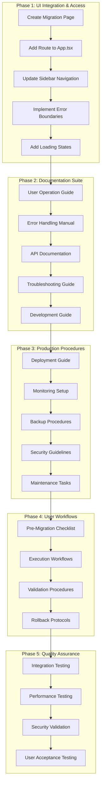
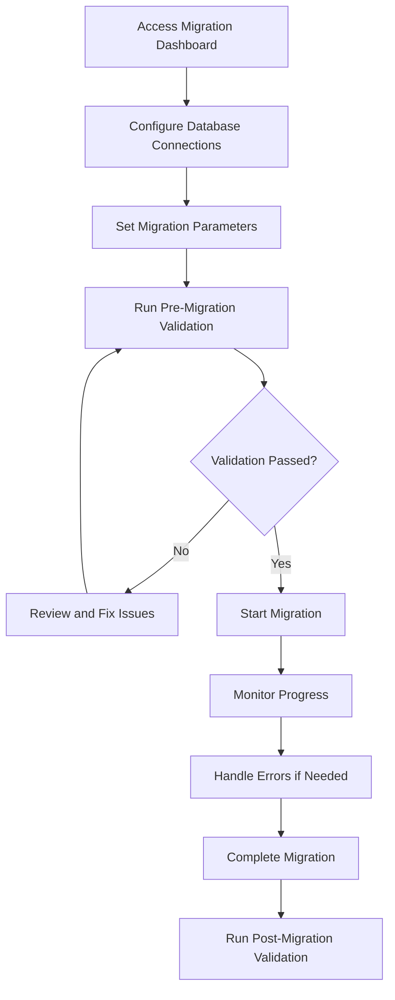
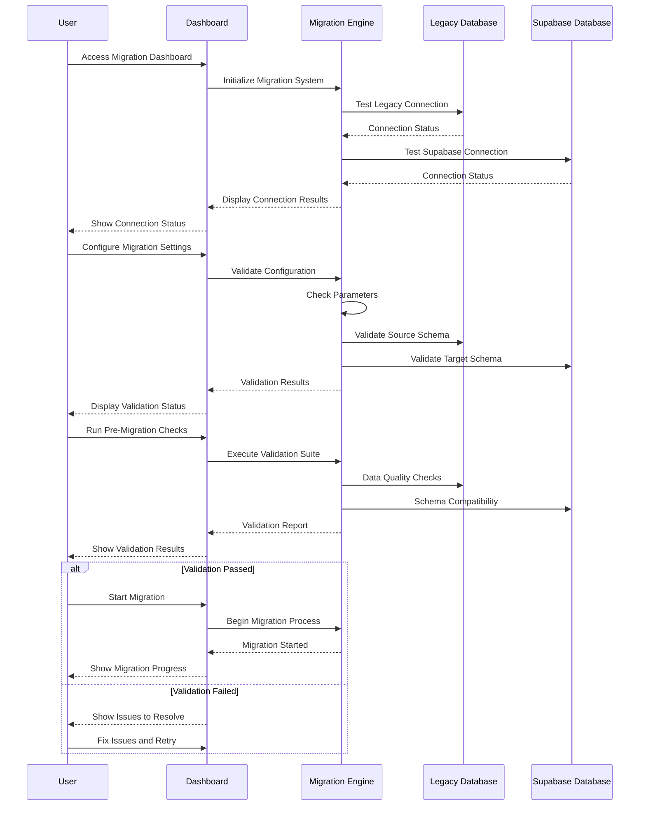

# Healthcare Data Migration System - Production Integration Plan

## Executive Summary

This document outlines the comprehensive implementation plan for transforming the existing healthcare data migration infrastructure into a fully integrated, production-ready system. The plan addresses UI integration, comprehensive documentation, operational procedures, user workflows, and quality assurance to create an enterprise-grade migration solution accessible to all authenticated users.

## Current State Assessment

### ✅ Existing Production-Ready Assets

**Migration Infrastructure:**
- **Migration Engine**: [`src/lib/migration-engine.ts`](src/lib/migration-engine.ts) - Robust core engine with error handling
- **Patient Deduplication**: [`src/lib/patient-deduplication.ts`](src/lib/patient-deduplication.ts) - Advanced deduplication algorithms
- **Legacy Database Connector**: [`src/lib/legacy-database.ts`](src/lib/legacy-database.ts) - Secure legacy system integration
- **Synchronization Service**: [`src/lib/synchronization-service.ts`](src/lib/synchronization-service.ts) - Real-time data sync

**UI Components:**
- **Migration Dashboard**: [`src/components/migration/migration-dashboard.tsx`](src/components/migration/migration-dashboard.tsx) - Real-time monitoring interface
- **Configuration Panel**: [`src/components/migration/migration-config-panel.tsx`](src/components/migration/migration-config-panel.tsx) - Database and parameter configuration
- **Status Monitor**: [`src/components/migration/migration-status-monitor.tsx`](src/components/migration/migration-status-monitor.tsx) - Performance and error monitoring

**State Management:**
- **Migration Store**: [`src/stores/migration-store.ts`](src/stores/migration-store.ts) - Zustand store with comprehensive state management
- **Custom Hooks**: [`src/hooks/use-migration.ts`](src/hooks/use-migration.ts) - Clean component-store interface

**Type System:**
- **Migration Types**: [`src/types/migration.ts`](src/types/migration.ts) - 800+ lines of comprehensive TypeScript definitions

**Testing Infrastructure:**
- **Test Suites**: [`src/tests/migration/migration-test-suite.ts`](src/tests/migration/migration-test-suite.ts) - Comprehensive testing framework
- **Mock Data**: [`src/tests/utils/mock-data-generator.ts`](src/tests/utils/mock-data-generator.ts) - Test data generation

**Documentation:**
- **Technical Specs**: [`docs/database/MDW_MIGRATION_SYNCHRONIZATION_PLAN.md`](docs/database/MDW_MIGRATION_SYNCHRONIZATION_PLAN.md) - Detailed technical architecture

### ❌ Critical Integration Gaps

1. **UI Integration**: Migration components not accessible through main application routing
2. **Navigation Access**: Missing migration menu item in sidebar navigation
3. **Route Configuration**: No migration routes in [`src/App.tsx`](src/App.tsx)
4. **User Documentation**: No end-user operation guides
5. **Error Handling Documentation**: Missing troubleshooting and resolution procedures
6. **Production Procedures**: No deployment, monitoring, or maintenance guides

## Implementation Architecture



## Detailed Implementation Plan

### Phase 1: UI Integration & Access Control

#### 1.1 Create Migration Page Component
**File**: `src/pages/portal/migration.tsx`

**Requirements:**
- Lazy-loaded React component wrapper
- Error boundary implementation for robust error handling
- Loading state management during component initialization
- Integration with existing portal layout structure

**Component Structure:**
```typescript
const MigrationPage = React.lazy(() => import('./migration'));

// Error boundary wrapper
// Loading state management
// Portal layout integration
```

#### 1.2 Update Application Routing
**File**: [`src/App.tsx`](src/App.tsx) (Lines 71-76)

**Current Routing:**
```typescript
<Route path="/portal" element={<PortalLayout />}>
  <Route index element={<HomePage />} />
  <Route path="assistant" element={<AssistantPage />} />
  <Route path="library" element={<LibraryPage />} />
  <Route path="reports" element={<ReportsPage />} />
</Route>
```

**Required Changes:**
- Add migration route: `<Route path="migration" element={<MigrationPage />} />`
- Implement lazy loading for performance optimization
- Add proper error handling and fallback components

#### 1.3 Update Navigation
**File**: [`src/components/portal/app-sidebar.tsx`](src/components/portal/app-sidebar.tsx) (Lines 27-52)

**Current Menu Items:**
```typescript
const menuItems = [
  { id: 'home', title: 'Home', icon: Home, url: '/portal' },
  { id: 'assistant', title: 'Assistant', icon: MessageSquare, url: '/portal/assistant' },
  { id: 'library', title: 'Library', icon: BookOpen, url: '/portal/library' },
  { id: 'reports', title: 'Reports', icon: BarChart3, url: '/portal/reports' },
];
```

**Required Addition:**
```typescript
{
  id: 'migration',
  title: 'Data Migration',
  icon: Database, // Import from lucide-react
  url: '/portal/migration',
}
```

#### 1.4 Access Control Implementation
**Requirements:**
- **Access Level**: All authenticated users (as specified)
- **Security**: Leverage existing [`ProtectedRoute`](src/pages/portal/index.tsx) component
- **Audit Logging**: Maintain comprehensive audit trails for migration activities
- **Session Management**: Proper session handling for long-running migrations

### Phase 2: Comprehensive Documentation Suite

#### 2.1 User Operation Guide
**File**: `docs/migration/user-guide.md`

**Content Structure:**


**Sections:**
1. **Getting Started**: Accessing the migration dashboard
2. **Database Configuration**: Setting up source and target connections
3. **Migration Parameters**: Configuring batch sizes, timeouts, and performance settings
4. **Pre-Migration Validation**: Running validation checks and resolving issues
5. **Migration Execution**: Step-by-step execution procedures
6. **Monitoring and Progress Tracking**: Understanding dashboard indicators
7. **Error Handling**: Identifying and resolving common issues
8. **Post-Migration Validation**: Verifying migration success

#### 2.2 Error Handling Manual
**File**: `docs/migration/error-handling.md`

**Error Categories:**

| Error Type | Common Causes | Resolution Steps | Escalation |
|------------|---------------|------------------|------------|
| **Connection Errors** | Network issues, invalid credentials, firewall blocks | Test connections, verify credentials, check network connectivity | Network team if persistent |
| **Data Validation Errors** | Invalid data formats, missing required fields, constraint violations | Review validation rules, clean source data, adjust mappings | Data team for complex validation issues |
| **Conflict Errors** | Concurrent modifications, duplicate keys, referential integrity | Apply conflict resolution strategy, review timing, check dependencies | Development team for complex conflicts |
| **Performance Issues** | Large datasets, insufficient resources, timeout errors | Adjust batch sizes, increase timeouts, optimize queries | Infrastructure team for resource issues |
| **Rollback Failures** | Incomplete transactions, dependency issues, data corruption | Manual data recovery, restore from backup, re-run specific batches | Database administrator for critical failures |

**Resolution Procedures:**
1. **Immediate Response**: Error identification and initial assessment
2. **Diagnostic Steps**: Gathering relevant information and logs
3. **Resolution Actions**: Step-by-step resolution procedures
4. **Verification**: Confirming resolution and preventing recurrence
5. **Documentation**: Recording resolution for future reference

#### 2.3 API Documentation
**File**: `docs/migration/api-reference.md`

**Content:**
1. **Migration Engine API**: Core migration functions and parameters
2. **Hook Usage Examples**: Proper implementation of custom hooks
3. **Store Interaction Patterns**: Best practices for state management
4. **Integration Examples**: Sample code for common integration scenarios
5. **Error Handling Patterns**: Proper error handling implementation
6. **Performance Optimization**: Tips for optimal performance

#### 2.4 Troubleshooting Guide
**File**: `docs/migration/troubleshooting.md`

**Common Issues:**
1. **Connection Problems**: Database connectivity, authentication, network issues
2. **Performance Degradation**: Slow migration, resource constraints, optimization
3. **Data Validation Failures**: Format issues, constraint violations, mapping errors
4. **Synchronization Issues**: Real-time sync problems, conflict resolution
5. **UI Responsiveness**: Dashboard performance, real-time updates, browser issues

### Phase 3: Production Procedures

#### 3.1 Deployment Guide
**File**: `docs/migration/deployment.md`

**Deployment Checklist:**
1. **Environment Setup**: Production environment configuration
2. **Database Preparation**: Schema setup, permissions, connection pooling
3. **Security Configuration**: Encryption, access controls, audit logging
4. **Performance Tuning**: Resource allocation, optimization settings
5. **Monitoring Setup**: Dashboard configuration, alerting, logging
6. **Backup Procedures**: Pre-deployment backup, recovery planning
7. **Rollback Plan**: Rollback procedures and contingency planning

#### 3.2 Monitoring Setup
**File**: `docs/migration/monitoring.md`

**Monitoring Components:**
1. **Real-time Dashboard**: Migration progress, performance metrics, error tracking
2. **Alert Configuration**: Critical error alerts, performance thresholds, escalation
3. **Performance Metrics**: Throughput, latency, resource utilization
4. **Health Checks**: System health, connectivity, service availability
5. **Audit Logging**: Comprehensive activity logging, compliance tracking

#### 3.3 Backup and Recovery Procedures
**File**: `docs/migration/backup-recovery.md`

**Backup Strategy:**
1. **Pre-Migration Backup**: Complete database backup before migration
2. **Incremental Backups**: Regular backups during migration process
3. **Point-in-Time Recovery**: Ability to restore to specific migration points
4. **Rollback Procedures**: Safe rollback to previous state
5. **Data Integrity Verification**: Backup validation and integrity checks

### Phase 4: User Workflows

#### 4.1 Pre-Migration Workflow



#### 4.2 Migration Execution Workflow

**Execution Steps:**
1. **Initialization**: System startup and connection verification
2. **Configuration**: Parameter setup and validation
3. **Pre-Migration Checks**: Data validation and compatibility verification
4. **Migration Start**: Begin data transfer process
5. **Progress Monitoring**: Real-time progress tracking and error monitoring
6. **Error Handling**: Automatic error detection and resolution guidance
7. **Completion Verification**: Post-migration validation and reporting

#### 4.3 Error Resolution Workflow

**Error Handling Process:**
1. **Error Detection**: Automatic error identification and classification
2. **User Notification**: Clear error messages with resolution guidance
3. **Resolution Actions**: Step-by-step resolution procedures
4. **Verification**: Confirmation of error resolution
5. **Migration Resume**: Continuation of migration process
6. **Documentation**: Error logging and resolution tracking

### Phase 5: Quality Assurance

#### 5.1 Testing Strategy

**Integration Testing:**
- Component integration with existing portal
- Navigation flow testing
- Error boundary functionality
- State management integration

**Performance Testing:**
- Large dataset migration performance
- Real-time update responsiveness
- Memory usage optimization
- Concurrent user handling

**Security Testing:**
- Access control validation
- Data encryption verification
- Audit logging functionality
- Input validation testing

#### 5.2 User Acceptance Testing

**Test Scenarios:**
1. **Complete Migration Workflow**: End-to-end migration process
2. **Error Handling**: Various error scenarios and resolution
3. **Performance Under Load**: Large dataset migration
4. **User Interface**: Dashboard usability and responsiveness
5. **Documentation Accuracy**: Verification of user guides and procedures

## File Structure Plan

```
src/
├── pages/portal/
│   └── migration.tsx                 # 🆕 New migration page
├── components/migration/             # ✅ Existing components
│   ├── migration-dashboard.tsx       # ✅ Already exists
│   ├── migration-config-panel.tsx    # ✅ Already exists
│   └── migration-status-monitor.tsx  # ✅ Already exists
├── stores/
│   └── migration-store.ts            # ✅ Already exists
├── hooks/
│   └── use-migration.ts              # ✅ Already exists
└── types/
    └── migration.ts                  # ✅ Already exists

docs/migration/                       # 🆕 New documentation
├── user-guide.md                     # 🆕 User operation guide
├── error-handling.md                 # 🆕 Error handling manual
├── api-reference.md                  # 🆕 API documentation
├── troubleshooting.md                # 🆕 Troubleshooting guide
├── deployment.md                     # 🆕 Deployment procedures
├── monitoring.md                     # 🆕 Monitoring setup
├── backup-recovery.md                # 🆕 Backup procedures
└── development-guide.md              # 🆕 Development guide
```

## Implementation Tasks

### Phase 1: UI Integration (Week 1)
- [ ] **Create Migration Page Component**
  - Implement lazy-loaded wrapper component
  - Add error boundary for robust error handling
  - Integrate with existing portal layout
  - Add loading states and transitions

- [ ] **Update Application Routing**
  - Add migration route to [`src/App.tsx`](src/App.tsx)
  - Implement lazy loading for performance
  - Add proper error handling and fallbacks
  - Test route navigation and component loading

- [ ] **Update Sidebar Navigation**
  - Add migration menu item to [`src/components/portal/app-sidebar.tsx`](src/components/portal/app-sidebar.tsx)
  - Import and configure Database icon from lucide-react
  - Position appropriately in navigation hierarchy
  - Test navigation flow and active state handling

- [ ] **Implement Access Control**
  - Configure access for all authenticated users
  - Leverage existing ProtectedRoute component
  - Add audit logging for migration activities
  - Test authentication and authorization flow

### Phase 2: Documentation Suite (Week 2-3)
- [ ] **User Operation Guide** (`docs/migration/user-guide.md`)
  - Step-by-step migration procedures with screenshots
  - Database configuration instructions
  - Parameter setup and validation guidance
  - Progress monitoring and status interpretation

- [ ] **Error Handling Manual** (`docs/migration/error-handling.md`)
  - Comprehensive error code reference
  - Resolution procedures for each error type
  - Escalation protocols and contact information
  - Recovery strategies and rollback procedures

- [ ] **API Documentation** (`docs/migration/api-reference.md`)
  - Migration engine API reference
  - Hook usage examples and best practices
  - Store interaction patterns
  - Integration code samples

- [ ] **Troubleshooting Guide** (`docs/migration/troubleshooting.md`)
  - Common issues and solutions
  - Performance optimization guidelines
  - Connection problem resolution
  - Data validation failure handling

- [ ] **Development Guide** (`docs/migration/development-guide.md`)
  - Architecture overview for developers
  - Component structure and relationships
  - State management patterns
  - Testing procedures and guidelines

### Phase 3: Production Procedures (Week 4)
- [ ] **Deployment Guide** (`docs/migration/deployment.md`)
  - Environment setup and configuration
  - Database preparation procedures
  - Security configuration guidelines
  - Performance tuning recommendations

- [ ] **Monitoring Setup** (`docs/migration/monitoring.md`)
  - Dashboard configuration instructions
  - Alert setup and threshold configuration
  - Performance metrics tracking
  - Health check implementation

- [ ] **Backup and Recovery** (`docs/migration/backup-recovery.md`)
  - Pre-migration backup procedures
  - Incremental backup strategies
  - Recovery and rollback procedures
  - Data integrity verification methods

### Phase 4: User Workflows (Week 5)
- [ ] **Pre-Migration Checklist**
  - Database connection verification
  - Configuration parameter validation
  - Data quality assessment
  - System readiness confirmation

- [ ] **Execution Workflows**
  - Step-by-step migration execution
  - Progress monitoring procedures
  - Error handling during migration
  - Completion verification steps

- [ ] **Validation Procedures**
  - Post-migration data validation
  - Integrity check procedures
  - Performance verification
  - User acceptance testing

- [ ] **Rollback Protocols**
  - Rollback decision criteria
  - Safe rollback procedures
  - Data recovery methods
  - System restoration steps

### Phase 5: Quality Assurance (Week 6)
- [ ] **Integration Testing**
  - Component integration with portal
  - Navigation flow testing
  - Error boundary functionality
  - State management integration

- [ ] **Performance Testing**
  - Large dataset migration testing
  - Real-time update performance
  - Memory usage optimization
  - Concurrent user handling

- [ ] **Security Validation**
  - Access control testing
  - Data encryption verification
  - Audit logging validation
  - Input sanitization testing

- [ ] **User Acceptance Testing**
  - End-to-end workflow testing
  - Error scenario testing
  - Documentation accuracy verification
  - Usability testing with stakeholders

## Success Criteria

### Technical Integration
- ✅ Migration dashboard accessible via `/portal/migration`
- ✅ All components render correctly with proper error handling
- ✅ Real-time updates function reliably without performance issues
- ✅ Navigation integrates seamlessly with existing portal structure
- ✅ Error boundaries prevent application crashes
- ✅ Loading states provide clear user feedback

### Documentation Completeness
- ✅ Complete user operation guide with step-by-step procedures
- ✅ Comprehensive error handling documentation with resolution steps
- ✅ Production-ready deployment and operational procedures
- ✅ Developer-friendly API documentation with examples
- ✅ Troubleshooting guide covering common scenarios
- ✅ Backup and recovery procedures for data protection

### Production Readiness
- ✅ Robust error handling and recovery procedures
- ✅ Comprehensive monitoring and alerting capabilities
- ✅ Secure configuration and access control implementation
- ✅ Scalable architecture suitable for enterprise use
- ✅ Performance optimization for large datasets
- ✅ Audit logging for compliance and tracking

### User Experience
- ✅ Intuitive navigation and workflow design
- ✅ Clear status indicators and progress tracking
- ✅ Actionable error messages with resolution guidance
- ✅ Comprehensive help documentation and support
- ✅ Responsive design for various screen sizes
- ✅ Accessibility compliance for inclusive use

## Risk Mitigation

### Technical Risks
- **Component Integration Issues**: Comprehensive testing and error boundaries
- **Performance Impact**: Lazy loading, optimization, and performance monitoring
- **State Management Conflicts**: Isolated migration store with custom hooks
- **Memory Leaks**: Proper cleanup and resource management
- **Browser Compatibility**: Cross-browser testing and polyfills

### Operational Risks
- **Data Loss**: Comprehensive backup and rollback procedures
- **Security Vulnerabilities**: Security validation and access controls
- **User Training**: Detailed documentation and user guides
- **System Downtime**: Monitoring, alerting, and rapid response procedures
- **Compliance Issues**: Audit logging and compliance documentation

### Business Risks
- **Migration Failures**: Robust error handling and recovery procedures
- **Performance Degradation**: Performance testing and optimization
- **User Adoption**: Intuitive design and comprehensive training
- **Maintenance Overhead**: Clear documentation and automated processes

## Timeline & Milestones

### Week 1: UI Integration Foundation
- **Day 1-2**: Create migration page component and routing
- **Day 3-4**: Update navigation and implement access control
- **Day 5**: Integration testing and bug fixes

### Week 2-3: Documentation Development
- **Week 2**: User guides and error handling documentation
- **Week 3**: API documentation and troubleshooting guides

### Week 4: Production Procedures
- **Day 1-2**: Deployment and monitoring documentation
- **Day 3-4**: Backup and security procedures
- **Day 5**: Review and validation of procedures

### Week 5: User Workflows
- **Day 1-2**: Pre-migration and execution workflows
- **Day 3-4**: Validation and rollback procedures
- **Day 5**: Workflow testing and refinement

### Week 6: Quality Assurance
- **Day 1-2**: Integration and performance testing
- **Day 3-4**: Security validation and user acceptance testing
- **Day 5**: Final testing and bug fixes

### Week 7: Production Deployment
- **Day 1-2**: Final preparations and staging deployment
- **Day 3-4**: Production deployment and monitoring
- **Day 5**: Post-deployment validation and documentation updates

## Conclusion

This comprehensive implementation plan transforms the existing healthcare data migration infrastructure into a production-ready system with enterprise-grade reliability, comprehensive documentation, and robust operational procedures. The phased approach ensures systematic development while maintaining system stability and user experience quality.

The plan addresses all critical gaps identified in the current system while leveraging the substantial existing infrastructure. Upon completion, the system will provide a fully integrated, well-documented, and operationally sound migration solution suitable for healthcare data migration requirements.

---

**Document Version**: 1.0  
**Last Updated**: January 29, 2025  
**Next Review**: Upon completion of Phase 1  
**Stakeholders**: Development Team, Operations Team, End Users