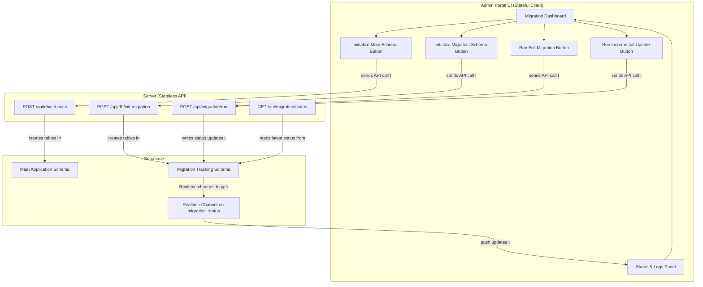

# Interactive Migration Architecture & Plan

## 1. Executive Summary

This document outlines the architecture for a simplified, yet powerful, data migration system that is controlled and monitored directly from the administration portal. This plan revises the previous script-based approach to incorporate essential admin-facing features, such as UI-driven initialization, incremental updates, and real-time status monitoring via Supabase.

The core principle is to provide administrators with full control over the data lifecycle, from initial schema setup to ongoing data synchronization, without the need for manual database intervention or complex, stateful backend services.

## 2. Core Architectural Changes

Based on the updated requirements, we will implement the following:

-   **Admin-Only System**: The target application is for internal administrators only. All patient-facing user roles, permissions, and Row-Level Security (RLS) policies will be removed from the database schema.
-   **UI-Driven Control**: The portal will be the central hub for all migration activities, including initializing the database schemas, running full or incremental migrations, and monitoring progress.
-   **Stateless Server, Stateful Client**: The server API will remain stateless. The React application will manage the UI state, driven by real-time data from Supabase.
-   **Supabase Realtime for Status Updates**: Custom WebSockets will be eliminated. The server's migration process will write its status to a dedicated Supabase table. The frontend will subscribe to this table for live UI updates.
-   **Incremental Updates**: The system will support an "Incremental" migration type that identifies and transfers only new records from the legacy database, making regular syncs efficient.

### Revised Workflow Diagram

## 3. Detailed Execution Plan

### Phase 1: Server and Database Refactoring

1.  **Decommission Old System**:
    -   **Delete Obsolete Services**: Remove `PersistentMigrationService`, `JobQueueService`, `RedisService`, `WebSocketService`, and `SocketService`.
    -   **Delete Obsolete Components**: Remove the `PersistentMigrationWorker`, `persistent-migration-controller.ts`, `persistent-migration-routes.ts`, and all related types.
    -   **Clean Dependencies**: Remove `bullmq`, `redis`, `socket.io`, and other unused packages from `server/package.json`.

2.  **Create New SQL Initialization Scripts**:
    -   **[`server/migrations/001_main_schema.sql`]**: This file will contain the complete SQL to create all core application tables (`practices`, `cases`, `orders`, etc.). It will be **modified** to remove the `role` column from the `profiles` table and eliminate patient-specific RLS policies.
    -   **[`server/migrations/002_migration_tracking_schema.sql`]**: A new, simplified schema for tracking migrations. It will contain just two tables:
        -   `migration_runs`: A log of every migration attempt (full or incremental) with a `type`, `status`, `start_time`, `end_time`, and `log` (JSONB) field.
        -   `migration_status`: **A single-row table** to hold the live status of the *active* migration (`current_step`, `progress_percentage`, `details`). The UI will subscribe to this table for updates.

3.  **Implement New Stateless Server Endpoints**:
    -   **`db.controller.ts` & `db.routes.ts`**:
        -   `POST /api/db/init-main`: Executes the `001_main_schema.sql` script.
        -   `POST /api/db/init-migration`: Executes the `002_migration_tracking_schema.sql` script.
    -   **`migration.controller.ts` & `migration.routes.ts`**:
        -   `POST /api/migration/run`: Receives `{ type: 'full' | 'incremental' }`. **Does not `await`**. Manages a simple in-memory flag to prevent concurrent runs and returns `202 Accepted` immediately.
        -   `GET /api/migration/status`: Reads the latest run from the `migration_runs` table.

4.  **Rewrite `migration.service.ts`**:
    -   Contains the core migration logic in a single `runMigration(type)` method.
    -   **Status Reporting**: At the start and end of each logical step (e.g., "Migrating Users," "Migrating Patients"), the service will `UPDATE` the single row in the `migration_status` table.
    -   **Incremental Logic**: For 'incremental' runs, it will first query `migration_runs` to get the timestamp of the last successful run, then fetch only newer records from the legacy DB.
    -   **Logging**: Upon completion (success or failure), it will create a new record in the `migration_runs` table with a full operational log.

### Phase 2: Frontend Implementation (in `/src`)

1.  **Create `use-migration-store.ts` (Zustand)**:
    -   Manages client-side state: `isMigrationRunning`, `progress`, `statusMessage`, `logHistory`, etc.
    -   Provides actions for the UI to call API endpoints: `initializeDatabase()`, `runFullMigration()`, `runIncrementalUpdate()`, etc.

2.  **Integrate Supabase Realtime**:
    -   In the main migration dashboard component, establish a subscription to the single-row `migration_status` table.
    -   The `on` event handler will call an action in the Zustand store to update the client state with the new progress/status message from the database.

3.  **Build Migration Dashboard UI (`/pages/portal/migration.tsx`)**:
    -   **Schema Initialization Panel**: Checks if `migration_runs` and `cases` tables exist and enables "Initialize" buttons accordingly.
    -   **Migration Control Panel**: Provides "Run Full Migration" and "Run Incremental Update" buttons, disabled if `isMigrationRunning` is true.
    -   **Live Status Panel**: Displays `statusMessage`, a progress bar bound to `progress`, and a log view that appends status messages as they arrive via the Realtime subscription.

### Phase 3: Documentation & Testing

1.  **Update Core Schema Document**:
    -   Edit [`docs/database/AI_READY_MDW_SCHEMA_DESIGN.md`] to reflect the admin-only changes (remove patient `role`, remove patient-specific RLS).
    -   Update the "Migration Strategy" section to link to this `interactive-migration-plan.md` document.

2.  **Testing the Data Load**:
    -   The primary testing method will be to use the newly created UI as a test harness.
    -   The test flow will be:
        1.  Click "Initialize Main Schema".
        2.  Click "Initialize Migration Schema".
        3.  Click "Run Full Migration".
        4.  Monitor the live status panel for progress and successful completion.
        5.  Verify data integrity using Supabase Studio.