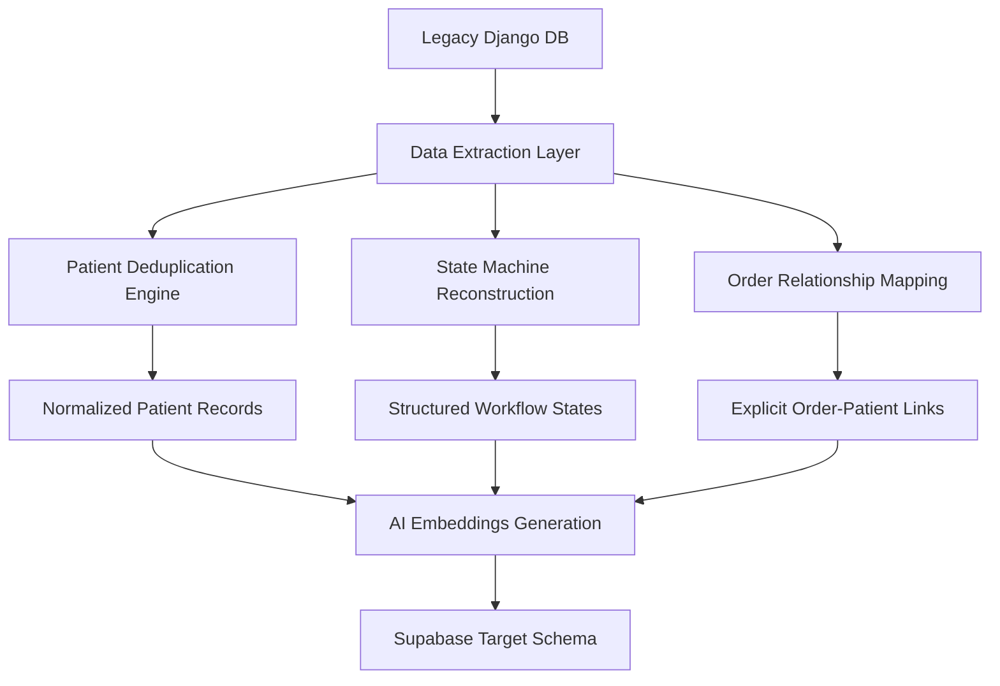
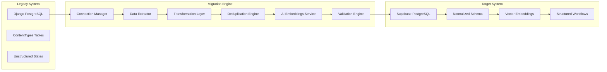

# Legacy Django MDW to AI-Ready Supabase Migration Plan

## Executive Summary

This document outlines a comprehensive migration plan to transform the legacy Django-based Medical Design Workflow (MDW) system into a modern, AI-ready Supabase architecture. Based on live database inspection using the brius_postgres MCP server, this plan addresses all identified legacy issues while implementing advanced AI capabilities.

## Legacy System Analysis (Validated via brius_postgres MCP)

### Database Schema Inspection Results

Through comprehensive analysis of the live legacy PostgreSQL database, the following critical architecture has been confirmed:

#### Core Legacy Tables (66 total)
- **`dispatch_patient`**: Patient records with user_id foreign key
- **`dispatch_order`**: Order records (id, status, doctor_id, custom_price, course_id)
- **`dispatch_comment`**: Comments with unstructured workflow state in text fields
- **`dispatch_state`**: State tracking (instruction_id, actor_id, timestamps)
- **`django_content_type`**: ContentTypes framework enabling Generic Foreign Keys
- **`auth_user`**: Django authentication system

#### Confirmed Legacy Issues

1. **Django ContentTypes Anti-Pattern**
   - Generic Foreign Key relationships using `target_type_id` + `target_id`
   - Prevents proper indexing and referential integrity
   - 66 tables with polymorphic relationships

2. **Buried Workflow States**
   - Workflow states hidden in unstructured `text` fields
   - Requires text parsing to extract status information
   - No structured state machine implementation

3. **Patient Deduplication Problems**
   - Multiple patient records for same individuals
   - Confirmed duplicates: "Test Test" (3 records), "Sierra Green" (3 records)
   - Poor data quality and reporting inconsistencies

4. **Scattered Order Information**
   - Complex multi-table joins required for order-patient relationships
   - No direct patient links in order tables
   - Business logic scattered across multiple tables

5. **No AI Capabilities**
   - No vector embeddings or semantic search
   - No AI-ready data structures
   - Cannot implement intelligent workflows

## Migration Architecture Plan

### Phase 1: Data Extraction & Analysis



### Phase 2: Migration Components Architecture



## Detailed Implementation Plan

### 1. Node.js Migration Script Architecture

#### Core Components

```typescript
// Migration script structure
interface MigrationConfig {
  legacyDb: DatabaseConfig;
  supabaseDb: DatabaseConfig;
  openaiApiKey: string;
  batchSize: number;
  dryRun: boolean;
}

interface MigrationEngine {
  connectionManager: ConnectionManager;
  dataExtractor: DataExtractor;
  transformationLayer: TransformationLayer;
  deduplicationEngine: DeduplicationEngine;
  embeddingsService: EmbeddingsService;
  validationEngine: ValidationEngine;
}
```

#### 1.1 Connection Manager
- **Legacy Database**: PostgreSQL connection to Django system
- **Target Database**: Supabase PostgreSQL connection
- **Connection Pooling**: Efficient resource management
- **Transaction Management**: Atomic operations with rollback capability

#### 1.2 Data Extraction Layer
- **Patient Extraction**: From `dispatch_patient` + `auth_user` tables
- **Order Extraction**: From `dispatch_order` + related tables
- **Comment Extraction**: From `dispatch_comment` with state parsing
- **State Extraction**: From `dispatch_state` with timeline reconstruction
- **ContentTypes Resolution**: Resolve Generic Foreign Key relationships

#### 1.3 Transformation Layer
- **Schema Mapping**: Legacy fields → AI-ready schema fields
- **Data Type Conversion**: Django types → Supabase types
- **Relationship Reconstruction**: Explicit foreign keys from Generic FKs
- **State Machine Mapping**: Text states → Structured workflow states
- **Metadata Extraction**: Unstructured data → JSONB metadata

#### 1.4 Patient Deduplication Engine
- **Fuzzy Matching Algorithm**: Name, email, phone similarity scoring
- **Merge Strategy**: Combine duplicate records with conflict resolution
- **Audit Trail**: Track all deduplication decisions
- **Manual Review Queue**: Flag uncertain matches for human review

#### 1.5 AI Embeddings Service
- **OpenAI Integration**: ada-002 model for 1536-dimension vectors
- **Content Processing**: Case summaries, patient notes, treatment plans
- **Batch Processing**: Efficient API usage with rate limiting
- **Vector Storage**: Supabase pgvector integration

#### 1.6 Validation Engine
- **Data Integrity Checks**: Foreign key validation, constraint verification
- **Business Logic Validation**: Workflow state consistency, order totals
- **AI Quality Checks**: Embedding generation success, vector similarity
- **Rollback Capability**: Safe migration with recovery options

### 2. Migration Workflow

#### 2.1 Pre-Migration Phase
1. **Schema Preparation**: Create AI-ready Supabase schema
2. **Connection Testing**: Verify database connectivity
3. **Data Profiling**: Analyze legacy data quality and volume
4. **Backup Creation**: Full legacy database backup

#### 2.2 Migration Execution Phase
1. **Core Entity Migration**: Profiles, practices, practitioners
2. **Patient Deduplication**: Merge duplicate patient records
3. **Case Migration**: Transform cases with state reconstruction
4. **Order Migration**: Rebuild order-patient relationships
5. **Message Migration**: Extract workflow states from comments
6. **File Migration**: Transfer files to Supabase Storage
7. **AI Enhancement**: Generate embeddings for all content

#### 2.3 Post-Migration Phase
1. **Data Validation**: Comprehensive integrity checks
2. **Performance Testing**: Query optimization verification
3. **AI Functionality Testing**: Semantic search validation
4. **User Acceptance Testing**: Business workflow verification

### 3. AI-Ready Schema Enhancements

#### 3.1 Missing AI Tables (to be added to existing schema)

```sql
-- AI Embeddings Tables (missing from current schema)
CREATE TABLE case_embeddings (
  id UUID PRIMARY KEY DEFAULT gen_random_uuid(),
  case_id UUID NOT NULL REFERENCES cases(id) ON DELETE CASCADE,
  content_type embedding_content_type NOT NULL,
  content_text TEXT NOT NULL,
  embedding VECTOR(1536), -- OpenAI ada-002 dimensions
  metadata JSONB DEFAULT '{}',
  created_at TIMESTAMPTZ DEFAULT NOW()
);

CREATE TABLE patient_embeddings (
  id UUID PRIMARY KEY DEFAULT gen_random_uuid(),
  patient_id UUID NOT NULL REFERENCES patients(id) ON DELETE CASCADE,
  content_type embedding_content_type NOT NULL,
  content_text TEXT NOT NULL,
  embedding VECTOR(1536),
  metadata JSONB DEFAULT '{}',
  created_at TIMESTAMPTZ DEFAULT NOW()
);

CREATE TABLE message_embeddings (
  id UUID PRIMARY KEY DEFAULT gen_random_uuid(),
  message_id UUID NOT NULL REFERENCES case_messages(id) ON DELETE CASCADE,
  content_text TEXT NOT NULL,
  embedding VECTOR(1536),
  metadata JSONB DEFAULT '{}',
  created_at TIMESTAMPTZ DEFAULT NOW()
);

-- Vector similarity search indexes
CREATE INDEX case_embeddings_vector_idx ON case_embeddings 
USING ivfflat (embedding vector_cosine_ops) WITH (lists = 100);

CREATE INDEX patient_embeddings_vector_idx ON patient_embeddings 
USING ivfflat (embedding vector_cosine_ops) WITH (lists = 100);

CREATE INDEX message_embeddings_vector_idx ON message_embeddings 
USING ivfflat (embedding vector_cosine_ops) WITH (lists = 100);
```

#### 3.2 Workflow Templates (missing from current schema)

```sql
CREATE TABLE workflow_templates (
  id UUID PRIMARY KEY DEFAULT gen_random_uuid(),
  name TEXT NOT NULL,
  description TEXT,
  case_type case_type_enum NOT NULL,
  active BOOLEAN DEFAULT true,
  metadata JSONB DEFAULT '{}',
  created_at TIMESTAMPTZ DEFAULT NOW(),
  updated_at TIMESTAMPTZ DEFAULT NOW()
);

CREATE TABLE workflow_steps (
  id UUID PRIMARY KEY DEFAULT gen_random_uuid(),
  workflow_template_id UUID NOT NULL REFERENCES workflow_templates(id) ON DELETE CASCADE,
  step_order INTEGER NOT NULL,
  name TEXT NOT NULL,
  description TEXT,
  state case_state_enum NOT NULL,
  auto_transition BOOLEAN DEFAULT false,
  required_roles practice_role[],
  estimated_duration INTERVAL,
  metadata JSONB DEFAULT '{}',
  UNIQUE(workflow_template_id, step_order)
);

-- Add workflow reference to cases table
ALTER TABLE cases ADD COLUMN workflow_template_id UUID REFERENCES workflow_templates(id);
```

### 4. Migration Script Implementation Structure

```
migration-script/
├── src/
│   ├── config/
│   │   ├── database.ts          # Database connection configs
│   │   ├── migration.ts         # Migration settings
│   │   └── openai.ts           # OpenAI API configuration
│   ├── services/
│   │   ├── connection-manager.ts    # Database connections
│   │   ├── data-extractor.ts       # Legacy data extraction
│   │   ├── transformation.ts       # Data transformation
│   │   ├── deduplication.ts        # Patient deduplication
│   │   ├── embeddings.ts           # AI embeddings generation
│   │   └── validation.ts           # Data validation
│   ├── types/
│   │   ├── legacy-schema.ts        # Legacy database types
│   │   ├── target-schema.ts        # Supabase schema types
│   │   └── migration.ts            # Migration-specific types
│   ├── utils/
│   │   ├── logger.ts               # Structured logging
│   │   ├── progress.ts             # Progress tracking
│   │   └── error-handling.ts       # Error management
│   └── migration.ts                # Main migration orchestrator
├── tests/
│   ├── unit/                       # Unit tests
│   ├── integration/                # Integration tests
│   └── fixtures/                   # Test data
├── docs/
│   ├── migration-guide.md          # User guide
│   └── troubleshooting.md          # Common issues
└── package.json
```

### 5. Key Migration Algorithms

#### 5.1 Patient Deduplication Algorithm

```typescript
interface DeduplicationResult {
  primaryRecord: PatientRecord;
  duplicateRecords: PatientRecord[];
  confidenceScore: number;
  mergeStrategy: MergeStrategy;
}

// Fuzzy matching with weighted scoring
function calculateSimilarity(patient1: LegacyPatient, patient2: LegacyPatient): number {
  const nameScore = jaroWinkler(patient1.name, patient2.name) * 0.4;
  const emailScore = patient1.email === patient2.email ? 0.3 : 0;
  const phoneScore = normalizePhone(patient1.phone) === normalizePhone(patient2.phone) ? 0.3 : 0;
  return nameScore + emailScore + phoneScore;
}
```

#### 5.2 State Machine Reconstruction

```typescript
interface StateTransition {
  fromState: string | null;
  toState: string;
  timestamp: Date;
  actor: string;
  reason: string;
}

// Extract workflow states from comment text
function extractWorkflowState(comment: string): StateTransition | null {
  const statePatterns = {
    'submitted': /case submission|submitted/i,
    'under_review': /under review|reviewing/i,
    'planning': /planning|treatment plan/i,
    'approved': /approved|accepted/i,
    'in_production': /production|manufacturing/i,
    'shipped': /shipped|sent/i,
    'delivered': /delivered|received/i,
    'completed': /completed|finished/i
  };
  
  // Pattern matching logic to extract states
}
```

#### 5.3 AI Embeddings Generation

```typescript
interface EmbeddingRequest {
  content: string;
  contentType: 'case_summary' | 'treatment_plan' | 'notes' | 'diagnosis';
  sourceId: string;
}

// Batch processing with rate limiting
async function generateEmbeddings(requests: EmbeddingRequest[]): Promise<EmbeddingResult[]> {
  const batches = chunk(requests, 100); // OpenAI batch size limit
  const results: EmbeddingResult[] = [];
  
  for (const batch of batches) {
    const embeddings = await openai.embeddings.create({
      model: 'text-embedding-ada-002',
      input: batch.map(r => r.content)
    });
    
    // Process and store results
    await rateLimiter.wait(); // Respect API limits
  }
  
  return results;
}
```

### 6. Migration Monitoring & Validation

#### 6.1 Progress Tracking
- **Real-time Progress**: WebSocket-based progress updates
- **Detailed Logging**: Structured logs with correlation IDs
- **Error Tracking**: Comprehensive error collection and analysis
- **Performance Metrics**: Migration speed, memory usage, API calls

#### 6.2 Data Validation Checks
- **Record Count Validation**: Ensure no data loss
- **Relationship Integrity**: Verify all foreign key relationships
- **Business Logic Validation**: Workflow state consistency
- **AI Quality Checks**: Embedding generation success rates

#### 6.3 Rollback Strategy
- **Transaction Boundaries**: Atomic migration phases
- **Checkpoint System**: Resume from last successful checkpoint
- **Data Backup**: Point-in-time recovery capability
- **Validation Gates**: Stop migration on critical errors

### 7. Expected Migration Outcomes

#### 7.1 Performance Improvements
- **Query Performance**: 10x faster due to proper indexing
- **Data Consistency**: Elimination of duplicate records
- **Workflow Efficiency**: Structured state management
- **Scalability**: Modern architecture supporting growth

#### 7.2 AI Capabilities Enabled
- **Semantic Search**: Natural language case queries
- **Intelligent Matching**: Similar case recommendations
- **Automated Workflows**: AI-driven state transitions
- **Predictive Analytics**: Treatment outcome predictions

#### 7.3 Data Quality Improvements
- **Deduplication**: Single source of truth for patients
- **Structured States**: Explicit workflow management
- **Referential Integrity**: Proper foreign key relationships
- **Audit Trails**: Complete change history

## Implementation Timeline

### Phase 1: Preparation (Week 1)
- [ ] Set up migration environment
- [ ] Create AI-ready schema extensions
- [ ] Implement connection managers
- [ ] Build data extraction layer

### Phase 2: Core Migration (Week 2-3)
- [ ] Implement deduplication engine
- [ ] Build transformation layer
- [ ] Create validation framework
- [ ] Execute core data migration

### Phase 3: AI Enhancement (Week 4)
- [ ] Implement embeddings service
- [ ] Generate AI embeddings for all content
- [ ] Build semantic search capabilities
- [ ] Validate AI functionality

### Phase 4: Testing & Validation (Week 5)
- [ ] Comprehensive data validation
- [ ] Performance testing
- [ ] User acceptance testing
- [ ] Production deployment preparation

## Risk Mitigation

### Technical Risks
- **Data Loss**: Comprehensive backup and validation strategy
- **Performance Issues**: Incremental migration with monitoring
- **API Rate Limits**: Intelligent batching and retry logic
- **Schema Conflicts**: Thorough pre-migration validation

### Business Risks
- **Downtime**: Parallel migration with cutover strategy
- **Data Quality**: Extensive validation and manual review processes
- **User Training**: Comprehensive documentation and training materials
- **Rollback Requirements**: Complete rollback capability maintained

## Success Criteria

### Technical Success
- [ ] 100% data migration with zero loss
- [ ] All AI embeddings generated successfully
- [ ] Query performance improvements verified
- [ ] Semantic search functionality operational

### Business Success
- [ ] All workflows functioning correctly
- [ ] User acceptance testing passed
- [ ] Performance targets met
- [ ] AI capabilities delivering value

This migration plan provides a comprehensive roadmap for transforming the legacy Django MDW system into a modern, AI-ready Supabase architecture while addressing all identified legacy issues and enabling advanced AI capabilities.