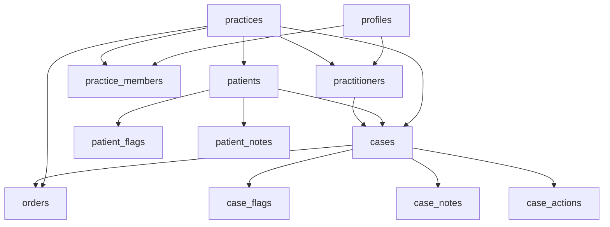

# Migration Loading Order Architecture Plan

## Problem Analysis

### Current Issue
The migration tool currently loads data in this order:
1. Practices ✅ (correct)
2. Profiles ✅ (correct - but incomplete understanding)
3. Patients ❌ (depends on practices, but may load before practices are fully committed)

### Root Cause Discovery
Through schema analysis, I discovered the complete dependency chain that was causing failures:

**Critical Missing Dependency**: `practitioners` table depends on BOTH `practices` AND `profiles`:
```sql
-- From create-complete-schema.sql line 228
CREATE TABLE IF NOT EXISTS practitioners (
  id UUID PRIMARY KEY DEFAULT gen_random_uuid(),
  -- ... other fields
  practice_id UUID NOT NULL REFERENCES practices(id) ON DELETE CASCADE,
  profile_id UUID NOT NULL REFERENCES profiles(id) ON DELETE CASCADE
);
```

**Additional Dependencies Found**:
- `practice_members` table has: `UNIQUE(practice_id, profile_id)` - requires both practices and profiles
- `cases` table has: `assigned_practitioner_id UUID REFERENCES practitioners(id)` - requires practitioners

## Complete Database Dependency Chain



## Corrected Loading Order Architecture

### Phase 1: Foundation Tables (No Dependencies)
- **Tables**: `practices`, `profiles`
- **Loading**: Sequential (practices first, then profiles)
- **Rationale**: Both are foundation tables, but practices should complete first for consistency
- **Validation**: Record count > 0 for both tables

### Phase 2: Cross-Reference Tables (Depend on Phase 1)
- **Tables**: `practitioners`, `practice_members`
- **Loading**: Sequential after Phase 1 completion
- **Dependencies**: Both require practices AND profiles to exist
- **Validation**: Foreign key integrity checks

### Phase 3: Primary Entity Tables (Depend on Phases 1-2)
- **Tables**: `patients`
- **Loading**: Sequential after Phase 2 completion
- **Dependencies**: Requires practices
- **Validation**: Foreign key integrity checks

### Phase 4: Secondary Entity Tables (Depend on Phases 1-3)
- **Tables**: `cases`, `patient_flags`, `patient_notes`
- **Loading**: Sequential after Phase 3 completion
- **Dependencies**: 
  - `cases` requires patients, practices, and practitioners
  - `patient_flags` and `patient_notes` require patients
- **Validation**: Foreign key integrity checks

### Phase 5: Tertiary Entity Tables (Depend on Phases 1-4)
- **Tables**: `orders`, `case_flags`, `case_notes`, `case_actions`
- **Loading**: Sequential after Phase 4 completion
- **Dependencies**: All require cases (which transitively requires all previous phases)
- **Validation**: Foreign key integrity checks

## Implementation Strategy

### 1. Refactor Main Orchestrator (`index.ts`)
```typescript
// Current problematic order:
await loader.loadPractices(transformationResult.practices);     // Phase 1a ✅
await loader.loadUsers(transformationResult.profiles);         // Phase 1b ✅  
await loader.loadPatients(transformationResult.patients);      // Phase 3 ❌ (too early)

// Corrected order:
// Phase 1: Foundation
await loader.loadPractices(transformationResult.practices);
await this.validatePhaseCompletion('practices');
await loader.loadUsers(transformationResult.profiles);
await this.validatePhaseCompletion('profiles');

// Phase 2: Cross-Reference  
await loader.loadPractitioners(transformationResult.practitioners);
await loader.loadPracticeMembers(transformationResult.practiceMembers);
await this.validatePhaseCompletion(['practitioners', 'practice_members']);

// Phase 3: Primary Entities
await loader.loadPatients(transformationResult.patients);
await this.validatePhaseCompletion('patients');

// Phase 4: Secondary Entities
await loader.loadCases(transformationResult.cases);
await loader.loadPatientFlags(transformationResult.patientFlags);
await loader.loadPatientNotes(transformationResult.patientNotes);
await this.validatePhaseCompletion(['cases', 'patient_flags', 'patient_notes']);

// Phase 5: Tertiary Entities
await loader.loadOrders(transformationResult.orders);
await loader.loadCaseFlags(transformationResult.caseFlags);
await loader.loadCaseNotes(transformationResult.caseNotes);
await loader.loadCaseActions(transformationResult.caseActions);
```

### 2. Add Phase Validation Service
Create `migration_tool/src/services/migration-phase-validator.ts`:
- Validate record counts after each phase
- Check foreign key integrity between phases
- Provide detailed validation reports
- Support rollback on validation failure

### 3. Enhanced Error Handling
- Phase-specific error messages
- Clear indication of which dependency is missing
- Automatic retry logic for transient issues
- Rollback capability per phase

### 4. Progress Reporting Improvements
- 5-phase progress tracking instead of generic loading
- Estimated time per phase based on record counts
- Clear indication of current phase and dependencies being validated

## Loading Order Matrix

| Phase | Tables | Dependencies | Critical Constraints |
|-------|--------|-------------|---------------------|
| 1 | `practices`, `profiles` | None | Foundation tables - must complete first |
| 2 | `practitioners`, `practice_members` | practices + profiles | Cross-reference tables |
| 3 | `patients` | practices | Primary entities |
| 4 | `cases`, `patient_flags`, `patient_notes` | patients + practices + practitioners | Secondary entities |
| 5 | `orders`, `case_flags`, `case_notes`, `case_actions` | cases | Tertiary entities |

## Error Recovery Strategy

### Phase Failure Handling
- **Phase 1 failure**: Complete rollback, restart migration
- **Phase 2 failure**: Rollback Phase 2 only, retry with enhanced validation
- **Phase 3 failure**: Rollback Phase 3 only, retry with enhanced validation  
- **Phase 4 failure**: Rollback Phase 4 only, retry with enhanced validation
- **Phase 5 failure**: Rollback Phase 5 only, retry with enhanced validation

### Validation Checkpoints
- **After Phase 1**: Verify practices and profiles record counts
- **After Phase 2**: Verify all foreign keys in practitioners and practice_members
- **After Phase 3**: Verify patient-practice relationships
- **After Phase 4**: Verify case-patient-practitioner relationships
- **After Phase 5**: Verify complete data integrity

## Benefits of This Architecture

1. **Eliminates All Foreign Key Violations**: Strict 5-phase dependency ordering
2. **Handles Complex Cross-Dependencies**: Properly manages practitioners requiring both practices and profiles
3. **Better Error Diagnosis**: Phase-based error reporting with clear dependency context
4. **Improved Reliability**: Validation between phases catches issues early
5. **Enhanced Monitoring**: Granular progress reporting per phase
6. **Rollback Capability**: Phase-based rollback for better recovery
7. **Future-Proof**: Easy to add new tables by placing them in correct phase

## Files to Modify

1. **`migration_tool/src/index.ts`** - Main orchestrator loadData() method
2. **`migration_tool/src/services/legacy-migration-data-loader.ts`** - Add missing loader methods
3. **`migration_tool/src/services/migration-phase-validator.ts`** - New validation service
4. **`migration_tool/src/types/legacy-migration-types.ts`** - Add phase-related types

## Next Steps

1. Implement phase-based loading in main orchestrator
2. Add missing loader methods for practitioners and practice_members
3. Create phase validation service
4. Add comprehensive error handling and rollback logic
5. Test with sample data to verify dependency resolution

This architecture ensures that all foreign key dependencies are respected and eliminates the constraint violations that were causing migration failures.