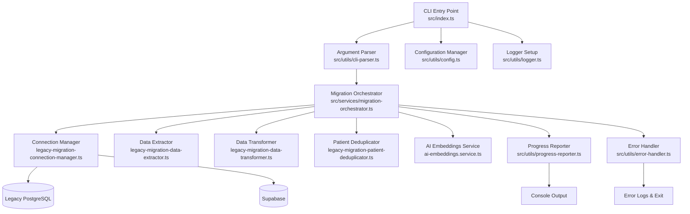

# Migration Tool Implementation Plan

## Executive Summary

Transform the existing migration tool codebase into a complete standalone Node.js CLI application that migrates data from the legacy Django MDW system to the new Supabase schema. The tool will feature a simple command-line interface with fail-fast error handling and comprehensive logging.

## Current State Analysis

### ✅ Existing Infrastructure
- **Package Dependencies**: Core dependencies (Supabase, PostgreSQL, OpenAI, Winston) already configured
- **TypeScript Types**: Comprehensive type definitions for legacy and target schemas
- **Migration Services**: Basic service structure with connection manager, data extractor, transformer, and deduplicator
- **Database Schemas**: Migration tracking tables and target schema definitions
- **Configuration**: TypeScript strict mode with path aliases

### ❌ Missing Components
- **Main Entry Point**: No `src/index.ts` with CLI interface
- **Package Scripts**: Empty scripts section in package.json
- **Utility Infrastructure**: Missing config management, logger setup, and CLI argument parsing
- **Service Implementation**: Migration services have placeholder TODO implementations
- **Error Handling**: No comprehensive error handling and recovery system

## Architectural Design



## Implementation Plan

### Phase 1: Core Infrastructure Setup

#### 1.1 Package.json Scripts Configuration
```json
{
  "scripts": {
    "dev": "tsx watch src/index.ts",
    "start": "tsx src/index.ts",
    "build": "tsc",
    "migrate:full": "tsx src/index.ts --type=full",
    "migrate:incremental": "tsx src/index.ts --type=incremental",
    "migrate:dry-run": "tsx src/index.ts --type=full --dry-run",
    "migrate:test": "tsx src/index.ts --type=full --dry-run --batch-size=10"
  }
}
```

#### 1.2 Utility Infrastructure
- **`src/utils/config.ts`**: Environment variable validation and database configuration
- **`src/utils/logger.ts`**: Enhanced Pino logger with file output and structured logging
- **`src/utils/cli-parser.ts`**: Command-line argument parsing with validation
- **`src/utils/progress-reporter.ts`**: Real-time progress tracking and console output
- **`src/utils/error-handler.ts`**: Comprehensive error handling with detailed reporting

### Phase 2: CLI Interface Implementation

#### 2.1 Main Entry Point (`src/index.ts`)
```typescript
interface CLIOptions {
  type: 'full' | 'incremental';
  dryRun: boolean;
  batchSize: number;
  enableAI: boolean;
  logLevel: 'debug' | 'info' | 'warn' | 'error';
  maxRetries: number;
}
```

#### 2.2 CLI Features
- **Argument Validation**: Strict validation of all CLI arguments
- **Environment Checking**: Verify all required environment variables
- **Database Connectivity**: Test connections before starting migration
- **Dry Run Mode**: Preview migration without making changes
- **Batch Size Control**: Configurable batch processing for large datasets

### Phase 3: Migration Orchestrator

#### 3.1 Migration Orchestrator Service
```typescript
class MigrationOrchestrator {
  async executeMigration(options: CLIOptions): Promise<MigrationResult>
  async validatePrerequisites(): Promise<void>
  async executePhase(phase: MigrationPhase): Promise<void>
  async handleError(error: MigrationError): Promise<never>
}
```

#### 3.2 Migration Phases
1. **Preparation**: Validate connections, check prerequisites
2. **Extraction**: Extract data from legacy database (corrected patient data strategy)
3. **Transformation**: Transform legacy data to target schema
4. **Deduplication**: Remove duplicate patient records
5. **AI Enhancement**: Generate embeddings for searchable content
6. **Validation**: Verify data integrity and completeness
7. **Completion**: Finalize migration and generate report

## Critical Migration Findings & Corrections

### Patient Data Structure Correction
**Previous Assumption**: Patient records contain comprehensive demographic data in `dispatch_patient` table
**Reality**: `dispatch_patient` table only contains:
- `id` (primary key)
- `user_id` (foreign key to auth_user)
- `birthdate` (date field)
- `sex` (character field)
- `updated_at` (timestamp)

**Migration Impact**:
- Patient names must be retrieved from `auth_user.first_name` and `auth_user.last_name`
- Missing demographic fields require default values or null handling
- Extraction queries must join `dispatch_patient` with `auth_user` tables

### Missing Critical Tables Identified
Analysis of the legacy database revealed three critical table types missing from the target schema:

#### 1. 3D Project Management (`dispatch_project`)
**Legacy Structure**:
- Project metadata and file management
- Digital asset tracking (STL files, scans, models)
- Version control for 3D assets
- Project status and workflow integration

**Target Schema Addition**: Added `projects` and `project_embeddings` tables with AI-ready architecture

#### 2. Granular State Tracking (`dispatch_state`)
**Legacy Structure**:
- Detailed workflow state transitions
- Instruction-level status tracking
- State change audit trail
- Performance analytics data

**Target Schema Addition**: Added `instruction_states` and `state_analytics` tables for comprehensive workflow tracking

#### 3. Enhanced Workflow Templates (`dispatch_template`)
**Legacy Structure**:
- Predefined workflow templates
- Task definitions and sequencing
- Role-based task assignments
- Template performance metrics

**Target Schema Addition**: Added `workflow_template_tasks` and `workflow_performance` tables for AI-enhanced workflow management

### Updated Migration Strategy

#### Patient Data Extraction (Corrected)
```sql
-- Corrected patient extraction query
SELECT
  dp.id,
  dp.user_id,
  au.first_name,
  au.last_name,
  au.email,
  dp.birthdate,
  dp.sex,
  dp.updated_at,
  -- Default values for missing fields
  NULL as phone,
  NULL as address,
  NULL as insurance_info
FROM dispatch_patient dp
JOIN auth_user au ON dp.user_id = au.id
WHERE dp.updated_at >= $1
ORDER BY dp.updated_at;
```

#### New Table Migration Phases
**Phase 2A: 3D Project Data Extraction**
- Extract `dispatch_project` records with file metadata
- Map legacy project types to new enum values
- Handle file path migrations to Supabase Storage

**Phase 2B: State Tracking Data Extraction**
- Extract `dispatch_state` records with transition history
- Map legacy state codes to new state enums
- Preserve audit trail and performance data

**Phase 2C: Workflow Template Data Extraction**
- Extract `dispatch_template` records with task definitions
- Map legacy template structures to new AI-ready format
- Preserve role assignments and performance metrics

### Phase 4: Service Implementation Completion

#### 4.1 Data Extractor Enhancement
- Implement batch extraction with pagination
- Add progress tracking and error recovery
- Support for incremental extraction based on timestamps

#### 4.2 Data Transformer Enhancement
- Complete transformation logic for all entity types
- Implement data validation and sanitization
- Add support for custom field mappings

#### 4.3 Patient Deduplicator Enhancement
- Implement fuzzy matching algorithms
- Add confidence scoring for duplicate detection
- Support for manual review queue generation

#### 4.4 AI Embeddings Service Enhancement
- Batch processing for embedding generation
- Rate limiting for OpenAI API calls
- Error handling and retry logic for API failures

### Phase 5: Error Handling & Recovery

#### 5.1 Fail-Fast Error Strategy
- **Immediate Termination**: Stop migration on any critical error
- **Detailed Error Reports**: Comprehensive error logging with context
- **Recovery Guidance**: Provide actionable steps for error resolution
- **State Preservation**: Save migration state for debugging

#### 5.2 Error Categories
- **Configuration Errors**: Missing environment variables, invalid settings
- **Connection Errors**: Database connectivity issues
- **Data Validation Errors**: Invalid or corrupted source data
- **Transformation Errors**: Failed data transformation or mapping
- **API Errors**: OpenAI API failures or rate limiting

### Phase 6: Progress Reporting & Logging

#### 6.1 Console Output
- Real-time progress bars for each migration phase
- Detailed status messages with timestamps
- Performance metrics (records/second, estimated completion)
- Error summaries and final migration report

#### 6.2 File Logging
- Structured JSON logs for debugging
- Separate error logs for failed operations
- Migration audit trail with complete operation history

## CLI Interface Design

### Command Structure
```bash
# Full migration with default settings
yarn migrate:full

# Dry run to preview changes
yarn migrate:dry-run

# Incremental migration with custom batch size
yarn start --type=incremental --batch-size=50

# Full migration with AI disabled and debug logging
yarn start --type=full --no-ai --log-level=debug
```

### Supported Arguments
- `--type`: Migration type (full, incremental)
- `--dry-run`: Preview mode without making changes
- `--batch-size`: Number of records to process per batch
- `--no-ai`: Disable AI embeddings generation
- `--log-level`: Logging verbosity level
- `--max-retries`: Maximum retry attempts for failed operations

## File Structure Plan

```
migration_tool/
├── src/
│   ├── index.ts                    # Main CLI entry point
│   ├── types/
│   │   └── legacy-migration-types.ts  # Existing types
│   ├── services/
│   │   ├── migration-orchestrator.ts   # New orchestrator
│   │   ├── migration.service.ts        # Existing service
│   │   ├── db.service.ts              # Existing service
│   │   ├── legacy-migration-*.ts      # Existing services
│   │   └── ai-embeddings.service.ts   # Enhanced AI service
│   └── utils/
│       ├── config.ts               # Configuration management
│       ├── logger.ts               # Enhanced logging
│       ├── cli-parser.ts           # CLI argument parsing
│       ├── progress-reporter.ts    # Progress tracking
│       └── error-handler.ts        # Error handling
├── package.json                    # Updated with scripts
└── tsconfig.json                   # Existing configuration
```

## Technical Specifications

### Dependencies Required
```json
{
  "dependencies": {
    "@supabase/supabase-js": "^2.x.x",
    "pg": "^8.x.x",
    "openai": "^4.x.x",
    "winston": "^3.x.x",
    "commander": "^11.x.x",
    "chalk": "^5.x.x",
    "cli-progress": "^3.x.x"
  },
  "devDependencies": {
    "tsx": "^4.x.x",
    "typescript": "^5.x.x"
  }
}
```

### Environment Variables
```bash
# Legacy Database
LEGACY_DB_HOST=localhost
LEGACY_DB_PORT=5432
LEGACY_DB_NAME=legacy_mdw
LEGACY_DB_USER=postgres
LEGACY_DB_PASSWORD=password
LEGACY_DB_SSL=false

# Supabase
SUPABASE_URL=https://your-project.supabase.co
SUPABASE_ANON_KEY=your-anon-key
SUPABASE_SERVICE_ROLE_KEY=your-service-role-key

# OpenAI
OPENAI_API_KEY=your-openai-api-key

# Migration Settings
MIGRATION_BATCH_SIZE=100
MIGRATION_MAX_RETRIES=3
MIGRATION_LOG_LEVEL=info
```

## Success Criteria

1. **Complete CLI Interface**: Functional command-line tool with all specified arguments
2. **Fail-Fast Error Handling**: Migration stops immediately on any error with detailed reporting
3. **Progress Tracking**: Real-time progress updates during migration execution
4. **Service Integration**: All existing services properly integrated and implemented
5. **Configuration Management**: Robust environment variable validation and configuration
6. **Comprehensive Logging**: Detailed logs for debugging and audit purposes
7. **Production Ready**: Error handling, validation, and recovery mechanisms in place

## Risk Mitigation

- **Data Integrity**: Comprehensive validation at each migration phase
- **Performance**: Batch processing and configurable batch sizes
- **Reliability**: Retry logic and connection health monitoring
- **Maintainability**: Clear separation of concerns and modular architecture
- **Debugging**: Extensive logging and error context preservation

## Implementation Timeline

### Phase 1: Infrastructure (Day 1)
- Set up package.json scripts
- Create utility infrastructure
- Implement configuration management

### Phase 2: CLI Interface (Day 1-2)
- Build main entry point
- Implement argument parsing
- Add environment validation

### Phase 3: Orchestrator (Day 2-3)
- Create migration orchestrator
- Implement phase management
- Add error handling framework

### Phase 4: Service Enhancement (Day 3-4)
- Complete existing service implementations
- Add AI embeddings integration
- Implement progress tracking

### Phase 5: Testing & Refinement (Day 4-5)
- End-to-end testing
- Error scenario validation
- Performance optimization

This comprehensive plan provides a complete roadmap for transforming the existing migration tool infrastructure into a production-ready standalone Node.js CLI application with robust error handling, progress tracking, and comprehensive logging capabilities.