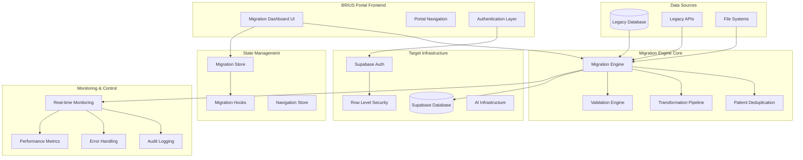
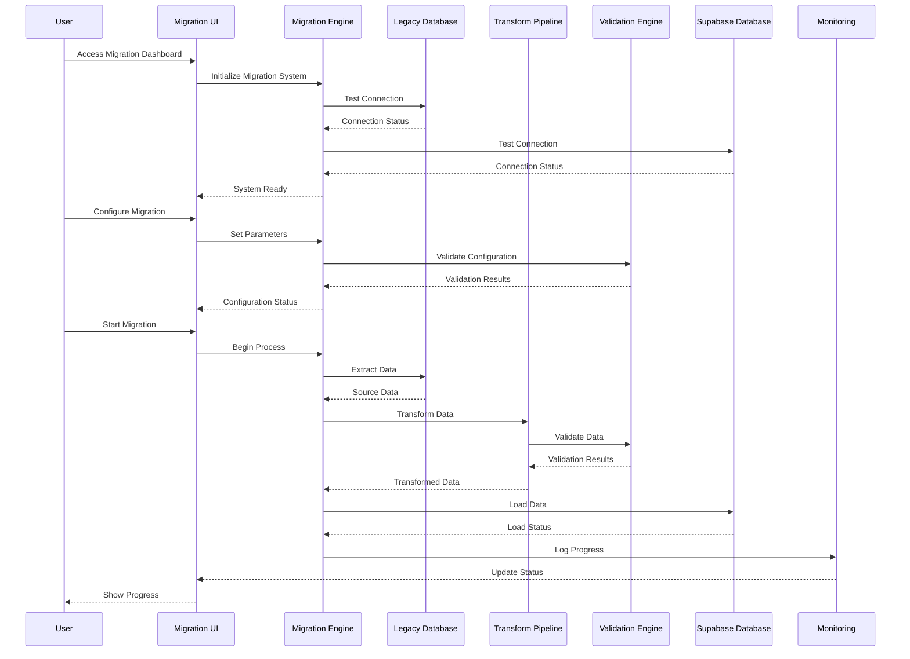
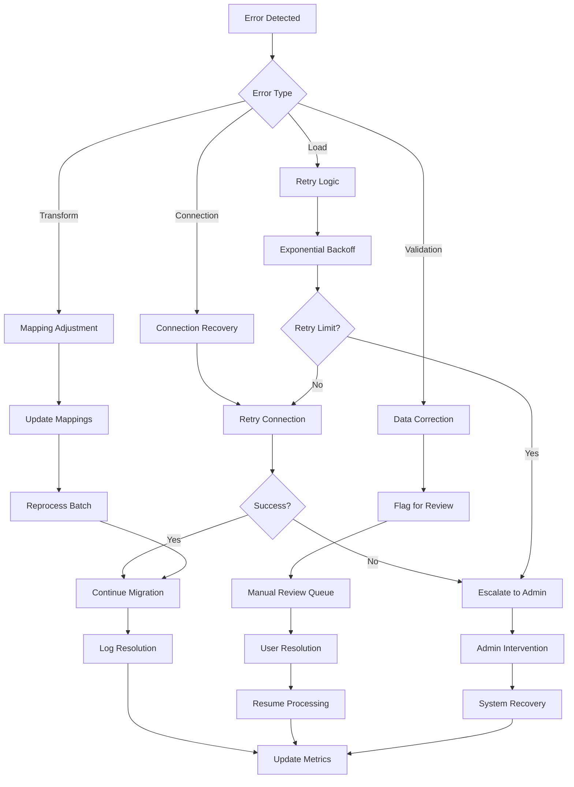

# Healthcare Data Migration System - Architecture Overview

## Executive Summary

The BRIUS Healthcare Data Migration System is a comprehensive, production-ready solution designed to migrate healthcare data from legacy systems to the modern AI-ready Supabase infrastructure. This system provides a secure, compliant, and user-friendly interface for healthcare organizations to perform complex data migrations while maintaining data integrity, security, and regulatory compliance.

## System Architecture

### High-Level Architecture



### Component Architecture

#### Frontend Components

**Location**: `src/components/migration/`

1. **Migration Dashboard** (`migration-dashboard.tsx`)
   - Real-time migration monitoring interface
   - Progress visualization and status indicators
   - Error reporting and resolution guidance
   - Performance metrics display

2. **Migration Configuration Panel** (`migration-config-panel.tsx`)
   - Database connection configuration
   - Migration parameter setup
   - Validation rule configuration
   - Batch processing settings

3. **Migration Status Monitor** (`migration-status-monitor.tsx`)
   - Live migration progress tracking
   - Error detection and alerting
   - Performance monitoring
   - Resource utilization display

#### Core Migration Engine

**Location**: `src/lib/`

1. **Migration Engine** (`migration-engine.ts`)
   - Core migration orchestration
   - Batch processing management
   - Error handling and recovery
   - Progress tracking and reporting

2. **Patient Deduplication** (`patient-deduplication.ts`)
   - Advanced patient matching algorithms
   - Duplicate detection and resolution
   - Data quality improvement
   - Compliance with healthcare standards

3. **Legacy Database Connector** (`legacy-database.ts`)
   - Secure legacy system integration
   - Multiple database support
   - Connection pooling and management
   - Data extraction optimization

4. **Synchronization Service** (`synchronization-service.ts`)
   - Real-time data synchronization
   - Change detection and propagation
   - Conflict resolution
   - Incremental updates

#### Data Transformation Pipeline

**Location**: `src/lib/transformations/`

1. **Schema Mapping Engine** (`schema-mapping-engine.ts`)
   - Legacy to modern schema mapping
   - Field transformation rules
   - Data type conversion
   - Relationship preservation

2. **Field Mapping Registry** (`field-mapping-registry.ts`)
   - Centralized field mapping definitions
   - Configurable transformation rules
   - Validation and verification
   - Audit trail maintenance

3. **Data Type Converters** (`data-type-converters.ts`)
   - Type-safe data conversion
   - Format standardization
   - Validation and sanitization
   - Error handling and recovery

4. **Code System Mappers** (`code-system-mappers.ts`)
   - Medical code system translation
   - ICD, CPT, SNOMED mapping
   - Terminology standardization
   - Compliance verification

5. **Validation Engine** (`validation-engine.ts`)
   - Comprehensive data validation
   - Business rule enforcement
   - Compliance checking
   - Quality assurance

6. **Transformation Pipeline** (`transformation-pipeline.ts`)
   - End-to-end transformation orchestration
   - Pipeline stage management
   - Error handling and rollback
   - Performance optimization

#### State Management

**Location**: `src/stores/` and `src/hooks/`

1. **Migration Store** (`migration-store.ts`)
   - Zustand-based state management
   - Migration status tracking
   - Configuration management
   - Error state handling

2. **Migration Hooks** (`use-migration.ts`)
   - Component-store interface
   - Reactive state updates
   - Action dispatching
   - Error boundary integration

#### Type System

**Location**: `src/types/`

1. **Database Types** (`database.ts`)
   - Supabase schema definitions
   - Type-safe database operations
   - Relationship modeling
   - Constraint definitions

2. **Transformation Types** (`transformations.ts`)
   - Transformation pipeline types
   - Mapping configuration types
   - Validation rule types
   - Error handling types

## Integration with BRIUS Portal

### Authentication and Authorization

The migration system is fully integrated with the BRIUS portal authentication system:

- **Supabase Authentication**: Leverages existing Supabase auth infrastructure
- **Row Level Security (RLS)**: Implements fine-grained access control
- **Role-Based Access**: Supports different user roles and permissions
- **Audit Logging**: Comprehensive activity tracking for compliance

### Navigation Integration

**File**: `src/components/portal/app-sidebar.tsx`

The migration system is accessible through the main portal navigation:

```typescript
{
  id: 'migration',
  title: 'Data Migration',
  icon: Database,
  url: '/portal/migration',
}
```

### Routing Configuration

**File**: `src/App.tsx`

Migration routes are integrated into the main application routing:

```typescript
<Route path="/portal" element={<PortalLayout />}>
  <Route path="migration" element={<MigrationPage />} />
</Route>
```

### Portal Layout Integration

The migration interface follows the established portal design patterns:

- **Consistent UI/UX**: Uses shadcn/ui components
- **Responsive Design**: Mobile and desktop optimized
- **Theme Integration**: Follows portal theming
- **Accessibility**: WCAG 2.1 AA compliant

## Security and Compliance

### Data Security

1. **Encryption in Transit**
   - TLS 1.3 for all data transmission
   - Certificate pinning for API connections
   - Secure WebSocket connections for real-time updates

2. **Encryption at Rest**
   - AES-256 encryption for stored data
   - Key management through Supabase
   - Secure credential storage

3. **Access Control**
   - Multi-factor authentication support
   - Role-based access control (RBAC)
   - Session management and timeout
   - IP whitelisting capabilities

### Healthcare Compliance

1. **HIPAA Compliance**
   - PHI protection and handling
   - Audit logging and monitoring
   - Data minimization principles
   - Breach notification procedures

2. **Data Governance**
   - Data lineage tracking
   - Change management procedures
   - Quality assurance processes
   - Retention policy enforcement

3. **Regulatory Standards**
   - HL7 FHIR compatibility
   - IHE profile compliance
   - FDA 21 CFR Part 11 support
   - SOX compliance features

### Audit and Monitoring

1. **Comprehensive Logging**
   - All user actions logged
   - System events tracked
   - Performance metrics recorded
   - Error conditions documented

2. **Real-time Monitoring**
   - Migration progress tracking
   - System health monitoring
   - Performance alerting
   - Security event detection

3. **Compliance Reporting**
   - Automated compliance reports
   - Audit trail generation
   - Data quality metrics
   - Performance analytics

## Data Flow Architecture

### Migration Process Flow



### Error Handling Flow



## Performance and Scalability

### Performance Characteristics

1. **Throughput Optimization**
   - Batch processing with configurable sizes
   - Parallel processing capabilities
   - Connection pooling and reuse
   - Memory-efficient data streaming

2. **Scalability Features**
   - Horizontal scaling support
   - Load balancing capabilities
   - Resource monitoring and adjustment
   - Auto-scaling triggers

3. **Performance Monitoring**
   - Real-time performance metrics
   - Bottleneck identification
   - Resource utilization tracking
   - Performance trend analysis

### Resource Management

1. **Memory Management**
   - Streaming data processing
   - Garbage collection optimization
   - Memory leak prevention
   - Resource cleanup procedures

2. **Database Optimization**
   - Connection pooling
   - Query optimization
   - Index utilization
   - Transaction management

3. **Network Optimization**
   - Compression algorithms
   - Bandwidth management
   - Latency optimization
   - Retry mechanisms

## Technology Stack

### Frontend Technologies

- **React 19**: Modern component framework
- **TypeScript**: Type-safe development
- **Vite 7**: Fast build tooling
- **Tailwind CSS**: Utility-first styling
- **shadcn/ui**: Component library
- **Zustand**: State management
- **React Router**: Navigation

### Backend Technologies

- **Supabase**: Database and authentication
- **PostgreSQL**: Relational database
- **Row Level Security**: Access control
- **Real-time subscriptions**: Live updates
- **Edge functions**: Serverless computing

### Development Tools

- **Yarn**: Package management
- **ESLint**: Code linting
- **Prettier**: Code formatting
- **Jest**: Testing framework
- **Docker**: Containerization

## Integration Points

### External System Integration

1. **Legacy Database Systems**
   - PostgreSQL, MySQL, SQL Server
   - Oracle, DB2, Sybase
   - NoSQL databases (MongoDB, Cassandra)
   - File-based systems (CSV, XML, JSON)

2. **Healthcare Standards**
   - HL7 FHIR R4/R5
   - DICOM for imaging
   - IHE profiles
   - CDA documents

3. **API Integration**
   - RESTful APIs
   - GraphQL endpoints
   - SOAP web services
   - Message queues (RabbitMQ, Apache Kafka)

### Monitoring and Alerting

1. **System Monitoring**
   - Application performance monitoring
   - Infrastructure monitoring
   - Database performance tracking
   - Network monitoring

2. **Business Monitoring**
   - Migration progress tracking
   - Data quality metrics
   - Compliance monitoring
   - User activity tracking

3. **Alerting Systems**
   - Real-time error alerts
   - Performance threshold alerts
   - Security event notifications
   - Compliance violation alerts

## Deployment Architecture

### Environment Configuration

1. **Development Environment**
   - Local development setup
   - Docker containerization
   - Hot reloading capabilities
   - Debug tooling integration

2. **Staging Environment**
   - Production-like configuration
   - Integration testing
   - Performance testing
   - Security testing

3. **Production Environment**
   - High availability setup
   - Load balancing
   - Auto-scaling
   - Disaster recovery

### Infrastructure Requirements

1. **Compute Resources**
   - CPU: Multi-core processors for parallel processing
   - Memory: Sufficient RAM for data buffering
   - Storage: High-performance SSD storage
   - Network: High-bandwidth, low-latency connections

2. **Database Requirements**
   - Primary database: Supabase PostgreSQL
   - Backup systems: Automated backup solutions
   - Replication: Multi-region replication
   - Monitoring: Database performance monitoring

3. **Security Infrastructure**
   - Firewall configuration
   - VPN access for secure connections
   - Certificate management
   - Intrusion detection systems

## Conclusion

The BRIUS Healthcare Data Migration System represents a comprehensive, enterprise-grade solution for healthcare data migration. With its robust architecture, comprehensive security features, and user-friendly interface, it provides healthcare organizations with the tools they need to successfully migrate their data to modern, AI-ready infrastructure while maintaining the highest standards of security, compliance, and data integrity.

The system's modular design, extensive documentation, and comprehensive testing ensure that it can be deployed and operated successfully in production healthcare environments, providing reliable and efficient data migration capabilities for organizations of all sizes.