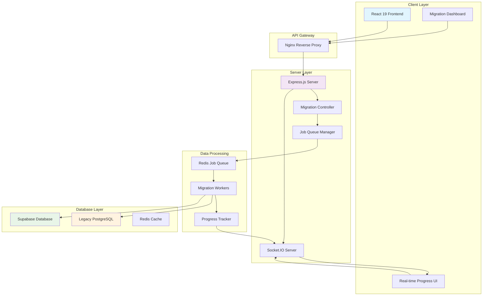

# Migration System Server Architecture Redesign

## Executive Summary

This document outlines the complete architectural redesign of the healthcare portal's migration system, addressing critical security vulnerabilities and implementing a robust server-side architecture. The redesign moves all database connections and migration logic from the frontend to a secure Node.js server, implementing real-time progress monitoring and proper separation of concerns.

## Problem Statement

### Current Issues
1. **Security Vulnerability**: Frontend directly accessing legacy PostgreSQL database
2. **Environment Configuration**: `process.env` usage in browser causing "process is not defined" errors
3. **Architectural Flaw**: Database credentials exposed in client-side code
4. **Compliance Risk**: HIPAA violations due to insecure data handling
5. **Scalability Limitations**: No background job processing or queue management

### Root Cause Analysis
The original error "process is not defined" was a symptom of a deeper architectural problem: attempting to run server-side database connection code in the browser environment. This revealed that the entire migration system was designed with a fundamental security flaw.

## Architectural Overview

### New Architecture Principles
1. **Separation of Concerns**: Clear boundaries between client and server responsibilities
2. **Security First**: All database connections and sensitive operations on server-side
3. **Real-time Communication**: Socket.IO for live progress updates
4. **Scalability**: Redis-based job queue for background processing
5. **Healthcare Compliance**: HIPAA-compliant data handling and security

### System Architecture Diagram



## Technology Stack

### Server-Side Technologies
- **Runtime**: Node.js 20+ with TypeScript
- **Framework**: Express.js 4.x
- **Real-time Communication**: Socket.IO 4.x
- **Job Queue**: Redis with Bull Queue
- **Database Clients**: 
  - `pg` for PostgreSQL (legacy database)
  - `@supabase/supabase-js` for Supabase
- **Security**: Helmet.js, CORS, rate limiting
- **Monitoring**: Winston logging, health checks

### Infrastructure
- **Containerization**: Docker with multi-stage builds
- **Orchestration**: Docker Compose
- **Reverse Proxy**: Nginx
- **Environment Management**: dotenv with validation

## Server Directory Structure

```
server/
├── src/
│   ├── controllers/
│   │   ├── migration-controller.ts
│   │   ├── health-controller.ts
│   │   └── index.ts
│   ├── services/
│   │   ├── migration-service.ts
│   │   ├── legacy-database-service.ts
│   │   ├── supabase-service.ts
│   │   ├── job-queue-service.ts
│   │   └── socket-service.ts
│   ├── workers/
│   │   ├── migration-worker.ts
│   │   ├── validation-worker.ts
│   │   └── cleanup-worker.ts
│   ├── middleware/
│   │   ├── auth-middleware.ts
│   │   ├── validation-middleware.ts
│   │   ├── error-middleware.ts
│   │   └── rate-limit-middleware.ts
│   ├── types/
│   │   ├── migration-types.ts
│   │   ├── api-types.ts
│   │   └── worker-types.ts
│   ├── utils/
│   │   ├── logger.ts
│   │   ├── config.ts
│   │   ├── validation.ts
│   │   └── encryption.ts
│   ├── routes/
│   │   ├── migration-routes.ts
│   │   ├── health-routes.ts
│   │   └── index.ts
│   ├── config/
│   │   ├── database.ts
│   │   ├── redis.ts
│   │   └── socket.ts
│   └── app.ts
├── tests/
│   ├── unit/
│   ├── integration/
│   └── e2e/
├── docker/
│   ├── Dockerfile
│   ├── Dockerfile.dev
│   └── nginx.conf
├── package.json
├── tsconfig.json
├── .env.example
└── README.md
```

## API Design Specification

### RESTful Endpoints

#### Migration Management
```typescript
// GET /api/migrations - List all migrations
interface MigrationListResponse {
  migrations: Migration[];
  total: number;
  status: 'idle' | 'running' | 'completed' | 'failed';
}

// POST /api/migrations/start - Start migration process
interface StartMigrationRequest {
  migrationId: string;
  options: {
    batchSize?: number;
    validateOnly?: boolean;
    skipValidation?: boolean;
  };
}

// GET /api/migrations/:id/status - Get migration status
interface MigrationStatusResponse {
  id: string;
  status: 'pending' | 'running' | 'completed' | 'failed' | 'cancelled';
  progress: {
    current: number;
    total: number;
    percentage: number;
  };
  startedAt?: string;
  completedAt?: string;
  error?: string;
}

// POST /api/migrations/:id/cancel - Cancel migration
// DELETE /api/migrations/:id - Delete migration record
```

#### Health and Monitoring
```typescript
// GET /api/health - Server health check
interface HealthResponse {
  status: 'healthy' | 'unhealthy';
  timestamp: string;
  services: {
    database: 'connected' | 'disconnected';
    redis: 'connected' | 'disconnected';
    legacyDb: 'connected' | 'disconnected';
  };
}

// GET /api/metrics - System metrics
interface MetricsResponse {
  activeJobs: number;
  completedJobs: number;
  failedJobs: number;
  queueSize: number;
  memoryUsage: number;
  uptime: number;
}
```

### Socket.IO Events

#### Client to Server Events
```typescript
interface ClientToServerEvents {
  'migration:subscribe': (migrationId: string) => void;
  'migration:unsubscribe': (migrationId: string) => void;
  'system:subscribe': () => void;
  'system:unsubscribe': () => void;
}
```

#### Server to Client Events
```typescript
interface ServerToClientEvents {
  'migration:progress': (data: {
    migrationId: string;
    progress: number;
    current: number;
    total: number;
    message: string;
  }) => void;
  
  'migration:status': (data: {
    migrationId: string;
    status: MigrationStatus;
    timestamp: string;
  }) => void;
  
  'migration:error': (data: {
    migrationId: string;
    error: string;
    timestamp: string;
  }) => void;
  
  'migration:completed': (data: {
    migrationId: string;
    summary: MigrationSummary;
    timestamp: string;
  }) => void;
  
  'system:metrics': (metrics: SystemMetrics) => void;
}
```

## Security Implementation

### Authentication & Authorization
```typescript
// JWT-based authentication with Supabase integration
interface AuthMiddleware {
  validateToken: (token: string) => Promise<User>;
  checkPermissions: (user: User, action: string) => boolean;
  rateLimiting: (userId: string) => Promise<boolean>;
}

// Role-based access control
enum UserRole {
  ADMIN = 'admin',
  MIGRATION_MANAGER = 'migration_manager',
  VIEWER = 'viewer'
}

interface PermissionMatrix {
  [UserRole.ADMIN]: ['*'];
  [UserRole.MIGRATION_MANAGER]: ['migration:*', 'health:read'];
  [UserRole.VIEWER]: ['migration:read', 'health:read'];
}
```

### Data Protection
```typescript
// Environment variable validation
interface ServerConfig {
  PORT: number;
  NODE_ENV: 'development' | 'production' | 'test';
  
  // Database connections
  LEGACY_DB_HOST: string;
  LEGACY_DB_PORT: number;
  LEGACY_DB_NAME: string;
  LEGACY_DB_USER: string;
  LEGACY_DB_PASSWORD: string;
  
  // Supabase configuration
  SUPABASE_URL: string;
  SUPABASE_SERVICE_KEY: string;
  
  // Redis configuration
  REDIS_URL: string;
  
  // Security
  JWT_SECRET: string;
  ENCRYPTION_KEY: string;
}

// Data encryption for sensitive fields
interface EncryptionService {
  encrypt: (data: string) => string;
  decrypt: (encryptedData: string) => string;
  hashPassword: (password: string) => Promise<string>;
  verifyPassword: (password: string, hash: string) => Promise<boolean>;
}
```

## Job Queue Architecture

### Queue Configuration
```typescript
interface QueueConfig {
  redis: {
    host: string;
    port: number;
    password?: string;
  };
  defaultJobOptions: {
    removeOnComplete: 10;
    removeOnFail: 50;
    attempts: 3;
    backoff: {
      type: 'exponential';
      delay: 2000;
    };
  };
}

// Job types and priorities
enum JobType {
  MIGRATION = 'migration',
  VALIDATION = 'validation',
  CLEANUP = 'cleanup',
  HEALTH_CHECK = 'health_check'
}

enum JobPriority {
  LOW = 1,
  NORMAL = 5,
  HIGH = 10,
  CRITICAL = 15
}
```

### Worker Implementation
```typescript
interface MigrationJob {
  id: string;
  type: JobType.MIGRATION;
  data: {
    migrationId: string;
    batchSize: number;
    startOffset: number;
    endOffset: number;
    options: MigrationOptions;
  };
  progress: (progress: number) => void;
}

interface WorkerService {
  processMigrationJob: (job: MigrationJob) => Promise<void>;
  processValidationJob: (job: ValidationJob) => Promise<void>;
  processCleanupJob: (job: CleanupJob) => Promise<void>;
}
```

## Docker Configuration

### Multi-Container Setup
```yaml
# docker-compose.yml
version: '3.8'

services:
  frontend:
    build:
      context: .
      dockerfile: Dockerfile
    ports:
      - "3000:3000"
    environment:
      - VITE_API_URL=http://localhost:4000
      - VITE_SOCKET_URL=http://localhost:4000
    depends_on:
      - server

  server:
    build:
      context: ./server
      dockerfile: Dockerfile
    ports:
      - "4000:4000"
    environment:
      - NODE_ENV=production
      - PORT=4000
    env_file:
      - ./server/.env
    depends_on:
      - redis
      - postgres
    volumes:
      - ./server/logs:/app/logs

  nginx:
    image: nginx:alpine
    ports:
      - "80:80"
      - "443:443"
    volumes:
      - ./server/docker/nginx.conf:/etc/nginx/nginx.conf
      - ./ssl:/etc/nginx/ssl
    depends_on:
      - frontend
      - server

  redis:
    image: redis:7-alpine
    ports:
      - "6379:6379"
    volumes:
      - redis_data:/data
    command: redis-server --appendonly yes

  postgres:
    image: postgres:15-alpine
    environment:
      - POSTGRES_DB=legacy_migration
      - POSTGRES_USER=migration_user
      - POSTGRES_PASSWORD=secure_password
    volumes:
      - postgres_data:/var/lib/postgresql/data
    ports:
      - "5432:5432"

volumes:
  redis_data:
  postgres_data:
```

### Nginx Configuration
```nginx
# server/docker/nginx.conf
events {
    worker_connections 1024;
}

http {
    upstream frontend {
        server frontend:3000;
    }
    
    upstream backend {
        server server:4000;
    }
    
    server {
        listen 80;
        server_name localhost;
        
        # Frontend routes
        location / {
            proxy_pass http://frontend;
            proxy_set_header Host $host;
            proxy_set_header X-Real-IP $remote_addr;
        }
        
        # API routes
        location /api/ {
            proxy_pass http://backend;
            proxy_set_header Host $host;
            proxy_set_header X-Real-IP $remote_addr;
        }
        
        # Socket.IO routes
        location /socket.io/ {
            proxy_pass http://backend;
            proxy_http_version 1.1;
            proxy_set_header Upgrade $http_upgrade;
            proxy_set_header Connection "upgrade";
            proxy_set_header Host $host;
            proxy_set_header X-Real-IP $remote_addr;
        }
    }
}
```

## Frontend Integration Changes

### API Client Service
```typescript
// src/services/api-client.ts
interface ApiClient {
  // Migration endpoints
  getMigrations: () => Promise<Migration[]>;
  startMigration: (request: StartMigrationRequest) => Promise<void>;
  getMigrationStatus: (id: string) => Promise<MigrationStatus>;
  cancelMigration: (id: string) => Promise<void>;
  
  // Health endpoints
  getHealth: () => Promise<HealthResponse>;
  getMetrics: () => Promise<MetricsResponse>;
}

// Environment configuration for Vite
interface ClientConfig {
  VITE_API_URL: string;
  VITE_SOCKET_URL: string;
  VITE_SUPABASE_URL: string;
  VITE_SUPABASE_ANON_KEY: string;
}
```

### Socket.IO Integration
```typescript
// src/services/socket-service.ts
interface SocketService {
  connect: () => void;
  disconnect: () => void;
  subscribeMigration: (migrationId: string) => void;
  unsubscribeMigration: (migrationId: string) => void;
  onProgress: (callback: (data: ProgressData) => void) => void;
  onStatusChange: (callback: (data: StatusData) => void) => void;
  onError: (callback: (data: ErrorData) => void) => void;
}
```

### Zustand Store Updates
```typescript
// src/stores/migration-store.ts
interface MigrationStore {
  // State
  migrations: Migration[];
  activeMigration: Migration | null;
  progress: ProgressData | null;
  isConnected: boolean;
  
  // Actions
  fetchMigrations: () => Promise<void>;
  startMigration: (request: StartMigrationRequest) => Promise<void>;
  cancelMigration: (id: string) => Promise<void>;
  updateProgress: (data: ProgressData) => void;
  updateStatus: (data: StatusData) => void;
  
  // Socket management
  connectSocket: () => void;
  disconnectSocket: () => void;
}
```

## Implementation Phases

### Phase 1: Foundation Setup (Week 1)
**Objective**: Establish server infrastructure and basic API

**Tasks**:
1. **Server Project Initialization**
   - Create `server/` directory structure
   - Initialize Node.js project with TypeScript
   - Configure ESLint, Prettier, and Jest
   - Set up basic Express.js application

2. **Database Connections**
   - Implement legacy PostgreSQL connection service
   - Implement Supabase connection service
   - Create connection pooling and health checks
   - Add environment variable validation

3. **Basic API Structure**
   - Create Express.js routes and controllers
   - Implement health check endpoints
   - Add basic error handling middleware
   - Set up request logging with Winston

4. **Docker Configuration**
   - Create server Dockerfile
   - Update docker-compose.yml for multi-container setup
   - Configure development and production environments

**Deliverables**:
- Working Express.js server with health endpoints
- Database connections to both legacy and Supabase
- Docker containerization
- Basic API documentation

### Phase 2: API Development (Week 2)
**Objective**: Implement core migration API endpoints

**Tasks**:
1. **Migration API Endpoints**
   - Implement migration listing endpoint
   - Create migration start/stop endpoints
   - Add migration status tracking
   - Implement migration cancellation

2. **Authentication & Security**
   - Integrate Supabase authentication
   - Implement JWT token validation
   - Add role-based access control
   - Configure CORS and security headers

3. **Input Validation**
   - Create request validation schemas
   - Implement input sanitization
   - Add rate limiting middleware
   - Error handling improvements

4. **API Testing**
   - Unit tests for controllers and services
   - Integration tests for API endpoints
   - Mock database connections for testing
   - API documentation with OpenAPI/Swagger

**Deliverables**:
- Complete migration API endpoints
- Authentication and authorization system
- Comprehensive API testing suite
- API documentation

### Phase 3: Migration Logic & Job Queue (Week 3)
**Objective**: Move migration logic to server-side with job processing

**Tasks**:
1. **Job Queue Implementation**
   - Set up Redis connection and Bull queue
   - Create job types and priority system
   - Implement worker processes
   - Add job retry and failure handling

2. **Migration Service Migration**
   - Move migration engine from frontend to server
   - Adapt patient deduplication logic
   - Port transformation pipeline
   - Implement batch processing

3. **Progress Tracking**
   - Create progress tracking system
   - Implement job status updates
   - Add detailed logging and metrics
   - Error reporting and recovery

4. **Data Validation**
   - Server-side validation engine
   - Schema validation for legacy data
   - Data integrity checks
   - Validation reporting

**Deliverables**:
- Redis-based job queue system
- Server-side migration processing
- Progress tracking and reporting
- Data validation system

### Phase 4: Real-time Communication (Week 4)
**Objective**: Implement Socket.IO for real-time updates

**Tasks**:
1. **Socket.IO Server Setup**
   - Configure Socket.IO server
   - Implement authentication for socket connections
   - Create room-based subscriptions
   - Add connection management

2. **Real-time Events**
   - Progress update events
   - Status change notifications
   - Error reporting events
   - System metrics broadcasting

3. **Frontend Socket Integration**
   - Update React components for real-time data
   - Implement socket connection management
   - Add reconnection logic
   - Update Zustand stores for real-time state

4. **Performance Optimization**
   - Optimize socket event frequency
   - Implement event batching
   - Add connection pooling
   - Memory usage optimization

**Deliverables**:
- Real-time progress monitoring
- Socket.IO integration
- Updated frontend components
- Performance optimizations

### Phase 5: Production Readiness (Week 5)
**Objective**: Prepare system for production deployment

**Tasks**:
1. **Production Configuration**
   - Environment-specific configurations
   - SSL/TLS certificate setup
   - Nginx reverse proxy configuration
   - Load balancing considerations

2. **Monitoring & Logging**
   - Comprehensive logging strategy
   - Health check endpoints
   - Performance monitoring
   - Error tracking and alerting

3. **Security Hardening**
   - Security audit and penetration testing
   - HIPAA compliance verification
   - Data encryption at rest and in transit
   - Access control review

4. **Documentation & Training**
   - Deployment documentation
   - API documentation updates
   - User training materials
   - Troubleshooting guides

**Deliverables**:
- Production-ready deployment
- Monitoring and alerting system
- Security compliance verification
- Complete documentation

## Security Considerations

### HIPAA Compliance
1. **Data Encryption**: All PHI encrypted at rest and in transit
2. **Access Controls**: Role-based access with audit logging
3. **Data Minimization**: Only necessary data processed
4. **Audit Trails**: Comprehensive logging of all data access
5. **Secure Communication**: TLS 1.3 for all connections

### Infrastructure Security
1. **Network Isolation**: Containers in isolated networks
2. **Secrets Management**: Environment variables and secrets rotation
3. **Regular Updates**: Automated security updates
4. **Vulnerability Scanning**: Regular security assessments
5. **Backup Strategy**: Encrypted backups with retention policies

## Performance Considerations

### Scalability
1. **Horizontal Scaling**: Multiple server instances behind load balancer
2. **Database Optimization**: Connection pooling and query optimization
3. **Caching Strategy**: Redis caching for frequently accessed data
4. **Job Queue Scaling**: Multiple worker processes for parallel processing

### Monitoring
1. **Application Metrics**: Response times, error rates, throughput
2. **Infrastructure Metrics**: CPU, memory, disk, network usage
3. **Business Metrics**: Migration success rates, processing times
4. **Alerting**: Automated alerts for critical issues

## Risk Assessment & Mitigation

### Technical Risks
1. **Data Loss**: Comprehensive backup and rollback procedures
2. **Performance Degradation**: Load testing and capacity planning
3. **Security Breaches**: Multi-layer security and monitoring
4. **System Downtime**: High availability and disaster recovery

### Business Risks
1. **Migration Failures**: Extensive testing and validation
2. **Compliance Issues**: Regular audits and compliance checks
3. **User Adoption**: Training and change management
4. **Cost Overruns**: Detailed project planning and monitoring

## Success Metrics

### Technical Metrics
1. **System Uptime**: 99.9% availability target
2. **Response Times**: <200ms for API endpoints
3. **Migration Speed**: 50% improvement in processing time
4. **Error Rates**: <0.1% for migration operations

### Business Metrics
1. **Security Incidents**: Zero security breaches
2. **Compliance**: 100% HIPAA compliance
3. **User Satisfaction**: >90% user satisfaction score
4. **Cost Efficiency**: 30% reduction in operational costs

## Conclusion

This architectural redesign addresses the fundamental security and scalability issues in the current migration system. By implementing a proper server-side architecture with Express.js, Socket.IO, and Redis, we ensure:

1. **Security**: All database connections and sensitive operations are server-side
2. **Scalability**: Job queue system enables parallel processing and horizontal scaling
3. **Real-time Monitoring**: Socket.IO provides live progress updates
4. **Compliance**: HIPAA-compliant data handling and security measures
5. **Maintainability**: Clear separation of concerns and modular architecture

The phased implementation approach ensures minimal disruption to current operations while systematically addressing each component of the system. The comprehensive testing strategy and monitoring capabilities provide confidence in the system's reliability and performance.

This redesign transforms the migration system from a security liability into a robust, scalable, and compliant healthcare data processing platform.