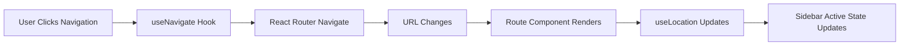
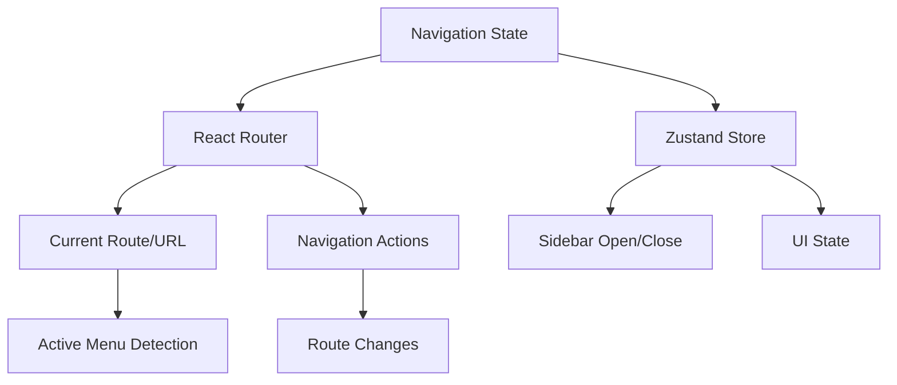

# Portal Navigation Routing Implementation Plan

## Overview

This document outlines the implementation plan for adding React Router-based navigation to the portal while maintaining the existing admin layout, app components, and Zustand state management for sidebar functionality.

## Current State Analysis

### Existing Architecture
- **Navigation System**: Zustand store (`navigation-store.ts`) manages `currentApp` state
- **Portal Layout**: `portal-layout.tsx` renders different app components based on `currentApp`
- **Sidebar**: `app-sidebar.tsx` has menu items with URLs defined but only calls `setCurrentApp()`
- **App Components**: Existing `HomeApp`, `AssistantApp`, `LibraryApp`, `ReportsApp` components
- **Authentication**: Working auth system with protected routes

### Required Changes
- Implement React Router nested routes for portal sections
- Update navigation to use React Router's `useNavigate` and `useLocation`
- Maintain existing admin layout with always-visible sidebar
- Ensure Sign Out redirects to landing page (/)
- Preserve existing app components by wrapping them in route pages

## Implementation Architecture

### Route Structure

```mermaid
graph TD
    A[App.tsx] --> B[BrowserRouter]
    B --> C[Routes]
    C --> D[/ - Landing Page]
    C --> E[/login - Login Page]
    C --> F[/portal/* - Portal Routes]
    F --> G[/portal - Home Default]
    F --> H[/portal/assistant - Assistant]
    F --> I[/portal/library - Library]
    F --> J[/portal/reports - Reports]
    C --> K[* - 404 Page]
```

### Navigation Flow



### State Management Strategy



## Implementation Steps

### Phase 1: Route Structure Setup

#### 1.1 Update App.tsx
- Add nested routes for portal sections
- Implement proper route protection
- Maintain lazy loading for performance
- Add default redirect from `/portal` to `/portal` (home)

**Key Changes:**
```typescript
// Add nested portal routes
<Route path="/portal" element={<PortalLayout />}>
  <Route index element={<HomePage />} />
  <Route path="assistant" element={<AssistantPage />} />
  <Route path="library" element={<LibraryPage />} />
  <Route path="reports" element={<ReportsPage />} />
</Route>
```

#### 1.2 Create Portal Layout Component
- Convert existing `portal-layout.tsx` to use React Router's `<Outlet />`
- Maintain existing admin layout structure
- Preserve sidebar, header, and main content areas
- Ensure responsive design is maintained

### Phase 2: Page Components Creation

#### 2.1 Create Route Page Components
Create new page components that wrap existing app components:

**Files to Create:**
- `src/pages/portal/home.tsx` - Wraps `HomeApp`
- `src/pages/portal/assistant.tsx` - Wraps `AssistantApp`
- `src/pages/portal/library.tsx` - Wraps `LibraryApp`
- `src/pages/portal/reports.tsx` - Wraps `ReportsApp`

**Pattern:**
```typescript
import React from 'react';
import { HomeApp } from '@/components/apps/home-app';

const HomePage: React.FC = () => {
  return <HomeApp />;
};

export default HomePage;
```

#### 2.2 Update Portal Index
- Convert `src/pages/portal/index.tsx` to be the layout component
- Implement `<Outlet />` for nested routes
- Maintain existing `ProtectedRoute` wrapper

### Phase 3: Navigation Component Updates

#### 3.1 Update App Sidebar
- Replace Zustand navigation with React Router hooks
- Use `useNavigate()` for navigation actions
- Use `useLocation()` for active state detection
- Maintain existing UI and styling
- Keep Zustand for sidebar open/close state

**Key Changes:**
```typescript
const navigate = useNavigate();
const location = useLocation();

const handleMenuClick = (path: string) => {
  navigate(path);
};

const isActive = (path: string) => {
  return location.pathname === path || 
         (path === '/portal' && location.pathname === '/portal');
};
```

#### 3.2 Update Navigation Hook
- Simplify `use-navigation.ts` to work with React Router
- Remove app switching logic (handled by React Router)
- Keep sidebar state management
- Add helper functions for route detection

#### 3.3 Update Navigation Store
- Simplify `navigation-store.ts` to only handle sidebar state
- Remove `currentApp` and `setCurrentApp` (handled by React Router)
- Keep `sidebarOpen`, `setSidebarOpen`, `toggleSidebar`

### Phase 4: Authentication Integration

#### 4.1 Update Logout Functionality
- Modify auth store logout to use React Router navigation
- Ensure logout redirects to landing page (/) using `navigate('/')`
- Maintain existing authentication state clearing

#### 4.2 Update Protected Routes
- Ensure protected route functionality works with nested routing
- Maintain existing authentication checks
- Handle authentication redirects properly

### Phase 5: Mobile Navigation Updates

#### 5.1 Update Mobile Navigation Component
- Ensure mobile navigation works with new routing
- Update any navigation logic to use React Router
- Maintain existing mobile UI patterns

### Phase 6: Type Safety and Documentation

#### 6.1 Create Navigation Types
- Create types for route parameters if needed
- Update existing navigation types
- Ensure proper TypeScript coverage

#### 6.2 Update Documentation
- Document new navigation patterns
- Update component documentation
- Create migration notes

## File Structure Changes

### New Files
```
src/pages/portal/
├── home.tsx          # Wraps HomeApp
├── assistant.tsx     # Wraps AssistantApp
├── library.tsx       # Wraps LibraryApp
├── reports.tsx       # Wraps ReportsApp
└── layout.tsx        # Portal layout with Outlet
```

### Modified Files
```
src/
├── App.tsx                           # Add nested routes
├── pages/portal/index.tsx            # Convert to layout
├── components/portal/
│   ├── app-sidebar.tsx              # Use React Router navigation
│   ├── portal-layout.tsx            # Add Outlet support
│   └── mobile-navigation.tsx        # Update navigation logic
├── hooks/use-navigation.ts           # Simplify for React Router
├── stores/navigation-store.ts        # Remove app state, keep sidebar
└── stores/auth-store.ts             # Update logout navigation
```

## Implementation Details

### Route Configuration
```typescript
// App.tsx route structure
<Routes>
  <Route path="/" element={<Index />} />
  <Route path="/login" element={<LoginPage />} />
  
  <Route path="/portal" element={<PortalLayout />}>
    <Route index element={<HomePage />} />
    <Route path="assistant" element={<AssistantPage />} />
    <Route path="library" element={<LibraryPage />} />
    <Route path="reports" element={<ReportsPage />} />
  </Route>
  
  <Route path="/dashboard" element={<Navigate to="/portal" replace />} />
  <Route path="/app" element={<Navigate to="/portal" replace />} />
  <Route path="*" element={<NotFound />} />
</Routes>
```

### Navigation State Management
```typescript
// Simplified navigation store
interface NavigationState {
  sidebarOpen: boolean;
  setSidebarOpen: (open: boolean) => void;
  toggleSidebar: () => void;
}

// Navigation hook with React Router
export const useNavigation = () => {
  const navigate = useNavigate();
  const location = useLocation();
  const { sidebarOpen, setSidebarOpen, toggleSidebar } = useNavigationStore();

  const navigateTo = (path: string) => {
    navigate(path);
  };

  const isActive = (path: string) => {
    return location.pathname === path || 
           (path === '/portal' && location.pathname === '/portal');
  };

  return {
    navigateTo,
    isActive,
    currentPath: location.pathname,
    sidebarOpen,
    setSidebarOpen,
    toggleSidebar,
  };
};
```

### Authentication Integration
```typescript
// Updated logout in auth store
logout: async () => {
  set({ isLoading: true });
  
  try {
    await supabaseSignOut();
    
    // Clear stored data
    removeStorageItem(AUTH_STORAGE_KEYS.REMEMBER_EMAIL);
    removeStorageItem(AUTH_STORAGE_KEYS.AUTH_REDIRECT);
    
    set({
      user: null,
      session: null,
      isAuthenticated: false,
      isLoading: false,
      error: null
    });

    // Navigate to landing page
    if (typeof window !== 'undefined') {
      window.location.href = '/';
    }
  } catch (error) {
    // Handle error and still redirect
    set({
      user: null,
      session: null,
      isAuthenticated: false,
      isLoading: false,
      error: null
    });
    
    if (typeof window !== 'undefined') {
      window.location.href = '/';
    }
  }
},
```

## Benefits of This Approach

1. **URL-based Navigation**: Users can bookmark specific portal sections
2. **Browser History**: Back/forward buttons work properly
3. **Maintains Architecture**: Preserves existing admin layout and components
4. **State Management**: Keeps Zustand for UI state, React Router for navigation
5. **Authentication**: Maintains existing auth flow with proper redirects
6. **Performance**: Preserves lazy loading and code splitting
7. **Scalability**: Easy to add new portal sections
8. **Mobile Support**: Maintains existing mobile navigation patterns

## Testing Strategy

1. **Navigation Testing**: Verify all menu items navigate to correct URLs
2. **Authentication Testing**: Ensure protected routes work with nested routing
3. **State Synchronization**: Verify sidebar state persists across navigation
4. **Mobile Testing**: Ensure mobile navigation works with new routing
5. **Browser Testing**: Verify back/forward buttons work correctly
6. **Logout Testing**: Ensure logout redirects to landing page

## Migration Notes

1. **Backward Compatibility**: Existing redirects from `/dashboard` and `/app` to `/portal`
2. **State Preservation**: Sidebar state maintained during navigation
3. **Component Reuse**: All existing app components preserved and reused
4. **Styling**: All existing styles and layouts maintained
5. **Performance**: No impact on existing performance optimizations

## Success Criteria

- [ ] Navigation items in sidebar navigate to correct URLs
- [ ] URL changes reflect in browser address bar
- [ ] Browser back/forward buttons work correctly
- [ ] Active menu item highlights based on current URL
- [ ] Sign Out button redirects to landing page (/)
- [ ] Admin layout with sidebar remains visible across all portal routes
- [ ] Mobile navigation works with new routing system
- [ ] Authentication protection works with nested routes
- [ ] Existing app components render correctly in new route structure
- [ ] Performance characteristics maintained (lazy loading, code splitting)