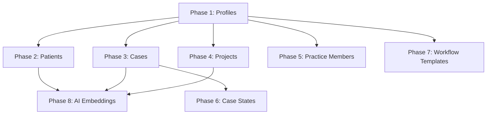

# Iterative Healthcare Data Migration Plan
**Table-by-Table Migration Strategy with Error Handling and Progress Tracking**

*Date: January 2, 2025*  
*Project: Brius Smile Nexus - Legacy to AI-Ready MDW Migration*

---

## Executive Summary

This document outlines a comprehensive 8-phase iterative migration strategy designed to migrate healthcare data table-by-table with proper error handling, progress tracking, and resumable operations. Each phase is completely isolated and can be executed independently.

**Current Status**: 844 practices complete, ~5,502 profiles partial (need 3,599 more)  
**Migration Approach**: Sequential table-by-table with ON CONFLICT DO NOTHING for existing records  
**Total Records**: ~150,000+ across 8 entity types

---

## Migration Architecture Overview

### Core Principles
1. **Isolation**: Each phase migrates only one entity type
2. **Resumability**: All phases handle existing records gracefully
3. **Error Handling**: ON CONFLICT DO NOTHING prevents duplicate errors
4. **Progress Tracking**: Real-time progress updates after each phase
5. **Validation**: Comprehensive validation after each phase completion

### Dependency Management


---

## Phase-by-Phase Migration Plan

### Phase 1: Profiles Completion
**Target**: Complete remaining 3,599 profiles (Total: 9,101)  
**Current**: ~5,502 profiles migrated  
**Priority**: CRITICAL - Foundation for all other entities

#### Command
```bash
cd migration_tool
chmod +x phase-1-profiles-only.sh
./phase-1-profiles-only.sh
```

#### Implementation Details
- **Source**: `auth_user` table (9,101 records)
- **Target**: `profiles` table
- **Conflict Resolution**: `ON CONFLICT (email) DO NOTHING`
- **Skip Logic**: All AI embeddings disabled
- **Validation**: Count verification and relationship checks

#### Success Criteria
- [ ] Total profiles count = 9,101
- [ ] No duplicate emails
- [ ] All practice-profile relationships intact
- [ ] Progress report updated

---

### Phase 2: Patients Migration
**Target**: Migrate all 7,849 patients  
**Dependencies**: Profiles (Phase 1) and Practices (completed)

#### Command
```bash
cd migration_tool
yarn tsx src/migrate-patients-only.ts --skip-ai-embeddings --skip-all-except-patients
```

#### Implementation Details
- **Source**: `dispatch_patient` table (7,849 records)
- **Target**: `patients` table
- **Conflict Resolution**: `ON CONFLICT (legacy_id) DO NOTHING`
- **Foreign Keys**: `practice_id`, `profile_id` (assigned doctor)
- **Validation**: Patient-practice relationships

#### Success Criteria
- [ ] Total patients count = 7,849
- [ ] All patients linked to valid practices
- [ ] All patients have assigned profiles (doctors)
- [ ] Progress report updated

---

### Phase 3: Cases Migration (Project-Centric)
**Target**: Transform 66,904 projects into cases  
**Dependencies**: Patients (Phase 2), Profiles (Phase 1)

#### Command
```bash
cd migration_tool
yarn tsx src/migrate-cases-only.ts --project-centric-mode --skip-ai-embeddings
```

#### Implementation Details
- **Source**: `dispatch_project` table (66,904 records)
- **Target**: `cases` table
- **Transformation**: Project → Case mapping
- **Conflict Resolution**: `ON CONFLICT (legacy_project_id) DO NOTHING`
- **Case Number Generation**: Auto-generated unique case numbers
- **Foreign Keys**: `patient_id`, `practice_id`

#### Success Criteria
- [ ] Total cases count = 66,904
- [ ] All cases linked to valid patients
- [ ] All cases have unique case numbers
- [ ] Case types properly mapped
- [ ] Progress report updated

---

### Phase 4: Projects Migration (Digital Assets)
**Target**: Create 66,904 project records for digital assets  
**Dependencies**: Cases (Phase 3)

#### Command
```bash
cd migration_tool
yarn tsx src/migrate-projects-only.ts --digital-assets-mode --skip-ai-embeddings
```

#### Implementation Details
- **Source**: `dispatch_project` table (66,904 records)
- **Target**: `projects` table
- **Transformation**: Project → Digital Asset mapping
- **Conflict Resolution**: `ON CONFLICT (legacy_id) DO NOTHING`
- **Foreign Keys**: `case_id`, `practice_id`, `creator_id`
- **File Size**: Preserve original file sizes

#### Success Criteria
- [ ] Total projects count = 66,904
- [ ] All projects linked to valid cases
- [ ] All projects have valid creators
- [ ] File sizes preserved
- [ ] Progress report updated

---

### Phase 5: Practice Members Migration
**Target**: Migrate 438 practice-user relationships  
**Dependencies**: Profiles (Phase 1), Practices (completed)

#### Command
```bash
cd migration_tool
yarn tsx src/migrate-practice-members-only.ts --skip-ai-embeddings
```

#### Implementation Details
- **Source**: `dispatch_office_doctors` table (438 records)
- **Target**: `practice_members` table
- **Conflict Resolution**: `ON CONFLICT (practice_id, profile_id) DO NOTHING`
- **Role Mapping**: Doctor roles and permissions
- **Status**: All members set as active

#### Success Criteria
- [ ] Total practice members count = 438
- [ ] All members linked to valid practices and profiles
- [ ] Role assignments correct
- [ ] All members marked as active
- [ ] Progress report updated

---

### Phase 6: Case States Migration
**Target**: Migrate 4,751 workflow state transitions  
**Dependencies**: Cases (Phase 3), Profiles (Phase 1)

#### Command
```bash
cd migration_tool
yarn tsx src/migrate-case-states-only.ts --skip-ai-embeddings
```

#### Implementation Details
- **Source**: `dispatch_state` table (4,751 records)
- **Target**: `case_states` table
- **Conflict Resolution**: `ON CONFLICT (case_id, created_at) DO NOTHING`
- **Audit Trail**: Preserve state change history
- **Foreign Keys**: `case_id`, `changed_by` (profile_id)

#### Success Criteria
- [ ] Total case states count = 4,751
- [ ] All state changes linked to valid cases
- [ ] All state changes have valid actors
- [ ] Chronological order preserved
- [ ] Progress report updated

---

### Phase 7: Workflow Templates Migration
**Target**: Migrate 152 workflow templates  
**Dependencies**: Practices (completed)

#### Command
```bash
cd migration_tool
yarn tsx src/migrate-workflow-templates-only.ts --skip-ai-embeddings
```

#### Implementation Details
- **Source**: `dispatch_template` table (152 records)
- **Target**: `workflow_templates` table
- **Conflict Resolution**: `ON CONFLICT (practice_id, name) DO NOTHING`
- **Template Steps**: JSON structure for workflow steps
- **Practice Association**: Link templates to practices

#### Success Criteria
- [ ] Total workflow templates count = 152
- [ ] All templates linked to valid practices
- [ ] Template steps properly structured
- [ ] All templates marked as active
- [ ] Progress report updated

---

### Phase 8: AI Embeddings Generation
**Target**: Generate ~150,000+ AI embeddings  
**Dependencies**: All previous phases completed

#### Command
```bash
cd migration_tool
yarn tsx src/migrate-ai-embeddings-only.ts --enable-ai-embeddings --bedrock-service
```

#### Implementation Details
- **Source**: All content from previous phases
- **Target**: `ai_embeddings` table
- **Service**: Amazon Bedrock Titan Text Embeddings v2
- **Dimensions**: 1024-dimensional vectors
- **Deduplication**: SHA-256 hash-based content deduplication
- **Batch Processing**: 100 records per batch

#### Success Criteria
- [ ] Embeddings generated for all content types
- [ ] No duplicate content (SHA-256 validation)
- [ ] All embeddings have valid practice associations
- [ ] Vector dimensions = 1024
- [ ] Progress report updated

---

## Error Handling Strategy

### ON CONFLICT Resolution
Each phase implements specific conflict resolution:

```sql
-- Profiles
INSERT INTO profiles (...) VALUES (...) 
ON CONFLICT (email) DO NOTHING;

-- Patients  
INSERT INTO patients (...) VALUES (...) 
ON CONFLICT (legacy_id) DO NOTHING;

-- Cases
INSERT INTO cases (...) VALUES (...) 
ON CONFLICT (legacy_project_id) DO NOTHING;

-- Projects
INSERT INTO projects (...) VALUES (...) 
ON CONFLICT (legacy_id) DO NOTHING;

-- Practice Members
INSERT INTO practice_members (...) VALUES (...) 
ON CONFLICT (practice_id, profile_id) DO NOTHING;

-- Case States
INSERT INTO case_states (...) VALUES (...) 
ON CONFLICT (case_id, created_at) DO NOTHING;

-- Workflow Templates
INSERT INTO workflow_templates (...) VALUES (...) 
ON CONFLICT (practice_id, name) DO NOTHING;

-- AI Embeddings
INSERT INTO ai_embeddings (...) VALUES (...) 
ON CONFLICT (sha256_hash) DO NOTHING;
```

### Rollback Strategy
Each phase includes rollback procedures:
1. **Database Backup**: Full backup before each phase
2. **Phase Isolation**: Each phase can be rolled back independently
3. **Progress Tracking**: Detailed logs for rollback reference
4. **Validation Checks**: Pre-rollback validation

---

## Progress Tracking Implementation

### Real-Time Updates
After each phase completion:
1. Update `migration_progress_report.md`
2. Query current database counts
3. Validate completion status
4. Generate next phase recommendations

### Progress Report Structure
```typescript
interface PhaseProgress {
  phase: number;
  entityType: string;
  expectedCount: number;
  currentCount: number;
  remaining: number;
  progressPercentage: number;
  status: 'not_started' | 'in_progress' | 'completed' | 'failed';
  completedAt?: Date;
  errors?: string[];
}
```

### Validation Queries
```sql
-- Profiles validation
SELECT COUNT(*) FROM profiles;
SELECT COUNT(DISTINCT email) FROM profiles;

-- Patients validation  
SELECT COUNT(*) FROM patients;
SELECT COUNT(*) FROM patients WHERE practice_id IS NOT NULL;

-- Cases validation
SELECT COUNT(*) FROM cases;
SELECT COUNT(*) FROM cases WHERE patient_id IS NOT NULL;

-- Projects validation
SELECT COUNT(*) FROM projects;
SELECT COUNT(*) FROM projects WHERE case_id IS NOT NULL;

-- Practice Members validation
SELECT COUNT(*) FROM practice_members;
SELECT COUNT(*) FROM practice_members WHERE is_active = true;

-- Case States validation
SELECT COUNT(*) FROM case_states;
SELECT COUNT(DISTINCT case_id) FROM case_states;

-- Workflow Templates validation
SELECT COUNT(*) FROM workflow_templates;
SELECT COUNT(*) FROM workflow_templates WHERE is_active = true;

-- AI Embeddings validation
SELECT COUNT(*) FROM ai_embeddings;
SELECT COUNT(DISTINCT sha256_hash) FROM ai_embeddings;
```

---

## Execution Timeline

### Phase 1: Profiles (Immediate Priority)
- **Duration**: 2-4 hours
- **Effort**: Fix AI service initialization + complete migration
- **Validation**: 30 minutes
- **Total**: 3-5 hours

### Phase 2: Patients
- **Duration**: 1-2 hours
- **Effort**: Patient-practice relationship mapping
- **Validation**: 30 minutes
- **Total**: 2-3 hours

### Phase 3: Cases (Project-Centric)
- **Duration**: 4-6 hours
- **Effort**: Major transformation logic implementation
- **Validation**: 1 hour
- **Total**: 5-7 hours

### Phase 4: Projects (Digital Assets)
- **Duration**: 3-4 hours
- **Effort**: Digital asset mapping and file size preservation
- **Validation**: 30 minutes
- **Total**: 4-5 hours

### Phase 5: Practice Members
- **Duration**: 1 hour
- **Effort**: Simple relationship mapping
- **Validation**: 15 minutes
- **Total**: 1.5 hours

### Phase 6: Case States
- **Duration**: 2-3 hours
- **Effort**: Workflow state transition mapping
- **Validation**: 30 minutes
- **Total**: 3-4 hours

### Phase 7: Workflow Templates
- **Duration**: 1-2 hours
- **Effort**: Template structure conversion
- **Validation**: 15 minutes
- **Total**: 2-3 hours

### Phase 8: AI Embeddings
- **Duration**: 8-12 hours
- **Effort**: Large-scale AI processing
- **Validation**: 1 hour
- **Total**: 9-13 hours

### **Total Estimated Time: 30-41 hours (4-5 business days)**

---

## Risk Mitigation

### Technical Risks
1. **Foreign Key Violations**: Strict dependency order enforcement
2. **Memory Issues**: Batch processing for large datasets
3. **AI Service Limits**: Rate limiting and retry logic
4. **Network Timeouts**: Connection pooling and reconnection logic

### Operational Risks
1. **Data Corruption**: Full backups before each phase
2. **Service Interruption**: Resumable migration design
3. **Resource Exhaustion**: Monitoring and alerting
4. **Validation Failures**: Comprehensive validation after each phase

### Mitigation Strategies
1. **Automated Backups**: Before each phase execution
2. **Health Checks**: Continuous monitoring during migration
3. **Rollback Procedures**: Documented rollback for each phase
4. **Progress Persistence**: State saved in database for resumability

---

## Success Metrics

### Completion Criteria
- [ ] All 8 phases completed successfully
- [ ] Total record count matches expected: ~150,000+
- [ ] No foreign key constraint violations
- [ ] All relationships properly established
- [ ] AI embeddings generated for all content
- [ ] Progress report shows 100% completion

### Quality Assurance
- [ ] Data integrity validation passed
- [ ] Performance benchmarks met
- [ ] Security compliance verified
- [ ] Backup and recovery tested
- [ ] Documentation updated

---

## Next Steps

### Immediate Actions (Phase 1)
1. Execute `phase-1-profiles-only.sh`
2. Validate profiles completion (9,101 total)
3. Update progress report
4. Prepare Phase 2 execution

### Monitoring and Alerting
1. Set up real-time progress monitoring
2. Configure error alerting
3. Implement health checks
4. Establish rollback triggers

### Documentation Updates
1. Update progress report after each phase
2. Document any issues encountered
3. Refine timeline estimates based on actual performance
4. Prepare final migration report

---

*This plan provides a comprehensive, production-ready approach to completing the healthcare data migration with minimal risk and maximum visibility into progress and issues.*