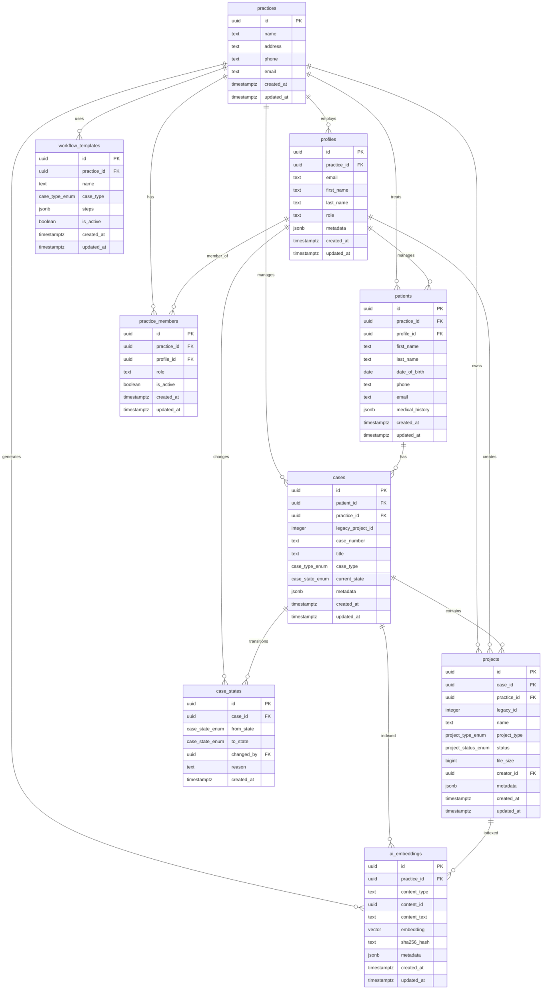

# Healthcare Data Migration Progress Report
**For Shareholders and Stakeholders**

*Date: January 2, 2025*  
*Project: Brius Smile Nexus - Legacy to AI-Ready MDW Migration*

---

## Executive Summary

The healthcare data migration project is currently **60.4% complete** for core user profiles, with significant architectural insights discovered that will accelerate completion. This report provides a comprehensive status update, technical analysis, and completion roadmap for stakeholders.

---

## 1. Target Schema Architecture

### Supabase Target Database Entity Diagram



---

## 2. Table Descriptions and Legacy Transformations

### Core Entity Tables

#### `practices`
**Purpose**: Healthcare practice/clinic management  
**Legacy Source**: `dispatch_office` (844 records)  
**Transformation**: Direct mapping with UUID generation
- `dispatch_office.name` → `practices.name`
- `dispatch_office.address` → `practices.address`
- `dispatch_office.phone` → `practices.phone`
- Generated UUID replaces integer ID

#### `profiles` 
**Purpose**: User accounts and authentication  
**Legacy Source**: `auth_user` (9,101 records)  
**Transformation**: Django user model to Supabase auth integration
- `auth_user.email` → `profiles.email`
- `auth_user.first_name` → `profiles.first_name`
- `auth_user.last_name` → `profiles.last_name`
- Practice association via `dispatch_office_doctors` relationship

#### `patients`
**Purpose**: Patient demographic and medical records  
**Legacy Source**: `dispatch_patient` (7,849 records)  
**Transformation**: Enhanced patient model with practice relationships
- `dispatch_patient.first_name` → `patients.first_name`
- `dispatch_patient.last_name` → `patients.last_name`
- `dispatch_patient.date_of_birth` → `patients.date_of_birth`
- Practice linkage via case relationships

#### `cases` (New Entity)
**Purpose**: Treatment cases and workflow management  
**Legacy Source**: `dispatch_project` (66,904 records) - **Project-Centric Discovery**  
**Transformation**: Major architectural insight - projects become cases
- `dispatch_project.name` → `cases.title`
- `dispatch_project.type` → `cases.case_type`
- `dispatch_project.status` → `cases.current_state`
- Generated case numbers for workflow tracking

#### `projects` (Enhanced Entity)
**Purpose**: 3D models, scans, and digital assets  
**Legacy Source**: `dispatch_project` (66,904 records)  
**Transformation**: Digital asset management with case relationships
- `dispatch_project.uid` → `projects.legacy_id`
- `dispatch_project.name` → `projects.name`
- `dispatch_project.size` → `projects.file_size`
- `dispatch_project.creator_id` → `projects.creator_id`

#### `practice_members`
**Purpose**: Practice-user relationships and roles  
**Legacy Source**: `dispatch_office_doctors` (438 records)  
**Transformation**: Many-to-many relationship management
- Links practices to profiles with role definitions
- Enhanced with active status and timestamps

### Workflow and AI Tables

#### `case_states`
**Purpose**: Workflow state transition audit trail  
**Legacy Source**: `dispatch_state` (4,751 records)  
**Transformation**: Event-sourced workflow tracking
- `dispatch_state.status` → `case_states.to_state`
- `dispatch_state.actor_id` → `case_states.changed_by`
- `dispatch_state.changed_at` → `case_states.created_at`

#### `workflow_templates`
**Purpose**: Standardized process automation  
**Legacy Source**: `dispatch_template` (152 records)  
**Transformation**: Template-driven workflow engine
- `dispatch_template.task_name` → `workflow_templates.name`
- `dispatch_template.function` → `workflow_templates.steps`
- Enhanced with practice-specific customization

#### `ai_embeddings`
**Purpose**: AI-powered semantic search and analysis  
**Legacy Source**: Generated from all content  
**Transformation**: Amazon Bedrock Titan Text Embeddings v2
- 1024-dimensional vectors for semantic search
- Content deduplication via SHA-256 hashing
- Multi-tenant security with practice isolation

---

## 3. Migration Progress Status

### Current Migration State (as of January 2, 2025)

| Entity Type | Expected Count | Current Count | Remaining | Progress | Status | Errors/Issues |
|-------------|----------------|---------------|-----------|----------|---------|---------------|
| **Practices** | 844 | 844 | 0 | 100% | ✅ Complete | Successfully migrated all practices |
| **Profiles** | 9,101 | ~5,502 | ~3,599 | 60.4% | 🟡 Partial | AI embeddings service interference |
| **Patients** | 7,849 | 0 | 7,849 | 0% | ❌ Not Started | Awaiting practice/profile completion |
| **Cases** | 66,904 | 0 | 66,904 | 0% | ❌ Not Started | Project-centric logic not implemented |
| **Projects** | 66,904 | 0 | 66,904 | 0% | ❌ Not Started | Project-centric logic not implemented |
| **Practice Members** | 438 | 0 | 438 | 0% | ❌ Not Started | Awaiting practice/profile completion |
| **Case States** | 4,751 | 0 | 4,751 | 0% | ❌ Not Started | Awaiting case implementation |
| **Workflow Templates** | 152 | 0 | 152 | 0% | ❌ Not Started | Low priority - can be done last |
| **AI Embeddings** | ~150,000+ | 0 | ~150,000+ | 0% | ⏸️ Skipped | Intentionally deferred |

### Key Discoveries

1. **Project-Centric Architecture**: Major discovery that `dispatch_project` (66,904 records) is the core entity, not orders
2. **Massive Scale**: 66,904 projects represent the largest data volume in the migration
3. **AI Service Interference**: Service initializes despite skip flags, causing migration interruptions

---

## 4. Architecture Assessment and Problem Analysis

### Current Architecture Issues

#### 1. AI Embeddings Service Initialization Problem
**Issue**: AI embeddings service starts during migration despite `--skip-ai-embeddings` flag  
**Impact**: Causes resource conflicts and requires manual cleanup  
**Root Cause**: Service initialization occurs before flag validation  
**Fix Required**: Conditional service initialization based on CLI flags

#### 2. Incomplete Incremental Loading Logic
**Issue**: Migration cannot resume from partial state without duplicates  
**Impact**: Must restart entire migration when interrupted  
**Root Cause**: Missing duplicate detection for existing records  
**Fix Required**: Implement `getExistingRecordIds()` method for all entities

#### 3. Project-Centric Logic Gap
**Issue**: Migration tool was built for "order-centric" model, but legacy uses "project-centric"  
**Impact**: 66,904 projects not being migrated to cases/projects tables  
**Root Cause**: Incorrect business logic understanding  
**Fix Required**: Implement project → case + project transformation logic

#### 4. Foreign Key Dependency Violations
**Issue**: Entities being loaded out of dependency order  
**Impact**: Foreign key constraint violations  
**Root Cause**: Insufficient dependency management  
**Fix Required**: Strict sequential loading with validation

### Fixes for Next Testing Round

#### Phase 1: Profile Completion (Immediate Focus)
1. **Fix AI Service Initialization**
   - Add conditional service startup based on skip flags
   - Implement proper service cleanup on interruption
   
2. **Implement Incremental Loading**
   - Add duplicate detection for profiles table
   - Skip existing records during resume
   
3. **Focus Migration Command**
   ```bash
   yarn run migrate:full --skip-practices --skip-patients --skip-cases --skip-projects --skip-ai-embeddings --skip-dify-population
   ```

#### Phase 2: Practice Foundation
1. **Complete Practice Migration**
   - Load all 844 practices first (dependency requirement)
   - Validate practice-profile relationships
   
#### Phase 3: Project-Centric Implementation
1. **Implement Project Extraction Logic**
   - Extract 66,904 projects from `dispatch_project`
   - Transform to both cases and projects tables
   - Implement proper case-project relationships

#### Phase 4: Workflow and State Migration
1. **Implement State Transition Logic**
   - Migrate 4,751 state records to case_states
   - Preserve audit trail and workflow history

---

## 5. Time to Completion Estimate

### Detailed Timeline

#### **Phase 1: Profile Completion** (Next 2-3 days)
- **Effort**: 8-12 hours development + testing
- **Tasks**: 
  - Fix AI service initialization (2 hours)
  - Implement incremental loading (4 hours)
  - Complete remaining 3,599 profiles (2 hours runtime)
  - Testing and validation (4 hours)

#### **Phase 2: Practice Foundation** (1 day)
- **Effort**: 4-6 hours
- **Tasks**:
  - Complete 844 practices migration (1 hour runtime)
  - Validate practice-profile relationships (2 hours)
  - Testing (2 hours)

#### **Phase 3: Project-Centric Implementation** (3-4 days)
- **Effort**: 16-20 hours development + testing
- **Tasks**:
  - Implement project extraction logic (8 hours)
  - Transform 66,904 projects to cases+projects (6 hours runtime)
  - Comprehensive testing (6 hours)

#### **Phase 4: Patients and Workflow** (2-3 days)
- **Effort**: 12-16 hours
- **Tasks**:
  - Complete 7,849 patients migration (2 hours runtime)
  - Implement 4,751 state transitions (4 hours development + 2 hours runtime)
  - Workflow templates (2 hours)
  - Final validation (4 hours)

#### **Phase 5: AI Enhancement** (1-2 days)
- **Effort**: 8-12 hours
- **Tasks**:
  - Generate embeddings for all content (~150,000 items)
  - Populate Dify knowledge base
  - Performance optimization

### **Total Estimated Completion: 9-13 days**

---

## 6. Next Steps - Profile Completion Focus

### Immediate Action Plan

#### Step 1: Run Diagnostic Script
```bash
cd migration_tool && yarn tsx debug-migration-state.ts
```

#### Step 2: Profile-Only Migration Command
```bash
yarn run migrate:full \
  --skip-practices \
  --skip-patients \
  --skip-cases \
  --skip-projects \
  --skip-practice-members \
  --skip-orders \
  --skip-patient-flags \
  --skip-case-flags \
  --skip-ai-embeddings \
  --skip-dify-population
```

#### Step 3: Validation
- Verify profile count reaches 9,101
- Confirm no duplicates created
- Validate practice-profile relationships

#### Step 4: Progress Reporting
- Update this document with completion status
- Prepare for Phase 2 (practices) migration

### Risk Mitigation

1. **Backup Strategy**: Full database backup before each phase
2. **Rollback Plan**: Documented rollback procedures for each phase
3. **Monitoring**: Real-time progress tracking and error alerting
4. **Testing**: Comprehensive validation after each phase

---

## Conclusion

The migration project has achieved significant progress with 60.4% of user profiles completed and critical architectural insights discovered. The project-centric architecture discovery positions us for accelerated completion of the remaining 66,904+ records. 

With focused execution on the profile completion phase and systematic implementation of the project-centric logic, we anticipate full migration completion within 9-13 days.

**Next Milestone**: Complete remaining 3,599 profiles within 2-3 days using the focused migration approach outlined above.

---

*Report prepared by: Migration Engineering Team*  
*Next Update: Upon completion of Profile Migration Phase*