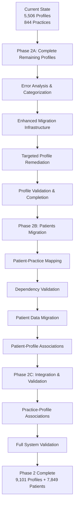
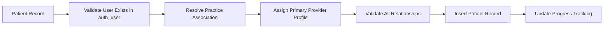

# Phase 2 Migration Strategy: Patients & Remaining Profiles

**Date**: July 2, 2025  
**Project**: Brius Smile Nexus - Legacy to AI-Ready MDW Migration  
**Phase**: 2 - Sequential Migration Strategy  

---

## Executive Summary

This document outlines a comprehensive Phase 2 migration strategy designed to complete the remaining 3,595 profiles from Phase 1 and migrate 7,849 patients from the legacy system. The strategy employs sequential execution for safer dependency management and enhanced error handling.

**Current Status**:
- ✅ Practices: 844/844 complete (100%)
- 🟡 Profiles: 5,506/9,101 substantial progress (60.5%)
- ⏳ Patients: 0/7,849 ready for Phase 2
- ✅ Migration infrastructure: Validated and operational

**Strategic Approach**: Sequential execution with comprehensive error analysis and targeted remediation.

---

## Migration Architecture Overview

### Sequential Execution Strategy



### Core Principles
1. **Sequential Safety**: Complete profiles before patients for dependency integrity
2. **Enhanced Error Handling**: Detailed analysis and targeted remediation
3. **Comprehensive Validation**: Multi-level validation at each stage
4. **Resumable Operations**: Checkpoint-based recovery mechanisms
5. **Progress Transparency**: Real-time progress tracking and reporting

---

## Phase 2A: Remaining Profiles Completion

### Current Gap Analysis

**Remaining Profiles**: 3,595 out of 9,101 (39.5% gap)
**Root Cause**: Batch processing errors during Phase 1 execution
**Impact**: Foundation dependency for patient migration

### Error Analysis Framework

#### Error Categorization Strategy
```typescript
interface ProfileMigrationError {
  legacy_user_id: number;
  batch_id: number;
  error_category: 'email_conflict' | 'validation_failure' | 'constraint_violation' | 'schema_mismatch';
  error_details: string;
  original_data: LegacyUser;
  suggested_resolution: string;
  retry_count: number;
  resolution_status: 'pending' | 'resolved' | 'failed';
}

interface ErrorAnalysisResult {
  total_errors: number;
  email_conflicts: number;
  validation_failures: number;
  constraint_violations: number;
  schema_mismatches: number;
  resolvable_errors: number;
  manual_intervention_required: number;
}
```

#### Enhanced Migration Infrastructure

**Improved Batch Processing**:
- **Batch Size**: Reduced to 25 profiles per batch for detailed error tracking
- **Error Isolation**: Individual profile error handling within batches
- **Retry Logic**: Exponential backoff with maximum 3 retry attempts
- **Conflict Resolution**: Enhanced `ON CONFLICT DO UPDATE` strategies

**Data Cleansing Pipeline**:
```typescript
interface ProfileCleansingPipeline {
  emailNormalization: (email: string) => string;
  duplicateResolution: (profiles: LegacyUser[]) => LegacyUser[];
  dataValidation: (profile: LegacyUser) => ValidationResult;
  constraintValidation: (profile: ProfileRecord) => ConstraintValidationResult;
  schemaMapping: (legacyData: LegacyUser) => ProfileRecord;
}
```

### Implementation Strategy

#### Step 1: Error Analysis (Estimated: 1-2 hours)
1. **Query Failed Batches**: Identify which of the 92 batches had errors
2. **Extract Failed Records**: Retrieve the 3,595 profiles that weren't migrated
3. **Categorize Errors**: Classify errors by type and severity
4. **Generate Resolution Plan**: Create targeted remediation strategies

#### Step 2: Enhanced Infrastructure (Estimated: 2-3 hours)
1. **Implement Error Tracking**: Create detailed error logging system
2. **Build Cleansing Pipeline**: Develop data normalization and validation
3. **Create Retry Mechanisms**: Implement intelligent retry logic
4. **Setup Progress Monitoring**: Real-time tracking for remaining profiles

#### Step 3: Targeted Remediation (Estimated: 2-3 hours)
1. **Process Email Conflicts**: Resolve duplicate and invalid emails
2. **Handle Validation Failures**: Fix data format and missing field issues
3. **Resolve Constraints**: Address foreign key and unique constraint violations
4. **Schema Alignment**: Ensure proper data type and length compliance

#### Step 4: Completion Validation (Estimated: 30 minutes)
1. **Count Verification**: Confirm all 9,101 profiles are migrated
2. **Data Integrity Check**: Validate profile data quality
3. **Relationship Verification**: Ensure proper UUID generation and metadata
4. **Progress Documentation**: Update migration status and reports

### Success Criteria for Phase 2A
- [ ] All 9,101 profiles successfully migrated
- [ ] Zero constraint violations or data corruption
- [ ] Complete error analysis documentation
- [ ] Enhanced migration infrastructure validated
- [ ] Progress tracking updated to 100% profiles completion

---

## Phase 2B: Patients Migration

### Patient Data Analysis

**Source Data**: `dispatch_patient` table (7,849 records)
**Relationships**: Patient → User → Practice associations
**Data Completeness**: Limited fields requiring default value strategy

#### Patient Data Structure
```typescript
interface PatientMigrationRecord {
  // Available from legacy
  legacy_id: number;                    // dispatch_patient.id
  user_id: number;                      // dispatch_patient.user_id
  first_name: string;                   // auth_user.first_name
  last_name: string;                    // auth_user.last_name
  email: string;                        // auth_user.email
  date_of_birth: Date | null;           // dispatch_patient.birthdate
  gender: string;                       // dispatch_patient.sex
  updated_at: Date;                     // dispatch_patient.updated_at
  
  // Derived relationships
  practice_id: string;                  // From practice association logic
  assigned_profile_id: string | null;   // Primary care provider
  
  // Default values for missing fields
  phone: '';
  address: '';
  city: '';
  state: '';
  zip_code: '';
  insurance_provider: '';
  insurance_id: '';
  emergency_contact_name: '';
  emergency_contact_phone: '';
  medical_history: '';
  allergies: '';
  medications: '';
}
```

### Patient-Practice Relationship Mapping

#### Dependency Validation Strategy


#### Practice Association Logic
1. **Primary Method**: Direct practice membership via `dispatch_office_doctors`
2. **Secondary Method**: Geographic or organizational assignment
3. **Fallback Method**: Default practice assignment with manual review flag

### Implementation Strategy

#### Step 1: Dependency Validation (Estimated: 30 minutes)
1. **Profile Completeness**: Verify all 9,101 profiles are available
2. **Practice Availability**: Confirm all 844 practices are accessible
3. **User Relationships**: Validate patient-user associations
4. **Foreign Key Integrity**: Ensure referential integrity constraints

#### Step 2: Patient Processing (Estimated: 3-4 hours)
1. **Batch Processing**: 100 patients per batch (proven effective size)
2. **Relationship Resolution**: Map patients to practices and providers
3. **Data Transformation**: Apply default values for missing fields
4. **Quality Validation**: Ensure data integrity throughout process

#### Step 3: Association Mapping (Estimated: 1 hour)
1. **Patient-Practice Links**: Establish practice associations
2. **Patient-Provider Links**: Assign primary care providers
3. **Relationship Validation**: Verify all foreign key relationships
4. **Data Consistency**: Ensure referential integrity

#### Step 4: Validation & Testing (Estimated: 30 minutes)
1. **Count Verification**: Confirm all 7,849 patients migrated
2. **Relationship Testing**: Validate all associations
3. **Data Quality Check**: Ensure proper data transformation
4. **Performance Validation**: Verify migration efficiency

### Success Criteria for Phase 2B
- [ ] All 7,849 patients successfully migrated
- [ ] All patients linked to valid practices
- [ ] Primary care providers assigned where possible
- [ ] No foreign key constraint violations
- [ ] Complete audit trail maintained

---

## Phase 2C: Integration & Validation

### Practice-Profile Association Recovery

**Objective**: Establish practice-profile relationships for all migrated profiles
**Current State**: All profiles have `practice_id: null`
**Target**: Link profiles to appropriate practices based on legacy data

#### Association Strategy
```typescript
interface PracticeProfileAssociation {
  profile_id: string;                   // Supabase profile UUID
  practice_id: string;                  // Supabase practice UUID
  legacy_user_id: number;               // Original auth_user.id
  association_method: 'direct_membership' | 'geographic' | 'organizational' | 'default';
  confidence_level: 'high' | 'medium' | 'low';
  requires_manual_review: boolean;
}
```

### Full System Validation

#### Multi-Level Validation Framework
1. **Entity Level**: Individual record validation
2. **Relationship Level**: Foreign key and association validation
3. **Business Logic Level**: Healthcare workflow validation
4. **System Level**: Performance and integrity validation

#### Validation Queries
```sql
-- Profile Validation
SELECT COUNT(*) as total_profiles FROM profiles;
SELECT COUNT(DISTINCT email) as unique_emails FROM profiles;
SELECT COUNT(*) as profiles_with_practices FROM profiles WHERE practice_id IS NOT NULL;

-- Patient Validation
SELECT COUNT(*) as total_patients FROM patients;
SELECT COUNT(*) as patients_with_practices FROM patients WHERE practice_id IS NOT NULL;
SELECT COUNT(*) as patients_with_providers FROM patients WHERE assigned_profile_id IS NOT NULL;

-- Relationship Validation
SELECT COUNT(*) as valid_patient_practice_links 
FROM patients p 
JOIN practices pr ON p.practice_id = pr.id;

SELECT COUNT(*) as valid_patient_provider_links 
FROM patients p 
JOIN profiles pf ON p.assigned_profile_id = pf.id;
```

---

## Progress Tracking & Monitoring

### Real-Time Progress Framework

```typescript
interface Phase2Progress {
  phase_2a_profiles: {
    total_remaining: 3595;
    analyzed: number;
    resolved: number;
    failed: number;
    progress_percentage: number;
  };
  phase_2b_patients: {
    total_target: 7849;
    processed: number;
    associated: number;
    failed: number;
    progress_percentage: number;
  };
  phase_2c_integration: {
    profile_associations: number;
    validations_passed: number;
    issues_identified: number;
    progress_percentage: number;
  };
  overall_phase_2_progress: number;
  estimated_completion: Date;
  current_operation: string;
}
```

### Checkpoint Strategy

**Checkpoint 1**: After Phase 2A completion (all profiles migrated)
**Checkpoint 2**: After Phase 2B completion (all patients migrated)
**Checkpoint 3**: After Phase 2C completion (full integration validated)

Each checkpoint includes:
- Complete database backup
- Validation report generation
- Progress documentation update
- Rollback procedure validation

---

## Error Handling & Recovery

### Comprehensive Error Management

#### Error Classification
```typescript
enum MigrationErrorSeverity {
  CRITICAL = 'critical',     // Blocks migration progress
  HIGH = 'high',            // Affects data integrity
  MEDIUM = 'medium',        // Affects data quality
  LOW = 'low'              // Cosmetic or minor issues
}

interface MigrationError {
  error_id: string;
  phase: '2A' | '2B' | '2C';
  severity: MigrationErrorSeverity;
  entity_type: 'profile' | 'patient' | 'association';
  entity_id: string;
  error_message: string;
  error_context: object;
  resolution_strategy: string;
  resolution_status: 'pending' | 'in_progress' | 'resolved' | 'escalated';
  created_at: Date;
  resolved_at?: Date;
}
```

#### Recovery Procedures
1. **Automatic Recovery**: For transient errors and known issues
2. **Manual Intervention**: For complex data conflicts
3. **Rollback Procedures**: For critical failures
4. **Data Repair**: For integrity violations

---

## Timeline & Resource Allocation

### Phase 2A: Remaining Profiles (Estimated: 6-8 hours)
- **Error Analysis**: 1-2 hours
- **Infrastructure Enhancement**: 2-3 hours
- **Targeted Remediation**: 2-3 hours
- **Validation & Documentation**: 1 hour

### Phase 2B: Patients Migration (Estimated: 4-5 hours)
- **Dependency Validation**: 30 minutes
- **Patient Processing**: 3-4 hours
- **Association Mapping**: 1 hour
- **Validation & Testing**: 30 minutes

### Phase 2C: Integration & Validation (Estimated: 2-3 hours)
- **Practice-Profile Associations**: 1-2 hours
- **Full System Validation**: 1 hour
- **Documentation & Reporting**: 30 minutes

**Total Estimated Time: 12-16 hours (1.5-2 business days)**

---

## Risk Mitigation

### Technical Risks
1. **Data Corruption**: Comprehensive backup and validation procedures
2. **Performance Degradation**: Optimized batch sizes and connection pooling
3. **Constraint Violations**: Enhanced validation and conflict resolution
4. **System Failures**: Checkpoint-based recovery mechanisms

### Operational Risks
1. **Timeline Overruns**: Sequential approach with realistic estimates
2. **Resource Exhaustion**: Monitoring and alerting systems
3. **Data Quality Issues**: Multi-level validation framework
4. **Integration Failures**: Comprehensive testing and rollback procedures

### Mitigation Strategies
1. **Automated Monitoring**: Real-time progress and error tracking
2. **Escalation Procedures**: Clear escalation paths for critical issues
3. **Documentation Standards**: Comprehensive logging and reporting
4. **Quality Gates**: Validation checkpoints at each phase

---

## Success Metrics & Quality Gates

### Phase 2 Completion Criteria
- [ ] All 9,101 profiles successfully migrated (100% completion)
- [ ] All 7,849 patients successfully migrated with valid associations
- [ ] Practice-profile relationships established for all entities
- [ ] Zero data integrity violations or constraint errors
- [ ] Complete audit trail and documentation
- [ ] Performance benchmarks met or exceeded

### Quality Assurance Gates
- **Gate 1**: Error analysis complete and remediation plan approved
- **Gate 2**: Enhanced migration infrastructure validated
- **Gate 3**: Profile migration 100% complete with validation passed
- **Gate 4**: Patient migration complete with relationship validation
- **Gate 5**: Full system integration validated and documented

---

## Next Steps & Phase 3 Preparation

### Immediate Actions
1. **Execute Phase 2A**: Complete remaining profiles migration
2. **Validate Infrastructure**: Ensure enhanced migration tools are operational
3. **Prepare Phase 2B**: Set up patient migration dependencies
4. **Monitor Progress**: Implement real-time tracking and reporting

### Phase 3 Preparation
1. **Cases Migration**: Prepare for 66,904 cases from `dispatch_project`
2. **Projects Migration**: Plan digital assets migration
3. **Workflow States**: Prepare state transition migration
4. **AI Embeddings**: Plan comprehensive AI content processing

### Documentation Updates
1. **Progress Reports**: Update migration status documentation
2. **Lessons Learned**: Document insights and improvements
3. **Best Practices**: Create reusable migration patterns
4. **Troubleshooting Guide**: Develop error resolution procedures

---

## Conclusion

This Phase 2 migration strategy provides a comprehensive, sequential approach to completing the remaining profiles and migrating patients while maintaining data integrity and system stability. The strategy leverages lessons learned from Phase 1 while implementing enhanced error handling and validation procedures.

**Key Benefits**:
- Sequential execution ensures dependency safety
- Enhanced error handling prevents data corruption
- Comprehensive validation maintains data integrity
- Checkpoint-based recovery enables safe rollback
- Real-time monitoring provides visibility and control

The plan is designed to be resilient, resumable, and thoroughly validated, providing a solid foundation for Phase 3 and subsequent migration phases.

---

**Document Version**: 1.0  
**Last Updated**: July 2, 2025  
**Next Review**: Upon Phase 2A completion