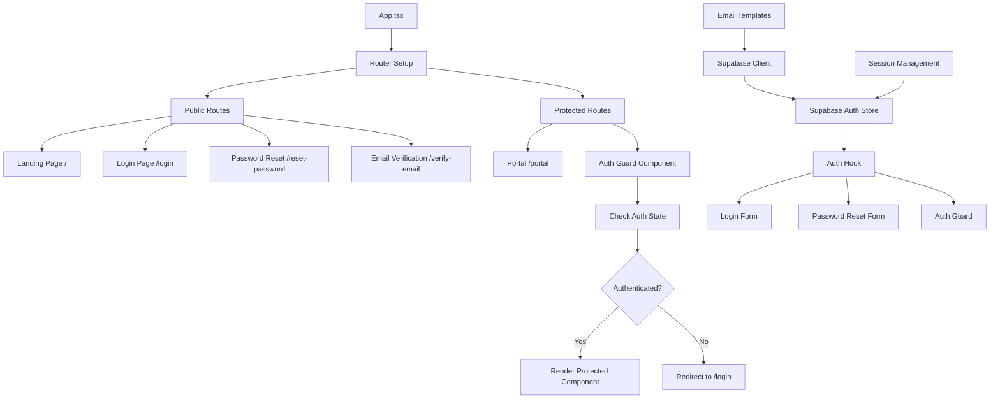
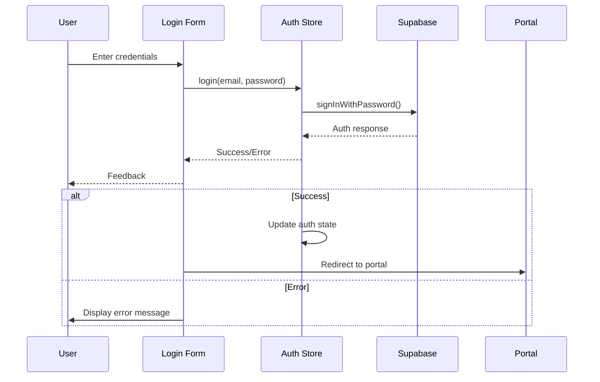
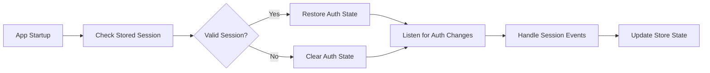
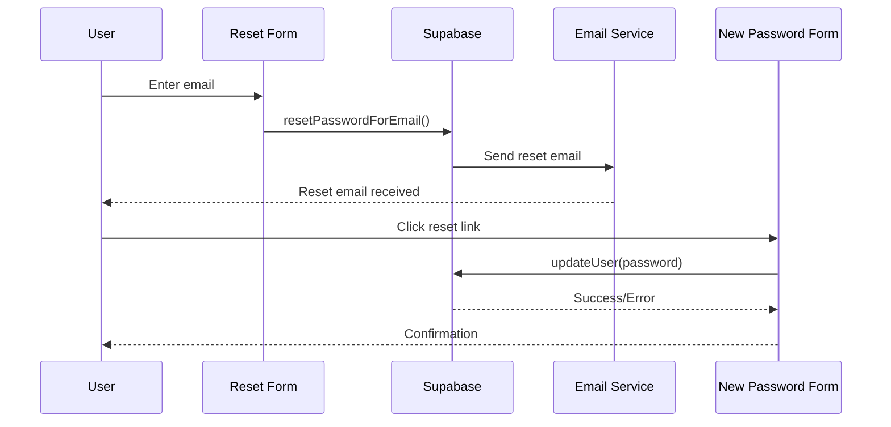

# Supabase Authentication & Login Page Implementation Plan

**Date:** 2025-01-26  
**Author:** Roo (Architect Mode)  
**Status:** Planning Phase  

## 🎯 Objective

Implement a comprehensive Supabase authentication system with proper routing, protected routes, and enhanced authentication features including password reset and email verification.

## 📋 Current State Analysis

### ✅ Existing Assets
- Well-designed login form component with shadcn/ui styling
- Zustand auth store with mock authentication
- Basic Supabase client configuration
- Consistent UI/UX patterns with Tailwind CSS
- React Router setup (basic)

### ❌ Missing Components
- Real Supabase authentication integration
- Proper routing structure with protected routes
- Authentication guards and session management
- Password reset functionality
- Email verification system
- Comprehensive error handling

## 🏗️ Architecture Overview



## 📁 Enhanced File Structure

```
src/
├── components/
│   ├── auth/
│   │   ├── login-form.tsx (updated)
│   │   ├── password-reset-form.tsx (new)
│   │   ├── email-verification.tsx (new)
│   │   └── protected-route.tsx (new)
├── pages/
│   ├── Index.tsx (refactored - landing only)
│   ├── login/
│   │   └── index.tsx (implemented)
│   ├── reset-password/
│   │   └── index.tsx (new)
│   ├── verify-email/
│   │   └── index.tsx (new)
│   └── portal/
│       └── index.tsx (new)
├── stores/
│   └── auth-store.ts (refactored for Supabase)
├── hooks/
│   ├── use-auth.ts (updated)
│   └── use-auth-redirect.ts (new)
├── lib/
│   ├── supabase.ts (enhanced)
│   └── auth-utils.ts (new)
├── types/
│   └── auth.ts (new - auth-specific types)
└── utils/
    └── email-templates.ts (new)
```

## 🚀 Implementation Phases

### Phase 1: Core Supabase Authentication

#### 1.1 Enhanced Supabase Client Configuration
**File:** `src/lib/supabase.ts`
- Add proper TypeScript types from database schema
- Configure auth event listeners
- Add session management utilities
- Implement automatic token refresh handling

#### 1.2 Refactor Auth Store
**File:** `src/stores/auth-store.ts`
- Replace mock authentication with Supabase methods
- Integrate `signInWithPassword`, `signOut`, `getSession`
- Add session persistence and restoration
- Update User interface to match Supabase auth structure
- Add comprehensive error handling
- Implement auth state change listeners

#### 1.3 Update Auth Hook
**File:** `src/hooks/use-auth.ts`
- Enhance to work with new Supabase store
- Add session initialization on app startup
- Add auth state change listeners
- Implement loading states during auth operations

#### 1.4 Create Auth Types
**File:** `src/types/auth.ts`
- Define Supabase user types
- Create auth error types
- Add session and auth state interfaces
- Define auth action types

### Phase 2: Routing Architecture

#### 2.1 Protected Route Component
**File:** `src/components/auth/protected-route.tsx`
- Implement authentication guard logic
- Handle loading states during auth checks
- Redirect unauthenticated users to `/login`
- Support role-based access control (future)

#### 2.2 Auth Redirect Hook
**File:** `src/hooks/use-auth-redirect.ts`
- Handle post-login redirects
- Manage authentication state transitions
- Support deep linking to protected routes

#### 2.3 Portal Page Creation
**File:** `src/pages/portal/index.tsx`
- Move portal logic from Index.tsx
- Implement as protected route
- Add proper navigation structure

#### 2.4 App Router Refactor
**File:** `src/App.tsx`
- Implement comprehensive route structure:
  - `/` - Landing page (public)
  - `/login` - Login page (public, redirect if authenticated)
  - `/reset-password` - Password reset (public)
  - `/verify-email` - Email verification (public)
  - `/portal` - Portal dashboard (protected)
  - `/portal/*` - Portal sub-routes (protected)

### Phase 3: Enhanced Authentication Features

#### 3.1 Password Reset System
**Files:** 
- `src/components/auth/password-reset-form.tsx`
- `src/pages/reset-password/index.tsx`

**Features:**
- Email-based password reset flow
- Secure token validation
- New password confirmation
- Integration with Supabase auth
- User-friendly error messages
- Success confirmation

#### 3.2 Email Verification System
**Files:**
- `src/components/auth/email-verification.tsx`
- `src/pages/verify-email/index.tsx`

**Features:**
- Email verification on signup
- Resend verification email
- Verification status checking
- Auto-redirect after verification
- Clear user feedback

#### 3.3 Enhanced Login Form
**File:** `src/components/auth/login-form.tsx`
- Remove `onCancel` prop (routing-based navigation)
- Add "Forgot Password?" link
- Implement "Remember me" functionality
- Add comprehensive error display
- Improve form validation
- Add loading states and animations

### Phase 4: Landing Page & Navigation

#### 4.1 Landing Page Refactor
**File:** `src/pages/Index.tsx`
- Remove conditional rendering logic
- Keep only landing page content
- Update navigation to use React Router links
- Add redirect logic for authenticated users
- Implement proper call-to-action flows

#### 4.2 Navigation Updates
- Update landing header to use router navigation
- Add proper authentication state handling
- Implement logout functionality in navigation

## 🔧 Technical Implementation Details

### Authentication Flow Architecture



### Session Management



### Password Reset Flow



## 🔒 Security Considerations

### Authentication Security
- ✅ Use Supabase's built-in security features
- ✅ Implement proper session validation
- ✅ Add CSRF protection through Supabase
- ✅ Secure token storage and refresh
- ✅ Input validation and sanitization
- ✅ Rate limiting on auth endpoints

### Password Security
- ✅ Enforce strong password requirements
- ✅ Secure password reset tokens
- ✅ Time-limited reset links
- ✅ Prevent password reuse
- ✅ Secure password transmission

### Email Security
- ✅ Verify email ownership
- ✅ Prevent email enumeration attacks
- ✅ Secure email templates
- ✅ Rate limit email sending

## ⚡ Performance Optimizations

### Code Splitting
- Lazy load authentication components
- Split auth routes from main bundle
- Optimize protected route loading

### State Management
- Optimize Zustand store subscriptions
- Minimize re-renders during auth checks
- Efficient session restoration
- Smart auth state caching

### Network Optimization
- Batch auth-related API calls
- Implement request deduplication
- Optimize session refresh timing
- Cache user profile data

## 🧪 Testing Strategy

### Unit Tests
- Auth store operations
- Authentication utilities
- Form validation logic
- Error handling functions

### Integration Tests
- Complete login flow
- Password reset process
- Email verification flow
- Protected route access

### E2E Tests
- User registration journey
- Login and logout flows
- Password reset workflow
- Email verification process

## 📊 Success Metrics

### Functional Requirements
- ✅ Users can log in with email/password
- ✅ Users can reset forgotten passwords
- ✅ Users can verify email addresses
- ✅ Protected routes are properly secured
- ✅ Session management works correctly

### Performance Requirements
- ✅ Login process completes in <2 seconds
- ✅ Auth state restoration in <500ms
- ✅ Protected route checks in <100ms
- ✅ Email delivery in <30 seconds

### Security Requirements
- ✅ No authentication bypasses possible
- ✅ Secure session management
- ✅ Proper error handling without information leakage
- ✅ OWASP compliance for auth flows

## 🔄 Migration Strategy

### Phase 1: Parallel Implementation
1. Implement new Supabase auth alongside existing mock auth
2. Add feature flags to switch between implementations
3. Test new implementation thoroughly

### Phase 2: Gradual Migration
1. Switch to Supabase auth for new users
2. Migrate existing mock sessions
3. Monitor for issues and rollback capability

### Phase 3: Complete Migration
1. Remove mock authentication code
2. Clean up unused dependencies
3. Update documentation

## 📝 Documentation Updates

### Technical Documentation
- Update API documentation
- Add authentication flow diagrams
- Document error codes and handling
- Create troubleshooting guides

### User Documentation
- Login instructions
- Password reset guide
- Email verification help
- Account security best practices

## 🎯 Next Steps

1. **Immediate:** Begin Phase 1 implementation
2. **Week 1:** Complete core Supabase integration
3. **Week 2:** Implement routing and protected routes
4. **Week 3:** Add enhanced auth features
5. **Week 4:** Testing and refinement

---

**Implementation Priority:** High  
**Estimated Effort:** 3-4 weeks  
**Dependencies:** Supabase configuration, Email service setup  
**Risk Level:** Medium (well-established patterns)